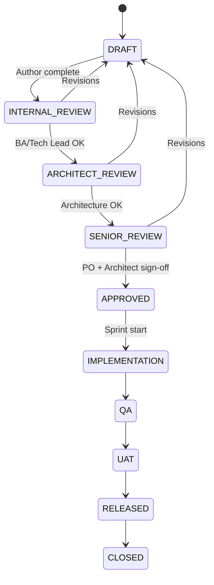

# Feature Documentation Approval Workflow

| Document ID | GOV-APPROVAL-001 |
| Status | DRAFT |

---

## Workflow

---

## Reviewers by gate

| Gate | Reviewers | Checklist |
|------|-----------|-----------|
| Internal Review | BA, Tech Lead | Requirements complete, flows realistic |
| Architect Review | Solution Architect | DB/API/module boundaries, no duplicate entities |
| Senior Review | PO, Architect, QA Lead, Security | Scope, risk, testability, compliance |
| QA | QA Lead | Test strategy executable |
| UAT | Product Owner | Acceptance criteria observable |

---

## Approval record (template)

| Feature ID | Version | Approved By | Role | Date | Notes |
|------------|---------|-------------|------|------|-------|
| P1-F1 | 1.0 | | | | Pending |

Store approvals in feature README status section.
