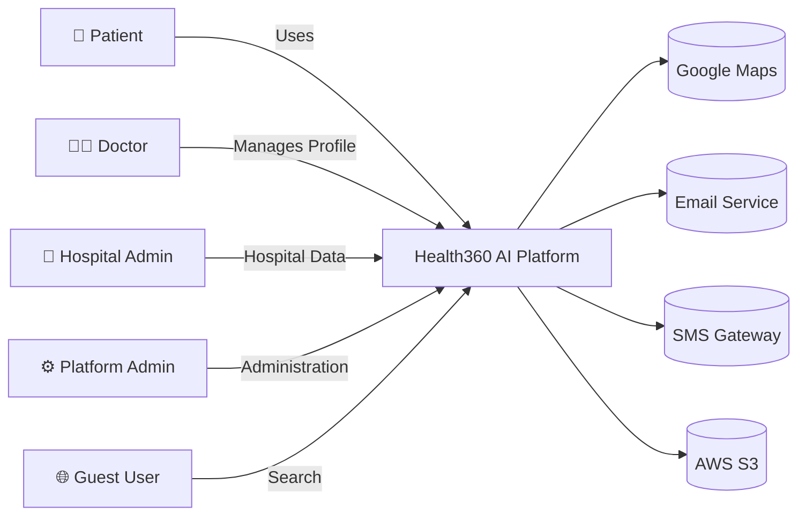

# DOC-01: Health360 AI — Project Vision & Phase 1 Scope Charter


| Attribute         | Value                                         |
| ----------------- | --------------------------------------------- |
| **Document ID**   | DOC-01                                        |
| **Title**         | Project Vision & Phase 1 Scope Charter        |
| **Version**       | 1.0                                           |
| **Status**        | **Approved**                                  |
| **Date**          | 2026-07-27                                    |
| **Author**        | Chief Software Architect / Technical Lead     |
| **References**    | [DOC-00] Project Memory                       |
| **Next Document** | [DOC-02] Business Requirements Document (BRD) |


---

## 1. Executive Summary

**Health360 AI** is an enterprise-grade, commercial Healthcare SaaS platform designed to become a comprehensive digital healthcare ecosystem. Phase 1 establishes the **production foundation** — not a prototype, not a demo, not a simple CRUD application.

Phase 1 delivers seven interconnected domain modules that enable patients to build comprehensive health profiles, discover doctors and hospitals, book appointments, and receive deterministic health analytics — while giving doctors and hospitals the tools to manage professional presence and scheduling.

The platform is architected as a **Modular Monolith** using **Domain-Driven Design (DDD)** and **Clean Architecture**, with every module independently bounded and extractable as a future microservice. Multi-tenant readiness is built into the data model from inception.

This charter defines the vision, strategic objectives, Phase 1 scope boundaries, success criteria, and governance model for all subsequent design and implementation documents.

---


## 2. Vision Statement

> **To empower every individual with a unified, intelligent view of their health journey — connecting them seamlessly with verified healthcare providers and facilities — through a secure, scalable, and extensible digital healthcare platform.**


### 2.1 Mission (Phase 1)

Build the trusted digital foundation where:

- **Patients** own a rich, structured health profile that powers meaningful health insights.
- **Doctors** establish verified professional identities and manage their availability.
- **Hospitals** present complete facility profiles with discoverability and scheduling integration.
- **The Platform** operates with enterprise security, auditability, and scalability from day one.


### 2.2 Long-Term Vision (Post Phase 1 — Not In Scope Now)

Health360 AI will evolve into a full healthcare ecosystem spanning pharmacy, diagnostics, insurance, telemedicine, AI-assisted care, and enterprise operations. Phase 1 deliberately constrains scope to ensure a solid, production-ready foundation. See [DOC-00 §6] for the complete out-of-scope list.

---


## 3. Strategic Objectives


| ID     | Objective                          | Phase 1 Contribution                                           | KPI (Phase 1 Launch)                                                                         |
| ------ | ---------------------------------- | -------------------------------------------------------------- | -------------------------------------------------------------------------------------------- |
| SO-001 | **Trust & Verification**           | Doctor verification workflow; hospital registration validation | 100% doctor profiles require verification before booking enabled                             |
| SO-002 | **Comprehensive Health Profile**   | Structured patient profile capturing all formula engine inputs | Profile completion score visible; ≥80% of active patients complete Basic + Physical sections |
| SO-003 | **Discoverability**                | Search doctors/hospitals with geo, filter, and sort            | Search response < 500ms p95; geo-search accuracy within 100m                                 |
| SO-004 | **Scheduling Reliability**         | Conflict-free appointment booking with audit trail             | Zero double-bookings; 99.9% booking success rate                                             |
| SO-005 | **Health Intelligence Foundation** | Deterministic formula engine with 20+ health calculations      | All specified formulas implemented with validated ranges                                     |
| SO-006 | **Enterprise Security**            | RBAC, JWT, audit logs, encryption at rest/transit              | Zero critical security vulnerabilities at launch                                             |
| SO-007 | **Platform Extensibility**         | Modular monolith with clean module boundaries                  | Each domain module deployable as independent package with no circular dependencies           |
| SO-008 | **Multi-Channel Access**           | React web app + React Native mobile app sharing APIs           | Feature parity for core flows (profile, search, booking, dashboard)                          |


---


## 4. Problem Statement


### 4.1 Current Market Gaps


| Gap                                | Description                                                                                                                |
| ---------------------------------- | -------------------------------------------------------------------------------------------------------------------------- |
| **Fragmented Health Data**         | Patient health information is scattered across paper records, multiple apps, and provider systems with no unified profile. |
| **Poor Provider Discovery**        | Finding the right doctor or hospital by specialization, availability, location, and ratings requires multiple platforms.   |
| **Unreliable Scheduling**          | Appointment booking lacks real-time availability, leading to no-shows, double-bookings, and poor patient experience.       |
| **No Actionable Health Insights**  | Consumer health apps offer generic advice without leveraging comprehensive personal health data.                           |
| **Weak Provider Digital Presence** | Doctors and hospitals lack a standardized, verified digital profile integrated with scheduling.                            |


### 4.2 Health360 AI Solution (Phase 1)

Health360 AI addresses these gaps through an integrated foundation:

```
Patient ──► Rich Health Profile ──► Formula Engine ──► Health Dashboard
   │                                              │
   ├──► Search (Doctors / Hospitals / Geo) ◄──────┤
   │                                              │
   └──► Book Appointment ──► Doctor + Hospital + Schedule
```

---


## 5. Phase 1 Scope Definition


### 5.1 In Scope — Domain Modules

Reference: [DOC-00 §7]

#### Module 01: Identity & Access Management (IAM)


| Capability                                         | Included      |
| -------------------------------------------------- | ------------- |
| User registration & login                          | ✅             |
| JWT authentication + refresh token rotation        | ✅             |
| RBAC (roles & permissions)                         | ✅             |
| Session management                                 | ✅             |
| Profile settings (account-level)                   | ✅             |
| Notification preferences                           | ✅             |
| Audit logs (authentication & authorization events) | ✅             |
| Multi-tenant ID on all entities                    | ✅             |
| OAuth/Social login                                 | ❌ (Future)    |
| MFA / 2FA                                          | ❌ (Phase 1.5) |


#### Module 02: Patient Domain


| Capability                                                                 | Included |
| -------------------------------------------------------------------------- | -------- |
| Complete structured patient profile (all sections)                         | ✅        |
| Personal & demographic information                                         | ✅        |
| Contact & address management                                               | ✅        |
| Emergency contacts & family members                                        | ✅        |
| Medical profile (history, allergies, medications, surgeries, vaccinations) | ✅        |
| Lifestyle profile                                                          | ✅        |
| Vital signs recording & history                                            | ✅        |
| Lab values storage (manual entry)                                          | ✅        |
| Health goals                                                               | ✅        |
| Health timeline (event aggregation)                                        | ✅        |
| Health documents upload & management                                       | ✅        |
| Profile completion scoring                                                 | ✅        |


#### Module 03: Doctor Domain


| Capability                                                        | Included |
| ----------------------------------------------------------------- | -------- |
| Professional profile (qualifications, experience, specialization) | ✅        |
| Medical registration & verification workflow                      | ✅        |
| Hospital associations                                             | ✅        |
| Consultation types & fees                                         | ✅        |
| Weekly schedule & availability                                    | ✅        |
| Languages, awards, biography                                      | ✅        |
| Ratings & reviews (patient-submitted post-appointment)            | ✅        |
| Public doctor profile page                                        | ✅        |


#### Module 04: Hospital Domain


| Capability                              | Included |
| --------------------------------------- | -------- |
| Hospital profile & registration details | ✅        |
| Branch management                       | ✅        |
| Departments & facilities                | ✅        |
| Doctor-hospital mapping                 | ✅        |
| Working hours & emergency/ICU info      | ✅        |
| Geo location & address                  | ✅        |
| Image gallery                           | ✅        |
| Ratings & reviews                       | ✅        |
| Public hospital profile page            | ✅        |


#### Module 05: Scheduling Domain


| Capability                         | Included   |
| ---------------------------------- | ---------- |
| Doctor schedule management         | ✅          |
| Time slot generation               | ✅          |
| Appointment booking workflow       | ✅          |
| Cancellation & rescheduling        | ✅          |
| Appointment status lifecycle       | ✅          |
| Appointment history                | ✅          |
| Reminder notifications (email/SMS) | ✅          |
| Booking audit trail                | ✅          |
| Waitlist                           | ❌ (Future) |
| Recurring appointments             | ❌ (Future) |


#### Module 06: Location Domain


| Capability                            | Included |
| ------------------------------------- | -------- |
| Google Maps integration               | ✅        |
| Nearby hospitals search               | ✅        |
| Nearby doctors search                 | ✅        |
| Distance calculation                  | ✅        |
| Travel time estimation                | ✅        |
| Geo-based search & filtering          | ✅        |
| Location permission handling (mobile) | ✅        |


#### Module 07: Health Analytics Domain


| Capability                                  | Included                                                    |
| ------------------------------------------- | ----------------------------------------------------------- |
| Health dashboard                            | ✅                                                           |
| Formula engine (all specified calculations) | ✅                                                           |
| Health metrics display                      | ✅                                                           |
| Health reports (PDF export)                 | ✅                                                           |
| Health timeline visualization               | ✅                                                           |
| Wellness score                              | ✅                                                           |
| Health risk score                           | ✅                                                           |
| AI recommendations                          | ❌ (Future — formula engine provides deterministic baseline) |


### 5.2 In Scope — Cross-Cutting Capabilities


| Capability                                               | Phase 1 |
| -------------------------------------------------------- | ------- |
| REST API with Swagger/OpenAPI documentation              | ✅       |
| Global exception handling & standardized error responses | ✅       |
| Request validation (backend + frontend)                  | ✅       |
| Audit logging on all mutations                           | ✅       |
| Soft delete strategy                                     | ✅       |
| Docker + Docker Compose local development                | ✅       |
| NGINX reverse proxy                                      | ✅       |
| AWS deployment architecture (design)                     | ✅       |
| GitHub Actions CI/CD pipeline (design)                   | ✅       |
| Responsive web UI (Material UI)                          | ✅       |
| React Native mobile app (core flows)                     | ✅       |


### 5.3 Explicitly Out of Scope (Phase 1)

Reference: [DOC-00 §6]

> **Governance Rule:** Any feature request falling under the out-of-scope list MUST be logged as a future phase backlog item and MUST NOT be designed or implemented in Phase 1 documents unless this charter is formally amended and re-approved.

---


## 6. Target Users & Personas

Reference: [DOC-00 §8]

### 6.1 Primary Personas

**P-01: Priya Sharma — Patient (32, Urban Professional)**

- Wants to track health metrics, find a cardiologist near her office, and book appointments online.
- Needs: Complete health profile, wellness dashboard, geo-search, easy booking.

**P-02: Dr. Rajesh Kumar — Cardiologist (45, Multi-Hospital Practice)**

- Wants a verified digital presence across hospitals he practices at.
- Needs: Profile management, schedule control, appointment visibility, patient health summary (limited, with consent).

**P-03: Anita Desai — Hospital Admin (38, Mid-Size Hospital)**

- Manages hospital profile, departments, and doctor roster.
- Needs: Hospital profile CMS, doctor association management, operating hours config.

**P-04: Admin User — Platform Operations (Internal)**

- Verifies doctor credentials, monitors audit logs, manages platform configuration.
- Needs: Admin dashboard, verification queue, audit log viewer, user management.


### 6.2 Secondary Personas

**P-05: Guest User — Unauthenticated Visitor**

- Searches for doctors/hospitals before signing up.
- Needs: Public search, public profile pages, registration CTA.

---


## 7. High-Level Capability Map

```
┌─────────────────────────────────────────────────────────────────────┐
│                        Health360 AI — Phase 1                       │
├─────────────┬─────────────┬─────────────┬─────────────┬─────────────┤
│     IAM     │   Patient   │   Doctor    │  Hospital   │ Scheduling  │
│             │   Domain    │   Domain    │   Domain    │   Domain    │
├─────────────┴─────────────┴──────┬──────┴─────────────┴─────────────┤
│                                  │                                   │
│         Location Domain          │      Health Analytics Domain      │
│    (Geo Search & Maps)         │   (Formula Engine & Dashboard)    │
├──────────────────────────────────┴───────────────────────────────────┤
│                    Cross-Cutting Platform Services                  │
│   Security │ Audit │ Notifications │ File Storage │ Search Index    │
├─────────────────────────────────────────────────────────────────────┤
│              React Web  │  React Native Mobile  │  Admin Portal     │
├─────────────────────────────────────────────────────────────────────┤
│                    Spring Boot Modular Monolith API                   │
├─────────────────────────────────────────────────────────────────────┤
│              PostgreSQL  │  Redis  │  Object Storage (S3)            │
└─────────────────────────────────────────────────────────────────────┘
```

---


## 8. Technology Stack (Confirmed)

Reference: [DOC-00 ADR-001 through ADR-010]


| Layer           | Technology                                                                                        | Version Target         |
| --------------- | ------------------------------------------------------------------------------------------------- | ---------------------- |
| Frontend Web    | React, TypeScript, Material UI, React Router, TanStack Query, Redux Toolkit, React Hook Form, Zod | React 19               |
| Frontend Mobile | React Native, TypeScript                                                                          | Latest stable          |
| Backend         | Java, Spring Boot, Spring Security, Spring Data JPA, Hibernate, MapStruct, Lombok                 | Java 21, Spring Boot 3 |
| Database        | PostgreSQL                                                                                        | 16+                    |
| Cache           | Redis                                                                                             | 7+                     |
| Auth            | JWT (Access + Refresh Token)                                                                      | —                      |
| API             | REST, Swagger/OpenAPI 3                                                                           | —                      |
| Infrastructure  | Docker, Docker Compose, NGINX, AWS, GitHub Actions                                                | —                      |


---


## 9. Architecture Principles


| Principle                | Application in Phase 1                                                                       |
| ------------------------ | -------------------------------------------------------------------------------------------- |
| **Domain-Driven Design** | Seven bounded contexts with explicit aggregate roots, entities, value objects, domain events |
| **Clean Architecture**   | Each module: Domain → Application → Infrastructure → Presentation layers                     |
| **SOLID**                | Single-responsibility services; interface-driven repositories; dependency inversion          |
| **Repository Pattern**   | Data access abstracted behind repository interfaces per aggregate                            |
| **DTO Pattern**          | API contracts separated from domain entities                                                 |
| **Mapper Pattern**       | MapStruct for entity ↔ DTO conversion                                                        |
| **Validation Layer**     | Jakarta Validation (backend) + Zod (frontend) + business rule validators                     |
| **Multi-Tenant Ready**   | `tenant_id` on all tenant-scoped tables; tenant context in security layer                    |
| **Audit Everything**     | Created/updated/deleted metadata + dedicated audit log table                                 |
| **Soft Delete**          | `deleted_at` timestamp; queries exclude soft-deleted by default                              |
| **API-First**            | OpenAPI spec drives frontend code generation and contract testing                            |
| **Mobile-Parity**        | Shared API contracts; React Native consumes same REST endpoints                              |


---


## 10. Non-Goals (Phase 1)


| Non-Goal                     | Rationale                                                         |
| ---------------------------- | ----------------------------------------------------------------- |
| Real-time video consultation | Telemedicine is a future module                                   |
| Payment processing           | Billing module is future scope                                    |
| Clinical EMR/EHR             | Phase 1 captures patient-entered data, not clinical documentation |
| AI/ML predictive models      | Formula engine is deterministic; AI is future scope               |
| HL7/FHIR integration         | Interoperability standards planned for Phase 2+                   |
| Multi-language UI            | English only in Phase 1; i18n-ready architecture                  |
| Offline-first mobile         | Online-required; offline cache is future enhancement              |
| Kubernetes orchestration     | Docker Compose for Phase 1; K8s in scaling phase                  |


---


## 11. Success Criteria (Phase 1 Launch)


| Category           | Criteria                                                          | Measurement                             |
| ------------------ | ----------------------------------------------------------------- | --------------------------------------- |
| **Functional**     | All 7 domain modules operational end-to-end                       | QA sign-off against acceptance criteria |
| **Security**       | RBAC enforced; JWT rotation working; audit logs complete          | Penetration test report                 |
| **Performance**    | API p95 < 300ms; search p95 < 500ms; page load < 2s               | Load test results                       |
| **Reliability**    | 99.9% uptime target; zero data loss on booking                    | Monitoring dashboards                   |
| **Usability**      | Patient can complete profile + book appointment in < 5 minutes    | Usability test (n≥10)                   |
| **Data Integrity** | No double-bookings; profile data validates against formula inputs | Integration test suite                  |
| **Documentation**  | All DOC-01 through DOC-16 complete and approved                   | Document registry review                |


---


## 12. Risks & Mitigations


| ID    | Risk                                        | Probability | Impact | Mitigation                                                     |
| ----- | ------------------------------------------- | ----------- | ------ | -------------------------------------------------------------- |
| R-001 | Scope creep from future modules             | High        | High   | Strict charter governance; change control board                |
| R-002 | Doctor verification bottleneck              | Medium      | High   | Streamlined verification workflow; admin SLA targets           |
| R-003 | Google Maps API cost at scale               | Medium      | Medium | Cache geo results; batch geocoding; monitor usage              |
| R-004 | Complex patient profile UX causing drop-off | Medium      | High   | Progressive profile completion; section-by-section save        |
| R-005 | Formula engine medical accuracy disputes    | Low         | High   | Medical advisory review of all formulas; disclaimer UX         |
| R-006 | Multi-tenant complexity delaying Phase 1    | Medium      | Medium | Tenant ID in schema; single-tenant deployment path for MVP     |
| R-007 | Scheduling race conditions (double booking) | Medium      | High   | Optimistic locking + database constraints + idempotent booking |


---


## 13. Governance & Change Control


### 13.1 Document Approval Workflow

```
Draft → Internal Review → Stakeholder Review → Approved → Baseline
```

- No subsequent document (DOC-02+) may begin until the prior document is **Approved**.
- Changes to approved documents require a new version with change log entry in [DOC-00 §10].


### 13.2 Scope Change Process

1. Change request logged with business justification.
2. Impact assessment on timeline, architecture, and dependent documents.
3. Approval by Product Owner + Technical Lead.
4. [DOC-00] and [DOC-01] updated if scope boundary changes.


### 13.3 Deliverable Sequence (Planned)


| Order | Document                                      | Purpose                                                    |
| ----- | --------------------------------------------- | ---------------------------------------------------------- |
| 1 ✅   | DOC-01: Vision & Scope Charter                | **This document**                                          |
| 2     | DOC-02: Business Requirements Document        | Business goals, stakeholder needs, business rules overview |
| 3     | DOC-03: Functional Requirements Specification | Detailed functional requirements per module                |
| 4     | DOC-04: Non-Functional Requirements           | Performance, security, scalability, compliance             |
| 5     | DOC-05: Domain Model & Bounded Contexts       | DDD aggregates, entities, value objects, events            |
| 6     | DOC-06: Database Design Specification         | ER model, tables, relationships, indexes                   |
| 7     | DOC-07: REST API Design Specification         | All endpoints, contracts, error codes                      |
| 8     | DOC-08: Health Formula Engine Specification   | All formulas with medical context                          |
| 9     | DOC-09: Business Rules & Validation Catalog   | Complete rule catalog                                      |
| 10    | DOC-10: UI/UX Screen Specification            | All screens, components, states                            |
| 11    | DOC-11: System Architecture Document          | Package structure, layers, module design                   |
| 12    | DOC-12: Security Architecture                 | Threat model, auth flows, encryption                       |
| 13    | DOC-13: DevOps & Deployment Architecture      | CI/CD, AWS, Docker, monitoring                             |
| 14    | DOC-14: User Stories & Acceptance Criteria    | Agile backlog with acceptance tests                        |
| 15    | DOC-15: Development Roadmap                   | Phased implementation plan with milestones                 |
| 16    | DOC-16: Architecture Diagrams Pack            | All Mermaid/diagram artifacts                              |


---


## 14. Compliance & Regulatory Considerations (Phase 1 Baseline)


| Regulation                  | Phase 1 Approach                                                               |
| --------------------------- | ------------------------------------------------------------------------------ |
| **Data Privacy**            | Consent management for profile data; data minimization; right to update/delete |
| **Healthcare Data (India)** | DPDP Act 2023 alignment; sensitive personal data handling practices            |
| **HIPAA (US expansion)**    | Architecture designed for HIPAA compliance; certification deferred0            |
| **Medical Disclaimers**     | All formula engine outputs include "not a medical diagnosis" disclaimer        |
| **Audit Trail**             | Immutable audit log for all healthcare data mutations                          |


---


## 15. Key Assumptions (This Charter)

Reference: [DOC-00 §4]


| ID      | Assumption                                                   |
| ------- | ------------------------------------------------------------ |
| ASM-001 | Web + mobile clients share a single REST API                 |
| ASM-006 | No payment, prescription, or insurance processing in Phase 1 |
| ASM-010 | Tenant ID on all domain tables from day one                  |


Additional charter-specific assumptions:


| ID      | Assumption                                                                                 |
| ------- | ------------------------------------------------------------------------------------------ |
| ASM-011 | Phase 1 launch targets Indian healthcare market (NMC registration, Indian address formats) |
| ASM-012 | Health documents stored in AWS S3 with pre-signed URL access                               |
| ASM-013 | Appointment reminders sent 24 hours and 1 hour before scheduled time                       |
| ASM-014 | Reviews can only be submitted by patients who completed the appointment                    |
| ASM-015 | Doctor can practice at multiple hospitals; schedule is per-hospital                        |


---


## 16. Open Questions (Pending Stakeholder Input)


| ID     | Question                                                            | Owner            | Required Before |
| ------ | ------------------------------------------------------------------- | ---------------- | --------------- |
| OQ-001 | Single tenant vs multi-tenant for Phase 1 launch deployment?        | Product Owner    | DOC-11          |
| OQ-002 | Maximum file size for health document uploads?                      | Product Owner    | DOC-06          |
| OQ-003 | Doctor verification: manual only or assisted (OCR of certificates)? | Product Owner    | DOC-03          |
| OQ-004 | SMS provider preference (Twilio, AWS SNS, MSG91)?                   | DevOps Lead      | DOC-13          |
| OQ-005 | Supported image formats and gallery limits for hospital profiles?   | Product Owner    | DOC-06          |
| OQ-006 | Appointment cancellation policy (time window, penalties)?           | Business Analyst | DOC-02          |


---


## 17. Approval


| Role                       | Name              | Signature         | Date     | Status  |
| -------------------------- | ----------------- | ----------------- | -------- | ------- |
| Product Owner              | _________________ | _________________ | ________ | Pending |
| Technical Lead / Architect | _________________ | _________________ | ________ | Pending |
| Business Analyst Lead      | _________________ | _________________ | ________ | Pending |
| Security Architect         | _________________ | _________________ | ________ | Pending |
| UI/UX Lead                 | _________________ | _________________ | ________ | Pending |


---


## 18. Appendix A — Context Diagram (Preview)

> Full diagram pack will be delivered in [DOC-16]. This preview establishes scope boundaries.




---


## 19. Appendix B — Glossary


| Term                  | Definition                                                                            |
| --------------------- | ------------------------------------------------------------------------------------- |
| **Aggregate Root**    | Primary entity in a DDD aggregate that controls access to child entities              |
| **Bounded Context**   | Explicit boundary within which a domain model is defined and applicable               |
| **Formula Engine**    | Server-side service computing deterministic health metrics from profile data          |
| **Modular Monolith**  | Single deployable application with internally separated domain modules                |
| **RBAC**              | Role-Based Access Control — permissions assigned to roles, roles assigned to users    |
| **Soft Delete**       | Marking records as deleted without physical removal from the database                 |
| **Time Slot**         | A bookable unit of a doctor's schedule at a specific hospital on a specific date/time |
| **Wellness Score**    | Composite score derived from multiple health metrics indicating overall wellness      |
| **Health Risk Score** | Composite score indicating potential health risk based on profile data and metrics    |


---

*End of DOC-01 — Project Vision & Phase 1 Scope Charter v1.0*