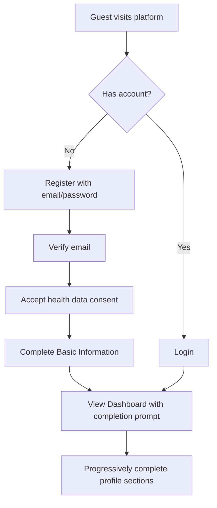
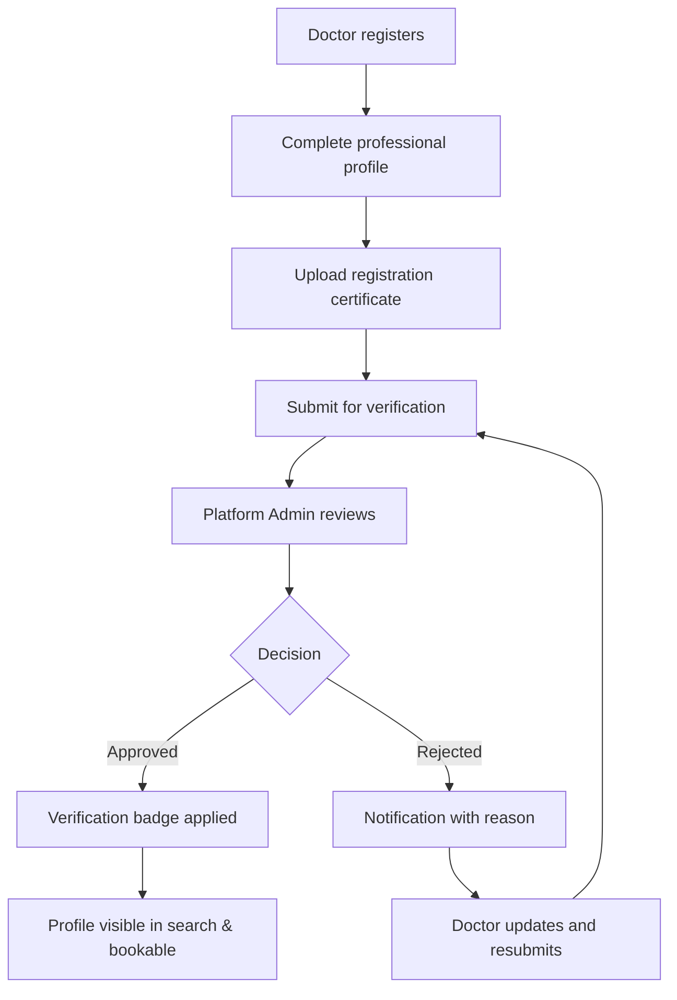
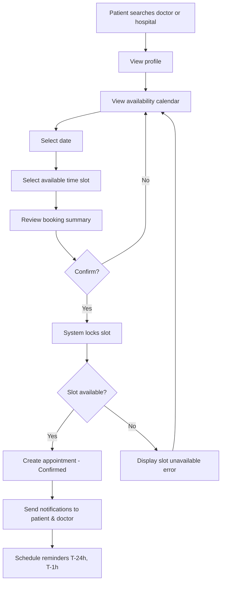
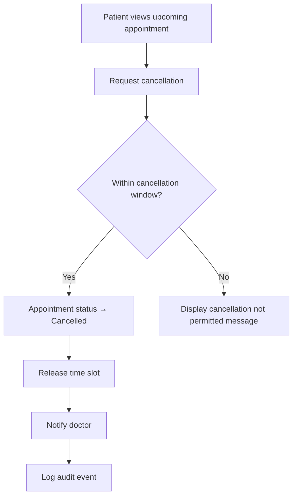
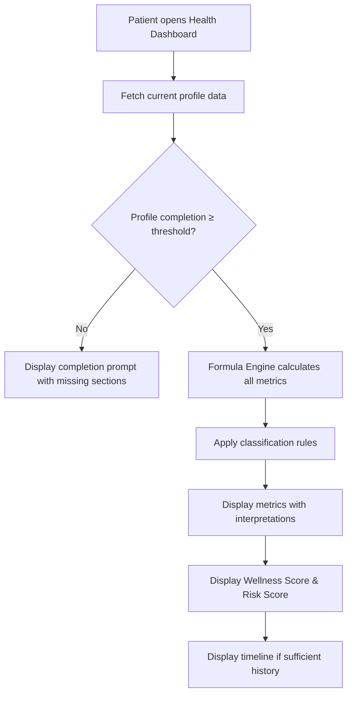
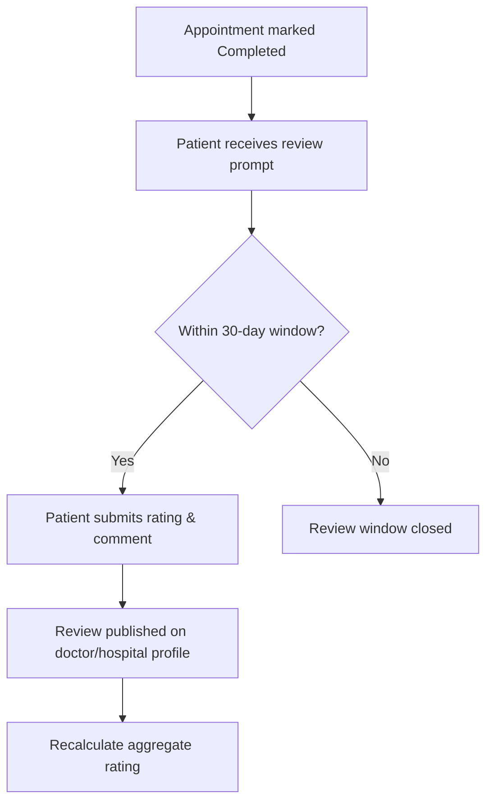

# DOC-02: Health360 AI — Business Requirements Document (BRD)

| Attribute | Value |
|-----------|-------|
| **Document ID** | DOC-02 |
| **Title** | Business Requirements Document |
| **Version** | 1.0 |
| **Status** | **Approved** |
| **Date** | 2026-07-27 |
| **Author** | Senior Business Analyst / Technical Lead |
| **References** | [DOC-00] Project Memory, [DOC-01] Project Vision & Phase 1 Scope Charter |
| **Next Document** | [DOC-03] Functional Requirements Specification (FRS) |

---

## 1. Executive Summary

This Business Requirements Document (BRD) translates the strategic vision defined in [DOC-01] into actionable business requirements for **Health360 AI Phase 1**. It defines what the business needs the platform to achieve — independent of technical implementation — across seven domain modules.

The BRD establishes:

- **Business goals and measurable outcomes** aligned with strategic objectives SO-001 through SO-008 [DOC-01 §3]
- **Stakeholder needs** for Patient, Doctor, Hospital Admin, Platform Admin, and Guest personas [DOC-00 §8]
- **Business requirements (BRQ-XXX)** — statements of business need
- **Business rules (BR-XXX)** — operational constraints and policies (detailed catalog deferred to [DOC-09])
- **Business processes** — end-to-end workflows for core platform capabilities
- **Compliance and regulatory baseline** for healthcare data handling

All requirements trace to [DOC-01] scope boundaries. Features listed in [DOC-00 §6] are explicitly excluded.

---

## 2. Document Purpose & Scope

### 2.1 Purpose

Provide a single authoritative business reference for product, engineering, QA, and stakeholder teams to:

1. Understand **why** each Phase 1 capability exists
2. Validate that delivered features meet business intent
3. Trace functional requirements ([DOC-03]) back to business need
4. Govern change requests against documented business goals

### 2.2 Scope

| In Scope | Out of Scope |
|----------|--------------|
| Phase 1 seven domain modules [DOC-00 §7] | Future ecosystem modules [DOC-00 §6] |
| Business rules governing Phase 1 operations | Technical API/DB design [DOC-06, DOC-07] |
| Business workflows and process definitions | Detailed UI specifications [DOC-10] |
| KPIs and success metrics | Implementation code |
| Regulatory baseline requirements | Formula mathematical specifications [DOC-08] |

### 2.3 Audience

| Audience | Usage |
|----------|-------|
| Product Owner | Scope validation, prioritization |
| Business Analyst | Requirements traceability, UAT planning |
| Engineering Lead | Business context for technical design |
| QA Lead | Business scenario test planning |
| Compliance Officer | Regulatory alignment review |
| Stakeholders / Investors | Business capability overview |

---

## 3. Business Context

### 3.1 Market Context

Health360 AI enters the Indian digital healthcare market where patients increasingly expect online provider discovery and appointment booking, yet lack a unified platform that combines comprehensive personal health profiling with verified provider networks and actionable health analytics.

Phase 1 positions Health360 AI as a **trusted healthcare foundation platform** — not a point solution — enabling future ecosystem expansion without rebuilding core identity, profile, scheduling, and analytics infrastructure.

### 3.2 Business Model (Phase 1 Foundation)

Phase 1 establishes the platform capability; monetization models are business decisions recorded here for architectural awareness:

| Model | Phase 1 Status | Notes |
|-------|---------------|-------|
| Patient subscription (premium analytics) | Future | Free tier with basic dashboard in Phase 1 |
| Doctor listing / visibility fees | Future | All verified doctors listed free in Phase 1 |
| Hospital enterprise subscription | Future | Hospital profiles free in Phase 1 |
| Appointment booking commission | Future | No payment processing in Phase 1 [ASM-006] |
| SaaS multi-tenant licensing | Future | Architecture ready [ASM-010] |

> **Business Decision BD-001:** Phase 1 launches as a **free-access foundation** to build user base and provider network. Monetization hooks (subscription flags, feature gates) architected but not activated.

### 3.3 Value Proposition by Stakeholder

| Stakeholder | Value Proposition |
|-------------|-------------------|
| **Patient** | One platform for health profile, provider discovery, appointment booking, and personalized health insights |
| **Doctor** | Verified professional presence, schedule management, patient reach, reputation building |
| **Hospital** | Digital facility profile, doctor roster management, appointment funnel |
| **Platform Operator** | Scalable SaaS foundation with audit trail, verification control, and ecosystem extensibility |

---

## 4. Stakeholder Analysis

Reference: [DOC-01 §6], [DOC-00 §8]

### 4.1 Stakeholder Matrix

| Stakeholder | Interest | Influence | Engagement Strategy |
|-------------|----------|-----------|---------------------|
| Patient | High | Medium | User research, beta program, feedback loops |
| Doctor | High | High | Onboarding program, verification SLA, profile tools |
| Hospital Admin | High | High | Admin portal, bulk doctor association tools |
| Platform Admin | High | High | Admin dashboard, audit tools, config management |
| Guest User | Medium | Low | Public search, conversion-optimized registration |
| Compliance / Legal | High | High | Early review of data handling, disclaimers, consent |
| Engineering | High | High | BRD → FRS traceability workshops |
| QA | Medium | Medium | Business scenario test matrix from BRD processes |

### 4.2 Stakeholder Needs Summary

#### Patient Needs

| Need ID | Need | Priority |
|---------|------|----------|
| SN-P-001 | Register and securely access personal account | Must Have |
| SN-P-002 | Build comprehensive health profile once, update over time | Must Have |
| SN-P-003 | View health dashboard with calculated metrics and scores | Must Have |
| SN-P-004 | Search doctors by specialization, location, availability, ratings | Must Have |
| SN-P-005 | Search hospitals by location, department, facilities | Must Have |
| SN-P-006 | Book, cancel, and reschedule appointments online | Must Have |
| SN-P-007 | Receive appointment reminders | Must Have |
| SN-P-008 | Upload and manage health documents | Should Have |
| SN-P-009 | View health timeline of profile changes and appointments | Should Have |
| SN-P-010 | Submit doctor/hospital reviews after completed appointments | Should Have |
| SN-P-011 | Manage notification preferences | Should Have |
| SN-P-012 | Export health report as PDF | Could Have |

#### Doctor Needs

| Need ID | Need | Priority |
|---------|------|----------|
| SN-D-001 | Register and create professional profile | Must Have |
| SN-D-002 | Submit credentials for platform verification | Must Have |
| SN-D-003 | Associate with one or more hospitals | Must Have |
| SN-D-004 | Configure weekly schedule and consultation types per hospital | Must Have |
| SN-D-005 | View and manage upcoming appointments | Must Have |
| SN-D-006 | View limited patient health summary (with patient consent) before appointment | Should Have |
| SN-D-007 | Receive appointment notifications | Must Have |
| SN-D-008 | View patient reviews and aggregate rating | Should Have |

#### Hospital Admin Needs

| Need ID | Need | Priority |
|---------|------|----------|
| SN-H-001 | Register and manage hospital profile | Must Have |
| SN-H-002 | Manage branches, departments, and facilities | Must Have |
| SN-H-003 | Associate doctors with hospital and departments | Must Have |
| SN-H-004 | Configure working hours, emergency, and ICU information | Must Have |
| SN-H-005 | Upload hospital images and gallery | Should Have |
| SN-H-006 | View hospital ratings and reviews | Should Have |

#### Platform Admin Needs

| Need ID | Need | Priority |
|---------|------|----------|
| SN-A-001 | Manage user accounts across all roles | Must Have |
| SN-A-002 | Review and approve/reject doctor verification requests | Must Have |
| SN-A-003 | View comprehensive audit logs | Must Have |
| SN-A-004 | Manage roles and permissions | Must Have |
| SN-A-005 | Monitor platform health metrics | Should Have |

#### Guest User Needs

| Need ID | Need | Priority |
|---------|------|----------|
| SN-G-001 | Search doctors and hospitals without registration | Must Have |
| SN-G-002 | View public doctor and hospital profiles | Must Have |
| SN-G-003 | Prompted to register when attempting to book | Must Have |

---

## 5. Business Goals & Objectives

Traceability to [DOC-01 §3] Strategic Objectives:

| Goal ID | Business Goal | Success Metric | Target |
|---------|---------------|----------------|--------|
| BG-001 | Establish trusted provider network | % verified doctors with complete profiles | ≥ 90% of registered doctors |
| BG-002 | Enable comprehensive patient health profiling | Avg profile completion score | ≥ 70% within 30 days of registration |
| BG-003 | Drive provider discoverability | Monthly search-to-profile-view conversion | ≥ 40% |
| BG-004 | Deliver reliable appointment booking | Booking completion rate (started → confirmed) | ≥ 85% |
| BG-005 | Provide actionable health insights | Dashboard engagement (weekly active patients viewing dashboard) | ≥ 50% of active patients |
| BG-006 | Ensure platform trust and compliance | Zero critical data breaches; audit log completeness | 100% mutation coverage |
| BG-007 | Build multi-channel accessibility | Mobile app adoption among active patients | ≥ 30% within 6 months |
| BG-008 | Prepare ecosystem extensibility | All 7 modules independently testable and bounded | 100% module isolation in architecture review |

---

## 6. Business Requirements by Domain

Requirements use prefix **BRQ-{DOMAIN}-{NNN}**.

---

### 6.1 Domain 01: Identity & Access Management (IAM)

| ID | Business Requirement | Priority | Traces To |
|----|---------------------|----------|-----------|
| BRQ-IAM-001 | The platform shall allow users to register with email and password | Must Have | SN-P-001, SN-D-001 |
| BRQ-IAM-002 | The platform shall authenticate users via secure token-based sessions (JWT) | Must Have | ADR-004 |
| BRQ-IAM-003 | The platform shall support refresh token rotation for session continuity | Must Have | ADR-004 |
| BRQ-IAM-004 | The platform shall enforce Role-Based Access Control (RBAC) with predefined roles: Patient, Doctor, Hospital Admin, Platform Admin | Must Have | ADR-005 |
| BRQ-IAM-005 | The platform shall support fine-grained permissions assignable to roles | Must Have | SN-A-004 |
| BRQ-IAM-006 | The platform shall allow users to manage account profile settings (name, email, phone, password, avatar) | Must Have | SN-P-001 |
| BRQ-IAM-007 | The platform shall allow users to configure notification preferences (email, SMS, in-app) | Should Have | SN-P-011 |
| BRQ-IAM-008 | The platform shall maintain an audit log of all authentication events (login, logout, failed attempts, password change) | Must Have | BG-006, ADR-010 |
| BRQ-IAM-009 | The platform shall maintain an audit log of all authorization-sensitive actions | Must Have | BG-006 |
| BRQ-IAM-010 | The platform shall support account deactivation (soft delete) with data retention policy | Must Have | ASM-005 |
| BRQ-IAM-011 | The platform shall include tenant identifier on all user records for multi-tenant readiness | Must Have | ASM-010 |
| BRQ-IAM-012 | The platform shall lock accounts after configurable failed login attempts | Should Have | Security baseline |
| BRQ-IAM-013 | The platform shall enforce password complexity policy | Must Have | Security baseline |
| BRQ-IAM-014 | The platform shall allow Platform Admin to manage users, assign roles, and deactivate accounts | Must Have | SN-A-001 |

---

### 6.2 Domain 02: Patient Domain

| ID | Business Requirement | Priority | Traces To |
|----|---------------------|----------|-----------|
| BRQ-PAT-001 | The platform shall provide a structured patient profile divided into logical sections: Basic Information, Contact Information, Physical Measurements, Medical Information, Lifestyle, Emergency Contacts, Family Members, Vitals, Lab Values, Health Goals, Documents | Must Have | SN-P-002, BG-002 |
| BRQ-PAT-002 | The platform shall collect all data fields required by the Health Formula Engine [DOC-08] at least once, allowing subsequent updates | Must Have | BG-002, BG-005 |
| BRQ-PAT-003 | The platform shall calculate and display a Profile Completion Score based on section completeness | Must Have | SO-002 |
| BRQ-PAT-004 | The platform shall allow patients to save profile sections independently (progressive completion) | Must Have | R-004 [DOC-01 §12] |
| BRQ-PAT-005 | The platform shall store personal information: full name, date of birth, gender, blood group, marital status, nationality | Must Have | Formula inputs |
| BRQ-PAT-006 | The platform shall store contact information: primary phone, secondary phone, email, permanent address, current address | Must Have | SN-P-002 |
| BRQ-PAT-007 | The platform shall store physical measurements: height, weight, waist circumference, hip circumference, body fat percentage (optional manual entry) | Must Have | Formula inputs |
| BRQ-PAT-008 | The platform shall store medical information: known allergies, current medications, past surgeries, vaccinations, chronic conditions, family medical history | Must Have | SN-P-002 |
| BRQ-PAT-009 | The platform shall store lifestyle profile: smoking status, alcohol consumption, exercise frequency, occupation type, sleep hours, dietary preference, stress level | Must Have | Formula inputs |
| BRQ-PAT-010 | The platform shall allow management of multiple emergency contacts with relationship and priority | Must Have | SN-P-002 |
| BRQ-PAT-011 | The platform shall allow management of family members with relationship and relevant health history | Should Have | SN-P-002 |
| BRQ-PAT-012 | The platform shall record vital signs with timestamp: blood pressure (systolic/diastolic), heart rate, temperature, respiratory rate, SpO2, blood glucose | Must Have | Formula inputs |
| BRQ-PAT-013 | The platform shall maintain vital signs history for trend analysis | Must Have | BG-005 |
| BRQ-PAT-014 | The platform shall store lab values (manual entry): HbA1c, cholesterol (total/HDL/LDL/triglycerides), hemoglobin, vitamin D, TSH, creatinine | Should Have | Formula inputs |
| BRQ-PAT-015 | The platform shall allow patients to set health goals: target weight, daily steps, sleep hours, water intake, exercise minutes | Should Have | SN-P-002 |
| BRQ-PAT-016 | The platform shall allow upload, categorization, and management of health documents (reports, prescriptions, scans) | Should Have | SN-P-008 |
| BRQ-PAT-017 | The platform shall maintain a health timeline aggregating profile updates, vital recordings, appointments, and document uploads | Should Have | SN-P-009 |
| BRQ-PAT-018 | The platform shall ensure patient health data is accessible only to the patient and authorized parties (doctor with consent during active appointment) | Must Have | BG-006, Compliance |
| BRQ-PAT-019 | The platform shall version significant profile changes for audit purposes | Should Have | ADR-010 |

#### Patient Profile Sections — Business Field Inventory

| Section | Key Fields | Required for Formula Engine |
|---------|-----------|----------------------------|
| **Basic Information** | First name, last name, DOB, gender, blood group, marital status, nationality, profile photo | DOB, gender |
| **Contact Information** | Primary phone, email, permanent address (line1, line2, city, state, pincode, country), current address | — |
| **Physical Measurements** | Height (cm), weight (kg), waist (cm), hip (cm), neck (cm), body fat % (optional), measurement date | Height, weight, waist, hip |
| **Medical Information** | Allergies (name, severity, reaction), medications (name, dosage, frequency, start date), surgeries (name, date, hospital), vaccinations (name, date, dose), chronic conditions, disabilities | Medical history for risk score |
| **Lifestyle** | Smoking (never/former/current + frequency), alcohol (never/occasional/regular), exercise (type, frequency, duration), occupation (sedentary/moderate/active), avg sleep hours, diet type (veg/non-veg/vegan/mixed), stress level (1–5) | Activity level, sleep, smoking, alcohol |
| **Emergency Contacts** | Name, relationship, phone, email, is primary | — |
| **Family Members** | Name, relationship, DOB, conditions (hereditary) | Family history for risk score |
| **Vitals** | BP systolic/diastolic, heart rate, temperature, respiratory rate, SpO2, blood glucose (fasting/random), recorded_at | BP, HR, blood glucose |
| **Lab Values** | HbA1c, total cholesterol, HDL, LDL, triglycerides, hemoglobin, vitamin D, TSH, creatinine, recorded_at | Lipid profile, HbA1c |
| **Health Goals** | Target weight, daily steps, sleep target, water intake (ml), weekly exercise minutes | Goal comparison in dashboard |
| **Documents** | File, category (lab report/prescription/scan/other), title, description, upload date | — |

---

### 6.3 Domain 03: Doctor Domain

| ID | Business Requirement | Priority | Traces To |
|----|---------------------|----------|-----------|
| BRQ-DOC-001 | The platform shall allow doctors to create and manage a comprehensive professional profile | Must Have | SN-D-001 |
| BRQ-DOC-002 | The platform shall capture professional details: title, medical registration number, registration council, registration year, registration expiry | Must Have | SN-D-002, ASM-003 |
| BRQ-DOC-003 | The platform shall capture qualifications: degree, institution, year of completion (multiple entries) | Must Have | SN-D-001 |
| BRQ-DOC-004 | The platform shall capture experience: total years, previous institutions, positions held | Must Have | SN-D-001 |
| BRQ-DOC-005 | The platform shall capture specialization and sub-specialization from a controlled taxonomy | Must Have | Search filters |
| BRQ-DOC-006 | The platform shall capture languages spoken | Must Have | Search filters |
| BRQ-DOC-007 | The platform shall allow doctors to associate with one or more hospitals [ASM-015] | Must Have | SN-D-003 |
| BRQ-DOC-008 | The platform shall capture consultation fee per consultation type per hospital | Must Have | Search filters |
| BRQ-DOC-009 | The platform shall capture biography, awards, and professional memberships | Should Have | SN-D-001 |
| BRQ-DOC-010 | The platform shall require platform verification before doctor profile is bookable | Must Have | SO-001, BG-001 |
| BRQ-DOC-011 | The platform shall provide a verification workflow: Submitted → Under Review → Approved / Rejected | Must Have | SN-A-002 |
| BRQ-DOC-012 | The platform shall display verification badge on approved doctor profiles | Must Have | SO-001 |
| BRQ-DOC-013 | The platform shall calculate and display aggregate rating from patient reviews | Should Have | SN-D-008 |
| BRQ-DOC-014 | The platform shall display patient reviews (post-appointment only) on doctor profile | Should Have | BR-REV-001 |
| BRQ-DOC-015 | The platform shall provide a public doctor profile page viewable by guests and patients | Must Have | SN-G-002 |
| BRQ-DOC-016 | The platform shall capture doctor gender for search filtering | Should Have | Search filters |
| BRQ-DOC-017 | The platform shall allow doctors to upload profile photo and certificates for verification | Must Have | SN-D-002 |

---

### 6.4 Domain 04: Hospital Domain

| ID | Business Requirement | Priority | Traces To |
|----|---------------------|----------|-----------|
| BRQ-HOS-001 | The platform shall allow hospital admins to create and manage a comprehensive hospital profile | Must Have | SN-H-001 |
| BRQ-HOS-002 | The platform shall capture hospital information: name, registration number, type (government/private/trust), established year, bed count, accreditation (NABH/JCI/none) | Must Have | SN-H-001 |
| BRQ-HOS-003 | The platform shall support multiple branches per hospital entity | Must Have | SN-H-002 |
| BRQ-HOS-004 | Each branch shall have: name, address, geo coordinates, contact phone, email, working hours | Must Have | SN-H-004 |
| BRQ-HOS-005 | The platform shall manage departments: name, description, floor, head doctor, operating hours | Must Have | SN-H-002 |
| BRQ-HOS-006 | The platform shall manage facilities: name, category (diagnostic/surgical/emergency/other), availability status | Must Have | SN-H-002 |
| BRQ-HOS-007 | The platform shall map doctors to hospitals and optionally to departments | Must Have | SN-H-003 |
| BRQ-HOS-008 | The platform shall capture emergency services information: 24/7 availability, emergency contact number, ambulance availability | Must Have | SN-H-004 |
| BRQ-HOS-009 | The platform shall capture ICU information: availability, bed count, type (general/critical care) | Should Have | SN-H-004 |
| BRQ-HOS-010 | The platform shall support hospital image gallery upload | Should Have | SN-H-005 |
| BRQ-HOS-011 | The platform shall calculate and display aggregate hospital rating from patient reviews | Should Have | SN-H-006 |
| BRQ-HOS-012 | The platform shall provide a public hospital profile page viewable by guests and patients | Must Have | SN-G-002 |
| BRQ-HOS-013 | The platform shall store geo location (latitude, longitude) for each branch for location-based search | Must Have | Location domain |

---

### 6.5 Domain 05: Scheduling Domain

| ID | Business Requirement | Priority | Traces To |
|----|---------------------|----------|-----------|
| BRQ-SCH-001 | The platform shall allow doctors to define weekly schedule templates per hospital | Must Have | SN-D-004 |
| BRQ-SCH-002 | The platform shall generate bookable time slots from schedule templates for a configurable horizon (default 30 days) | Must Have | SN-P-006 |
| BRQ-SCH-003 | The platform shall support consultation types: in-person, follow-up (video deferred to future) | Must Have | SN-D-004 |
| BRQ-SCH-004 | The platform shall allow configurable slot duration (default 15 minutes) and buffer time | Must Have | SN-D-004 |
| BRQ-SCH-005 | The platform shall enforce the appointment booking workflow: Search → Profile → Availability → Date → Time Slot → Confirm | Must Have | SN-P-006 |
| BRQ-SCH-006 | Each appointment shall link: Patient, Doctor, Hospital (branch), Time Slot, Consultation Type, Status | Must Have | SO-004 |
| BRQ-SCH-007 | The platform shall prevent double-booking of the same time slot | Must Have | SO-004, R-007 |
| BRQ-SCH-008 | The platform shall support appointment status lifecycle: Pending → Confirmed → Completed / Cancelled / No-Show / Rescheduled | Must Have | SN-P-006 |
| BRQ-SCH-009 | The platform shall allow patients to cancel appointments subject to cancellation policy [OQ-006] | Must Have | SN-P-006 |
| BRQ-SCH-010 | The platform shall allow patients to reschedule appointments to an available slot | Must Have | SN-P-006 |
| BRQ-SCH-011 | The platform shall send appointment reminders at 24 hours and 1 hour before scheduled time [ASM-013] | Must Have | SN-P-007 |
| BRQ-SCH-012 | The platform shall maintain complete appointment history for patients and doctors | Must Have | SN-P-006 |
| BRQ-SCH-013 | The platform shall log all appointment state changes in the audit trail | Must Have | ADR-010 |
| BRQ-SCH-014 | The platform shall notify doctor and patient on booking, cancellation, and rescheduling | Must Have | SN-D-007 |
| BRQ-SCH-015 | The platform shall block booking for unverified doctors | Must Have | SO-001 |

---

### 6.6 Domain 06: Location Domain

| ID | Business Requirement | Priority | Traces To |
|----|---------------------|----------|-----------|
| BRQ-LOC-001 | The platform shall integrate with Google Maps Platform for map display and geo services [ASM-002] | Must Have | SO-003 |
| BRQ-LOC-002 | The platform shall allow patients to search nearby hospitals based on current or entered location | Must Have | SN-P-005 |
| BRQ-LOC-003 | The platform shall allow patients to search nearby doctors based on current or entered location | Must Have | SN-P-004 |
| BRQ-LOC-004 | The platform shall calculate distance between user location and provider location | Must Have | Search filters |
| BRQ-LOC-005 | The platform shall estimate travel time between user location and provider location | Should Have | SO-003 |
| BRQ-LOC-006 | The platform shall support geo-based search with radius filter (default 5km, configurable up to 50km) | Must Have | SN-P-004 |
| BRQ-LOC-007 | The platform shall request location permission on mobile app with graceful fallback to manual location entry | Must Have | SN-P-004 |
| BRQ-LOC-008 | The platform shall geocode addresses for hospitals without explicit coordinates | Should Have | BRQ-HOS-013 |

---

### 6.7 Domain 07: Health Analytics Domain

| ID | Business Requirement | Priority | Traces To |
|----|---------------------|----------|-----------|
| BRQ-ANL-001 | The platform shall provide a Health Dashboard displaying calculated metrics for the logged-in patient | Must Have | SN-P-003, BG-005 |
| BRQ-ANL-002 | The platform shall implement a Formula Engine computing all specified health calculations [DOC-08] | Must Have | SO-005 |
| BRQ-ANL-003 | The platform shall calculate and display: BMI, BMR, Ideal Weight, Lean Body Mass, Body Fat %, Body Surface Area, Healthy Weight Range | Must Have | DOC-08 |
| BRQ-ANL-004 | The platform shall calculate and display: Protein Requirement, Water Intake, Daily Calorie Requirement, Sleep Recommendation, Daily Step Goal | Must Have | DOC-08 |
| BRQ-ANL-005 | The platform shall calculate and display: Heart Rate Zones, Blood Pressure Classification, Blood Sugar Classification | Must Have | DOC-08 |
| BRQ-ANL-006 | The platform shall calculate and display: Waist-Hip Ratio, Waist-Height Ratio | Must Have | DOC-08 |
| BRQ-ANL-007 | The platform shall calculate and display: Overall Wellness Score and Health Risk Score | Must Have | SO-005 |
| BRQ-ANL-008 | Each calculated metric shall include: value, unit, classification (normal/warning/critical), interpretation text, and medical disclaimer | Must Have | Compliance |
| BRQ-ANL-009 | The platform shall display a Health Timeline visualizing metrics over time | Should Have | SN-P-009 |
| BRQ-ANL-010 | The platform shall generate a downloadable Health Report (PDF) summarizing profile and current metrics | Could Have | SN-P-012 |
| BRQ-ANL-011 | The platform shall recalculate metrics automatically when underlying profile data changes | Must Have | BG-005 |
| BRQ-ANL-012 | The platform shall indicate which profile sections/fields are missing for incomplete calculations | Must Have | BG-002 |
| BRQ-ANL-013 | The Formula Engine shall be deterministic — same inputs always produce same outputs | Must Have | ADR-001 |
| BRQ-ANL-014 | The platform shall NOT provide AI-generated medical advice in Phase 1 | Must Have | [DOC-00 §6] |

#### Formula Engine — Business-Level Calculation Inventory

| Calculation | Business Purpose | Profile Inputs Required |
|-------------|-----------------|------------------------|
| BMI | Assess weight relative to height | Height, weight |
| BMR | Estimate daily calorie burn at rest | Weight, height, age, gender |
| Ideal Weight | Target weight range reference | Height, gender |
| Lean Body Mass | Estimate non-fat body mass | Weight, body fat % OR height, weight, gender |
| Body Fat % | Accept manual entry; display classification | Body fat % (manual) |
| Body Surface Area | Clinical dosing reference | Height, weight |
| Healthy Weight Range | Display acceptable weight range | Height, gender |
| Protein Requirement | Daily protein intake guidance | Weight, activity level |
| Water Intake | Daily hydration recommendation | Weight, activity level, climate |
| Daily Calories | Caloric intake recommendation | BMR, activity level, goal (maintain/lose/gain) |
| Sleep Recommendation | Recommended sleep duration | Age |
| Daily Step Goal | Activity target | Age, activity level, health goals |
| Heart Rate Zones | Exercise intensity zones | Age, resting heart rate |
| BP Classification | Classify blood pressure reading | Systolic, diastolic |
| Blood Sugar Classification | Classify glucose reading | Glucose value, reading type (fasting/random) |
| Waist-Hip Ratio | Abdominal obesity indicator | Waist, hip |
| Waist-Height Ratio | Central obesity indicator | Waist, height |
| Wellness Score | Composite wellness indicator | Multiple profile sections |
| Health Risk Score | Composite risk indicator | Medical history, lifestyle, vitals, lab values |
| Profile Completion | Percentage of profile completeness | All sections |

> Full formula specifications (formula, ranges, validation, UI recommendations) defined in [DOC-08].

---

### 6.8 Cross-Domain: Search & Discovery

| ID | Business Requirement | Priority | Traces To |
|----|---------------------|----------|-----------|
| BRQ-SRH-001 | The platform shall provide unified search for doctors and hospitals | Must Have | SN-P-004, SN-P-005 |
| BRQ-SRH-002 | Doctor search shall support filters: specialization, sub-specialization, experience (years), distance, availability (date), ratings, fee range, gender, language, hospital | Must Have | SN-P-004 |
| BRQ-SRH-003 | Hospital search shall support filters: department, facility, distance, ratings, emergency availability, 24/7 | Must Have | SN-P-005 |
| BRQ-SRH-004 | Search results shall support sorting: nearest, highest rated, most experienced, lowest fee | Must Have | SN-P-004 |
| BRQ-SRH-005 | Guest users shall access search and public profiles without authentication | Must Have | SN-G-001 |
| BRQ-SRH-006 | Search shall return only verified, active doctor profiles | Must Have | SO-001 |

---

### 6.9 Cross-Domain: Reviews & Ratings

| ID | Business Requirement | Priority | Traces To |
|----|---------------------|----------|-----------|
| BRQ-REV-001 | Only patients with a completed appointment may submit a review for that doctor/hospital | Must Have | [ASM-014] |
| BRQ-REV-002 | Reviews shall include: star rating (1–5), text comment, submission date | Must Have | SN-P-010 |
| BRQ-REV-003 | One review per patient per doctor/hospital per completed appointment | Must Have | Data integrity |
| BRQ-REV-004 | Aggregate rating shall be calculated as arithmetic mean of all approved reviews | Must Have | SN-D-008 |
| BRQ-REV-005 | Platform Admin shall be able to moderate/remove inappropriate reviews | Should Have | Trust & safety |

---

## 7. Business Rules Catalog (Overview)

> Full rule specifications with validation logic deferred to [DOC-09]. Rules defined here establish business policy.

### 7.1 Authentication & Authorization Rules

| Rule ID | Rule | Domain |
|---------|------|--------|
| BR-AUTH-001 | A user must verify email before accessing protected features | IAM |
| BR-AUTH-002 | Access token expires in 15 minutes; refresh token expires in 7 days | IAM |
| BR-AUTH-003 | Refresh token is rotated on each use; previous token invalidated | IAM |
| BR-AUTH-004 | Password must be minimum 8 characters with uppercase, lowercase, digit, and special character | IAM |
| BR-AUTH-005 | Account locked for 30 minutes after 5 consecutive failed login attempts | IAM |
| BR-AUTH-006 | A user may hold only one primary role; additional roles require Platform Admin assignment | IAM |
| BR-AUTH-007 | Patient health data access by doctor requires active appointment relationship | IAM, Patient |

### 7.2 Patient Profile Rules

| Rule ID | Rule | Domain |
|---------|------|--------|
| BR-PAT-001 | Date of birth cannot be in the future; patient must be at least 1 year old | Patient |
| BR-PAT-002 | Height must be between 30 cm and 300 cm | Patient |
| BR-PAT-003 | Weight must be between 1 kg and 500 kg | Patient |
| BR-PAT-004 | Vital signs recordings are append-only; edits create new records with timestamp | Patient |
| BR-PAT-005 | Health documents maximum file size: 10 MB [pending OQ-002 confirmation] | Patient |
| BR-PAT-006 | Allowed document formats: PDF, JPEG, PNG, DICOM | Patient |
| BR-PAT-007 | Profile completion score weights: Basic (15%), Contact (10%), Physical (15%), Medical (15%), Lifestyle (10%), Emergency (5%), Vitals (10%), Lab (5%), Goals (5%), Documents (10%) | Patient |
| BR-PAT-008 | Patient must accept health data processing consent before profile creation | Patient |

### 7.3 Doctor Profile Rules

| Rule ID | Rule | Domain |
|---------|------|--------|
| BR-DOC-001 | Doctor profile must be verified (status = Approved) before appearing in bookable search results | Doctor |
| BR-DOC-002 | Medical registration number must be unique within the platform | Doctor |
| BR-DOC-003 | Doctor must be associated with at least one hospital to enable booking | Doctor |
| BR-DOC-004 | Consultation fee must be ≥ 0; fee = 0 displayed as "Free Consultation" | Doctor |
| BR-DOC-005 | Doctor must define at least one consultation type | Doctor |
| BR-DOC-006 | Rejected verification allows resubmission with updated documents | Doctor |
| BR-DOC-007 | Doctor can practice at multiple hospitals with independent schedules per hospital | Doctor |

### 7.4 Hospital Profile Rules

| Rule ID | Rule | Domain |
|---------|------|--------|
| BR-HOS-001 | Hospital must have at least one branch with valid address | Hospital |
| BR-HOS-002 | Hospital registration number must be unique within the platform | Hospital |
| BR-HOS-003 | Each branch must have geo coordinates for location-based search | Hospital |
| BR-HOS-004 | Maximum 20 gallery images per hospital [pending OQ-005 confirmation] | Hospital |
| BR-HOS-005 | Department names must be unique within a hospital | Hospital |

### 7.5 Scheduling Rules

| Rule ID | Rule | Domain |
|---------|------|--------|
| BR-SCH-001 | Time slots cannot overlap for the same doctor at the same hospital | Scheduling |
| BR-SCH-002 | Patient cannot book more than one active appointment with the same doctor on the same day | Scheduling |
| BR-SCH-003 | Appointment can only be booked for future time slots | Scheduling |
| BR-SCH-004 | Cancellation allowed up to 2 hours before appointment [pending OQ-006 confirmation] | Scheduling |
| BR-SCH-005 | Rescheduling allowed up to 2 hours before appointment; creates new slot, marks old as Rescheduled | Scheduling |
| BR-SCH-006 | Only Confirmed appointments can transition to Completed or No-Show | Scheduling |
| BR-SCH-007 | Doctor or Platform Admin can mark appointment as No-Show after scheduled time + 15 minutes | Scheduling |
| BR-SCH-008 | Booking confirmation is atomic — slot locked during transaction to prevent race conditions | Scheduling |
| BR-SCH-009 | Reminder notifications sent at T-24 hours and T-1 hour via patient's preferred channels | Scheduling |

### 7.6 Health Analytics Rules

| Rule ID | Rule | Domain |
|---------|------|--------|
| BR-ANL-001 | All calculated metrics must display disclaimer: "This is not a medical diagnosis. Consult a healthcare professional." | Analytics |
| BR-ANL-002 | Metrics with missing required inputs display "Insufficient data" with guidance on missing fields | Analytics |
| BR-ANL-003 | Wellness Score requires minimum 60% profile completion to calculate | Analytics |
| BR-ANL-004 | Health Risk Score requires Medical Information and Lifestyle sections to be complete | Analytics |
| BR-ANL-005 | Classification thresholds follow internationally recognized standards (WHO, AHA, ADA) | Analytics |
| BR-ANL-006 | Historical metric trends require at least 2 data points | Analytics |

### 7.7 Review Rules

| Rule ID | Rule | Domain |
|---------|------|--------|
| BR-REV-001 | Review submission window: within 30 days of completed appointment | Reviews |
| BR-REV-002 | Review text maximum 1000 characters | Reviews |
| BR-REV-003 | Reviews cannot be edited after submission; only deleted by patient or moderated by admin | Reviews |

---

## 8. Business Processes & Workflows

### 8.1 Process: Patient Registration & Onboarding

**Process Owner:** Product  
**Trigger:** New user registration  
**Outcome:** Active patient account with initiated health profile

---

### 8.2 Process: Doctor Verification

**Process Owner:** Platform Operations  
**Trigger:** Doctor submits verification request  
**Outcome:** Verified doctor profile eligible for appointment booking  
**SLA Target:** Verification completed within 48 business hours

---

### 8.3 Process: Appointment Booking

**Process Owner:** Product  
**Trigger:** Patient initiates booking from doctor/hospital profile  
**Outcome:** Confirmed appointment linking Patient, Doctor, Hospital, Time Slot

---

### 8.4 Process: Appointment Cancellation

**Process Owner:** Product  
**Trigger:** Patient cancellation request  
**Business Rule:** [BR-SCH-004]

---

### 8.5 Process: Health Dashboard Calculation

**Process Owner:** Product / Clinical Advisory  
**Trigger:** Dashboard access or profile data update  
**Outcome:** Patient views current health metrics with classifications

---

### 8.6 Process: Review Submission

**Process Owner:** Product  
**Trigger:** Appointment completion  
**Business Rule:** [BR-REV-001]

---

## 9. Business Constraints

| ID | Constraint | Impact |
|----|-----------|--------|
| BC-001 | No payment processing in Phase 1 [ASM-006] | Appointment booking is free; no fee collection |
| BC-002 | English-only UI in Phase 1 [ASM-008] | All content, labels, error messages in English |
| BC-003 | India-first regulatory alignment [ASM-011] | NMC registration format, Indian address/pincode, IST default timezone |
| BC-004 | Google Maps Platform dependency [ASM-002] | Location features require active API subscription |
| BC-005 | No clinical diagnosis in Phase 1 | Formula engine outputs are informational only with disclaimers |
| BC-006 | Tenant isolation prepared but single-tenant deployment for MVP [ASM-010] | Simpler ops; schema supports future multi-tenant |
| BC-007 | Manual lab value entry only | No lab integration in Phase 1 |
| BC-008 | Email + SMS notifications only in Phase 1 [ASM-007] | Push notifications deferred to mobile Phase 1.5 |

---

## 10. Regulatory & Compliance Requirements

| ID | Requirement | Regulation / Standard | Phase 1 Approach |
|----|-------------|----------------------|------------------|
| CR-001 | Health data classified as sensitive personal data | India DPDP Act 2023 | Explicit consent; encryption; access controls |
| CR-002 | Right to access and update personal data | DPDP Act 2023 | Patient profile self-service edit |
| CR-003 | Right to erasure (with legal exceptions) | DPDP Act 2023 | Account deactivation with soft delete; hard purge on request |
| CR-004 | Audit trail for data access and modifications | Healthcare best practice | Immutable audit log [ADR-010] |
| CR-005 | Medical calculation disclaimers | Consumer protection | Mandatory disclaimer on all analytics [BR-ANL-001] |
| CR-006 | Doctor credential verification | Medical council regulations | Verification workflow before booking enabled |
| CR-007 | Data encryption in transit | Industry standard | TLS 1.2+ for all API communication |
| CR-008 | Data encryption at rest | Industry standard | PostgreSQL encryption; S3 server-side encryption |
| CR-009 | HIPAA readiness (US market future) | HIPAA | Architecture alignment; certification post-Phase 1 [ASM-009] |
| CR-010 | Password and session security | OWASP | JWT, refresh rotation, account lockout [BR-AUTH-002–005] |

---

## 11. Key Performance Indicators (KPIs)

| KPI ID | Metric | Target (3 months post-launch) | Measurement Source |
|--------|--------|-------------------------------|-------------------|
| KPI-001 | Registered patients | 10,000 | User database |
| KPI-002 | Verified doctors | 500 | Doctor verification records |
| KPI-003 | Registered hospitals | 100 | Hospital profiles |
| KPI-004 | Appointments booked | 5,000 | Scheduling records |
| KPI-005 | Avg profile completion score | ≥ 70% | Patient profile analytics |
| KPI-006 | Search-to-book conversion | ≥ 15% | Funnel analytics |
| KPI-007 | Appointment no-show rate | ≤ 20% | Scheduling records |
| KPI-008 | Doctor verification SLA compliance | ≥ 95% within 48 hours | Admin workflow timestamps |
| KPI-009 | Dashboard weekly active users | ≥ 50% of active patients | Analytics |
| KPI-010 | API uptime | ≥ 99.9% | Monitoring |

---

## 12. Assumptions & Dependencies

### 12.1 Assumptions

All assumptions from [DOC-00 §4] apply. Additional BRD assumptions:

| ID | Assumption |
|----|------------|
| ASM-016 | Patients are 18+ or have guardian consent for registration |
| ASM-017 | Doctors self-register; hospital admins invite/manage doctor associations |
| ASM-018 | Platform Admin team available for verification within 48-hour SLA |
| ASM-019 | Health formula thresholds reviewed by medical advisory board before launch |
| ASM-020 | Initial launch city: metro areas with highest provider density (configurable) |

### 12.2 Dependencies

| ID | Dependency | Owner | Risk if Unavailable |
|----|-----------|-------|---------------------|
| DEP-001 | Google Maps Platform API access | DevOps | Location search non-functional |
| DEP-002 | Email delivery service (AWS SES) | DevOps | No verification emails, no reminders |
| DEP-003 | SMS gateway (TBD — OQ-004) | DevOps | No SMS reminders |
| DEP-004 | AWS S3 for document/image storage | DevOps | No document upload |
| DEP-005 | Medical advisory review of formula engine | Clinical Advisory | Incorrect health classifications |
| DEP-006 | Specialization taxonomy definition | Product / Medical | Incomplete search filters |

---

## 13. Requirements Traceability Matrix (Preview)

| Business Requirement | Strategic Objective | Stakeholder Need | Future FRS Reference |
|---------------------|--------------------|--------------------|---------------------|
| BRQ-PAT-001–019 | SO-002 | SN-P-002 | DOC-03 §Patient |
| BRQ-DOC-001–017 | SO-001 | SN-D-001–003 | DOC-03 §Doctor |
| BRQ-HOS-001–013 | SO-001 | SN-H-001–003 | DOC-03 §Hospital |
| BRQ-SCH-001–015 | SO-004 | SN-P-006, SN-D-004 | DOC-03 §Scheduling |
| BRQ-LOC-001–008 | SO-003 | SN-P-004, SN-P-005 | DOC-03 §Location |
| BRQ-ANL-001–014 | SO-005 | SN-P-003 | DOC-03 §Analytics |
| BRQ-IAM-001–014 | SO-006 | SN-P-001, SN-A-001 | DOC-03 §IAM |
| BRQ-SRH-001–006 | SO-003 | SN-P-004, SN-G-001 | DOC-03 §Search |

---

## 14. Business Risks

| ID | Risk | Business Impact | Mitigation | Reference |
|----|------|----------------|------------|-----------|
| BRK-001 | Low doctor adoption | Empty search results; patient churn | Doctor onboarding program; verification SLA | R-002 [DOC-01] |
| BRK-002 | Patient profile abandonment | Incomplete analytics; poor dashboard experience | Progressive profiling; completion gamification | R-004 [DOC-01] |
| BRK-003 | Incorrect health calculations | Legal liability; loss of trust | Medical advisory review; disclaimers | R-005 [DOC-01] |
| BRK-004 | Review manipulation | Trust erosion | One-review-per-appointment rule; moderation | BR-REV-003 |
| BRK-005 | Regulatory changes (DPDP) | Compliance rework | Privacy-by-design architecture | CR-001–003 |

---

## 15. Open Questions (Carried Forward)

| ID | Question | Default if Unresolved | Required Before |
|----|----------|----------------------|-----------------|
| OQ-001 | Single vs multi-tenant Phase 1 deployment | Single-tenant with tenant_id in schema | DOC-11 |
| OQ-002 | Max health document upload size | 10 MB (BR-PAT-005) | DOC-06 |
| OQ-003 | Doctor verification: manual vs OCR-assisted | Manual only in Phase 1 | DOC-03 |
| OQ-004 | SMS provider | AWS SNS | DOC-13 |
| OQ-005 | Hospital gallery image limits | 20 images, JPEG/PNG, 5 MB each | DOC-06 |
| OQ-006 | Appointment cancellation time window | 2 hours before appointment | DOC-09 |

---

## 16. Glossary (Business Terms)

| Term | Definition |
|------|------------|
| **Business Requirement** | Statement of a business need the system must satisfy |
| **Business Rule** | Constraint or policy that governs business behavior |
| **Profile Completion Score** | Weighted percentage indicating how complete a patient's health profile is |
| **Verification** | Platform Admin approval of doctor credentials before booking enablement |
| **Time Slot** | Discrete bookable interval in a doctor's schedule at a specific hospital |
| **Wellness Score** | Composite 0–100 score reflecting overall health wellness based on multiple metrics |
| **Health Risk Score** | Composite score indicating potential health risk based on medical and lifestyle data |
| **Soft Delete** | Business-visible deletion that retains data for audit and compliance |

---

## 17. Approval

| Role | Name | Signature | Date | Status |
|------|------|-----------|------|--------|
| Product Owner | _________________ | _________________ | ________ | Pending |
| Business Analyst Lead | _________________ | _________________ | ________ | Pending |
| Technical Lead / Architect | _________________ | _________________ | ________ | Pending |
| Clinical Advisory | _________________ | _________________ | ________ | Pending |
| Compliance Officer | _________________ | _________________ | ________ | Pending |

---

## 18. Appendix — Use Case Summary (High-Level)

> Detailed use cases with actors, preconditions, and flows will be expanded in [DOC-14].

| UC ID | Use Case | Primary Actor | Domain |
|-------|----------|---------------|--------|
| UC-001 | Register Account | Guest | IAM |
| UC-002 | Login / Logout | User | IAM |
| UC-003 | Manage Health Profile | Patient | Patient |
| UC-004 | View Health Dashboard | Patient | Analytics |
| UC-005 | Search Doctors | Patient, Guest | Search, Location |
| UC-006 | Search Hospitals | Patient, Guest | Search, Location |
| UC-007 | Book Appointment | Patient | Scheduling |
| UC-008 | Cancel Appointment | Patient | Scheduling |
| UC-009 | Reschedule Appointment | Patient | Scheduling |
| UC-010 | Create Doctor Profile | Doctor | Doctor |
| UC-011 | Submit Verification | Doctor | Doctor |
| UC-012 | Manage Schedule | Doctor | Scheduling |
| UC-013 | Manage Hospital Profile | Hospital Admin | Hospital |
| UC-014 | Verify Doctor | Platform Admin | IAM, Doctor |
| UC-015 | Submit Review | Patient | Reviews |
| UC-016 | Upload Health Document | Patient | Patient |
| UC-017 | View Appointment History | Patient, Doctor | Scheduling |
| UC-018 | Manage Notification Preferences | User | IAM |
| UC-019 | View Audit Logs | Platform Admin | IAM |
| UC-020 | Export Health Report | Patient | Analytics |

---

*End of DOC-02 — Business Requirements Document v1.0*
