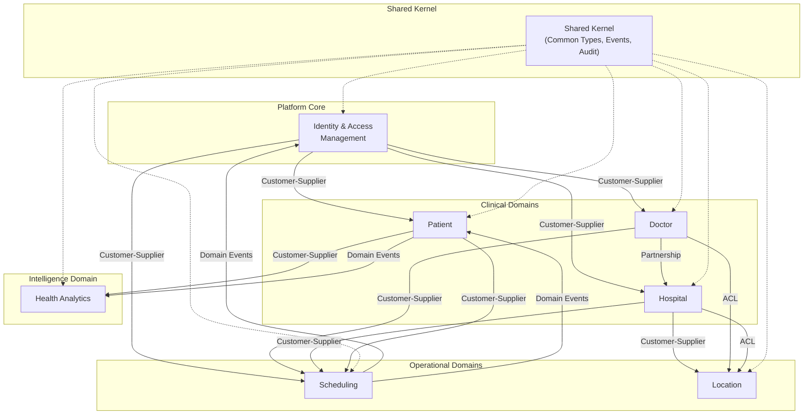

# DOC-05: Health360 AI — Domain Model & Bounded Contexts

| Attribute | Value |
|-----------|-------|
| **Document ID** | DOC-05 |
| **Title** | Domain Model & Bounded Contexts |
| **Version** | 1.0 |
| **Status** | **Approved** |
| **Date** | 2026-07-28 |
| **Author** | Chief Software Architect / Technical Lead |
| **References** | [DOC-00] Project Memory, [DOC-01] Vision & Scope Charter, [DOC-02] BRD, [DOC-03] FRS, [DOC-04] NFR |
| **Next Document** | [DOC-06] Database Design Specification |

---

## 1. Executive Summary

This document defines the **Domain-Driven Design (DDD)** foundation for Health360 AI Phase 1. It establishes seven bounded contexts aligned with the domain modules defined in [DOC-01 §5.1], specifies aggregate roots, entities, value objects, domain events, repository interfaces, and domain services for each context, and maps inter-context relationships using DDD context mapping patterns.

This domain model drives:
- Database entity design [DOC-06]
- REST API resource modeling [DOC-07]
- Spring Boot package/module structure [DOC-11]
- Microservice extraction boundaries (future)

**Architecture Principles Applied:** [ADR-001] Modular Monolith, [ADR-006] DDD + Clean Architecture, [NFR-MAINT-004] zero circular dependencies, [NFR-SCAL-012] module extraction readiness.

---

## 2. Bounded Context Map

### 2.1 Context Overview



### 2.2 Context Mapping Relationships

| Upstream | Downstream | Pattern | Integration Mechanism |
|----------|-----------|---------|----------------------|
| IAM | Patient, Doctor, Hospital, Scheduling | Customer-Supplier | User ID reference; IAM publishes `UserRegistered`, `UserDeactivated` events |
| Patient | Health Analytics | Customer-Supplier | Patient Profile ID; `ProfileUpdated`, `VitalsRecorded` events |
| Doctor | Hospital | Partnership | `DoctorHospitalAssociation` shared concept; both contexts contribute |
| Doctor | Scheduling | Customer-Supplier | Doctor ID, Schedule templates; `ScheduleUpdated` event |
| Hospital | Scheduling | Customer-Supplier | Hospital/Branch ID; branch working hours |
| Patient | Scheduling | Customer-Supplier | Patient ID; booking permissions |
| Hospital | Location | Customer-Supplier | Branch geo coordinates |
| Doctor, Hospital | Location | Anti-Corruption Layer | Location context translates provider IDs to geo queries |
| Scheduling | IAM | Domain Events | `AppointmentBooked` triggers notifications via IAM |
| Patient | Scheduling | Domain Events | Appointment history appears in health timeline |
| All Modules | Shared Kernel | Shared Kernel | Common value objects, base entities, event bus interface |

### 2.3 Module Package Mapping (Spring Boot)

```
com.health360
├── shared/                          # Shared Kernel
│   ├── domain/                      # BaseEntity, ValueObjects, DomainEvent
│   ├── exception/                   # Global exceptions
│   └── event/                       # Event publisher interface
├── iam/                             # Bounded Context: IAM
│   ├── domain/
│   ├── application/
│   ├── infrastructure/
│   └── presentation/
├── patient/                         # Bounded Context: Patient
├── doctor/                          # Bounded Context: Doctor
├── hospital/                        # Bounded Context: Hospital
├── scheduling/                      # Bounded Context: Scheduling
├── location/                        # Bounded Context: Location
└── analytics/                       # Bounded Context: Health Analytics
```

---

## 3. Shared Kernel

The Shared Kernel contains concepts shared across all bounded contexts. Changes require cross-team agreement.

### 3.1 Base Entity

All aggregate roots and entities extend:

| Field | Type | Description |
|-------|------|-------------|
| id | UUID | Primary key |
| tenantId | UUID | Multi-tenant isolation [ASM-010] |
| createdAt | Instant (UTC) | Creation timestamp |
| updatedAt | Instant (UTC) | Last modification timestamp |
| createdBy | UUID | User who created |
| updatedBy | UUID | User who last modified |
| deletedAt | Instant (nullable) | Soft delete timestamp [ASM-005] |
| version | Long | Optimistic locking [NFR-DATA-007] |

### 3.2 Shared Value Objects

#### Address

| Field | Type | Validation |
|-------|------|------------|
| line1 | String | Required, max 200 |
| line2 | String | Optional, max 200 |
| city | String | Required, max 100 |
| state | String | Required, max 100 |
| pincode | String | Required, 6 digits (India) |
| country | String | ISO 3166-1 alpha-2, default IN |

#### GeoCoordinate

| Field | Type | Validation |
|-------|------|------------|
| latitude | BigDecimal | -90 to 90 |
| longitude | BigDecimal | -180 to 180 |

#### Money

| Field | Type | Validation |
|-------|------|------------|
| amount | BigDecimal | ≥ 0, scale 2 |
| currency | String | ISO 4217, default INR |

#### WeeklySchedule

| Field | Type |
|-------|------|
| dayOfWeek | DayOfWeek enum |
| startTime | LocalTime |
| endTime | LocalTime |
| isActive | boolean |

#### ContactInfo

| Field | Type |
|-------|------|
| phone | String |
| email | String |
| alternatePhone | String (optional) |

#### AuditLogEntry (Shared Entity — append-only)

| Field | Type |
|-------|------|
| id | UUID |
| tenantId | UUID |
| userId | UUID (nullable) |
| action | AuditAction enum |
| entityType | String |
| entityId | UUID |
| oldValue | JSON |
| newValue | JSON |
| ipAddress | String |
| userAgent | String |
| timestamp | Instant |

### 3.3 Domain Event Interface

```java
public interface DomainEvent {
    UUID eventId();
    UUID tenantId();
    String eventType();
    Instant occurredAt();
    UUID aggregateId();
}
```

### 3.4 Shared Enums

| Enum | Values |
|------|--------|
| Gender | MALE, FEMALE, OTHER, PREFER_NOT_TO_SAY |
| UserStatus | PENDING_VERIFICATION, ACTIVE, DEACTIVATED, LOCKED |
| BloodGroup | A_POSITIVE, A_NEGATIVE, B_POSITIVE, B_NEGATIVE, AB_POSITIVE, AB_NEGATIVE, O_POSITIVE, O_NEGATIVE |
| DayOfWeek | MONDAY through SUNDAY |

---

## 4. Bounded Context 01: Identity & Access Management (IAM)

### 4.1 Context Responsibility

User lifecycle management, authentication, authorization, session management, notification preferences, and platform-wide audit logging.

### 4.2 Aggregate Roots

#### User (Aggregate Root)

| Attribute | Type | Notes |
|-----------|------|-------|
| id | UUID | |
| tenantId | UUID | |
| email | String | Unique per tenant |
| passwordHash | String | bcrypt |
| firstName | String | |
| lastName | String | |
| phone | String | |
| avatarUrl | String | Optional |
| status | UserStatus | |
| emailVerified | boolean | |
| failedLoginAttempts | int | |
| lockedUntil | Instant | Nullable |
| timezone | String | Default Asia/Kolkata |
| locale | String | Default en-IN |
| roles | List\<Role\> | Entity within aggregate |
| notificationPreferences | NotificationPreference | Entity within aggregate |

**Invariants:**
- Email unique within tenant
- At least one role assigned
- Password hash never exposed externally
- Status LOCKED prevents authentication

**Domain Methods:**
- `register(email, password, name, phone, role)`
- `verifyEmail(token)`
- `authenticate(password)` → AuthResult
- `changePassword(currentPassword, newPassword)`
- `deactivate()`
- `assignRole(role)`
- `revokeRole(role)`
- `updateProfile(firstName, lastName, phone, avatar, timezone)`
- `recordFailedLogin()` / `resetFailedLogins()`

**Domain Events:**
- `UserRegistered`
- `EmailVerified`
- `UserLoggedIn`
- `UserLoggedOut`
- `PasswordChanged`
- `AccountDeactivated`
- `RoleAssigned`

#### Role (Entity within User aggregate context — separate aggregate for admin management)

| Attribute | Type |
|-----------|------|
| id | UUID |
| tenantId | UUID |
| name | String | PATIENT, DOCTOR, HOSPITAL_ADMIN, PLATFORM_ADMIN |
| description | String |
| permissions | List\<Permission\> |

#### Permission (Value Object)

| Attribute | Type |
|-----------|------|
| resource | String | e.g., patient:profile |
| action | String | e.g., read, write, delete |
| code | String | Computed: resource:action |

#### RefreshToken (Aggregate Root)

| Attribute | Type |
|-----------|------|
| id | UUID |
| userId | UUID |
| tokenHash | String |
| deviceInfo | String |
| expiresAt | Instant |
| revoked | boolean |

#### NotificationPreference (Entity within User)

| Attribute | Type |
|-----------|------|
| notificationType | NotificationType enum |
| emailEnabled | boolean |
| smsEnabled | boolean |
| inAppEnabled | boolean |

### 4.3 Repository Interfaces

| Interface | Operations |
|-----------|-----------|
| UserRepository | save, findById, findByEmail, findByTenant, search, softDelete |
| RoleRepository | save, findById, findByName, findAll |
| RefreshTokenRepository | save, findByTokenHash, revokeAllForUser, deleteExpired |
| AuditLogRepository | save (append-only), findByEntity, findByUser, search |

### 4.4 Domain Services

| Service | Responsibility |
|---------|---------------|
| AuthenticationService | Login, logout, token refresh orchestration |
| AuthorizationService | Permission check for resource + action |
| PasswordPolicyService | Validate password complexity |
| AuditService | Record audit log entries |

---

## 5. Bounded Context 02: Patient

### 5.1 Context Responsibility

Comprehensive patient health profile management — personal data, medical history, lifestyle, vitals, lab values, goals, documents, and health timeline.

### 5.2 Aggregate Roots

#### PatientProfile (Aggregate Root)

The central aggregate containing all patient health data. Sections are entities/value objects within the aggregate boundary.

| Attribute | Type | Notes |
|-----------|------|-------|
| id | UUID | |
| tenantId | UUID | |
| userId | UUID | FK reference to IAM User |
| consentAccepted | boolean | Health data processing consent |
| consentAcceptedAt | Instant | |
| completionScore | int | 0–100, calculated |
| basicInfo | BasicInfo | Value Object |
| contactInfo | ContactInfo | Value Object |
| physicalMeasurement | PhysicalMeasurement | Entity (current) |
| lifestyle | LifestyleProfile | Value Object |
| healthGoals | HealthGoals | Value Object |

**Child Entities (within aggregate):**

| Entity | Description |
|--------|-------------|
| Allergy | name, severity, reaction, diagnosedDate |
| CurrentMedication | name, dosage, frequency, route, startDate, endDate |
| PastSurgery | procedureName, surgeryDate, hospitalName, notes |
| Vaccination | vaccineName, doseNumber, administeredDate |
| ChronicCondition | conditionName, diagnosedDate, status, notes |
| EmergencyContact | name, relationship, phone, email, isPrimary |
| FamilyMember | name, relationship, dateOfBirth, hereditaryConditions |
| VitalSignRecord | systolic, diastolic, heartRate, temperature, spo2, glucose, recordedAt |
| LabValueRecord | hba1c, cholesterol, hdl, ldl, triglycerides, etc., recordedAt |
| PhysicalMeasurementHistory | height, weight, waist, hip, bodyFat, measuredAt |
| HealthDocument | fileName, s3Key, category, title, description, uploadedAt |
| TimelineEvent | eventType, summary, metadata, occurredAt |

**Invariants:**
- One profile per userId per tenant
- Consent must be accepted before profile modification
- VitalSignRecords are append-only [BR-PAT-004]
- LabValueRecords are append-only
- Maximum 5 emergency contacts
- Exactly one primary emergency contact if any exist
- Physical measurements history preserved on update

**Domain Methods:**
- `acceptConsent()`
- `updateBasicInfo(basicInfo)`
- `updateContactInfo(contactInfo)`
- `updatePhysicalMeasurement(measurement)` → adds to history
- `updateLifestyle(lifestyle)`
- `addAllergy(allergy)` / `removeAllergy(id)`
- `addMedication(medication)` / `updateMedication(id)` / `removeMedication(id)`
- `addSurgery(surgery)` / `removeSurgery(id)`
- `addVaccination(vaccination)`
- `addChronicCondition(condition)` / `updateCondition(id)`
- `addEmergencyContact(contact)` / `updateEmergencyContact(id)` / `removeEmergencyContact(id)`
- `addFamilyMember(member)` / `removeFamilyMember(id)`
- `recordVitals(vitals)` → append-only
- `recordLabValues(labValues)` → append-only
- `updateHealthGoals(goals)`
- `uploadDocument(document)`
- `removeDocument(id)`
- `calculateCompletionScore()` → int
- `getTimeline(page, size)` → List\<TimelineEvent\>

**Domain Events:**
- `PatientProfileCreated`
- `ProfileSectionUpdated` (section name)
- `VitalsRecorded`
- `LabValuesRecorded`
- `HealthDocumentUploaded`
- `ProfileCompletionScoreChanged`

### 5.3 Value Objects

#### BasicInfo

| Field | Type |
|-------|------|
| dateOfBirth | LocalDate |
| gender | Gender |
| bloodGroup | BloodGroup |
| maritalStatus | MaritalStatus enum |
| nationality | String |
| profilePhotoUrl | String |

#### PhysicalMeasurement

| Field | Type |
|-------|------|
| heightCm | BigDecimal |
| weightKg | BigDecimal |
| waistCm | BigDecimal |
| hipCm | BigDecimal |
| neckCm | BigDecimal |
| bodyFatPercent | BigDecimal |
| measuredAt | Instant |

#### LifestyleProfile

| Field | Type |
|-------|------|
| smokingStatus | SmokingStatus enum |
| smokingFrequency | SmokingFrequency enum |
| alcoholConsumption | AlcoholConsumption enum |
| exerciseFrequency | ExerciseFrequency enum |
| exerciseType | String |
| exerciseDurationMinutes | Integer |
| occupationType | OccupationType enum |
| averageSleepHours | BigDecimal |
| dietaryPreference | DietaryPreference enum |
| stressLevel | Integer (1–5) |

#### HealthGoals

| Field | Type |
|-------|------|
| targetWeightKg | BigDecimal |
| dailyStepsGoal | Integer |
| sleepHoursGoal | BigDecimal |
| waterIntakeMlGoal | Integer |
| weeklyExerciseMinutesGoal | Integer |

### 5.4 Repository Interfaces

| Interface | Operations |
|-----------|-----------|
| PatientProfileRepository | save, findById, findByUserId, softDelete |
| VitalSignRecordRepository | save, findByPatientId (paginated, chronological) |
| LabValueRecordRepository | save, findByPatientId (paginated) |
| HealthDocumentRepository | save, findByPatientId, findById, softDelete |
| TimelineEventRepository | save, findByPatientId (paginated, desc) |

### 5.5 Domain Services

| Service | Responsibility |
|---------|---------------|
| ProfileCompletionCalculator | Weighted score calculation [BR-PAT-007] |
| PatientSummaryService | Build limited summary for doctor view [FR-PAT-015] |
| HealthTimelineService | Aggregate events from profile changes, vitals, appointments |

---

## 6. Bounded Context 03: Doctor

### 6.1 Context Responsibility

Doctor professional profile, qualifications, experience, specializations, hospital associations, consultation fees, verification workflow, and ratings.

### 6.2 Aggregate Roots

#### DoctorProfile (Aggregate Root)

| Attribute | Type | Notes |
|-----------|------|-------|
| id | UUID | |
| tenantId | UUID | |
| userId | UUID | FK to IAM User |
| title | Title enum | DR, PROF, MR, MS |
| medicalRegistrationNumber | String | Unique [BR-DOC-002] |
| registrationCouncil | String | |
| registrationYear | Integer | |
| registrationExpiry | LocalDate | Optional |
| gender | Gender | |
| biography | String | Max 2000 chars |
| profilePhotoUrl | String | |
| totalYearsExperience | Integer | |
| verificationStatus | VerificationStatus enum | DRAFT, PENDING, VERIFIED, REJECTED |
| verificationRejectionReason | String | |
| verifiedAt | Instant | |
| verifiedBy | UUID | Platform Admin userId |
| averageRating | BigDecimal | Denormalized, recalculated on review |
| reviewCount | Integer | Denormalized |

**Child Entities:**

| Entity | Description |
|--------|-------------|
| Qualification | degree, institution, yearOfCompletion, country |
| ExperienceEntry | institution, position, startYear, endYear |
| Specialization | primarySpecialization, subSpecializations[] |
| Language | languageCode (ISO 639-1) |
| Award | title, year, organization |
| Membership | organization, membershipId, year |
| HospitalAssociation | hospitalId, branchId, departmentId, status, consultationConfigs[] |
| VerificationDocument | documentType, s3Key, uploadedAt |
| Review | patientId, appointmentId, rating, comment, createdAt |

**ConsultationConfig (Entity within HospitalAssociation):**

| Field | Type |
|-------|------|
| consultationType | ConsultationType enum |
| fee | Money |
| durationMinutes | Integer |

**Invariants:**
- Medical registration number unique per tenant
- Must have ≥ 1 qualification before verification submission
- Must have ≥ 1 active hospital association before booking enabled
- Only VERIFIED doctors appear in search [BR-DOC-001]
- Reviews linked to completed appointments only [BR-REV-001]

**Domain Methods:**
- `updateProfessionalDetails(details)`
- `addQualification(qualification)` / `removeQualification(id)`
- `addExperience(entry)` / `removeExperience(id)`
- `setSpecialization(specialization)`
- `addLanguage(languageCode)` / `removeLanguage(code)`
- `addAward(award)` / `addMembership(membership)`
- `updateBiography(text)`
- `associateWithHospital(association)` / `dissociateFromHospital(hospitalId)`
- `setConsultationFee(hospitalId, type, fee, duration)`
- `uploadVerificationDocument(document)`
- `submitForVerification()` → validates completeness
- `approveVerification(adminUserId)` / `rejectVerification(reason, adminUserId)`
- `addReview(review)` → recalculates averageRating
- `isBookable()` → boolean

**Domain Events:**
- `DoctorProfileCreated`
- `VerificationSubmitted`
- `DoctorVerified`
- `DoctorVerificationRejected`
- `HospitalAssociationCreated`
- `HospitalAssociationRemoved`
- `DoctorReviewAdded`
- `DoctorRatingUpdated`

### 6.3 Value Objects

#### Specialization

| Field | Type |
|-------|------|
| primary | String (taxonomy) |
| subSpecializations | List\<String\> |

#### VerificationStatus (Enum)

DRAFT, PENDING_VERIFICATION, VERIFIED, REJECTED

### 6.4 Repository Interfaces

| Interface | Operations |
|-----------|-----------|
| DoctorProfileRepository | save, findById, findByUserId, findByRegistrationNumber, search (filters), softDelete |
| HospitalAssociationRepository | save, findByDoctorId, findByHospitalId, findActiveByDoctorId |
| DoctorReviewRepository | save, findByDoctorId (paginated), findByAppointmentId |
| VerificationDocumentRepository | save, findByDoctorId |

### 6.5 Domain Services

| Service | Responsibility |
|---------|---------------|
| DoctorVerificationService | Validate submission prerequisites, orchestrate review |
| DoctorSearchService | Filter/sort verified doctors (used by Search module via interface) |
| RatingCalculatorService | Recalculate aggregate rating [BRQ-REV-004] |

---

## 7. Bounded Context 04: Hospital

### 7.1 Context Responsibility

Hospital profile, branch management, departments, facilities, doctor associations, working hours, emergency/ICU info, image gallery, and ratings.

### 7.2 Aggregate Roots

#### Hospital (Aggregate Root)

| Attribute | Type | Notes |
|-----------|------|-------|
| id | UUID | |
| tenantId | UUID | |
| adminUserId | UUID | FK to IAM User (Hospital Admin) |
| name | String | |
| registrationNumber | String | Unique [BR-HOS-002] |
| hospitalType | HospitalType enum | GOVERNMENT, PRIVATE, TRUST, CLINIC |
| establishedYear | Integer | |
| totalBedCount | Integer | |
| accreditation | Accreditation enum | NABH, JCI, NONE |
| description | String | |
| averageRating | BigDecimal | Denormalized |
| reviewCount | Integer | Denormalized |

**Child Entities:**

| Entity | Description |
|--------|-------------|
| Branch | name, address, geoCoordinate, phone, email, isPrimary, workingHours[] |
| Department | name, description, floor, headDoctorId, operatingHours, isActive |
| Facility | name, category, description, isAvailable, branchId |
| GalleryImage | s3Key, caption, displayOrder, uploadedAt |
| Review | patientId, appointmentId, rating, comment, createdAt |

**Invariants:**
- At least one branch required [BR-HOS-001]
- Registration number unique per tenant
- Department names unique within hospital [BR-HOS-005]
- Each branch must have geo coordinates [BR-HOS-003]
- Maximum 20 gallery images [BR-HOS-004]

**Domain Methods:**
- `updateProfile(details)`
- `addBranch(branch)` / `updateBranch(id)` / `removeBranch(id)`
- `addDepartment(department)` / `updateDepartment(id)` / `deactivateDepartment(id)`
- `addFacility(facility)` / `updateFacility(id)`
- `addGalleryImage(image)` / `removeGalleryImage(id)`
- `addReview(review)` → recalculates averageRating
- `getPrimaryBranch()` → Branch

**Domain Events:**
- `HospitalCreated`
- `BranchAdded`
- `BranchUpdated`
- `DepartmentAdded`
- `HospitalReviewAdded`
- `HospitalRatingUpdated`

### 7.3 Repository Interfaces

| Interface | Operations |
|-----------|-----------|
| HospitalRepository | save, findById, findByAdminUserId, findByRegistrationNumber, search, softDelete |
| BranchRepository | save, findByHospitalId, findById |
| DepartmentRepository | save, findByHospitalId, findById |
| HospitalReviewRepository | save, findByHospitalId (paginated) |

### 7.4 Domain Services

| Service | Responsibility |
|---------|---------------|
| HospitalSearchService | Filter/sort hospitals (used by Search/Location modules) |
| GeocodingService | Address → coordinates (delegates to Location context) |

---

## 8. Bounded Context 05: Scheduling

### 8.1 Context Responsibility

Doctor schedule management, time slot generation, appointment booking/cancellation/rescheduling, appointment lifecycle, and reminder scheduling.

### 8.2 Aggregate Roots

#### DoctorSchedule (Aggregate Root)

Represents a doctor's schedule template at a specific hospital.

| Attribute | Type | Notes |
|-----------|------|-------|
| id | UUID | |
| tenantId | UUID | |
| doctorId | UUID | FK to Doctor context |
| hospitalId | UUID | FK to Hospital context |
| branchId | UUID | FK to Hospital Branch |
| scheduleBlocks | List\<ScheduleBlock\> | Entity |
| slotDurationMinutes | Integer | Default 15 |
| bufferMinutes | Integer | Default 5 |
| horizonDays | Integer | Default 30 |
| isActive | boolean | |

**ScheduleBlock (Entity):**

| Field | Type |
|-------|------|
| id | UUID |
| dayOfWeek | DayOfWeek |
| startTime | LocalTime |
| endTime | LocalTime |
| consultationType | ConsultationType |
| isActive | boolean |

**Invariants:**
- No overlapping schedule blocks on same day [BR-SCH-001]
- End time > start time
- doctorId + hospitalId combination unique per active schedule

**Domain Methods:**
- `addScheduleBlock(block)` / `updateBlock(id)` / `removeBlock(id)`
- `generateSlots(date)` → List\<TimeSlot\>
- `blockDateRange(from, to, reason)` → marks slots BLOCKED
- `isActiveOn(dayOfWeek)` → boolean

---

#### TimeSlot (Aggregate Root)

Individual bookable time slot — separate aggregate for concurrency control.

| Attribute | Type | Notes |
|-----------|------|-------|
| id | UUID | |
| tenantId | UUID | |
| scheduleId | UUID | FK to DoctorSchedule |
| doctorId | UUID | Denormalized for query |
| hospitalId | UUID | Denormalized |
| branchId | UUID | Denormalized |
| slotDate | LocalDate | |
| startTime | LocalTime | |
| endTime | LocalTime | |
| consultationType | ConsultationType | |
| status | SlotStatus enum | AVAILABLE, BOOKED, BLOCKED |
| appointmentId | UUID | Nullable, set when BOOKED |

**Invariants:**
- Status transitions: AVAILABLE ↔ BOOKED, AVAILABLE → BLOCKED, BLOCKED → AVAILABLE
- BOOKED slots must have appointmentId
- Slot datetime must be in the future for booking

**Domain Methods:**
- `book(appointmentId)` → validates AVAILABLE, sets BOOKED
- `release()` → sets AVAILABLE, clears appointmentId
- `block()` → sets BLOCKED

---

#### Appointment (Aggregate Root)

| Attribute | Type | Notes |
|-----------|------|-------|
| id | UUID | |
| tenantId | UUID | |
| patientId | UUID | FK to Patient context |
| doctorId | UUID | FK to Doctor context |
| hospitalId | UUID | FK to Hospital context |
| branchId | UUID | FK to Hospital Branch |
| slotId | UUID | FK to TimeSlot |
| consultationType | ConsultationType | |
| consultationFee | Money | Snapshot at booking time |
| status | AppointmentStatus enum | |
| reasonForVisit | String | Max 500 chars |
| scheduledAt | Instant | Computed from slot date + time |
| cancelledAt | Instant | Nullable |
| cancellationReason | String | |
| completedAt | Instant | Nullable |
| rescheduledFromId | UUID | Nullable, links to original |
| rescheduledToId | UUID | Nullable, links to new |

**Invariants:**
- Patient cannot have > 1 active appointment with same doctor on same day [BR-SCH-002]
- Status transitions enforced [FR-SCH-007]
- Cancellation/reschedule within allowed window [BR-SCH-004, BR-SCH-005]
- Only VERIFIED doctors can receive bookings

**Domain Methods:**
- `confirm()` → status CONFIRMED
- `cancel(reason)` → validates window, status CANCELLED
- `reschedule(newSlotId)` → creates new appointment, marks self RESCHEDULED
- `markCompleted()` → status COMPLETED
- `markNoShow()` → status NO_SHOW (after scheduledAt + 15 min)
- `canBeCancelled()` → boolean
- `canBeRescheduled()` → boolean
- `isActive()` → boolean

**Domain Events:**
- `AppointmentBooked`
- `AppointmentConfirmed`
- `AppointmentCancelled`
- `AppointmentRescheduled`
- `AppointmentCompleted`
- `AppointmentNoShow`
- `ReminderScheduled` (T-24h, T-1h)

### 8.3 Value Objects

#### AppointmentStatus (Enum)

PENDING, CONFIRMED, COMPLETED, CANCELLED, NO_SHOW, RESCHEDULED

#### SlotStatus (Enum)

AVAILABLE, BOOKED, BLOCKED

#### ConsultationType (Enum)

IN_PERSON, FOLLOW_UP

### 8.4 Repository Interfaces

| Interface | Operations |
|-----------|-----------|
| DoctorScheduleRepository | save, findById, findByDoctorAndHospital, findActiveByDoctorId |
| TimeSlotRepository | save, findById (with lock), findAvailableByDoctorAndDate, findByScheduleId |
| AppointmentRepository | save, findById, findByPatientId, findByDoctorId, findActiveByPatientAndDoctor |
| ReminderRepository | save, findPendingReminders, markSent |

### 8.5 Domain Services

| Service | Responsibility |
|---------|---------------|
| SlotGenerationService | Generate slots from schedule templates for date range |
| BookingService | Atomic booking orchestration (lock slot → create appointment) |
| CancellationService | Validate policy, release slot, notify |
| ReschedulingService | Cancel old + book new atomically |
| ReminderSchedulingService | Schedule T-24h and T-1h reminders |

---

## 9. Bounded Context 06: Location

### 9.1 Context Responsibility

Geo-search, nearby provider discovery, distance calculation, travel time estimation. Acts as Anti-Corruption Layer over Google Maps Platform.

### 9.2 Domain Model

Location is primarily a **domain service context** rather than entity-heavy. It translates provider IDs from Doctor/Hospital contexts into geo queries.

#### GeoSearchQuery (Value Object)

| Field | Type |
|-------|------|
| latitude | BigDecimal |
| longitude | BigDecimal |
| radiusKm | BigDecimal |
| entityType | DOCTOR or HOSPITAL |
| filters | Map\<String, Object\> |

#### GeoSearchResult (Value Object)

| Field | Type |
|-------|------|
| entityId | UUID |
| entityType | String |
| name | String |
| latitude | BigDecimal |
| longitude | BigDecimal |
| distanceKm | BigDecimal |
| travelTimeMinutes | Integer (nullable) |
| address | Address |

#### GeocodingResult (Value Object)

| Field | Type |
|-------|------|
| latitude | BigDecimal |
| longitude | BigDecimal |
| formattedAddress | String |
| confidence | GeocodingConfidence enum |

### 9.3 Domain Services

| Service | Responsibility |
|---------|---------------|
| NearbyHospitalSearchService | Find hospitals within radius |
| NearbyDoctorSearchService | Find doctors via hospital branch proximity |
| DistanceCalculationService | Haversine distance between two coordinates |
| TravelTimeService | Google Distance Matrix API integration |
| GeocodingService | Address → coordinates via Google Geocoding API |
| GeoCacheService | Cache distance/travel time results in Redis [NFR-PERF-031] |

### 9.4 External Port Interfaces (ACL)

| Port | External System |
|------|----------------|
| MapsApiPort | Google Maps Platform |
| GeocodingApiPort | Google Geocoding API |
| DistanceMatrixApiPort | Google Distance Matrix API |

---

## 10. Bounded Context 07: Health Analytics

### 10.1 Context Responsibility

Deterministic health metric calculations (Formula Engine), wellness/risk score computation, health dashboard data assembly, and health report generation.

### 10.2 Aggregate Roots

#### HealthMetricsSnapshot (Aggregate Root)

Point-in-time calculation results for a patient. New snapshot created on each recalculation.

| Attribute | Type | Notes |
|-----------|------|-------|
| id | UUID | |
| tenantId | UUID | |
| patientId | UUID | FK to Patient context |
| calculatedAt | Instant | |
| profileCompletionAtCalc | int | Snapshot of completion score |
| metrics | List\<CalculatedMetric\> | Entity |
| wellnessScore | WellnessScore | Value Object |
| healthRiskScore | HealthRiskScore | Value Object |

**CalculatedMetric (Entity):**

| Field | Type |
|-------|------|
| metricType | MetricType enum |
| value | BigDecimal |
| unit | String |
| classification | Classification enum (NORMAL, WARNING, CRITICAL, INSUFFICIENT_DATA) |
| interpretation | String |
| missingFields | List\<String\> |

**Invariants:**
- Calculations are deterministic [BRQ-ANL-013]
- Missing inputs → INSUFFICIENT_DATA classification [BR-ANL-002]
- All metrics include disclaimer [BR-ANL-001]
- Wellness Score requires ≥ 60% profile completion [BR-ANL-003]
- Health Risk Score requires Medical + Lifestyle sections [BR-ANL-004]

**Domain Methods:**
- `calculate(patientProfile)` → HealthMetricsSnapshot (factory)
- `getMetric(metricType)` → CalculatedMetric
- `getLatest(patientId)` → HealthMetricsSnapshot (query)

**Domain Events:**
- `HealthMetricsCalculated`
- `WellnessScoreChanged`
- `HealthRiskScoreChanged`

### 10.3 Value Objects

#### WellnessScore

| Field | Type |
|-------|------|
| score | Integer (0–100) |
| label | WellnessLabel enum (EXCELLENT, GOOD, FAIR, NEEDS_ATTENTION) |
| factors | Map\<String, BigDecimal\> (weighted contributions) |

#### HealthRiskScore

| Field | Type |
|-------|------|
| score | Integer (0–100) |
| label | RiskLabel enum (LOW, MODERATE, HIGH, VERY_HIGH) |
| factors | Map\<String, BigDecimal\> (weighted contributions) |

#### MetricType (Enum)

BMI, BMR, IDEAL_WEIGHT, LEAN_BODY_MASS, BODY_FAT_PERCENT, BODY_SURFACE_AREA, HEALTHY_WEIGHT_RANGE, PROTEIN_REQUIREMENT, WATER_INTAKE, DAILY_CALORIES, SLEEP_RECOMMENDATION, DAILY_STEP_GOAL, HEART_RATE_ZONES, BP_CLASSIFICATION, BLOOD_SUGAR_CLASSIFICATION, WAIST_HIP_RATIO, WAIST_HEIGHT_RATIO, WELLNESS_SCORE, HEALTH_RISK_SCORE, PROFILE_COMPLETION

#### Classification (Enum)

NORMAL, WARNING, CRITICAL, INSUFFICIENT_DATA

### 10.4 Repository Interfaces

| Interface | Operations |
|-----------|-----------|
| HealthMetricsSnapshotRepository | save, findLatestByPatientId, findByPatientId (paginated, for trends) |

### 10.5 Domain Services

| Service | Responsibility |
|---------|---------------|
| FormulaEngineService | Orchestrate all metric calculations [DOC-08] |
| BmiCalculator | BMI + classification |
| BmrCalculator | BMR (Mifflin-St Jeor) |
| IdealWeightCalculator | Devine formula |
| LeanBodyMassCalculator | Boer formula |
| BodySurfaceAreaCalculator | Du Bois formula |
| NutritionCalculator | Protein, water, calorie requirements |
| ActivityCalculator | Step goals, heart rate zones |
| BpClassificationService | AHA blood pressure categories |
| GlucoseClassificationService | ADA blood sugar categories |
| BodyRatioCalculator | WHR, WHtR |
| WellnessScoreCalculator | Composite wellness [FR-ANL-004] |
| HealthRiskScoreCalculator | Composite risk [FR-ANL-005] |
| ProfileCompletionCalculator | Shared with Patient context |
| HealthReportGenerator | PDF report assembly |
| MetricsCacheService | Redis cache management [NFR-PERF-033] |

---

## 11. Cross-Context Concepts

### 11.1 Search (Application Service — Not a Bounded Context)

Search is an **application-level orchestration service** that queries Doctor, Hospital, and Location contexts. It is not a separate bounded context because it has no unique domain model — it composes existing aggregates.

| Service | Queries |
|---------|---------|
| DoctorSearchService | DoctorProfileRepository + Location context |
| HospitalSearchService | HospitalRepository + Location context |
| UnifiedSearchService | Combines both with relevance ranking |

### 11.2 Reviews (Shared Between Doctor & Hospital Contexts)

Reviews are entities within Doctor and Hospital aggregates respectively, with shared business rules [DOC-02 §6.9] enforced by a shared `ReviewPolicyService` in the Shared Kernel.

### 11.3 Notifications (Application Service — Orchestrated by IAM)

Notification dispatch is an application service triggered by domain events from Scheduling, Doctor, and IAM contexts. Notification templates and preferences live in IAM; delivery is infrastructure concern.

---

## 12. Domain Event Catalog

| Event | Publisher Context | Consumers | Payload |
|-------|------------------|-----------|---------|
| UserRegistered | IAM | Patient/Doctor (profile creation) | userId, role, email |
| EmailVerified | IAM | — | userId |
| UserDeactivated | IAM | All (access revocation) | userId |
| PatientProfileCreated | Patient | Analytics (init dashboard) | patientId, userId |
| ProfileSectionUpdated | Patient | Analytics (recalculate) | patientId, section |
| VitalsRecorded | Patient | Analytics (recalculate) | patientId, vitals |
| LabValuesRecorded | Patient | Analytics (recalculate) | patientId, labValues |
| HealthDocumentUploaded | Patient | — | patientId, documentId |
| DoctorProfileCreated | Doctor | — | doctorId, userId |
| VerificationSubmitted | Doctor | IAM (admin notification) | doctorId |
| DoctorVerified | Doctor | Search (enable listing) | doctorId |
| DoctorVerificationRejected | Doctor | IAM (doctor notification) | doctorId, reason |
| HospitalAssociationCreated | Doctor | Hospital (update roster) | doctorId, hospitalId |
| AppointmentBooked | Scheduling | IAM (notify), Patient (timeline) | appointmentId, patientId, doctorId |
| AppointmentCancelled | Scheduling | IAM (notify), Scheduling (release slot) | appointmentId |
| AppointmentCompleted | Scheduling | Doctor/Patient (review prompt) | appointmentId |
| AppointmentNoShow | Scheduling | IAM (notify) | appointmentId |
| HealthMetricsCalculated | Analytics | — | patientId, snapshotId |
| DoctorReviewAdded | Doctor | — | doctorId, reviewId, rating |
| HospitalReviewAdded | Hospital | — | hospitalId, reviewId, rating |

### 12.1 Event Delivery

| Phase 1 Mechanism | Description |
|-------------------|-------------|
| In-process event bus | Spring ApplicationEventPublisher for modular monolith |
| Future extraction | Replace with message broker (SNS/SQS, Kafka) per module |

---

## 13. Entity Relationship Overview

> Detailed table definitions, indexes, and constraints in [DOC-06].

```mermaid
erDiagram
    User ||--o| PatientProfile : "has"
    User ||--o| DoctorProfile : "has"
    User ||--o| Hospital : "administers"

    PatientProfile ||--|{ Allergy : contains
    PatientProfile ||--|{ CurrentMedication : contains
    PatientProfile ||--|{ VitalSignRecord : contains
    PatientProfile ||--|{ LabValueRecord : contains
    PatientProfile ||--|{ HealthDocument : contains
    PatientProfile ||--|{ EmergencyContact : contains
    PatientProfile ||--|{ TimelineEvent : contains

    DoctorProfile ||--|{ Qualification : contains
    DoctorProfile ||--|{ HospitalAssociation : contains
    DoctorProfile ||--|{ DoctorReview : receives
    DoctorProfile ||--|{ VerificationDocument : contains

    Hospital ||--|{ Branch : contains
    Hospital ||--|{ Department : contains
    Hospital ||--|{ Facility : contains
    Hospital ||--|{ GalleryImage : contains
    Hospital ||--|{ HospitalReview : receives
    Hospital ||--|{ HospitalAssociation : "linked via"

    DoctorSchedule ||--|{ ScheduleBlock : contains
    DoctorSchedule ||--|{ TimeSlot : generates
    DoctorSchedule }o--|| DoctorProfile : "belongs to"
    DoctorSchedule }o--|| Hospital : "at"

    Appointment }o--|| PatientProfile : "booked by"
    Appointment }o--|| DoctorProfile : "with"
    Appointment }o--|| Hospital : "at"
    Appointment }o--|| TimeSlot : "occupies"

    HealthMetricsSnapshot }o--|| PatientProfile : "calculated for"
    HealthMetricsSnapshot ||--|{ CalculatedMetric : contains

    User ||--|{ RefreshToken : has
    User ||--|{ Role : assigned
    Role ||--|{ Permission : grants
```



---

## 14. Aggregate Boundary Rules

| Rule | Description |
|------|-------------|
| AB-001 | One repository per aggregate root — never load child entities directly |
| AB-002 | Cross-aggregate references use ID only (UUID), not object references |
| AB-003 | Consistency within aggregate boundary is immediate (ACID transaction) |
| AB-004 | Consistency across aggregates is eventual (domain events) |
| AB-005 | TimeSlot is a separate aggregate from Appointment for independent locking |
| AB-006 | HealthMetricsSnapshot is immutable once created — new snapshot on recalculation |
| AB-007 | AuditLogEntry is append-only, outside any mutable aggregate |
| AB-008 | External context references (userId, doctorId, hospitalId) validated at application layer |

---

## 15. Ubiquitous Language Glossary

| Term | Context | Definition |
|------|---------|------------|
| User | IAM | Platform account with credentials and roles |
| Patient Profile | Patient | Comprehensive health data collection belonging to a patient |
| Doctor Profile | Doctor | Professional identity of a healthcare provider |
| Verification | Doctor | Platform approval process for doctor credentials |
| Hospital Association | Doctor/Hospital | Link between a doctor and a hospital where they practice |
| Branch | Hospital | Physical location of a hospital |
| Schedule Template | Scheduling | Weekly recurring availability pattern for a doctor at a hospital |
| Time Slot | Scheduling | Discrete bookable interval generated from schedule template |
| Appointment | Scheduling | Confirmed booking linking patient, doctor, hospital, and slot |
| Formula Engine | Analytics | Deterministic calculation service for health metrics |
| Wellness Score | Analytics | Composite 0–100 score reflecting overall health wellness |
| Health Risk Score | Analytics | Composite score indicating potential health risk |
| Health Timeline | Patient | Chronological feed of health-related events |
| Profile Completion Score | Patient | Weighted percentage of profile section completeness |
| Geo Search | Location | Location-based provider discovery within a radius |
| Tenant | Shared | Organization operating on the platform |

---

## 16. Requirements Traceability

| Domain Concept | FR Reference | BRQ Reference | DB Reference |
|---------------|-------------|---------------|-------------|
| User aggregate | FR-IAM-001–012 | BRQ-IAM-001–014 | DOC-06 §users |
| PatientProfile aggregate | FR-PAT-001–015 | BRQ-PAT-001–019 | DOC-06 §patient |
| DoctorProfile aggregate | FR-DOC-001–014 | BRQ-DOC-001–017 | DOC-06 §doctor |
| Hospital aggregate | FR-HOS-001–008 | BRQ-HOS-001–013 | DOC-06 §hospital |
| Appointment aggregate | FR-SCH-004–008 | BRQ-SCH-005–015 | DOC-06 §scheduling |
| HealthMetricsSnapshot | FR-ANL-001–008 | BRQ-ANL-001–014 | DOC-06 §analytics |
| GeoSearchService | FR-LOC-003–005 | BRQ-LOC-002–005 | — (external API) |

---

## 17. Approval

| Role | Name | Signature | Date | Status |
|------|------|-----------|------|--------|
| Product Owner | _________________ | _________________ | ________ | Pending |
| Technical Lead / Architect | _________________ | _________________ | ________ | Pending |
| Engineering Lead | _________________ | _________________ | ________ | Pending |
| Database Architect | _________________ | _________________ | ________ | Pending |

---

*End of DOC-05 — Domain Model & Bounded Contexts v1.0*
