# DOC-06: Health360 AI — Database Design Specification

| Attribute | Value |
|-----------|-------|
| **Document ID** | DOC-06 |
| **Title** | Database Design Specification |
| **Version** | 1.0 |
| **Status** | **Approved** |
| **Date** | 2026-07-29 |
| **Author** | Database Architect / Technical Lead |
| **References** | [DOC-00] Project Memory, [DOC-03] FRS, [DOC-04] NFR, [DOC-05] Domain Model & Bounded Contexts |
| **Next Document** | [DOC-07] REST API Design Specification |

---

## 1. Executive Summary

This document translates the domain model defined in [DOC-05] into a complete **PostgreSQL 16+** relational database design for Health360 AI Phase 1. It specifies all tables, columns, data types, primary keys, foreign keys, constraints, indexes, audit fields, and soft-delete strategy — **without generating SQL DDL**.

The design supports:
- Multi-tenant readiness via `tenant_id` on all tenant-scoped tables [ASM-010]
- Soft delete on all user-facing entities [ASM-005]
- Optimistic locking on concurrency-sensitive aggregates [NFR-DATA-007]
- Append-only tables for vitals, lab values, and audit logs [BR-PAT-004]
- Future module extraction without schema redesign [NFR-SCAL-012]

**Total Tables:** 52 (including lookup/reference tables)

---

## 2. Database Conventions

### 2.1 Naming Conventions

| Element | Convention | Example |
|---------|-----------|---------|
| Schema | Module prefix | `iam`, `patient`, `doctor`, `hospital`, `scheduling`, `analytics`, `shared` |
| Table | snake_case, plural | `patient_profiles`, `time_slots` |
| Column | snake_case | `created_at`, `tenant_id` |
| Primary Key | `id` (UUID) | |
| Foreign Key | `{referenced_table_singular}_id` | `patient_id`, `doctor_id` |
| Index | `idx_{table}_{columns}` | `idx_users_tenant_email` |
| Unique Constraint | `uq_{table}_{columns}` | `uq_doctors_tenant_registration` |

### 2.2 Standard Audit Columns

Every mutable table includes:

| Column | Type | Nullable | Description |
|--------|------|----------|-------------|
| id | UUID | NOT NULL | Primary key |
| tenant_id | UUID | NOT NULL | Tenant isolation [ASM-010] |
| created_at | TIMESTAMPTZ | NOT NULL | UTC creation timestamp |
| updated_at | TIMESTAMPTZ | NOT NULL | UTC last update timestamp |
| created_by | UUID | NULL | User ID who created |
| updated_by | UUID | NULL | User ID who last modified |
| deleted_at | TIMESTAMPTZ | NULL | Soft delete timestamp; NULL = active |
| version | BIGINT | NOT NULL | Optimistic lock counter, default 0 |

**Exception tables (no soft delete):**
- `shared.audit_logs` — append-only, never deleted
- `patient.vital_sign_records` — append-only [BR-PAT-004]
- `patient.lab_value_records` — append-only
- `patient.physical_measurement_history` — append-only
- `analytics.calculated_metrics` — immutable child of snapshot
- `analytics.health_metrics_snapshots` — immutable after creation

### 2.3 Soft Delete Strategy

| Aspect | Policy |
|--------|--------|
| Mechanism | `deleted_at` timestamp; NULL = active record |
| Query default | All application queries filter `WHERE deleted_at IS NULL` |
| Hibernate | `@SQLRestriction("deleted_at IS NULL")` on entities |
| Cascade | Soft delete does NOT cascade; child records remain until explicitly deleted |
| Hard delete | Compliance purge only; requires Platform Admin + audit trail |
| Unique constraints | Partial unique indexes excluding soft-deleted rows |
| Restoration | Set `deleted_at = NULL` within retention period |

### 2.4 Data Type Standards

| Purpose | PostgreSQL Type |
|---------|----------------|
| Primary/Foreign keys | UUID |
| Short text | VARCHAR(n) |
| Long text | TEXT |
| Money | DECIMAL(12, 2) |
| Currency code | CHAR(3) |
| Boolean | BOOLEAN |
| Enum values | VARCHAR(50) or PostgreSQL ENUM (per schema) |
| Date | DATE |
| Time | TIME |
| Timestamp | TIMESTAMPTZ (always UTC) [ASM-004] |
| JSON metadata | JSONB |
| Geo latitude | DECIMAL(10, 7) |
| Geo longitude | DECIMAL(10, 7) |
| Rating | DECIMAL(3, 2) — range 1.00–5.00 |
| Percentage/score | INTEGER or DECIMAL(5, 2) |

### 2.5 Schema Organization

```
health360_db
├── shared        — Tenants, audit logs, lookup taxonomies
├── iam           — Users, roles, permissions, tokens
├── patient       — Patient profiles and health data
├── doctor        — Doctor profiles and associations
├── hospital      — Hospital profiles and facilities
├── scheduling    — Schedules, slots, appointments
└── analytics     — Health metrics snapshots
```

---

## 3. Shared Schema

### 3.1 Table: `shared.tenants`

| Column | Type | Nullable | Constraints | Description |
|--------|------|----------|-------------|-------------|
| id | UUID | NOT NULL | PK | Tenant identifier |
| name | VARCHAR(200) | NOT NULL | | Organization name |
| slug | VARCHAR(100) | NOT NULL | UQ | URL-safe identifier |
| status | VARCHAR(20) | NOT NULL | | ACTIVE, SUSPENDED |
| config | JSONB | NULL | | Tenant-specific settings |
| created_at | TIMESTAMPTZ | NOT NULL | | |
| updated_at | TIMESTAMPTZ | NOT NULL | | |

**Indexes:** `idx_tenants_slug` (UNIQUE), `idx_tenants_status`

---

### 3.2 Table: `shared.audit_logs`

Append-only. No soft delete. No `deleted_at` or `version`.

| Column | Type | Nullable | Constraints | Description |
|--------|------|----------|-------------|-------------|
| id | UUID | NOT NULL | PK | |
| tenant_id | UUID | NOT NULL | FK → tenants.id | |
| user_id | UUID | NULL | | Actor; NULL for system |
| action | VARCHAR(100) | NOT NULL | | e.g., APPOINTMENT_BOOKED |
| entity_type | VARCHAR(100) | NOT NULL | | e.g., Appointment |
| entity_id | UUID | NOT NULL | | |
| old_value | JSONB | NULL | | Previous state |
| new_value | JSONB | NULL | | New state |
| ip_address | VARCHAR(45) | NULL | | IPv4/IPv6 |
| user_agent | VARCHAR(500) | NULL | | |
| occurred_at | TIMESTAMPTZ | NOT NULL | | Event timestamp |

**Indexes:**
- `idx_audit_logs_tenant_occurred` (tenant_id, occurred_at DESC)
- `idx_audit_logs_entity` (entity_type, entity_id)
- `idx_audit_logs_user` (user_id, occurred_at DESC)
- `idx_audit_logs_action` (action)

**Retention:** 7 years [NFR-SEC-053]

---

### 3.3 Table: `shared.specializations`

Reference taxonomy for doctor specializations.

| Column | Type | Nullable | Constraints | Description |
|--------|------|----------|-------------|-------------|
| id | UUID | NOT NULL | PK | |
| code | VARCHAR(50) | NOT NULL | UQ | e.g., CARDIOLOGIST |
| name | VARCHAR(200) | NOT NULL | | Display name |
| parent_id | UUID | NULL | FK → specializations.id | For sub-specializations |
| is_active | BOOLEAN | NOT NULL | DEFAULT true | |
| display_order | INTEGER | NOT NULL | DEFAULT 0 | |

**Indexes:** `uq_specializations_code`, `idx_specializations_parent`

---

### 3.4 Table: `shared.domain_event_outbox`

Transactional outbox for future event broker integration.

| Column | Type | Nullable | Constraints | Description |
|--------|------|----------|-------------|-------------|
| id | UUID | NOT NULL | PK | |
| tenant_id | UUID | NOT NULL | | |
| event_type | VARCHAR(100) | NOT NULL | | |
| aggregate_type | VARCHAR(100) | NOT NULL | | |
| aggregate_id | UUID | NOT NULL | | |
| payload | JSONB | NOT NULL | | Event data |
| occurred_at | TIMESTAMPTZ | NOT NULL | | |
| published_at | TIMESTAMPTZ | NULL | | NULL = pending |
| retry_count | INTEGER | NOT NULL | DEFAULT 0 | |

**Indexes:** `idx_outbox_unpublished` (published_at) WHERE published_at IS NULL

---

## 4. IAM Schema

### 4.1 Table: `iam.users`

| Column | Type | Nullable | Constraints | Description |
|--------|------|----------|-------------|-------------|
| id | UUID | NOT NULL | PK | |
| tenant_id | UUID | NOT NULL | FK → shared.tenants.id | |
| email | VARCHAR(255) | NOT NULL | | |
| password_hash | VARCHAR(255) | NOT NULL | | bcrypt |
| first_name | VARCHAR(100) | NOT NULL | | |
| last_name | VARCHAR(100) | NOT NULL | | |
| phone | VARCHAR(20) | NOT NULL | | |
| avatar_url | VARCHAR(500) | NULL | | |
| status | VARCHAR(30) | NOT NULL | | PENDING_VERIFICATION, ACTIVE, DEACTIVATED, LOCKED |
| email_verified | BOOLEAN | NOT NULL | DEFAULT false | |
| email_verified_at | TIMESTAMPTZ | NULL | | |
| failed_login_attempts | INTEGER | NOT NULL | DEFAULT 0 | |
| locked_until | TIMESTAMPTZ | NULL | | |
| timezone | VARCHAR(50) | NOT NULL | DEFAULT 'Asia/Kolkata' | |
| locale | VARCHAR(10) | NOT NULL | DEFAULT 'en-IN' | |
| + audit columns | | | | |

**Constraints:**
- `uq_users_tenant_email` UNIQUE (tenant_id, email) WHERE deleted_at IS NULL
- CHECK status IN ('PENDING_VERIFICATION', 'ACTIVE', 'DEACTIVATED', 'LOCKED')

**Indexes:**
- `idx_users_tenant_email` (tenant_id, email)
- `idx_users_tenant_status` (tenant_id, status)
- `idx_users_phone` (phone)

---

### 4.2 Table: `iam.roles`

| Column | Type | Nullable | Constraints | Description |
|--------|------|----------|-------------|-------------|
| id | UUID | NOT NULL | PK | |
| tenant_id | UUID | NOT NULL | FK → shared.tenants.id | |
| name | VARCHAR(50) | NOT NULL | | PATIENT, DOCTOR, HOSPITAL_ADMIN, PLATFORM_ADMIN |
| description | VARCHAR(255) | NULL | | |
| + audit columns | | | | |

**Constraints:** `uq_roles_tenant_name` UNIQUE (tenant_id, name) WHERE deleted_at IS NULL

---

### 4.3 Table: `iam.permissions`

| Column | Type | Nullable | Constraints | Description |
|--------|------|----------|-------------|-------------|
| id | UUID | NOT NULL | PK | |
| resource | VARCHAR(100) | NOT NULL | | e.g., patient:profile |
| action | VARCHAR(50) | NOT NULL | | read, write, delete |
| code | VARCHAR(150) | NOT NULL | UQ | Computed: resource:action |
| description | VARCHAR(255) | NULL | | |
| created_at | TIMESTAMPTZ | NOT NULL | | |

**Constraints:** `uq_permissions_code` UNIQUE (code)

---

### 4.4 Table: `iam.user_roles`

Junction table: User ↔ Role

| Column | Type | Nullable | Constraints | Description |
|--------|------|----------|-------------|-------------|
| id | UUID | NOT NULL | PK | |
| tenant_id | UUID | NOT NULL | | |
| user_id | UUID | NOT NULL | FK → iam.users.id | |
| role_id | UUID | NOT NULL | FK → iam.roles.id | |
| assigned_at | TIMESTAMPTZ | NOT NULL | | |
| assigned_by | UUID | NULL | FK → iam.users.id | |

**Constraints:** `uq_user_roles` UNIQUE (user_id, role_id)

**Indexes:** `idx_user_roles_user`, `idx_user_roles_role`

---

### 4.5 Table: `iam.role_permissions`

Junction table: Role ↔ Permission

| Column | Type | Nullable | Constraints | Description |
|--------|------|----------|-------------|-------------|
| role_id | UUID | NOT NULL | FK → iam.roles.id | PK (composite) |
| permission_id | UUID | NOT NULL | FK → iam.permissions.id | PK (composite) |

---

### 4.6 Table: `iam.refresh_tokens`

| Column | Type | Nullable | Constraints | Description |
|--------|------|----------|-------------|-------------|
| id | UUID | NOT NULL | PK | |
| tenant_id | UUID | NOT NULL | | |
| user_id | UUID | NOT NULL | FK → iam.users.id | |
| token_hash | VARCHAR(255) | NOT NULL | UQ | SHA-256 hash |
| device_info | VARCHAR(500) | NULL | | |
| expires_at | TIMESTAMPTZ | NOT NULL | | |
| revoked | BOOLEAN | NOT NULL | DEFAULT false | |
| revoked_at | TIMESTAMPTZ | NULL | | |
| created_at | TIMESTAMPTZ | NOT NULL | | |

**Indexes:**
- `idx_refresh_tokens_hash` (token_hash)
- `idx_refresh_tokens_user` (user_id, revoked)
- `idx_refresh_tokens_expires` (expires_at) — for cleanup job

---

### 4.7 Table: `iam.email_verification_tokens`

| Column | Type | Nullable | Constraints | Description |
|--------|------|----------|-------------|-------------|
| id | UUID | NOT NULL | PK | |
| user_id | UUID | NOT NULL | FK → iam.users.id | |
| token_hash | VARCHAR(255) | NOT NULL | UQ | |
| expires_at | TIMESTAMPTZ | NOT NULL | | 24 hours |
| used_at | TIMESTAMPTZ | NULL | | |
| created_at | TIMESTAMPTZ | NOT NULL | | |

---

### 4.8 Table: `iam.notification_preferences`

| Column | Type | Nullable | Constraints | Description |
|--------|------|----------|-------------|-------------|
| id | UUID | NOT NULL | PK | |
| tenant_id | UUID | NOT NULL | | |
| user_id | UUID | NOT NULL | FK → iam.users.id | |
| notification_type | VARCHAR(50) | NOT NULL | | APPOINTMENT_CONFIRMATION, etc. |
| email_enabled | BOOLEAN | NOT NULL | DEFAULT true | |
| sms_enabled | BOOLEAN | NOT NULL | DEFAULT false | |
| in_app_enabled | BOOLEAN | NOT NULL | DEFAULT true | |
| + audit columns | | | | |

**Constraints:** `uq_notif_pref_user_type` UNIQUE (user_id, notification_type) WHERE deleted_at IS NULL

---

### 4.9 Table: `iam.in_app_notifications`

| Column | Type | Nullable | Constraints | Description |
|--------|------|----------|-------------|-------------|
| id | UUID | NOT NULL | PK | |
| tenant_id | UUID | NOT NULL | | |
| user_id | UUID | NOT NULL | FK → iam.users.id | |
| title | VARCHAR(200) | NOT NULL | | |
| message | TEXT | NOT NULL | | |
| notification_type | VARCHAR(50) | NOT NULL | | |
| reference_type | VARCHAR(50) | NULL | | e.g., Appointment |
| reference_id | UUID | NULL | | |
| is_read | BOOLEAN | NOT NULL | DEFAULT false | |
| read_at | TIMESTAMPTZ | NULL | | |
| created_at | TIMESTAMPTZ | NOT NULL | | |

**Indexes:** `idx_in_app_notif_user_unread` (user_id, is_read, created_at DESC)

---

## 5. Patient Schema

### 5.1 Table: `patient.patient_profiles`

Aggregate root. One profile per user per tenant.

| Column | Type | Nullable | Constraints | Description |
|--------|------|----------|-------------|-------------|
| id | UUID | NOT NULL | PK | |
| tenant_id | UUID | NOT NULL | FK → shared.tenants.id | |
| user_id | UUID | NOT NULL | FK → iam.users.id | |
| consent_accepted | BOOLEAN | NOT NULL | DEFAULT false | |
| consent_accepted_at | TIMESTAMPTZ | NULL | | |
| completion_score | INTEGER | NOT NULL | DEFAULT 0 | 0–100 |
| date_of_birth | DATE | NULL | | |
| gender | VARCHAR(30) | NULL | | |
| blood_group | VARCHAR(5) | NULL | | |
| marital_status | VARCHAR(20) | NULL | | |
| nationality | CHAR(2) | NULL | DEFAULT 'IN' | |
| profile_photo_url | VARCHAR(500) | NULL | | |
| primary_phone | VARCHAR(20) | NULL | | |
| secondary_phone | VARCHAR(20) | NULL | | |
| permanent_address_line1 | VARCHAR(200) | NULL | | |
| permanent_address_line2 | VARCHAR(200) | NULL | | |
| permanent_city | VARCHAR(100) | NULL | | |
| permanent_state | VARCHAR(100) | NULL | | |
| permanent_pincode | VARCHAR(10) | NULL | | |
| permanent_country | CHAR(2) | NULL | DEFAULT 'IN' | |
| current_address_line1 | VARCHAR(200) | NULL | | |
| current_address_line2 | VARCHAR(200) | NULL | | |
| current_city | VARCHAR(100) | NULL | | |
| current_state | VARCHAR(100) | NULL | | |
| current_pincode | VARCHAR(10) | NULL | | |
| current_country | CHAR(2) | NULL | | |
| height_cm | DECIMAL(5,1) | NULL | CHECK 30–300 | Current measurement |
| weight_kg | DECIMAL(5,1) | NULL | CHECK 1–500 | Current measurement |
| waist_cm | DECIMAL(5,1) | NULL | | |
| hip_cm | DECIMAL(5,1) | NULL | | |
| neck_cm | DECIMAL(5,1) | NULL | | |
| body_fat_percent | DECIMAL(4,1) | NULL | | |
| measured_at | TIMESTAMPTZ | NULL | | Last physical measurement |
| smoking_status | VARCHAR(20) | NULL | | |
| smoking_frequency | VARCHAR(20) | NULL | | |
| alcohol_consumption | VARCHAR(20) | NULL | | |
| exercise_frequency | VARCHAR(20) | NULL | | |
| exercise_type | VARCHAR(100) | NULL | | |
| exercise_duration_minutes | INTEGER | NULL | | |
| occupation_type | VARCHAR(20) | NULL | | |
| average_sleep_hours | DECIMAL(3,1) | NULL | | |
| dietary_preference | VARCHAR(20) | NULL | | |
| stress_level | INTEGER | NULL | CHECK 1–5 | |
| target_weight_kg | DECIMAL(5,1) | NULL | | Health goal |
| daily_steps_goal | INTEGER | NULL | | |
| sleep_hours_goal | DECIMAL(3,1) | NULL | | |
| water_intake_ml_goal | INTEGER | NULL | | |
| weekly_exercise_minutes_goal | INTEGER | NULL | | |
| + audit columns | | | | |

**Constraints:**
- `uq_patient_profiles_tenant_user` UNIQUE (tenant_id, user_id) WHERE deleted_at IS NULL
- CHECK completion_score BETWEEN 0 AND 100

**Indexes:**
- `idx_patient_profiles_user` (user_id)
- `idx_patient_profiles_tenant_completion` (tenant_id, completion_score)

---

### 5.2 Table: `patient.allergies`

| Column | Type | Nullable | Constraints | Description |
|--------|------|----------|-------------|-------------|
| id | UUID | NOT NULL | PK | |
| tenant_id | UUID | NOT NULL | | |
| patient_id | UUID | NOT NULL | FK → patient_profiles.id | |
| name | VARCHAR(200) | NOT NULL | | |
| severity | VARCHAR(20) | NOT NULL | | MILD, MODERATE, SEVERE |
| reaction | VARCHAR(500) | NULL | | |
| diagnosed_date | DATE | NULL | | |
| + audit columns | | | | |

**Indexes:** `idx_allergies_patient` (patient_id)

---

### 5.3 Table: `patient.medications`

| Column | Type | Nullable | Constraints | Description |
|--------|------|----------|-------------|-------------|
| id | UUID | NOT NULL | PK | |
| tenant_id | UUID | NOT NULL | | |
| patient_id | UUID | NOT NULL | FK → patient_profiles.id | |
| name | VARCHAR(200) | NOT NULL | | |
| dosage | VARCHAR(100) | NULL | | |
| frequency | VARCHAR(100) | NULL | | |
| route | VARCHAR(50) | NULL | | ORAL, INJECTION, etc. |
| start_date | DATE | NULL | | |
| end_date | DATE | NULL | | |
| prescribing_doctor | VARCHAR(200) | NULL | | |
| + audit columns | | | | |

**Indexes:** `idx_medications_patient` (patient_id)

---

### 5.4 Table: `patient.surgeries`

| Column | Type | Nullable | Constraints | Description |
|--------|------|----------|-------------|-------------|
| id | UUID | NOT NULL | PK | |
| tenant_id | UUID | NOT NULL | | |
| patient_id | UUID | NOT NULL | FK → patient_profiles.id | |
| procedure_name | VARCHAR(200) | NOT NULL | | |
| surgery_date | DATE | NULL | | |
| hospital_name | VARCHAR(200) | NULL | | |
| notes | TEXT | NULL | | |
| + audit columns | | | | |

---

### 5.5 Table: `patient.vaccinations`

| Column | Type | Nullable | Constraints | Description |
|--------|------|----------|-------------|-------------|
| id | UUID | NOT NULL | PK | |
| tenant_id | UUID | NOT NULL | | |
| patient_id | UUID | NOT NULL | FK → patient_profiles.id | |
| vaccine_name | VARCHAR(200) | NOT NULL | | |
| dose_number | INTEGER | NULL | | |
| administered_date | DATE | NULL | | |
| administered_by | VARCHAR(200) | NULL | | |
| + audit columns | | | | |

---

### 5.6 Table: `patient.chronic_conditions`

| Column | Type | Nullable | Constraints | Description |
|--------|------|----------|-------------|-------------|
| id | UUID | NOT NULL | PK | |
| tenant_id | UUID | NOT NULL | | |
| patient_id | UUID | NOT NULL | FK → patient_profiles.id | |
| condition_name | VARCHAR(200) | NOT NULL | | |
| diagnosed_date | DATE | NULL | | |
| status | VARCHAR(20) | NOT NULL | | ACTIVE, MANAGED, RESOLVED |
| notes | TEXT | NULL | | |
| + audit columns | | | | |

---

### 5.7 Table: `patient.emergency_contacts`

| Column | Type | Nullable | Constraints | Description |
|--------|------|----------|-------------|-------------|
| id | UUID | NOT NULL | PK | |
| tenant_id | UUID | NOT NULL | | |
| patient_id | UUID | NOT NULL | FK → patient_profiles.id | |
| name | VARCHAR(200) | NOT NULL | | |
| relationship | VARCHAR(50) | NOT NULL | | |
| phone | VARCHAR(20) | NOT NULL | | |
| email | VARCHAR(255) | NULL | | |
| is_primary | BOOLEAN | NOT NULL | DEFAULT false | |
| + audit columns | | | | |

**Constraints:** Max 5 per patient enforced at application layer [FR-PAT-007]

**Indexes:** `idx_emergency_contacts_patient` (patient_id)

---

### 5.8 Table: `patient.family_members`

| Column | Type | Nullable | Constraints | Description |
|--------|------|----------|-------------|-------------|
| id | UUID | NOT NULL | PK | |
| tenant_id | UUID | NOT NULL | | |
| patient_id | UUID | NOT NULL | FK → patient_profiles.id | |
| name | VARCHAR(200) | NOT NULL | | |
| relationship | VARCHAR(50) | NOT NULL | | |
| date_of_birth | DATE | NULL | | |
| gender | VARCHAR(30) | NULL | | |
| hereditary_conditions | JSONB | NULL | | Array of conditions |
| is_alive | BOOLEAN | NOT NULL | DEFAULT true | |
| + audit columns | | | | |

---

### 5.9 Table: `patient.vital_sign_records`

**Append-only.** No soft delete. No `deleted_at`.

| Column | Type | Nullable | Constraints | Description |
|--------|------|----------|-------------|-------------|
| id | UUID | NOT NULL | PK | |
| tenant_id | UUID | NOT NULL | | |
| patient_id | UUID | NOT NULL | FK → patient_profiles.id | |
| systolic_bp | INTEGER | NULL | CHECK 40–300 | mmHg |
| diastolic_bp | INTEGER | NULL | CHECK 20–200 | mmHg |
| heart_rate | INTEGER | NULL | CHECK 20–300 | bpm |
| temperature | DECIMAL(4,1) | NULL | | °C |
| respiratory_rate | INTEGER | NULL | | breaths/min |
| spo2 | INTEGER | NULL | CHECK 50–100 | % |
| blood_glucose | DECIMAL(5,1) | NULL | | mg/dL |
| glucose_reading_type | VARCHAR(20) | NULL | | FASTING, RANDOM, POST_PRANDIAL |
| recorded_at | TIMESTAMPTZ | NOT NULL | | |
| created_at | TIMESTAMPTZ | NOT NULL | | |
| created_by | UUID | NOT NULL | | |

**Indexes:**
- `idx_vitals_patient_recorded` (patient_id, recorded_at DESC)
- `idx_vitals_tenant_recorded` (tenant_id, recorded_at DESC)

---

### 5.10 Table: `patient.lab_value_records`

**Append-only.** No soft delete.

| Column | Type | Nullable | Constraints | Description |
|--------|------|----------|-------------|-------------|
| id | UUID | NOT NULL | PK | |
| tenant_id | UUID | NOT NULL | | |
| patient_id | UUID | NOT NULL | FK → patient_profiles.id | |
| hba1c | DECIMAL(4,1) | NULL | | % |
| total_cholesterol | DECIMAL(5,1) | NULL | | mg/dL |
| hdl | DECIMAL(5,1) | NULL | | mg/dL |
| ldl | DECIMAL(5,1) | NULL | | mg/dL |
| triglycerides | DECIMAL(5,1) | NULL | | mg/dL |
| hemoglobin | DECIMAL(4,1) | NULL | | g/dL |
| vitamin_d | DECIMAL(5,1) | NULL | | ng/mL |
| tsh | DECIMAL(5,2) | NULL | | mIU/L |
| creatinine | DECIMAL(4,2) | NULL | | mg/dL |
| recorded_at | TIMESTAMPTZ | NOT NULL | | |
| created_at | TIMESTAMPTZ | NOT NULL | | |
| created_by | UUID | NOT NULL | | |

**Indexes:** `idx_lab_values_patient_recorded` (patient_id, recorded_at DESC)

---

### 5.11 Table: `patient.physical_measurement_history`

**Append-only.** No soft delete.

| Column | Type | Nullable | Constraints | Description |
|--------|------|----------|-------------|-------------|
| id | UUID | NOT NULL | PK | |
| tenant_id | UUID | NOT NULL | | |
| patient_id | UUID | NOT NULL | FK → patient_profiles.id | |
| height_cm | DECIMAL(5,1) | NOT NULL | | |
| weight_kg | DECIMAL(5,1) | NOT NULL | | |
| waist_cm | DECIMAL(5,1) | NULL | | |
| hip_cm | DECIMAL(5,1) | NULL | | |
| neck_cm | DECIMAL(5,1) | NULL | | |
| body_fat_percent | DECIMAL(4,1) | NULL | | |
| measured_at | TIMESTAMPTZ | NOT NULL | | |
| created_at | TIMESTAMPTZ | NOT NULL | | |

**Indexes:** `idx_phys_history_patient` (patient_id, measured_at DESC)

---

### 5.12 Table: `patient.health_documents`

| Column | Type | Nullable | Constraints | Description |
|--------|------|----------|-------------|-------------|
| id | UUID | NOT NULL | PK | |
| tenant_id | UUID | NOT NULL | | |
| patient_id | UUID | NOT NULL | FK → patient_profiles.id | |
| file_name | VARCHAR(255) | NOT NULL | | Original filename |
| s3_key | VARCHAR(500) | NOT NULL | | S3 object key |
| file_size_bytes | BIGINT | NOT NULL | | Max 10 MB [BR-PAT-005] |
| mime_type | VARCHAR(100) | NOT NULL | | PDF, JPEG, PNG, DICOM |
| category | VARCHAR(30) | NOT NULL | | LAB_REPORT, PRESCRIPTION, SCAN, OTHER |
| title | VARCHAR(200) | NOT NULL | | |
| description | TEXT | NULL | | |
| uploaded_at | TIMESTAMPTZ | NOT NULL | | |
| + audit columns | | | | |

**Indexes:** `idx_health_docs_patient` (patient_id, uploaded_at DESC)

---

### 5.13 Table: `patient.health_timeline_events`

| Column | Type | Nullable | Constraints | Description |
|--------|------|----------|-------------|-------------|
| id | UUID | NOT NULL | PK | |
| tenant_id | UUID | NOT NULL | | |
| patient_id | UUID | NOT NULL | FK → patient_profiles.id | |
| event_type | VARCHAR(50) | NOT NULL | | PROFILE_UPDATED, VITALS_RECORDED, etc. |
| summary | VARCHAR(500) | NOT NULL | | Human-readable summary |
| metadata | JSONB | NULL | | Event-specific data |
| reference_type | VARCHAR(50) | NULL | | Entity type |
| reference_id | UUID | NULL | | Entity ID |
| occurred_at | TIMESTAMPTZ | NOT NULL | | |
| created_at | TIMESTAMPTZ | NOT NULL | | |

**Indexes:** `idx_timeline_patient_occurred` (patient_id, occurred_at DESC)

---

## 6. Doctor Schema

### 6.1 Table: `doctor.doctor_profiles`

| Column | Type | Nullable | Constraints | Description |
|--------|------|----------|-------------|-------------|
| id | UUID | NOT NULL | PK | |
| tenant_id | UUID | NOT NULL | FK → shared.tenants.id | |
| user_id | UUID | NOT NULL | FK → iam.users.id | |
| title | VARCHAR(10) | NOT NULL | | DR, PROF, MR, MS |
| medical_registration_number | VARCHAR(100) | NOT NULL | | |
| registration_council | VARCHAR(200) | NOT NULL | | |
| registration_year | INTEGER | NOT NULL | | |
| registration_expiry | DATE | NULL | | |
| gender | VARCHAR(30) | NULL | | |
| biography | TEXT | NULL | | Max 2000 chars (app layer) |
| profile_photo_url | VARCHAR(500) | NULL | | |
| total_years_experience | INTEGER | NULL | | |
| primary_specialization_id | UUID | NULL | FK → shared.specializations.id | |
| verification_status | VARCHAR(30) | NOT NULL | DEFAULT 'DRAFT' | DRAFT, PENDING_VERIFICATION, VERIFIED, REJECTED |
| verification_rejection_reason | TEXT | NULL | | |
| verified_at | TIMESTAMPTZ | NULL | | |
| verified_by | UUID | NULL | FK → iam.users.id | |
| average_rating | DECIMAL(3,2) | NULL | | Denormalized 1.00–5.00 |
| review_count | INTEGER | NOT NULL | DEFAULT 0 | |
| + audit columns | | | | |

**Constraints:**
- `uq_doctors_tenant_registration` UNIQUE (tenant_id, medical_registration_number) WHERE deleted_at IS NULL
- `uq_doctors_tenant_user` UNIQUE (tenant_id, user_id) WHERE deleted_at IS NULL

**Indexes:**
- `idx_doctors_verification_status` (tenant_id, verification_status)
- `idx_doctors_specialization` (primary_specialization_id)
- `idx_doctors_rating` (tenant_id, average_rating DESC)
- `idx_doctors_experience` (tenant_id, total_years_experience DESC)

---

### 6.2 Table: `doctor.qualifications`

| Column | Type | Nullable | Constraints | Description |
|--------|------|----------|-------------|-------------|
| id | UUID | NOT NULL | PK | |
| tenant_id | UUID | NOT NULL | | |
| doctor_id | UUID | NOT NULL | FK → doctor_profiles.id | |
| degree | VARCHAR(200) | NOT NULL | | |
| institution | VARCHAR(200) | NOT NULL | | |
| year_of_completion | INTEGER | NOT NULL | | |
| country | CHAR(2) | NOT NULL | DEFAULT 'IN' | |
| + audit columns | | | | |

---

### 6.3 Table: `doctor.experience_entries`

| Column | Type | Nullable | Constraints | Description |
|--------|------|----------|-------------|-------------|
| id | UUID | NOT NULL | PK | |
| tenant_id | UUID | NOT NULL | | |
| doctor_id | UUID | NOT NULL | FK → doctor_profiles.id | |
| institution | VARCHAR(200) | NOT NULL | | |
| position | VARCHAR(200) | NOT NULL | | |
| start_year | INTEGER | NOT NULL | | |
| end_year | INTEGER | NULL | | NULL = current |
| + audit columns | | | | |

---

### 6.4 Table: `doctor.doctor_sub_specializations`

| Column | Type | Nullable | Constraints | Description |
|--------|------|----------|-------------|-------------|
| doctor_id | UUID | NOT NULL | FK → doctor_profiles.id | PK (composite) |
| specialization_id | UUID | NOT NULL | FK → shared.specializations.id | PK (composite) |

---

### 6.5 Table: `doctor.doctor_languages`

| Column | Type | Nullable | Constraints | Description |
|--------|------|----------|-------------|-------------|
| doctor_id | UUID | NOT NULL | FK → doctor_profiles.id | PK (composite) |
| language_code | CHAR(2) | NOT NULL | ISO 639-1 | PK (composite) |

---

### 6.6 Table: `doctor.awards`

| Column | Type | Nullable | Constraints | Description |
|--------|------|----------|-------------|-------------|
| id | UUID | NOT NULL | PK | |
| tenant_id | UUID | NOT NULL | | |
| doctor_id | UUID | NOT NULL | FK → doctor_profiles.id | |
| title | VARCHAR(200) | NOT NULL | | |
| year | INTEGER | NULL | | |
| organization | VARCHAR(200) | NULL | | |
| + audit columns | | | | |

---

### 6.7 Table: `doctor.memberships`

| Column | Type | Nullable | Constraints | Description |
|--------|------|----------|-------------|-------------|
| id | UUID | NOT NULL | PK | |
| tenant_id | UUID | NOT NULL | | |
| doctor_id | UUID | NOT NULL | FK → doctor_profiles.id | |
| organization | VARCHAR(200) | NOT NULL | | |
| membership_id | VARCHAR(100) | NULL | | |
| year | INTEGER | NULL | | |
| + audit columns | | | | |

---

### 6.8 Table: `doctor.hospital_associations`

| Column | Type | Nullable | Constraints | Description |
|--------|------|----------|-------------|-------------|
| id | UUID | NOT NULL | PK | |
| tenant_id | UUID | NOT NULL | | |
| doctor_id | UUID | NOT NULL | FK → doctor_profiles.id | |
| hospital_id | UUID | NOT NULL | FK → hospital.hospitals.id | |
| branch_id | UUID | NULL | FK → hospital.branches.id | |
| department_id | UUID | NULL | FK → hospital.departments.id | |
| status | VARCHAR(20) | NOT NULL | | PENDING, ACTIVE, INACTIVE |
| + audit columns | | | | |

**Constraints:**
- `uq_doctor_hospital_assoc` UNIQUE (doctor_id, hospital_id, branch_id) WHERE deleted_at IS NULL AND status = 'ACTIVE'

**Indexes:**
- `idx_hosp_assoc_doctor` (doctor_id, status)
- `idx_hosp_assoc_hospital` (hospital_id, status)

---

### 6.9 Table: `doctor.consultation_configs`

| Column | Type | Nullable | Constraints | Description |
|--------|------|----------|-------------|-------------|
| id | UUID | NOT NULL | PK | |
| tenant_id | UUID | NOT NULL | | |
| association_id | UUID | NOT NULL | FK → hospital_associations.id | |
| consultation_type | VARCHAR(20) | NOT NULL | | IN_PERSON, FOLLOW_UP |
| fee_amount | DECIMAL(10,2) | NOT NULL | CHECK ≥ 0 | |
| currency | CHAR(3) | NOT NULL | DEFAULT 'INR' | |
| duration_minutes | INTEGER | NOT NULL | DEFAULT 15 | |
| + audit columns | | | | |

**Constraints:** `uq_consult_config` UNIQUE (association_id, consultation_type) WHERE deleted_at IS NULL

---

### 6.10 Table: `doctor.verification_documents`

| Column | Type | Nullable | Constraints | Description |
|--------|------|----------|-------------|-------------|
| id | UUID | NOT NULL | PK | |
| tenant_id | UUID | NOT NULL | | |
| doctor_id | UUID | NOT NULL | FK → doctor_profiles.id | |
| document_type | VARCHAR(50) | NOT NULL | | REGISTRATION_CERT, IDENTITY_PROOF |
| s3_key | VARCHAR(500) | NOT NULL | | |
| file_name | VARCHAR(255) | NOT NULL | | |
| uploaded_at | TIMESTAMPTZ | NOT NULL | | |
| + audit columns | | | | |

---

### 6.11 Table: `doctor.doctor_reviews`

| Column | Type | Nullable | Constraints | Description |
|--------|------|----------|-------------|-------------|
| id | UUID | NOT NULL | PK | |
| tenant_id | UUID | NOT NULL | | |
| doctor_id | UUID | NOT NULL | FK → doctor_profiles.id | |
| patient_id | UUID | NOT NULL | FK → patient.patient_profiles.id | |
| appointment_id | UUID | NOT NULL | FK → scheduling.appointments.id | |
| rating | INTEGER | NOT NULL | CHECK 1–5 | |
| comment | TEXT | NULL | | Max 1000 chars (app layer) |
| is_visible | BOOLEAN | NOT NULL | DEFAULT true | Moderation flag |
| moderated_by | UUID | NULL | FK → iam.users.id | |
| moderated_at | TIMESTAMPTZ | NULL | | |
| + audit columns | | | | |

**Constraints:**
- `uq_doctor_review_appointment` UNIQUE (appointment_id) — one review per appointment [BR-REV-003]

**Indexes:** `idx_doctor_reviews_doctor` (doctor_id, created_at DESC) WHERE is_visible = true

---

## 7. Hospital Schema

### 7.1 Table: `hospital.hospitals`

| Column | Type | Nullable | Constraints | Description |
|--------|------|----------|-------------|-------------|
| id | UUID | NOT NULL | PK | |
| tenant_id | UUID | NOT NULL | FK → shared.tenants.id | |
| admin_user_id | UUID | NOT NULL | FK → iam.users.id | |
| name | VARCHAR(300) | NOT NULL | | |
| registration_number | VARCHAR(100) | NOT NULL | | |
| hospital_type | VARCHAR(20) | NOT NULL | | GOVERNMENT, PRIVATE, TRUST, CLINIC |
| established_year | INTEGER | NULL | | |
| total_bed_count | INTEGER | NULL | | |
| accreditation | VARCHAR(10) | NULL | | NABH, JCI, NONE |
| description | TEXT | NULL | | |
| emergency_available_24x7 | BOOLEAN | NOT NULL | DEFAULT false | |
| emergency_phone | VARCHAR(20) | NULL | | |
| ambulance_available | BOOLEAN | NOT NULL | DEFAULT false | |
| icu_available | BOOLEAN | NOT NULL | DEFAULT false | |
| icu_bed_count | INTEGER | NULL | | |
| icu_type | VARCHAR(20) | NULL | | GENERAL, CRITICAL_CARE |
| average_rating | DECIMAL(3,2) | NULL | | Denormalized |
| review_count | INTEGER | NOT NULL | DEFAULT 0 | |
| + audit columns | | | | |

**Constraints:** `uq_hospitals_tenant_registration` UNIQUE (tenant_id, registration_number) WHERE deleted_at IS NULL

**Indexes:**
- `idx_hospitals_tenant_name` (tenant_id, name)
- `idx_hospitals_rating` (tenant_id, average_rating DESC)
- `idx_hospitals_emergency` (tenant_id, emergency_available_24x7)

---

### 7.2 Table: `hospital.branches`

| Column | Type | Nullable | Constraints | Description |
|--------|------|----------|-------------|-------------|
| id | UUID | NOT NULL | PK | |
| tenant_id | UUID | NOT NULL | | |
| hospital_id | UUID | NOT NULL | FK → hospitals.id | |
| name | VARCHAR(200) | NOT NULL | | |
| address_line1 | VARCHAR(200) | NOT NULL | | |
| address_line2 | VARCHAR(200) | NULL | | |
| city | VARCHAR(100) | NOT NULL | | |
| state | VARCHAR(100) | NOT NULL | | |
| pincode | VARCHAR(10) | NOT NULL | | |
| country | CHAR(2) | NOT NULL | DEFAULT 'IN' | |
| latitude | DECIMAL(10,7) | NOT NULL | | [BR-HOS-003] |
| longitude | DECIMAL(10,7) | NOT NULL | | |
| phone | VARCHAR(20) | NOT NULL | | |
| email | VARCHAR(255) | NULL | | |
| is_primary | BOOLEAN | NOT NULL | DEFAULT false | |
| + audit columns | | | | |

**Indexes:**
- `idx_branches_hospital` (hospital_id)
- `idx_branches_geo` (latitude, longitude) — for geo search
- `idx_branches_city` (city, state)

**Future:** PostGIS `GEOGRAPHY(POINT, 4326)` column for optimized geo queries [NFR-SCAL-011]

---

### 7.3 Table: `hospital.branch_working_hours`

| Column | Type | Nullable | Constraints | Description |
|--------|------|----------|-------------|-------------|
| id | UUID | NOT NULL | PK | |
| branch_id | UUID | NOT NULL | FK → branches.id | |
| day_of_week | VARCHAR(10) | NOT NULL | | MONDAY–SUNDAY |
| open_time | TIME | NOT NULL | | |
| close_time | TIME | NOT NULL | | |
| is_closed | BOOLEAN | NOT NULL | DEFAULT false | |

**Constraints:** `uq_branch_hours` UNIQUE (branch_id, day_of_week)

---

### 7.4 Table: `hospital.departments`

| Column | Type | Nullable | Constraints | Description |
|--------|------|----------|-------------|-------------|
| id | UUID | NOT NULL | PK | |
| tenant_id | UUID | NOT NULL | | |
| hospital_id | UUID | NOT NULL | FK → hospitals.id | |
| name | VARCHAR(200) | NOT NULL | | |
| description | TEXT | NULL | | |
| floor | VARCHAR(20) | NULL | | |
| head_doctor_id | UUID | NULL | FK → doctor.doctor_profiles.id | |
| is_active | BOOLEAN | NOT NULL | DEFAULT true | |
| + audit columns | | | | |

**Constraints:** `uq_departments_hospital_name` UNIQUE (hospital_id, name) WHERE deleted_at IS NULL [BR-HOS-005]

---

### 7.5 Table: `hospital.department_working_hours`

Same structure as `branch_working_hours` but FK → departments.id.

---

### 7.6 Table: `hospital.facilities`

| Column | Type | Nullable | Constraints | Description |
|--------|------|----------|-------------|-------------|
| id | UUID | NOT NULL | PK | |
| tenant_id | UUID | NOT NULL | | |
| hospital_id | UUID | NOT NULL | FK → hospitals.id | |
| branch_id | UUID | NULL | FK → branches.id | |
| name | VARCHAR(200) | NOT NULL | | |
| category | VARCHAR(30) | NOT NULL | | DIAGNOSTIC, SURGICAL, EMERGENCY, ICU, etc. |
| description | TEXT | NULL | | |
| is_available | BOOLEAN | NOT NULL | DEFAULT true | |
| + audit columns | | | | |

**Indexes:** `idx_facilities_hospital` (hospital_id, category)

---

### 7.7 Table: `hospital.gallery_images`

| Column | Type | Nullable | Constraints | Description |
|--------|------|----------|-------------|-------------|
| id | UUID | NOT NULL | PK | |
| tenant_id | UUID | NOT NULL | | |
| hospital_id | UUID | NOT NULL | FK → hospitals.id | |
| s3_key | VARCHAR(500) | NOT NULL | | |
| caption | VARCHAR(200) | NULL | | |
| display_order | INTEGER | NOT NULL | DEFAULT 0 | |
| file_size_bytes | BIGINT | NOT NULL | | Max 5 MB [BR-HOS-004] |
| + audit columns | | | | |

**Constraint:** Max 20 per hospital enforced at application layer [BR-HOS-004]

---

### 7.8 Table: `hospital.hospital_reviews`

Same structure as `doctor.doctor_reviews` with `hospital_id` instead of `doctor_id`.

**Constraints:** `uq_hospital_review_appointment` UNIQUE (appointment_id)

---

## 8. Scheduling Schema

### 8.1 Table: `scheduling.doctor_schedules`

| Column | Type | Nullable | Constraints | Description |
|--------|------|----------|-------------|-------------|
| id | UUID | NOT NULL | PK | |
| tenant_id | UUID | NOT NULL | | |
| doctor_id | UUID | NOT NULL | FK → doctor.doctor_profiles.id | |
| hospital_id | UUID | NOT NULL | FK → hospital.hospitals.id | |
| branch_id | UUID | NOT NULL | FK → hospital.branches.id | |
| slot_duration_minutes | INTEGER | NOT NULL | DEFAULT 15 | |
| buffer_minutes | INTEGER | NOT NULL | DEFAULT 5 | |
| horizon_days | INTEGER | NOT NULL | DEFAULT 30 | |
| is_active | BOOLEAN | NOT NULL | DEFAULT true | |
| + audit columns | | | | |

**Constraints:**
- `uq_schedule_doctor_hospital` UNIQUE (doctor_id, hospital_id, branch_id) WHERE deleted_at IS NULL AND is_active = true

**Indexes:** `idx_schedules_doctor` (doctor_id, is_active)

---

### 8.2 Table: `scheduling.schedule_blocks`

| Column | Type | Nullable | Constraints | Description |
|--------|------|----------|-------------|-------------|
| id | UUID | NOT NULL | PK | |
| tenant_id | UUID | NOT NULL | | |
| schedule_id | UUID | NOT NULL | FK → doctor_schedules.id | |
| day_of_week | VARCHAR(10) | NOT NULL | | |
| start_time | TIME | NOT NULL | | |
| end_time | TIME | NOT NULL | | |
| consultation_type | VARCHAR(20) | NOT NULL | | |
| is_active | BOOLEAN | NOT NULL | DEFAULT true | |
| + audit columns | | | | |

**Constraints:** CHECK end_time > start_time

**Indexes:** `idx_schedule_blocks_schedule` (schedule_id, day_of_week)

---

### 8.3 Table: `scheduling.time_slots`

Separate aggregate for booking concurrency [DOC-05 AB-005].

| Column | Type | Nullable | Constraints | Description |
|--------|------|----------|-------------|-------------|
| id | UUID | NOT NULL | PK | |
| tenant_id | UUID | NOT NULL | | |
| schedule_id | UUID | NOT NULL | FK → doctor_schedules.id | |
| doctor_id | UUID | NOT NULL | | Denormalized for query |
| hospital_id | UUID | NOT NULL | | Denormalized |
| branch_id | UUID | NOT NULL | | Denormalized |
| slot_date | DATE | NOT NULL | | |
| start_time | TIME | NOT NULL | | |
| end_time | TIME | NOT NULL | | |
| consultation_type | VARCHAR(20) | NOT NULL | | |
| status | VARCHAR(20) | NOT NULL | DEFAULT 'AVAILABLE' | AVAILABLE, BOOKED, BLOCKED |
| appointment_id | UUID | NULL | FK → appointments.id | Set when BOOKED |
| + audit columns | | | | |

**Constraints:**
- `uq_time_slot` UNIQUE (doctor_id, hospital_id, branch_id, slot_date, start_time, consultation_type)
- CHECK status IN ('AVAILABLE', 'BOOKED', 'BLOCKED')

**Indexes:**
- `idx_time_slots_doctor_date` (doctor_id, slot_date, status) — primary booking query
- `idx_time_slots_hospital_date` (hospital_id, slot_date, status)
- `idx_time_slots_available` (doctor_id, slot_date) WHERE status = 'AVAILABLE'
- `idx_time_slots_appointment` (appointment_id) WHERE appointment_id IS NOT NULL

**Locking:** `SELECT ... FOR UPDATE` on booking [FR-SCH-004]

---

### 8.4 Table: `scheduling.appointments`

| Column | Type | Nullable | Constraints | Description |
|--------|------|----------|-------------|-------------|
| id | UUID | NOT NULL | PK | |
| tenant_id | UUID | NOT NULL | | |
| patient_id | UUID | NOT NULL | FK → patient.patient_profiles.id | |
| doctor_id | UUID | NOT NULL | FK → doctor.doctor_profiles.id | |
| hospital_id | UUID | NOT NULL | FK → hospital.hospitals.id | |
| branch_id | UUID | NOT NULL | FK → hospital.branches.id | |
| slot_id | UUID | NOT NULL | FK → time_slots.id | |
| consultation_type | VARCHAR(20) | NOT NULL | | |
| consultation_fee | DECIMAL(10,2) | NOT NULL | | Snapshot at booking |
| currency | CHAR(3) | NOT NULL | DEFAULT 'INR' | |
| status | VARCHAR(20) | NOT NULL | DEFAULT 'CONFIRMED' | |
| reason_for_visit | VARCHAR(500) | NULL | | |
| scheduled_at | TIMESTAMPTZ | NOT NULL | | Computed: slot_date + start_time |
| cancelled_at | TIMESTAMPTZ | NULL | | |
| cancellation_reason | TEXT | NULL | | |
| completed_at | TIMESTAMPTZ | NULL | | |
| rescheduled_from_id | UUID | NULL | FK → appointments.id | Self-reference |
| rescheduled_to_id | UUID | NULL | FK → appointments.id | Self-reference |
| + audit columns | | | | |

**Constraints:**
- CHECK status IN ('PENDING', 'CONFIRMED', 'COMPLETED', 'CANCELLED', 'NO_SHOW', 'RESCHEDULED')

**Indexes:**
- `idx_appointments_patient` (patient_id, scheduled_at DESC)
- `idx_appointments_doctor` (doctor_id, scheduled_at DESC)
- `idx_appointments_hospital` (hospital_id, scheduled_at DESC)
- `idx_appointments_status` (tenant_id, status, scheduled_at)
- `idx_appointments_scheduled` (scheduled_at) WHERE status = 'CONFIRMED' — for reminders
- `idx_appointments_patient_doctor_date` (patient_id, doctor_id, slot_date via join) — duplicate check

---

### 8.5 Table: `scheduling.appointment_reminders`

| Column | Type | Nullable | Constraints | Description |
|--------|------|----------|-------------|-------------|
| id | UUID | NOT NULL | PK | |
| tenant_id | UUID | NOT NULL | | |
| appointment_id | UUID | NOT NULL | FK → appointments.id | |
| reminder_type | VARCHAR(10) | NOT NULL | | T_24H, T_1H |
| scheduled_for | TIMESTAMPTZ | NOT NULL | | When to send |
| sent_at | TIMESTAMPTZ | NULL | | NULL = pending |
| status | VARCHAR(20) | NOT NULL | DEFAULT 'PENDING' | PENDING, SENT, FAILED, CANCELLED |
| created_at | TIMESTAMPTZ | NOT NULL | | |

**Indexes:**
- `idx_reminders_pending` (scheduled_for) WHERE status = 'PENDING'
- `uq_reminder_appointment_type` UNIQUE (appointment_id, reminder_type)

---

## 9. Analytics Schema

### 9.1 Table: `analytics.health_metrics_snapshots`

**Immutable** after creation. No soft delete.

| Column | Type | Nullable | Constraints | Description |
|--------|------|----------|-------------|-------------|
| id | UUID | NOT NULL | PK | |
| tenant_id | UUID | NOT NULL | | |
| patient_id | UUID | NOT NULL | FK → patient.patient_profiles.id | |
| calculated_at | TIMESTAMPTZ | NOT NULL | | |
| profile_completion_at_calc | INTEGER | NOT NULL | | Snapshot of score |
| wellness_score | INTEGER | NULL | CHECK 0–100 | |
| wellness_label | VARCHAR(20) | NULL | | EXCELLENT, GOOD, FAIR, NEEDS_ATTENTION |
| health_risk_score | INTEGER | NULL | CHECK 0–100 | |
| health_risk_label | VARCHAR(20) | NULL | | LOW, MODERATE, HIGH, VERY_HIGH |
| wellness_factors | JSONB | NULL | | Weighted factor breakdown |
| risk_factors | JSONB | NULL | | Weighted factor breakdown |
| created_at | TIMESTAMPTZ | NOT NULL | | |

**Indexes:**
- `idx_metrics_snapshot_patient` (patient_id, calculated_at DESC)
- `idx_metrics_snapshot_latest` (patient_id, calculated_at DESC) — for dashboard

---

### 9.2 Table: `analytics.calculated_metrics`

**Immutable** child of snapshot.

| Column | Type | Nullable | Constraints | Description |
|--------|------|----------|-------------|-------------|
| id | UUID | NOT NULL | PK | |
| snapshot_id | UUID | NOT NULL | FK → health_metrics_snapshots.id | |
| metric_type | VARCHAR(50) | NOT NULL | | BMI, BMR, etc. |
| value | DECIMAL(12,4) | NULL | | NULL if insufficient data |
| unit | VARCHAR(30) | NULL | | |
| classification | VARCHAR(20) | NOT NULL | | NORMAL, WARNING, CRITICAL, INSUFFICIENT_DATA |
| interpretation | TEXT | NULL | | |
| missing_fields | JSONB | NULL | | Array of field names |
| display_value | VARCHAR(100) | NULL | | Formatted for UI (e.g., range) |

**Indexes:**
- `idx_calc_metrics_snapshot` (snapshot_id)
- `idx_calc_metrics_type` (snapshot_id, metric_type)

---

## 10. Entity Relationship Diagram

```mermaid
erDiagram
    tenants ||--o{ users : "scopes"
    tenants ||--o{ patient_profiles : "scopes"
    tenants ||--o{ doctor_profiles : "scopes"
    tenants ||--o{ hospitals : "scopes"

    users ||--o| patient_profiles : "has"
    users ||--o| doctor_profiles : "has"
    users ||--o| hospitals : "administers"
    users ||--o{ user_roles : "assigned"
    roles ||--o{ user_roles : "granted"
    roles ||--o{ role_permissions : "has"
    permissions ||--o{ role_permissions : "granted"
    users ||--o{ refresh_tokens : "has"
    users ||--o{ notification_preferences : "configures"
    users ||--o{ in_app_notifications : "receives"

    patient_profiles ||--o{ allergies : "has"
    patient_profiles ||--o{ medications : "has"
    patient_profiles ||--o{ surgeries : "has"
    patient_profiles ||--o{ vaccinations : "has"
    patient_profiles ||--o{ chronic_conditions : "has"
    patient_profiles ||--o{ emergency_contacts : "has"
    patient_profiles ||--o{ family_members : "has"
    patient_profiles ||--o{ vital_sign_records : "records"
    patient_profiles ||--o{ lab_value_records : "records"
    patient_profiles ||--o{ physical_measurement_history : "tracks"
    patient_profiles ||--o{ health_documents : "uploads"
    patient_profiles ||--o{ health_timeline_events : "generates"
    patient_profiles ||--o{ health_metrics_snapshots : "calculated_for"

    doctor_profiles ||--o{ qualifications : "has"
    doctor_profiles ||--o{ experience_entries : "has"
    doctor_profiles ||--o{ doctor_sub_specializations : "has"
    doctor_profiles ||--o{ doctor_languages : "speaks"
    doctor_profiles ||--o{ awards : "has"
    doctor_profiles ||--o{ memberships : "has"
    doctor_profiles ||--o{ hospital_associations : "practices_at"
    doctor_profiles ||--o{ doctor_reviews : "receives"
    doctor_profiles ||--o{ verification_documents : "submits"
    doctor_profiles ||--o{ doctor_schedules : "maintains"
    specializations ||--o{ doctor_profiles : "primary"
    specializations ||--o{ doctor_sub_specializations : "sub"

    hospitals ||--o{ branches : "has"
    hospitals ||--o{ departments : "has"
    hospitals ||--o{ facilities : "offers"
    hospitals ||--o{ gallery_images : "displays"
    hospitals ||--o{ hospital_reviews : "receives"
    hospitals ||--o{ hospital_associations : "employs"
    branches ||--o{ branch_working_hours : "operates"

    hospital_associations ||--o{ consultation_configs : "defines"
    doctor_schedules ||--o{ schedule_blocks : "contains"
    doctor_schedules ||--o{ time_slots : "generates"
    time_slots ||--o| appointments : "booked_by"
    appointments ||--o{ appointment_reminders : "triggers"
    appointments ||--o| doctor_reviews : "enables"
    appointments ||--o| hospital_reviews : "enables"

    health_metrics_snapshots ||--o{ calculated_metrics : "contains"
```



---

## 11. Cross-Schema Foreign Key Summary

| Child Table | Column | Parent Table | On Delete |
|-------------|--------|-------------|-----------|
| iam.users | tenant_id | shared.tenants | RESTRICT |
| patient.patient_profiles | user_id | iam.users | RESTRICT |
| doctor.doctor_profiles | user_id | iam.users | RESTRICT |
| hospital.hospitals | admin_user_id | iam.users | RESTRICT |
| doctor.hospital_associations | hospital_id | hospital.hospitals | RESTRICT |
| doctor.hospital_associations | doctor_id | doctor.doctor_profiles | RESTRICT |
| scheduling.appointments | patient_id | patient.patient_profiles | RESTRICT |
| scheduling.appointments | doctor_id | doctor.doctor_profiles | RESTRICT |
| scheduling.appointments | hospital_id | hospital.hospitals | RESTRICT |
| scheduling.appointments | slot_id | scheduling.time_slots | RESTRICT |
| scheduling.time_slots | appointment_id | scheduling.appointments | SET NULL |
| doctor.doctor_reviews | appointment_id | scheduling.appointments | RESTRICT |
| analytics.health_metrics_snapshots | patient_id | patient.patient_profiles | RESTRICT |
| analytics.calculated_metrics | snapshot_id | analytics.health_metrics_snapshots | CASCADE |

**Policy:** RESTRICT on all cross-aggregate FKs to prevent orphaned references. Soft delete used instead of hard delete.

---

## 12. Index Strategy Summary

| Category | Strategy | Example |
|----------|----------|---------|
| Primary keys | UUID v4 via application | All `id` columns |
| Unique business keys | Partial unique index (exclude soft-deleted) | `uq_users_tenant_email` |
| Tenant isolation | Composite index leading with tenant_id | `(tenant_id, status)` |
| Search queries | Multi-column indexes matching filter + sort | `(tenant_id, verification_status)`, `(tenant_id, average_rating DESC)` |
| Geo search | Composite lat/lng index; PostGIS future | `(latitude, longitude)` |
| Time-series | Descending timestamp indexes | `(patient_id, recorded_at DESC)` |
| Booking concurrency | Partial index on available slots | `WHERE status = 'AVAILABLE'` |
| Reminder jobs | Partial index on pending reminders | `WHERE status = 'PENDING'` |
| Audit queries | Entity + timestamp composite | `(entity_type, entity_id)` |

---

## 13. Table Inventory

| Schema | Table | Type | Soft Delete | Append-Only |
|--------|-------|------|-------------|-------------|
| shared | tenants | Master | No | No |
| shared | audit_logs | Transaction | No | Yes |
| shared | specializations | Reference | No | No |
| shared | domain_event_outbox | Transaction | No | No |
| iam | users | Master | Yes | No |
| iam | roles | Master | Yes | No |
| iam | permissions | Reference | No | No |
| iam | user_roles | Junction | No | No |
| iam | role_permissions | Junction | No | No |
| iam | refresh_tokens | Transaction | No | No |
| iam | email_verification_tokens | Transaction | No | No |
| iam | notification_preferences | Master | Yes | No |
| iam | in_app_notifications | Transaction | No | No |
| patient | patient_profiles | Master | Yes | No |
| patient | allergies | Child | Yes | No |
| patient | medications | Child | Yes | No |
| patient | surgeries | Child | Yes | No |
| patient | vaccinations | Child | Yes | No |
| patient | chronic_conditions | Child | Yes | No |
| patient | emergency_contacts | Child | Yes | No |
| patient | family_members | Child | Yes | No |
| patient | vital_sign_records | History | No | Yes |
| patient | lab_value_records | History | No | Yes |
| patient | physical_measurement_history | History | No | Yes |
| patient | health_documents | Child | Yes | No |
| patient | health_timeline_events | Event | No | Yes |
| doctor | doctor_profiles | Master | Yes | No |
| doctor | qualifications | Child | Yes | No |
| doctor | experience_entries | Child | Yes | No |
| doctor | doctor_sub_specializations | Junction | No | No |
| doctor | doctor_languages | Junction | No | No |
| doctor | awards | Child | Yes | No |
| doctor | memberships | Child | Yes | No |
| doctor | hospital_associations | Junction | Yes | No |
| doctor | consultation_configs | Child | Yes | No |
| doctor | verification_documents | Child | Yes | No |
| doctor | doctor_reviews | Transaction | Yes | No |
| hospital | hospitals | Master | Yes | No |
| hospital | branches | Child | Yes | No |
| hospital | branch_working_hours | Child | No | No |
| hospital | departments | Child | Yes | No |
| hospital | department_working_hours | Child | No | No |
| hospital | facilities | Child | Yes | No |
| hospital | gallery_images | Child | Yes | No |
| hospital | hospital_reviews | Transaction | Yes | No |
| scheduling | doctor_schedules | Master | Yes | No |
| scheduling | schedule_blocks | Child | Yes | No |
| scheduling | time_slots | Transaction | Yes | No |
| scheduling | appointments | Transaction | Yes | No |
| scheduling | appointment_reminders | Transaction | No | No |
| analytics | health_metrics_snapshots | Snapshot | No | Yes |
| analytics | calculated_metrics | Snapshot child | No | Yes |
| **Total** | **52 tables** | | | |

---

## 14. Future Scalability Considerations

| Area | Phase 1 | Future Enhancement |
|------|---------|-------------------|
| Geo search | Haversine on lat/lng columns | PostGIS extension with GIST index |
| Search | PostgreSQL full-text + filters | Elasticsearch/OpenSearch index |
| Multi-tenant | Shared schema with tenant_id | Schema-per-tenant or DB-per-tenant |
| Read scaling | Single PostgreSQL instance | Read replicas for search/reporting |
| Time slots | Generated rows in PostgreSQL | Redis sorted sets for hot slot data |
| Audit logs | PostgreSQL table | Archive to S3/Glacier after 2 years |
| Event bus | In-process + outbox table | SNS/SQS or Kafka per module |
| Module extraction | Schema separation within single DB | Separate database per bounded context |
| Partitioning | Not required | Partition appointments and audit_logs by month at scale |
| Connection pooling | HikariCP (default 20 connections) | PgBouncer for connection multiplexing |

---

## 15. Requirements Traceability

| DB Table | Domain Aggregate [DOC-05] | FR Reference [DOC-03] | Business Rule [DOC-02] |
|----------|--------------------------|----------------------|----------------------|
| iam.users | User | FR-IAM-001–012 | BR-AUTH-001–006 |
| patient.patient_profiles | PatientProfile | FR-PAT-001–014 | BR-PAT-001–008 |
| patient.vital_sign_records | VitalSignRecord | FR-PAT-009 | BR-PAT-004 |
| doctor.doctor_profiles | DoctorProfile | FR-DOC-001–014 | BR-DOC-001–007 |
| hospital.hospitals | Hospital | FR-HOS-001–008 | BR-HOS-001–005 |
| scheduling.appointments | Appointment | FR-SCH-004–008 | BR-SCH-001–009 |
| scheduling.time_slots | TimeSlot | FR-SCH-004 | BR-SCH-008 |
| analytics.health_metrics_snapshots | HealthMetricsSnapshot | FR-ANL-002–005 | BR-ANL-001–006 |
| shared.audit_logs | AuditLogEntry | FR-IAM-010 | ADR-010 |

---

## 16. Approval

| Role | Name | Signature | Date | Status |
|------|------|-----------|------|--------|
| Product Owner | _________________ | _________________ | 2026-07-29 | **Approved** |
| Technical Lead / Architect | _________________ | _________________ | 2026-07-29 | **Approved** |
| Database Architect | _________________ | _________________ | 2026-07-29 | **Approved** |
| Engineering Lead | _________________ | _________________ | 2026-07-29 | Pending |

---

*End of DOC-06 — Database Design Specification v1.0*
