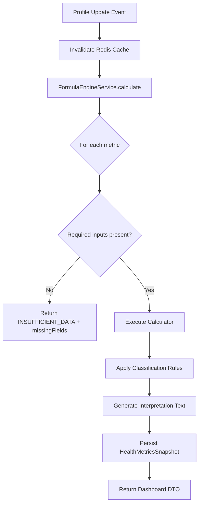
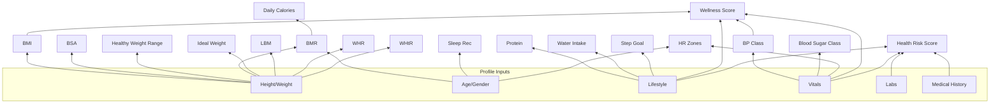

# DOC-08: Health360 AI — Health Formula Engine Specification

| Attribute | Value |
|-----------|-------|
| **Document ID** | DOC-08 |
| **Title** | Health Formula Engine Specification |
| **Version** | 1.0 |
| **Status** | **Approved** |
| **Date** | 2026-07-29 |
| **Author** | Healthcare Domain Expert / Chief Architect |
| **References** | [DOC-03] FRS, [DOC-06] Database Design, [DOC-07] REST API Design |
| **Next Document** | [DOC-09] Business Rules & Validation Catalog |

---

## 1. Executive Summary

This document specifies the **Health Formula Engine** — a deterministic calculation service that transforms patient profile data into clinically meaningful health metrics, classifications, and composite scores. The engine powers the Health Analytics domain [DOC-05 §10] and is exposed via [API-ANL-001–008] [DOC-07].

**Scope:** 20 calculations (18 individual metrics + 2 composite scores + profile completion)  
**Standards Referenced:** WHO, AHA (2017), ADA (2024), NIH, National Sleep Foundation  
**Phase 1 Constraint:** Deterministic calculations only — no AI/ML inference [BRQ-ANL-014]  
**Medical Advisory:** All thresholds subject to clinical advisory board review before launch [ASM-019]

**Mandatory Disclaimer (all outputs):**
> *This is not a medical diagnosis. Consult a healthcare professional for medical advice.*

---

## 2. Formula Engine Architecture

### 2.1 Execution Model



### 2.2 Design Principles

| Principle | Implementation |
|-----------|---------------|
| Deterministic | Same inputs → same outputs always [BRQ-ANL-013] |
| Idempotent | Recalculation replaces latest snapshot; history preserved |
| Fail-safe | Missing inputs → INSUFFICIENT_DATA, never guess |
| Standards-based | WHO/AHA/ADA classification thresholds |
| Extensible | Each calculator is independent Spring bean implementing `MetricCalculator` |
| Cacheable | Redis TTL 5 min; key: `metrics:{tenantId}:{patientId}` [NFR-PERF-033] |

### 2.3 Calculator Interface (Design Reference — Not Implementation)

```
MetricCalculator
├── getMetricType(): MetricType
├── getRequiredFields(): List<String>
├── calculate(PatientProfileContext): CalculatedMetric
├── classify(value, context): Classification
└── interpret(value, classification): String
```

### 2.4 Formula ID Convention

| ID Range | Category |
|----------|----------|
| FML-001 – FML-017 | Individual body & vital metrics |
| FML-018 | Wellness Score (composite) |
| FML-019 | Health Risk Score (composite) |
| FML-020 | Profile Completion Score |

### 2.5 Classification Scale (Universal)

| Level | Color | Meaning |
|-------|-------|---------|
| NORMAL | Green (#4CAF50) | Within healthy/reference range |
| WARNING | Amber (#FF9800) | Borderline or moderate concern |
| CRITICAL | Red (#F44336) | Significantly outside healthy range |
| INSUFFICIENT_DATA | Grey (#9E9E9E) | Required inputs missing |

---

## 3. Input Context Object

The engine receives a `PatientProfileContext` assembled from [DOC-06] tables:

| Context Field | DB Source |
|--------------|-----------|
| dateOfBirth, gender | patient.patient_profiles |
| heightCm, weightKg, waistCm, hipCm, bodyFatPercent | patient.patient_profiles + physical_measurement_history |
| smokingStatus, alcoholConsumption, exerciseFrequency, averageSleepHours, stressLevel, occupationType | patient.patient_profiles |
| latestVitals (BP, HR, glucose) | patient.vital_sign_records (latest) |
| latestLabs (HbA1c, cholesterol) | patient.lab_value_records (latest) |
| chronicConditions, allergies, familyMembers | patient.chronic_conditions, patient.family_members |
| healthGoals | patient.patient_profiles (goal columns) |
| completionScore | computed |

**Derived at runtime:** `age` = years from dateOfBirth to today

---

## 4. Individual Metric Specifications

---

### FML-001: Body Mass Index (BMI)

| Attribute | Detail |
|-----------|--------|
| **Metric Type** | BMI |
| **Standard** | WHO International Classification |

**Purpose:** Assess whether body weight is appropriate for height — a screening tool for underweight, overweight, and obesity.

**Medical Meaning:** BMI correlates with body fat and health risk at population level. It does not distinguish muscle from fat and may misclassify athletes or elderly.

**Formula:**
```
BMI = weight_kg / (height_m)²
where height_m = height_cm / 100
```

**Input Fields:**

| Field | Source | Required |
|-------|--------|----------|
| heightCm | patient_profiles.height_cm | Yes |
| weightKg | patient_profiles.weight_kg | Yes |

**Output:** Single decimal value  
**Units:** kg/m² (display to 1 decimal place)

**Validation Rules:**
- heightCm: 30–300 [BR-PAT-002]
- weightKg: 1–500 [BR-PAT-003]

**Classification Thresholds (WHO — Asian population adjustment optional Phase 1.5):**

| Classification | BMI Range |
|-------------|-----------|
| NORMAL (Underweight boundary) | < 18.5 → WARNING (underweight) |
| NORMAL | 18.5 – 24.9 |
| WARNING (Overweight) | 25.0 – 29.9 |
| CRITICAL (Obese Class I) | 30.0 – 34.9 |
| CRITICAL (Obese Class II+) | ≥ 35.0 |

**Interpretation Templates:**
- NORMAL: "Your BMI of {value} is within the healthy weight range (18.5–24.9)."
- WARNING (underweight): "Your BMI of {value} is below the healthy range. Consider consulting a nutritionist."
- WARNING (overweight): "Your BMI of {value} indicates overweight. Lifestyle changes may help."
- CRITICAL: "Your BMI of {value} indicates obesity. Please consult a healthcare professional."

**UI Recommendation:** Card with large numeric value, color-coded badge, BMI scale gauge (15–40 range with marker), trend sparkline from physical_measurement_history.

**Future API:** `GET /api/v1/analytics/patients/me/metrics/BMI` [API-ANL-003]

**Database Inputs:** `patient_profiles.height_cm`, `patient_profiles.weight_kg`

**Future AI Recommendation:** Personalized weight management plan based on BMI trend, activity level, and comorbidities (Phase 3+ AI module).

---

### FML-002: Basal Metabolic Rate (BMR)

| Attribute | Detail |
|-----------|--------|
| **Metric Type** | BMR |
| **Standard** | Mifflin-St Jeor Equation (1990) — most accurate for general population |

**Purpose:** Estimate daily calories burned at complete rest — foundation for calorie intake recommendations.

**Medical Meaning:** BMR represents minimum energy needed for vital functions (breathing, circulation, cell production). Typically 60–75% of total daily energy expenditure.

**Formula:**
```
Male:   BMR = (10 × weight_kg) + (6.25 × height_cm) − (5 × age) + 5
Female: BMR = (10 × weight_kg) + (6.25 × height_cm) − (5 × age) − 161
Other/Prefer not to say: Use average of male and female formulas
```

**Input Fields:**

| Field | Required |
|-------|----------|
| weightKg | Yes |
| heightCm | Yes |
| dateOfBirth (→ age) | Yes |
| gender | Yes |

**Output:** Integer (rounded)  
**Units:** kcal/day

**Validation:** age ≥ 1, all physical fields valid

**Classification (relative to expected range by age/gender — informational):**

| Classification | Condition |
|---------------|-----------|
| NORMAL | Calculated value within ±20% of population median for age/gender |
| WARNING | ±20–35% deviation |
| INSUFFICIENT_DATA | Missing inputs |

**Note:** BMR itself is not classified as good/bad — display as informational with no CRITICAL state in Phase 1.

**Interpretation:** "Your estimated basal metabolic rate is {value} kcal/day — the energy your body needs at rest."

**UI Recommendation:** Info card with kcal/day; link to Daily Calories (FML-010) metric.

**Future API:** `GET /analytics/patients/me/metrics/BMR`

**Database Inputs:** `patient_profiles` (weight, height, DOB, gender)

**Future AI Recommendation:** Adaptive calorie targets based on weight change trajectory.

---

### FML-003: Ideal Body Weight (Devine Formula)

| Attribute | Detail |
|-----------|--------|
| **Metric Type** | IDEAL_WEIGHT |
| **Standard** | Devine Formula (1974) |

**Purpose:** Provide a reference ideal weight based on height and gender — used in clinical dosing and nutrition planning.

**Formula:**
```
Male:   IBW_kg = 50 + 2.3 × (height_inches − 60)
Female: IBW_kg = 45.5 + 2.3 × (height_inches − 60)

where height_inches = height_cm / 2.54
If height_inches < 60: use 60 as minimum baseline
```

**Input Fields:** heightCm, gender  
**Output:** Decimal (1 place)  
**Units:** kg

**Classification:** Compare current weightKg to IBW:

| Classification | Deviation from IBW |
|---------------|-------------------|
| NORMAL | Within ±10% |
| WARNING | ±10–20% |
| CRITICAL | > ±20% |

**Interpretation:** "Your ideal body weight is approximately {value} kg based on your height."

**UI Recommendation:** Show ideal weight alongside current weight with delta indicator (↑/↓ kg from ideal).

**Future API:** `GET /analytics/patients/me/metrics/IDEAL_WEIGHT`

**Database Inputs:** height_cm, gender, weight_kg (for comparison)

**Future AI Recommendation:** Goal weight suggestion integrated with target weight from health goals.

---

### FML-004: Lean Body Mass (LBM)

| Attribute | Detail |
|-----------|--------|
| **Metric Type** | LEAN_BODY_MASS |
| **Standard** | Boer Formula (1984); fallback James Formula if no body fat % |

**Purpose:** Estimate fat-free body mass — useful for protein requirements and metabolic assessment.

**Formula (if bodyFatPercent available):**
```
LBM_kg = weight_kg × (1 − bodyFatPercent / 100)
```

**Formula (Boer — if bodyFatPercent NOT available):**
```
Male:   LBM = (0.407 × weight_kg) + (0.267 × height_cm) − 19.2
Female: LBM = (0.252 × weight_kg) + (0.473 × height_cm) − 48.3
```

**Input Fields:** weightKg, heightCm, gender; bodyFatPercent (optional, preferred)  
**Output:** Decimal (1 place)  
**Units:** kg

**Classification:** Informational only (no clinical good/bad threshold in Phase 1)

**Interpretation:** "Your estimated lean body mass is {value} kg ({percent}% of total body weight)."

**UI Recommendation:** Stacked bar showing fat mass vs lean mass proportion.

**Future API:** `GET /analytics/patients/me/metrics/LEAN_BODY_MASS`

**Database Inputs:** weight_kg, height_cm, gender, body_fat_percent

**Future AI Recommendation:** Body composition trend analysis with wearable integration (future).

---

### FML-005: Body Fat Percentage (Manual Entry Classification)

| Attribute | Detail |
|-----------|--------|
| **Metric Type** | BODY_FAT_PERCENT |
| **Standard** | ACSM / ACE general population ranges |

**Purpose:** Classify manually entered body fat percentage — no calculation, classification only.

**Medical Meaning:** Body fat percentage indicates proportion of fat to total body weight. More accurate than BMI for fitness assessment.

**Formula:** None — user-provided value classified against reference ranges.

**Input Fields:** bodyFatPercent (manual entry)  
**Output:** Same value + classification  
**Units:** %

**Validation:** 1–70%

**Classification Ranges (Male / Female):**

| Classification | Male | Female |
|---------------|------|--------|
| CRITICAL (Essential/Too Low) | < 6% | < 14% |
| NORMAL (Athletic/Fitness) | 6–24% | 14–31% |
| WARNING (Acceptable/Overweight) | 25–29% | 32–36% |
| CRITICAL (Obese) | ≥ 30% | ≥ 37% |

**Interpretation:** "Your body fat percentage of {value}% is classified as {category} for your gender."

**UI Recommendation:** Donut chart with fat vs lean split; prompt user to enter value if missing with guidance on measurement methods.

**Future API:** `GET /analytics/patients/me/metrics/BODY_FAT_PERCENT`

**Database Inputs:** `patient_profiles.body_fat_percent`

**Future AI Recommendation:** Estimate body fat from circumference measurements (Navy method) if not manually entered.

---

### FML-006: Body Surface Area (BSA)

| Attribute | Detail |
|-----------|--------|
| **Metric Type** | BODY_SURFACE_AREA |
| **Standard** | Du Bois Formula (1916) |

**Purpose:** Clinical reference for drug dosing, cardiac index, and metabolic rate normalization.

**Formula:**
```
BSA_m² = 0.007184 × (weight_kg ^ 0.425) × (height_cm ^ 0.725)
```

**Input Fields:** weightKg, heightCm  
**Output:** Decimal (2 places)  
**Units:** m²

**Classification:** Informational only (typical adult range 1.5–2.2 m²)

**Interpretation:** "Your body surface area is {value} m²."

**UI Recommendation:** Small info card; primarily informational for clinical context.

**Future API:** `GET /analytics/patients/me/metrics/BODY_SURFACE_AREA`

**Database Inputs:** weight_kg, height_cm

**Future AI Recommendation:** Clinical dosing reference alerts (future pharmacy module).

---

### FML-007: Healthy Weight Range

| Attribute | Detail |
|-----------|--------|
| **Metric Type** | HEALTHY_WEIGHT_RANGE |
| **Standard** | WHO BMI 18.5–24.9 applied to height |

**Purpose:** Display the weight range corresponding to healthy BMI for the patient's height.

**Formula:**
```
min_weight_kg = 18.5 × (height_m)²
max_weight_kg = 24.9 × (height_m)²
```

**Input Fields:** heightCm  
**Output:** Range object `{ min, max }`  
**Units:** kg

**Classification (current weight vs range):**

| Classification | Condition |
|---------------|-----------|
| NORMAL | weightKg within [min, max] |
| WARNING | weightKg within ±10% outside range |
| CRITICAL | weightKg > ±10% outside range |

**Interpretation:** "For your height, a healthy weight range is {min}–{max} kg. Your current weight is {current} kg."

**UI Recommendation:** Range slider with current weight marker; green zone between min and max.

**Future API:** `GET /analytics/patients/me/metrics/HEALTHY_WEIGHT_RANGE`

**Database Inputs:** height_cm, weight_kg

**Future AI Recommendation:** Progressive goal stepping toward healthy range.

---

### FML-008: Daily Protein Requirement

| Attribute | Detail |
|-----------|--------|
| **Metric Type** | PROTEIN_REQUIREMENT |
| **Standard** | ISSN / Academy of Nutrition and Dietetics |

**Purpose:** Recommend daily protein intake based on body weight and activity level.

**Formula:**
```
protein_g_day = weight_kg × activity_multiplier

Activity multipliers:
  SEDENTARY:           0.8 g/kg
  LIGHT exercise:      1.0 g/kg
  MODERATE exercise:   1.2 g/kg
  ACTIVE:              1.4 g/kg
  VERY_ACTIVE:         1.6 g/kg
  Chronic illness/elderly (age ≥ 65): minimum 1.0 g/kg regardless
```

**Input Fields:** weightKg, exerciseFrequency (lifestyle), dateOfBirth (age check)  
**Output:** Integer (rounded)  
**Units:** g/day

**Classification:**

| Classification | Condition |
|---------------|-----------|
| NORMAL | Recommendation generated successfully |
| INSUFFICIENT_DATA | Missing weight or activity |

**Interpretation:** "Based on your weight and activity level, aim for approximately {value} g of protein per day."

**UI Recommendation:** Card with grams/day; icon grid of protein source examples (eggs, dal, chicken).

**Future API:** `GET /analytics/patients/me/metrics/PROTEIN_REQUIREMENT`

**Database Inputs:** weight_kg, exercise_frequency, date_of_birth

**Future AI Recommendation:** Meal plan suggestions meeting protein target (future nutrition module).

---

### FML-009: Daily Water Intake

| Attribute | Detail |
|-----------|--------|
| **Metric Type** | WATER_INTAKE |
| **Standard** | NIH / EFSA general guidelines |

**Purpose:** Recommend daily fluid intake for hydration.

**Formula:**
```
base_ml = weight_kg × 35

Activity adjustment:
  SEDENTARY:     × 1.0
  LIGHT:         × 1.1
  MODERATE:      × 1.2
  ACTIVE:        × 1.3
  VERY_ACTIVE:   × 1.4

Climate adjustment (Phase 1 default): × 1.1 for India hot climate

water_ml_day = base_ml × activity_multiplier × climate_multiplier
Minimum floor: 1500 ml
Maximum cap: 4000 ml (unless VERY_ACTIVE: 5000 ml)
```

**Input Fields:** weightKg, exerciseFrequency  
**Output:** Integer  
**Units:** ml/day (display also as liters: "2.5 L")

**Classification:** Informational (NORMAL if calculated)

**Interpretation:** "Aim to drink approximately {value} ml ({liters} L) of water daily."

**UI Recommendation:** Water glass progress tracker (compare to waterIntakeMlGoal from health goals); visual fill animation.

**Future API:** `GET /analytics/patients/me/metrics/WATER_INTAKE`

**Database Inputs:** weight_kg, exercise_frequency; compare against `water_intake_ml_goal`

**Future AI Recommendation:** Hydration reminders based on activity and weather (future IoT/wearable).

---

### FML-010: Daily Calorie Requirement (TDEE)

| Attribute | Detail |
|-----------|--------|
| **Metric Type** | DAILY_CALORIES |
| **Standard** | Mifflin-St Jeor BMR × Activity Factor |

**Purpose:** Estimate total daily caloric needs including activity — for weight maintenance, loss, or gain planning.

**Formula:**
```
TDEE = BMR × activity_factor

Activity factors:
  SEDENTARY:      1.2
  LIGHT:          1.375
  MODERATE:       1.55
  ACTIVE:         1.725
  VERY_ACTIVE:    1.9

Goal adjustment (if targetWeightKg set):
  Lose weight:  TDEE − 500 kcal (min BMR × 1.1)
  Gain weight:  TDEE + 300 kcal
  Maintain:     TDEE
```

**Input Fields:** BMR inputs + exerciseFrequency + targetWeightKg (optional goal)  
**Output:** Integer  
**Units:** kcal/day

**Classification:**

| Classification | Condition |
|---------------|-----------|
| NORMAL | TDEE calculated |
| WARNING | TDEE below BMR × 1.1 (unsafe deficit flagged) |
| INSUFFICIENT_DATA | Missing BMR inputs |

**Interpretation:** "Your estimated daily calorie need is {value} kcal to {maintain/lose/gain} weight."

**UI Recommendation:** Calorie card with breakdown: BMR + activity = TDEE; show deficit/surplus if goal set.

**Future API:** `GET /analytics/patients/me/metrics/DAILY_CALORIES`

**Database Inputs:** profile fields + `target_weight_kg`

**Future AI Recommendation:** Personalized meal calorie budgeting.

---

### FML-011: Sleep Recommendation

| Attribute | Detail |
|-----------|--------|
| **Metric Type** | SLEEP_RECOMMENDATION |
| **Standard** | National Sleep Foundation (2015) |

**Purpose:** Recommend optimal sleep duration based on age.

**Formula (lookup by age):**

| Age Group | Recommended Hours |
|-----------|------------------|
| 18–25 | 7–9 |
| 26–64 | 7–9 |
| 65+ | 7–8 |

**Input Fields:** dateOfBirth (→ age)  
**Output:** Range `{ minHours, maxHours }`  
**Units:** hours

**Classification (compare averageSleepHours from lifestyle):**

| Classification | Condition |
|---------------|-----------|
| NORMAL | averageSleepHours within recommended range |
| WARNING | ±1 hour outside range |
| CRITICAL | ±2+ hours outside range or < 5 hours |
| INSUFFICIENT_DATA | Missing age or sleep data |

**Interpretation:** "For your age group, {min}–{max} hours of sleep is recommended. You report averaging {actual} hours."

**UI Recommendation:** Moon icon card; bar showing recommended range vs actual; compare to sleepHoursGoal.

**Future API:** `GET /analytics/patients/me/metrics/SLEEP_RECOMMENDATION`

**Database Inputs:** date_of_birth, average_sleep_hours, sleep_hours_goal

**Future AI Recommendation:** Sleep hygiene tips based on stress level and screen time (future).

---

### FML-012: Daily Step Goal

| Attribute | Detail |
|-----------|--------|
| **Metric Type** | DAILY_STEP_GOAL |
| **Standard** | WHO / ACSM physical activity guidelines |

**Purpose:** Recommend daily step target for cardiovascular health.

**Formula:**
```
Base by age:
  18–40:   10,000 steps
  41–60:   8,000 steps
  61+:     7,000 steps

Activity adjustment:
  SEDENTARY:    base (no change)
  LIGHT:        base
  MODERATE:     base (already active)
  ACTIVE:       base + 2,000
  VERY_ACTIVE:  base + 4,000

If dailyStepsGoal set in profile: use as override display comparison
```

**Input Fields:** dateOfBirth, exerciseFrequency; dailyStepsGoal (optional override)  
**Output:** Integer  
**Units:** steps/day

**Classification:** Compare actual steps (from goal progress if tracked) vs recommendation

**Interpretation:** "A daily step goal of {value} steps supports your cardiovascular health."

**UI Recommendation:** Circular progress ring; integration point for future wearable sync.

**Future API:** `GET /analytics/patients/me/metrics/DAILY_STEP_GOAL`

**Database Inputs:** date_of_birth, exercise_frequency, daily_steps_goal

**Future AI Recommendation:** Adaptive step goals based on fitness progression (future wearable).

---

### FML-013: Heart Rate Training Zones

| Attribute | Detail |
|-----------|--------|
| **Metric Type** | HEART_RATE_ZONES |
| **Standard** | Karvonen Method (% Heart Rate Reserve) |

**Purpose:** Define exercise intensity zones for safe and effective cardiovascular training.

**Formula:**
```
Max HR = 220 − age
Resting HR = latest heart_rate from vitals (default 70 if not recorded)
HRR (Heart Rate Reserve) = Max HR − Resting HR

Zone 1 (Very Light / Recovery): 50–60% HRR + Resting HR
Zone 2 (Light / Fat Burn):      60–70% HRR + Resting HR
Zone 3 (Moderate / Aerobic):    70–80% HRR + Resting HR
Zone 4 (Hard / Anaerobic):      80–90% HRR + Resting HR
Zone 5 (Maximum):               90–100% HRR + Resting HR
```

**Input Fields:** dateOfBirth (age), latest heartRate from vitals (optional, default 70)  
**Output:** Object with 5 zones, each `{ name, minBpm, maxBpm }`  
**Units:** bpm

**Classification:** Informational (NORMAL when calculated)

**Interpretation:** "Based on your age{and resting heart rate}, your training zones range from {z1.min} to {z5.max} bpm."

**UI Recommendation:** Horizontal zone bar chart (color gradient blue→red); highlight current HR if live data available.

**Future API:** `GET /analytics/patients/me/metrics/HEART_RATE_ZONES`

**Database Inputs:** date_of_birth, vital_sign_records.heart_rate (latest)

**Future AI Recommendation:** Workout plan generator targeting specific zones (future fitness module).

---

### FML-014: Blood Pressure Classification

| Attribute | Detail |
|-----------|--------|
| **Metric Type** | BP_CLASSIFICATION |
| **Standard** | AHA 2017 Guidelines |

**Purpose:** Classify blood pressure reading into clinical categories.

**Formula:** Classification lookup (no calculation) — uses latest systolic and diastolic.

**Input Fields:** systolicBp, diastolicBp (latest vital_sign_records)  
**Output:** Category string  
**Units:** mmHg (display both values)

**Validation:** systolic 40–300, diastolic 20–200; systolic > diastolic

**Classification Thresholds (AHA 2017):**

| Category | Systolic (mmHg) | Diastolic (mmHg) |
|----------|----------------|-----------------|
| NORMAL | < 120 | AND < 80 |
| WARNING (Elevated) | 120–129 | AND < 80 |
| WARNING (Stage 1 HTN) | 130–139 | OR 80–89 |
| CRITICAL (Stage 2 HTN) | ≥ 140 | OR ≥ 90 |
| CRITICAL (Hypertensive Crisis) | > 180 | OR > 120 |

**Note:** Use higher classification if systolic and diastolic fall in different categories.

**Interpretation Templates:**
- NORMAL: "Your blood pressure {sys}/{dia} mmHg is within the normal range."
- WARNING: "Your blood pressure {sys}/{dia} mmHg is elevated. Monitor regularly and consult your doctor."
- CRITICAL: "Your blood pressure {sys}/{dia} mmHg is high. Please consult a healthcare professional promptly."

**UI Recommendation:** BP card with sys/dia large numbers; AHA color-coded category badge; trend line from vitals history.

**Future API:** `GET /analytics/patients/me/metrics/BP_CLASSIFICATION`

**Database Inputs:** vital_sign_records (latest systolic_bp, diastolic_bp)

**Future AI Recommendation:** Hypertension risk prediction from BP trends + lifestyle (Phase 3 AI).

---

### FML-015: Blood Sugar Classification

| Attribute | Detail |
|-----------|--------|
| **Metric Type** | BLOOD_SUGAR_CLASSIFICATION |
| **Standard** | ADA 2024 Standards of Care |

**Purpose:** Classify blood glucose reading based on reading type (fasting, random, post-prandial).

**Input Fields:** bloodGlucose, glucoseReadingType (FASTING, RANDOM, POST_PRANDIAL)  
**Output:** Category string  
**Units:** mg/dL

**Validation:** glucose 20–600; readingType required when glucose provided

**Classification Thresholds:**

| Category | Fasting (mg/dL) | Post-Prandial (mg/dL) | Random (mg/dL) |
|----------|----------------|----------------------|----------------|
| NORMAL | < 100 | < 140 | < 140 |
| WARNING (Prediabetes) | 100–125 | 140–199 | 140–199 |
| CRITICAL (Diabetes) | ≥ 126 | ≥ 200 | ≥ 200 |
| CRITICAL (Hypoglycemia) | < 70 | < 70 | < 70 |

**Interpretation:** "Your {readingType} blood glucose of {value} mg/dL is classified as {category}."

**UI Recommendation:** Glucose card with reading type badge; reference range table below value.

**Future API:** `GET /analytics/patients/me/metrics/BLOOD_SUGAR_CLASSIFICATION`

**Database Inputs:** vital_sign_records.blood_glucose, glucose_reading_type

**Future AI Recommendation:** Diabetes risk score from HbA1c + glucose trends (Phase 3).

---

### FML-016: Waist-to-Hip Ratio (WHR)

| Attribute | Detail |
|-----------|--------|
| **Metric Type** | WAIST_HIP_RATIO |
| **Standard** | WHO abdominal obesity guidelines |

**Purpose:** Assess abdominal fat distribution — indicator of cardiovascular and metabolic risk.

**Formula:**
```
WHR = waist_cm / hip_cm
```

**Input Fields:** waistCm, hipCm  
**Output:** Decimal (2 places)  
**Units:** ratio (dimensionless)

**Validation:** waist 20–300, hip 20–300; waist < hip expected (WARNING if not)

**Classification (WHO):**

| Classification | Male | Female |
|---------------|------|--------|
| NORMAL | < 0.90 | < 0.80 |
| WARNING | 0.90–0.99 | 0.80–0.84 |
| CRITICAL | ≥ 1.00 | ≥ 0.85 |

**Interpretation:** "Your waist-to-hip ratio of {value} indicates {low/moderate/high} abdominal fat risk for your gender."

**UI Recommendation:** Silhouette diagram highlighting waist and hip measurement points; ratio gauge.

**Future API:** `GET /analytics/patients/me/metrics/WAIST_HIP_RATIO`

**Database Inputs:** waist_cm, hip_cm

**Future AI Recommendation:** Central obesity tracking with measurement reminders.

---

### FML-017: Waist-to-Height Ratio (WHtR)

| Attribute | Detail |
|-----------|--------|
| **Metric Type** | WAIST_HEIGHT_RATIO |
| **Standard** | WHO / NICE Guidelines ("Keep waist to less than half your height") |

**Purpose:** Simple screening for central obesity — more predictive than BMI alone for cardiometabolic risk.

**Formula:**
```
WHtR = waist_cm / height_cm
```

**Input Fields:** waistCm, heightCm  
**Output:** Decimal (2 places)  
**Units:** ratio

**Classification:**

| Classification | WHtR |
|---------------|------|
| NORMAL | < 0.50 |
| WARNING | 0.50 – 0.59 |
| CRITICAL | ≥ 0.60 |

**Interpretation:** "Your waist-to-height ratio is {value}. A ratio below 0.5 is generally considered healthy."

**UI Recommendation:** Simple card with "Half your height" reference line visualization.

**Future API:** `GET /analytics/patients/me/metrics/WAIST_HEIGHT_RATIO`

**Database Inputs:** waist_cm, height_cm

**Future AI Recommendation:** Combined with WHR and BMI for composite obesity assessment.

---

## 5. Composite Score Specifications

---

### FML-018: Overall Wellness Score

| Attribute | Detail |
|-----------|--------|
| **Metric Type** | WELLNESS_SCORE |
| **Precondition** | Profile completion ≥ 60% [BR-ANL-003] |

**Purpose:** Provide a single composite indicator of overall health wellness based on multiple profile dimensions.

**Medical Meaning:** Wellness score reflects general health status — NOT a clinical diagnosis. It encourages holistic health awareness and profile completion.

**Formula:**
```
WellnessScore = (
    BMI_score        × 0.20 +
    BP_score         × 0.15 +
    Lifestyle_score  × 0.25 +
    Vitals_score     × 0.15 +
    Completion_score × 0.10 +
    Goals_score      × 0.15
) × 100

Each sub-score normalized to 0.0–1.0:
```

**Sub-Score Calculations:**

| Sub-Score | Derivation |
|-----------|-----------|
| BMI_score | NORMAL=1.0, WARNING=0.6, CRITICAL=0.2 |
| BP_score | NORMAL=1.0, WARNING=0.5, CRITICAL=0.1, no data=0.5 |
| Lifestyle_score | Average of: exercise(0–1), sleep(0–1), non-smoker(1/0.3/0), alcohol(1/0.7/0.4), stress(1−(level−1)/4) |
| Vitals_score | Average of available: HR normal range(60–100)=1.0, SpO2≥95=1.0, glucose normal=1.0 |
| Completion_score | completionScore / 100 |
| Goals_score | Average progress toward set goals (weight, steps, sleep, water, exercise); unset goals excluded |

**Input Fields:** All profile sections; latest vitals; health goals; completion score

**Output:** Integer 0–100 + label  
**Units:** score (dimensionless)

**Labels:**

| Score Range | Label | Classification |
|-------------|-------|---------------|
| 80–100 | EXCELLENT | NORMAL |
| 60–79 | GOOD | NORMAL |
| 40–59 | FAIR | WARNING |
| 0–39 | NEEDS_ATTENTION | CRITICAL |

**Interpretation:** "Your Wellness Score is {score}/100 ({label}). {personalized_tip based on lowest sub-score}."

**UI Recommendation:** Large circular gauge (0–100) with color gradient; expandable breakdown showing each factor's contribution bar.

**Future API:** `GET /analytics/patients/me/dashboard` (includes wellnessScore)

**Database Inputs:** All patient profile tables; stored in `analytics.health_metrics_snapshots.wellness_score`

**Future AI Recommendation:** AI-generated personalized wellness action plan based on lowest-scoring factors (Phase 3).

---

### FML-019: Health Risk Score

| Attribute | Detail |
|-----------|--------|
| **Metric Type** | HEALTH_RISK_SCORE |
| **Precondition** | Medical Information + Lifestyle sections complete [BR-ANL-004] |

**Purpose:** Estimate overall health risk based on medical history, lifestyle, vitals, and lab values.

**Medical Meaning:** Indicates potential future health risk — NOT a diagnosis or probability of disease. Higher scores suggest more risk factors present.

**Formula:**
```
RiskScore = (
    Chronic_conditions_risk × 0.25 +
    Family_history_risk     × 0.15 +
    Lifestyle_risk          × 0.25 +
    Vitals_risk             × 0.20 +
    Lab_values_risk         × 0.15
) × 100

Each sub-score: 0.0 (lowest risk) to 1.0 (highest risk)
```

**Sub-Score Calculations:**

| Sub-Score | Derivation |
|-----------|-----------|
| Chronic_conditions_risk | min(count(active conditions) × 0.2 + count(severe allergies) × 0.1, 1.0) |
| Family_history_risk | min(count(family members with hereditary conditions) × 0.15, 1.0) |
| Lifestyle_risk | SMOKING: CURRENT=0.8, FORMER=0.3; ALCOHOL: REGULAR=0.5; EXERCISE: SEDENTARY=0.7; STRESS≥4=0.3 |
| Vitals_risk | BP CRITICAL=0.8, WARNING=0.4; Glucose CRITICAL=0.7; HR abnormal=0.3 (additive, cap 1.0) |
| Lab_values_risk | HbA1c≥6.5=0.6, 5.7–6.4=0.3; LDL≥160=0.5, 130–159=0.3; HDL<40(M)/50(F)=0.3 (additive, cap 1.0) |

**Input Fields:** chronic_conditions, family_members, lifestyle profile, latest vitals, latest lab values

**Output:** Integer 0–100 + label  
**Units:** score

**Labels:**

| Score Range | Label | Classification |
|-------------|-------|---------------|
| 0–25 | LOW_RISK | NORMAL |
| 26–50 | MODERATE_RISK | WARNING |
| 51–75 | HIGH_RISK | WARNING |
| 76–100 | VERY_HIGH_RISK | CRITICAL |

**Interpretation:** "Your Health Risk Score is {score}/100 ({label}). This reflects {n} risk factors in your profile. {top_risk_factor_suggestion}."

**UI Recommendation:** Risk gauge (green→red gradient); list of identified risk factors with icons; CTA to complete missing sections or consult doctor.

**Future API:** `GET /analytics/patients/me/dashboard` (includes healthRiskScore)

**Database Inputs:** patient medical/lifestyle/vitals/labs tables; stored in `analytics.health_metrics_snapshots.health_risk_score`

**Future AI Recommendation:** Predictive disease risk models (cardiovascular 10-year risk, diabetes risk) using Framingham/Indian Diabetes Risk Score (Phase 3 AI).

---

### FML-020: Profile Completion Score

| Attribute | Detail |
|-----------|--------|
| **Metric Type** | PROFILE_COMPLETION |
| **Standard** | [BR-PAT-007] weighted section scoring |

**Purpose:** Encourage comprehensive profile completion for accurate health analytics.

**Formula:** Weighted sum — see [DOC-03 FR-PAT-014] / [DOC-02 BR-PAT-007]:

| Section | Weight | Complete When |
|---------|--------|--------------|
| Basic Information | 15% | DOB, gender filled |
| Contact Information | 10% | Phone, permanent address filled |
| Physical Measurements | 15% | Height, weight filled |
| Medical Information | 15% | ≥1 allergy OR medication OR condition recorded (or explicitly "none") |
| Lifestyle | 10% | smokingStatus, exerciseFrequency, averageSleepHours filled |
| Emergency Contacts | 5% | ≥1 contact with phone |
| Vitals | 10% | ≥1 vital_sign_record |
| Lab Values | 5% | ≥1 lab_value_record |
| Health Goals | 5% | ≥1 goal set |
| Documents | 10% | ≥1 health_document uploaded |

**Output:** Integer 0–100  
**Units:** percent

**Classification:**

| Score | Label |
|-------|-------|
| 80–100 | Nearly Complete |
| 60–79 | Good Progress |
| 40–59 | Needs Attention |
| 0–39 | Just Started |

**UI Recommendation:** Progress bar with section checklist; each incomplete section links to edit screen.

**Future API:** `GET /patients/me/profile/completion` [API-PAT-025]

**Database Inputs:** All patient profile tables

**Future AI Recommendation:** Smart prompts for most impactful missing section based on age/gender.

---

## 6. Formula Dependency Graph



---

## 7. Engine Execution Order

Calculators execute in dependency order:

| Order | Calculator | Depends On |
|-------|-----------|------------|
| 1 | Profile Completion (FML-020) | — |
| 2 | BMI (FML-001) | height, weight |
| 3 | BMR (FML-002) | height, weight, age, gender |
| 4 | Ideal Weight (FML-003) | height, gender |
| 5 | Lean Body Mass (FML-004) | weight, height, gender, bodyFat% |
| 6 | Body Fat % (FML-005) | bodyFat% |
| 7 | BSA (FML-006) | height, weight |
| 8 | Healthy Weight Range (FML-007) | height |
| 9 | Protein (FML-008) | weight, activity |
| 10 | Water Intake (FML-009) | weight, activity |
| 11 | Daily Calories (FML-010) | BMR, activity, goals |
| 12 | Sleep Recommendation (FML-011) | age, sleep hours |
| 13 | Step Goal (FML-012) | age, activity |
| 14 | Heart Rate Zones (FML-013) | age, resting HR |
| 15 | BP Classification (FML-014) | latest vitals |
| 16 | Blood Sugar Classification (FML-015) | latest vitals |
| 17 | WHR (FML-016) | waist, hip |
| 18 | WHtR (FML-017) | waist, height |
| 19 | Wellness Score (FML-018) | BMI, BP, lifestyle, vitals, completion, goals |
| 20 | Health Risk Score (FML-019) | medical, family, lifestyle, vitals, labs |

---

## 8. Snapshot Persistence

Each engine run creates one row in [DOC-06]:

**analytics.health_metrics_snapshots** + child **analytics.calculated_metrics** (one row per metric type)

Snapshot is immutable; new calculation = new snapshot. Dashboard always reads latest.

---

## 9. Test Reference Values

For [NFR-TEST-009] formula accuracy testing:

| Metric | Inputs | Expected Output |
|--------|--------|----------------|
| BMI | height=170cm, weight=70kg | 24.2 kg/m² (NORMAL) |
| BMR | male, 30yr, 170cm, 70kg | 1,662 kcal/day |
| BMR | female, 30yr, 160cm, 60kg | 1,336 kcal/day |
| Ideal Weight | male, 170cm | 68.0 kg |
| BSA | 170cm, 70kg | 1.82 m² |
| WHR | waist=85, hip=100, male | 0.85 (WARNING) |
| WHtR | waist=85, height=170 | 0.50 (WARNING boundary) |
| BP | 118/76 | NORMAL |
| BP | 145/92 | CRITICAL (Stage 2) |
| Glucose | 92 mg/dL fasting | NORMAL |
| Glucose | 110 mg/dL fasting | WARNING (Prediabetes) |

---

## 10. Requirements Traceability

| Formula | FR Reference | API Reference | DB Tables |
|---------|-------------|---------------|-----------|
| FML-001 BMI | FR-ANL-002 | API-ANL-003 | patient_profiles |
| FML-014 BP | FR-ANL-005 | API-ANL-003 | vital_sign_records |
| FML-018 Wellness | FR-ANL-004 | API-ANL-001 | health_metrics_snapshots |
| FML-019 Risk | FR-ANL-005 | API-ANL-001 | health_metrics_snapshots |
| FML-020 Completion | FR-PAT-014 | API-PAT-025 | patient_profiles |

---

## 11. Approval

| Role | Name | Signature | Date | Status |
|------|------|-----------|------|--------|
| Product Owner | _________________ | _________________ | ________ | Pending |
| Clinical Advisory | _________________ | _________________ | ________ | Pending |
| Technical Lead / Architect | _________________ | _________________ | ________ | Pending |
| Engineering Lead | _________________ | _________________ | ________ | Pending |

---

*End of DOC-08 — Health Formula Engine Specification v1.0*
