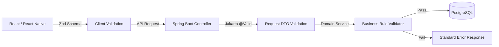
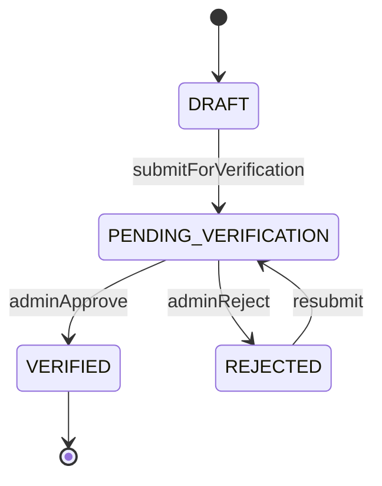
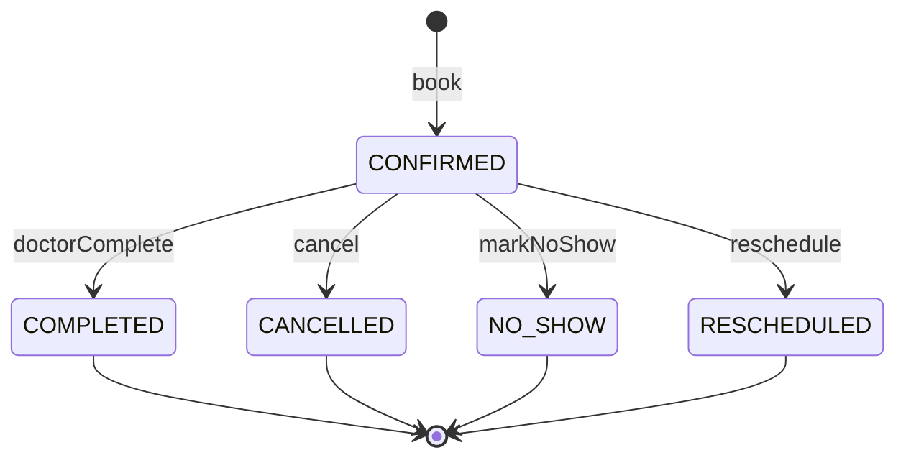

# DOC-09: Health360 AI — Business Rules & Validation Catalog

| Attribute | Value |
|-----------|-------|
| **Document ID** | DOC-09 |
| **Title** | Business Rules & Validation Catalog |
| **Version** | 1.0 |
| **Status** | **Approved** |
| **Date** | 2026-07-29 |
| **Author** | Senior Business Analyst / Technical Lead |
| **References** | [DOC-02] BRD, [DOC-03] FRS, [DOC-07] REST API, [DOC-08] Formula Engine |
| **Next Document** | [DOC-10] UI/UX Screen Specification |

---

## 1. Executive Summary

This catalog is the authoritative reference for **business rules (BR-XXX)** and **field validation rules (VAL-XXX)** across Health360 AI Phase 1. It expands the overview in [DOC-02 §7] with enforcement logic, validation constraints, error codes, and dual-layer implementation guidance (Zod frontend + Jakarta Validation backend) [ADR-008].

**Totals:** 47 business rules | 85+ field validation rules | 22 error codes | 4 state machines

---

## 2. Validation Architecture

### 2.1 Dual Validation Layer

| Layer | Technology | Responsibility |
|-------|-----------|----------------|
| **L1 — Client** | Zod (React Hook Form) | Format, required fields, ranges; immediate UX feedback |
| **L2 — API DTO** | Jakarta Validation (Bean Validation 3.0) | Mirror L1 constraints; reject malformed requests |
| **L3 — Domain** | Business rule validators (Java) | Cross-field rules, state transitions, uniqueness, authorization context |
| **L4 — Database** | CHECK constraints, UNIQUE indexes [DOC-06] | Last line of defense; data integrity |

### 2.2 Validation ID Convention

| Prefix | Type |
|--------|------|
| BR-XXX | Business rule (policy/logic) |
| VAL-XXX | Field-level validation constraint |
| SM-XXX | State machine definition |
| ERR-XXX | Error code (maps to [DOC-07 §3]) |

### 2.3 Error Response Mapping

Every validation failure returns [DOC-07] standard error format with `details[].code` matching ERR-XXX.

---

## 3. Authentication & Authorization Rules

### BR-AUTH-001: Email Verification Required

| Attribute | Detail |
|-----------|--------|
| **Domain** | IAM |
| **Enforcement** | L3 — AuthenticationFilter / AuthorizationService |
| **Trigger** | Any protected endpoint access |
| **Condition** | `user.emailVerified == false` AND endpoint not in allowlist |
| **Allowlist** | `/auth/**`, `/users/me` (read only), email verification endpoints |
| **Action** | HTTP 403, ERR-FORBIDDEN, message: "Please verify your email" |
| **Traces To** | FR-IAM-002 |

---

### BR-AUTH-002: Token Expiry

| Attribute | Detail |
|-----------|--------|
| **Domain** | IAM |
| **Rule** | Access token TTL = 900 seconds (15 min); Refresh token TTL = 604800 seconds (7 days) |
| **Enforcement** | L3 — JwtTokenProvider |
| **Storage** | Refresh token hash in Redis with TTL |
| **Traces To** | FR-IAM-003, FR-IAM-004 |

---

### BR-AUTH-003: Refresh Token Rotation

| Attribute | Detail |
|-----------|--------|
| **Domain** | IAM |
| **Rule** | On refresh: invalidate old token; issue new pair; reused old token → 401 |
| **Enforcement** | L3 — AuthenticationService.refreshToken() |
| **Error** | ERR-TOKEN_EXPIRED / ERR-UNAUTHORIZED |
| **Traces To** | FR-IAM-004 |

---

### BR-AUTH-004: Password Complexity

| Attribute | Detail |
|-----------|--------|
| **Domain** | IAM |
| **Rule** | Min 8 chars; ≥1 uppercase; ≥1 lowercase; ≥1 digit; ≥1 special char from `!@#$%^&*()_+-=` |
| **VAL-ID** | VAL-IAM-001 |
| **Enforcement** | L1 Zod regex + L2 `@Pattern` + L3 PasswordPolicyService |
| **Error** | ERR-VALIDATION_ERROR, field: password, code: WEAK_PASSWORD |
| **Traces To** | FR-IAM-001, FR-IAM-006 |

**VAL-IAM-001:**

| Field | Constraint | Zod | Jakarta |
|-------|-----------|-----|---------|
| password | Min 8, complexity regex | `z.string().min(8).regex(...)` | `@Size(min=8) @Pattern` |
| confirmPassword | Must equal password | `.refine(match)` | Custom validator |

---

### BR-AUTH-005: Account Lockout

| Attribute | Detail |
|-----------|--------|
| **Domain** | IAM |
| **Rule** | 5 consecutive failed logins → lock 30 minutes |
| **Enforcement** | L3 — AuthenticationService |
| **Fields** | `failedLoginAttempts`, `lockedUntil` on iam.users |
| **Error** | HTTP 423, ERR-ACCOUNT_LOCKED, include `lockedUntil` in response |
| **Reset** | Successful login resets counter to 0 |
| **Traces To** | FR-IAM-003 |

---

### BR-AUTH-006: Single Primary Role

| Attribute | Detail |
|-----------|--------|
| **Domain** | IAM |
| **Rule** | Registration assigns one role; additional roles via Platform Admin only |
| **Enforcement** | L3 — UserRegistrationService |
| **Exception** | Platform Admin may hold PATIENT + PLATFORM_ADMIN for testing |
| **Traces To** | FR-IAM-007 |

---

### BR-AUTH-007: Doctor Patient Data Access Window

| Attribute | Detail |
|-----------|--------|
| **Domain** | IAM + Patient |
| **Rule** | Doctor may view patient summary only if appointment exists with status CONFIRMED or COMPLETED and `scheduledAt` within [now − 24h, now + 24h] |
| **Enforcement** | L3 — PatientSummaryService + AuthorizationService |
| **Error** | HTTP 403, ERR-FORBIDDEN |
| **Traces To** | FR-PAT-015 |

---

## 4. Patient Domain Rules & Validation

### BR-PAT-001: Date of Birth Validation

**VAL-PAT-001:**

| Field | Type | Min | Max | Rule |
|-------|------|-----|-----|------|
| dateOfBirth | date | 1 year ago | today | Not future; age ≥ 1 |

| Layer | Implementation |
|-------|---------------|
| Zod | `z.coerce.date().max(new Date()).refine(age >= 1)` |
| Jakarta | `@Past @NotNull` + custom `@MinAge(1)` |
| Error | ERR-VALIDATION_ERROR, code: INVALID_DOB |

---

### BR-PAT-002 / BR-PAT-003: Physical Measurements

**VAL-PAT-002:**

| Field | Min | Max | Unit |
|-------|-----|-----|------|
| heightCm | 30 | 300 | cm |
| weightKg | 1 | 500 | kg |
| waistCm | 20 | 300 | cm (optional) |
| hipCm | 20 | 300 | cm (optional) |
| neckCm | 15 | 100 | cm (optional) |
| bodyFatPercent | 1 | 70 | % (optional) |

| Layer | Jakarta |
|-------|---------|
| DTO | `@DecimalMin @DecimalMax` on each field |

---

### BR-PAT-004: Vital Signs Append-Only

| Attribute | Detail |
|-----------|--------|
| **Rule** | No UPDATE or DELETE on vital_sign_records; corrections via new POST |
| **Enforcement** | L3 — no update endpoint exposed; repository save-only |
| **API** | POST only [API-PAT-016]; no PUT/DELETE |
| **Traces To** | FR-PAT-009 |

**VAL-PAT-003 — Vital Signs Ranges:**

| Field | Min | Max | Unit |
|-------|-----|-----|------|
| systolicBp | 40 | 300 | mmHg |
| diastolicBp | 20 | 200 | mmHg |
| heartRate | 20 | 300 | bpm |
| temperature | 30.0 | 45.0 | °C |
| respiratoryRate | 5 | 60 | /min |
| spo2 | 50 | 100 | % |
| bloodGlucose | 20.0 | 600.0 | mg/dL |
| recordedAt | — | now | not future |

**Cross-field:** If `bloodGlucose` provided → `glucoseReadingType` required (VAL-PAT-004)

---

### BR-PAT-005 / BR-PAT-006: Health Documents

**VAL-PAT-005:**

| Constraint | Value |
|-----------|-------|
| maxFileSize | 10 MB (10,485,760 bytes) |
| allowedMimeTypes | application/pdf, image/jpeg, image/png, application/dicom |
| maxTitleLength | 200 chars |
| maxDescriptionLength | 1000 chars |

| Error | HTTP 413 ERR-FILE_TOO_LARGE or 400 ERR-VALIDATION_ERROR (INVALID_FILE_TYPE) |

---

### BR-PAT-007: Profile Completion Weights

| Section | Weight | Complete Criteria |
|---------|--------|------------------|
| BASIC_INFO | 15% | dateOfBirth AND gender NOT NULL |
| CONTACT_INFO | 10% | primaryPhone AND permanent address line1, city, state, pincode |
| PHYSICAL | 15% | heightCm AND weightKg NOT NULL |
| MEDICAL | 15% | ≥1 allergy OR medication OR chronic condition OR explicit `medicalSectionAcknowledged=true` |
| LIFESTYLE | 10% | smokingStatus AND exerciseFrequency AND averageSleepHours |
| EMERGENCY | 5% | ≥1 emergency contact with phone |
| VITALS | 10% | ≥1 vital_sign_record exists |
| LAB_VALUES | 5% | ≥1 lab_value_record exists |
| GOALS | 5% | ≥1 goal field NOT NULL |
| DOCUMENTS | 10% | ≥1 health_document exists |

**Enforcement:** L3 — ProfileCompletionCalculator [DOC-08 FML-020]

---

### BR-PAT-008: Health Data Consent

| Attribute | Detail |
|-----------|--------|
| **Rule** | `consentAccepted` must be true before any profile mutation |
| **Enforcement** | L3 — PatientProfileService pre-check |
| **Error** | HTTP 403, ERR-FORBIDDEN, "Health data consent required" |
| **Traces To** | FR-PAT-001 |

---

### BR-PAT-009: Emergency Contact Limits

**VAL-PAT-006:**

| Rule | Value |
|------|-------|
| maxContacts | 5 per patient |
| primaryRequired | If any contact exists, exactly one `isPrimary=true` |
| phoneRequired | phone mandatory per contact |

---

### BR-PAT-010: Contact & Address Validation

**VAL-PAT-007:**

| Field | Constraint |
|-------|-----------|
| primaryPhone | 10-digit Indian mobile OR E.164; regex: `^[6-9]\d{9}$` or `^\+[1-9]\d{1,14}$` |
| pincode | Exactly 6 digits; regex: `^[1-9]\d{5}$` |
| email | Read-only from IAM account |

---

## 5. Doctor Domain Rules & Validation

### BR-DOC-001: Verified Doctors Only in Search

| Attribute | Detail |
|-----------|--------|
| **Rule** | `verificationStatus = VERIFIED` required for search/booking results |
| **Enforcement** | L3 — DoctorSearchService query filter; BookingService pre-check |
| **Error (booking)** | 400 ERR-VALIDATION_ERROR, DOCTOR_NOT_VERIFIED |
| **Traces To** | FR-DOC-012, FR-SCH-015 |

---

### BR-DOC-002: Unique Medical Registration Number

**VAL-DOC-001:**

| Field | Constraint |
|-------|-----------|
| medicalRegistrationNumber | Required; 5–100 chars; unique per tenant |

| Error | 409 ERR-DUPLICATE_REGISTRATION |

---

### BR-DOC-003: Hospital Association Required for Booking

| Attribute | Detail |
|-----------|--------|
| **Rule** | Doctor must have ≥1 ACTIVE hospital_association to be bookable |
| **Enforcement** | L3 — BookingService |
| **Traces To** | FR-DOC-007 |

---

### BR-DOC-004: Consultation Fee

**VAL-DOC-002:**

| Field | Min | Display |
|-------|-----|---------|
| feeAmount | 0 | fee = 0 → "Free Consultation" |

---

### BR-DOC-005: Consultation Type Required

| Attribute | Detail |
|-----------|--------|
| **Rule** | ≥1 consultation_config per active hospital association |
| **Enforcement** | L3 — VerificationSubmissionValidator |
| **Traces To** | FR-DOC-008 |

---

### BR-DOC-006: Verification Resubmission

| Attribute | Detail |
|-----------|--------|
| **Rule** | Status REJECTED → doctor may edit profile and resubmit → PENDING_VERIFICATION |
| **Allowed transitions** | REJECTED → PENDING_VERIFICATION; DRAFT → PENDING_VERIFICATION |
| **Traces To** | FR-DOC-012 |

---

### BR-DOC-007: Multi-Hospital Practice

| Attribute | Detail |
|-----------|--------|
| **Rule** | Independent schedule per doctor+hospital+branch; fees may differ per association |
| **Enforcement** | L3 — scheduling.doctor_schedules unique constraint |
| **Traces To** | FR-DOC-007 |

---

### Doctor Verification State Machine (SM-DOC-001)

**Submission prerequisites (L3 validator):**
- Profile completeness ≥ 80%
- ≥1 qualification
- Registration certificate uploaded
- ≥1 active hospital association
- ≥1 consultation config

| Error | 422 ERR-VERIFICATION_INCOMPLETE + `missingItems[]` |

---

## 6. Hospital Domain Rules & Validation

### BR-HOS-001: Minimum One Branch

| Attribute | Detail |
|-----------|--------|
| **Rule** | Hospital must have ≥1 branch before public visibility |
| **Enforcement** | L3 — HospitalProfileService |
| **Error** | 400 ERR-VALIDATION_ERROR, NO_BRANCHES |

---

### BR-HOS-002: Unique Hospital Registration

**VAL-HOS-001:** registrationNumber — required, 5–100 chars, unique per tenant  
**Error:** 409 ERR-DUPLICATE_REGISTRATION

---

### BR-HOS-003: Branch Geo Coordinates Required

**VAL-HOS-002:**

| Field | Min | Max |
|-------|-----|-----|
| latitude | -90 | 90 |
| longitude | -180 | 180 |

Both required on branch create/update.

---

### BR-HOS-004: Gallery Image Limits

**VAL-HOS-003:**

| Constraint | Value |
|-----------|-------|
| maxImages | 20 per hospital |
| maxFileSize | 5 MB per image |
| allowedTypes | image/jpeg, image/png |

---

### BR-HOS-005: Unique Department Names

| Attribute | Detail |
|-----------|--------|
| **Rule** | Department name unique within hospital (case-insensitive) |
| **Enforcement** | L3 + DB partial unique index |
| **Error** | 409 ERR-VALIDATION_ERROR, DUPLICATE_DEPARTMENT |

---

## 7. Scheduling Domain Rules & Validation

### BR-SCH-001: No Overlapping Schedule Blocks

| Attribute | Detail |
|-----------|--------|
| **Rule** | For same schedule + dayOfWeek: block intervals must not overlap |
| **Enforcement** | L3 — ScheduleBlockValidator |
| **Validation** | endTime > startTime for each block |
| **Error** | 400 ERR-VALIDATION_ERROR, OVERLAPPING_SCHEDULE |

---

### BR-SCH-002: One Appointment Per Doctor Per Day

| Attribute | Detail |
|-----------|--------|
| **Rule** | Patient cannot have >1 ACTIVE (CONFIRMED) appointment with same doctor on same calendar day |
| **Active statuses** | CONFIRMED |
| **Enforcement** | L3 — BookingService pre-check |
| **Error** | 409 ERR-DUPLICATE_APPOINTMENT |

---

### BR-SCH-003: Future Slots Only

| Attribute | Detail |
|-----------|--------|
| **Rule** | slotDate + startTime must be > now (user timezone) |
| **Enforcement** | L3 — BookingService |
| **Error** | 400 ERR-VALIDATION_ERROR, PAST_SLOT |

---

### BR-SCH-004: Cancellation Window

| Attribute | Detail |
|-----------|--------|
| **Rule** | Cancel allowed if `scheduledAt - now >= 2 hours` |
| **Enforcement** | L3 — CancellationService.canBeCancelled() |
| **Error** | 400 ERR-CANCELLATION_NOT_ALLOWED |
| **Configurable** | `scheduling.cancellation-window-hours=2` (application property) |

---

### BR-SCH-005: Reschedule Window

| Attribute | Detail |
|-----------|--------|
| **Rule** | Same 2-hour window as cancellation; creates new appointment; old → RESCHEDULED |
| **Enforcement** | L3 — ReschedulingService |
| **Error** | 400 ERR-CANCELLATION_NOT_ALLOWED |

---

### BR-SCH-006: Appointment Status Transitions

**SM-SCH-001 — Appointment State Machine:**

| Invalid Transition Error | 400 ERR-INVALID_STATUS_TRANSITION |

---

### BR-SCH-007: No-Show Timing

| Attribute | Detail |
|-----------|--------|
| **Rule** | Mark NO_SHOW only if `now > scheduledAt + 15 minutes` AND status = CONFIRMED |
| **Enforcement** | L3 — AppointmentService.markNoShow() |
| **Actors** | DOCTOR, PLATFORM_ADMIN, SYSTEM (scheduled job) |

---

### BR-SCH-008: Atomic Booking

| Attribute | Detail |
|-----------|--------|
| **Rule** | SELECT FOR UPDATE on time_slot; verify AVAILABLE; create appointment; set BOOKED — single transaction |
| **Enforcement** | L3 + L4 — @Transactional + pessimistic lock |
| **Error (race)** | 409 ERR-SLOT_UNAVAILABLE |
| **Traces To** | FR-SCH-004 |

---

### BR-SCH-009: Appointment Reminders

| Attribute | Detail |
|-----------|--------|
| **Rule** | Schedule reminders at T-24h and T-1h; skip if appointment CANCELLED/RESCHEDULED |
| **Enforcement** | L3 — ReminderSchedulingService + scheduled job |
| **Channels** | Per user notification preferences [BR-AUTH preferences] |

---

## 8. Health Analytics Rules

### BR-ANL-001: Medical Disclaimer

| Attribute | Detail |
|-----------|--------|
| **Rule** | Every metric response includes disclaimer text |
| **Text** | "This is not a medical diagnosis. Consult a healthcare professional for medical advice." |
| **Enforcement** | L3 — CalculatedMetricDto always includes `disclaimer` field |
| **Traces To** | [DOC-08 §1] |

---

### BR-ANL-002: Insufficient Data Handling

| Attribute | Detail |
|-----------|--------|
| **Rule** | Missing formula inputs → classification INSUFFICIENT_DATA; list missingFields[] |
| **Enforcement** | L3 — each MetricCalculator |
| **Traces To** | [DOC-08] |

---

### BR-ANL-003: Wellness Score Gate

| Attribute | Detail |
|-----------|--------|
| **Rule** | Wellness Score calculated only if completionScore ≥ 60 |
| **Else** | Return null score + message "Complete at least 60% of your profile" |
| **Traces To** | [DOC-08 FML-018] |

---

### BR-ANL-004: Health Risk Score Gate

| Attribute | Detail |
|-----------|--------|
| **Rule** | Requires MEDICAL + LIFESTYLE sections complete per BR-PAT-007 criteria |
| **Traces To** | [DOC-08 FML-019] |

---

### BR-ANL-005: Classification Standards

| Attribute | Detail |
|-----------|--------|
| **Rule** | Thresholds per [DOC-08] WHO/AHA/ADA — not configurable in Phase 1 |
| **Traces To** | FR-ANL-003 |

---

### BR-ANL-006: Trend Data Minimum

| Attribute | Detail |
|-----------|--------|
| **Rule** | Metric history charts require ≥ 2 snapshots/recordings |
| **UI** | Show "Add more recordings to see trends" if count < 2 |
| **Traces To** | FR-ANL-007 |

---

## 9. Review Rules

### BR-REV-001: Review Eligibility

| Attribute | Detail |
|-----------|--------|
| **Rule** | Appointment status = COMPLETED; completedAt within 30 days; patient owns appointment |
| **Enforcement** | L3 — ReviewSubmissionValidator |
| **Error** | 400 ERR-VALIDATION_ERROR, REVIEW_WINDOW_CLOSED |

---

### BR-REV-002: Review Text Limit

**VAL-REV-001:**

| Field | Max |
|-------|-----|
| comment | 1000 characters |
| rating | 1–5 integer required |

---

### BR-REV-003: One Review Per Appointment

| Attribute | Detail |
|-----------|--------|
| **Rule** | Unique appointment_id on doctor_reviews and hospital_reviews |
| **Enforcement** | L4 DB unique constraint + L3 pre-check |
| **Error** | 409 ERR-DUPLICATE_REVIEW |

---

### BR-REV-004: Aggregate Rating Calculation

| Attribute | Detail |
|-----------|--------|
| **Rule** | `averageRating = sum(ratings) / count(visible reviews)`; round to 1 decimal; exclude moderated/hidden |
| **Enforcement** | L3 — RatingCalculatorService on review create/delete/moderate |
| **Traces To** | BRQ-REV-004 |

---

## 10. Search & Location Rules

### BR-SRH-001: Verified Doctors in Search

| Attribute | Detail |
|-----------|--------|
| **Rule** | All doctor search queries include `verificationStatus = VERIFIED AND deletedAt IS NULL` |
| **Enforcement** | L3 — DoctorSearchService (mandatory filter, not client-overridable) |

---

### BR-SRH-002: Geo Search Radius

**VAL-SRH-001:**

| Param | Default | Min | Max |
|-------|---------|-----|-----|
| radiusKm | 5 | 1 | 50 |

---

### BR-SRH-003: Pagination Limits

**VAL-COMMON-001:**

| Param | Default | Max |
|-------|---------|-----|
| page | 0 | — |
| size | 20 | 100 |

---

## 11. Registration & IAM Field Validation Catalog

| VAL-ID | Field | Constraints | Error Code |
|--------|-------|-------------|------------|
| VAL-IAM-002 | email | Valid email; max 255; unique per tenant | DUPLICATE_EMAIL |
| VAL-IAM-003 | firstName | Required; 1–100 chars; letters/spaces | VALIDATION_ERROR |
| VAL-IAM-004 | lastName | Required; 1–100 chars | VALIDATION_ERROR |
| VAL-IAM-005 | phone | Required; Indian 10-digit or E.164 | VALIDATION_ERROR |
| VAL-IAM-006 | role | Enum: PATIENT, DOCTOR only at registration | VALIDATION_ERROR |
| VAL-IAM-007 | acceptTerms | Must be true | VALIDATION_ERROR |

---

## 12. Enum Definitions (Canonical)

All enums validated at L1 and L2 — invalid enum → 400 VALIDATION_ERROR.

| Enum | Values |
|------|--------|
| Gender | MALE, FEMALE, OTHER, PREFER_NOT_TO_SAY |
| BloodGroup | A_POSITIVE, A_NEGATIVE, B_POSITIVE, B_NEGATIVE, AB_POSITIVE, AB_NEGATIVE, O_POSITIVE, O_NEGATIVE |
| UserStatus | PENDING_VERIFICATION, ACTIVE, DEACTIVATED, LOCKED |
| VerificationStatus | DRAFT, PENDING_VERIFICATION, VERIFIED, REJECTED |
| AppointmentStatus | PENDING, CONFIRMED, COMPLETED, CANCELLED, NO_SHOW, RESCHEDULED |
| SlotStatus | AVAILABLE, BOOKED, BLOCKED |
| ConsultationType | IN_PERSON, FOLLOW_UP |
| SmokingStatus | NEVER, FORMER, CURRENT |
| AlcoholConsumption | NEVER, OCCASIONAL, REGULAR |
| ExerciseFrequency | SEDENTARY, LIGHT, MODERATE, ACTIVE, VERY_ACTIVE |
| GlucoseReadingType | FASTING, RANDOM, POST_PRANDIAL |
| DocumentCategory | LAB_REPORT, PRESCRIPTION, SCAN, OTHER |
| AllergySeverity | MILD, MODERATE, SEVERE |
| HospitalType | GOVERNMENT, PRIVATE, TRUST, CLINIC |

---

## 13. Zod Schema Naming Convention (Frontend)

| Domain | Schema File | Example |
|--------|------------|---------|
| IAM | `schemas/auth.schema.ts` | `registerSchema`, `loginSchema`, `changePasswordSchema` |
| Patient | `schemas/patient.schema.ts` | `basicInfoSchema`, `vitalsSchema`, `medicationSchema` |
| Doctor | `schemas/doctor.schema.ts` | `professionalDetailsSchema`, `qualificationSchema` |
| Hospital | `schemas/hospital.schema.ts` | `branchSchema`, `departmentSchema` |
| Scheduling | `schemas/scheduling.schema.ts` | `bookAppointmentSchema`, `scheduleBlockSchema` |
| Reviews | `schemas/review.schema.ts` | `submitReviewSchema` |

**Pattern:** Export schema + inferred TypeScript type: `type RegisterForm = z.infer<typeof registerSchema>`

---

## 14. Jakarta Validation Mapping (Backend)

| DTO | Package | Key Annotations |
|-----|---------|----------------|
| RegisterRequest | iam.presentation.dto | `@Email`, `@NotBlank`, `@Size`, `@Pattern` |
| LoginRequest | iam.presentation.dto | `@Email`, `@NotBlank` |
| BasicInfoRequest | patient.presentation.dto | `@Past`, `@NotNull` |
| VitalsRequest | patient.presentation.dto | `@Min`, `@Max`, `@PastOrPresent` |
| BookAppointmentRequest | scheduling.presentation.dto | `@NotNull UUID fields` |
| SubmitReviewRequest | review.presentation.dto | `@Min(1) @Max(5)`, `@Size(max=1000)` |

**Custom Validators:**

| Validator | Applies To | Rule |
|-----------|-----------|------|
| `@MinAge(1)` | dateOfBirth | BR-PAT-001 |
| `@IndianPincode` | pincode | VAL-PAT-007 |
| `@UniqueRegistration` | medicalRegistrationNumber | BR-DOC-002 |
| `@ValidScheduleBlocks` | scheduleBlocks[] | BR-SCH-001 |

---

## 15. Complete Business Rules Index

| Rule ID | Summary | Domain | Priority |
|---------|---------|--------|----------|
| BR-AUTH-001 | Email verification required | IAM | P0 |
| BR-AUTH-002 | Token expiry times | IAM | P0 |
| BR-AUTH-003 | Refresh token rotation | IAM | P0 |
| BR-AUTH-004 | Password complexity | IAM | P0 |
| BR-AUTH-005 | Account lockout | IAM | P0 |
| BR-AUTH-006 | Single primary role | IAM | P0 |
| BR-AUTH-007 | Doctor data access window | IAM/Patient | P1 |
| BR-PAT-001 | DOB validation | Patient | P0 |
| BR-PAT-002 | Height range | Patient | P0 |
| BR-PAT-003 | Weight range | Patient | P0 |
| BR-PAT-004 | Vitals append-only | Patient | P0 |
| BR-PAT-005 | Document size limit | Patient | P1 |
| BR-PAT-006 | Document file types | Patient | P1 |
| BR-PAT-007 | Completion weights | Patient | P0 |
| BR-PAT-008 | Health consent | Patient | P0 |
| BR-PAT-009 | Emergency contact limits | Patient | P0 |
| BR-PAT-010 | Phone/pincode format | Patient | P0 |
| BR-DOC-001 | Verified in search | Doctor | P0 |
| BR-DOC-002 | Unique registration # | Doctor | P0 |
| BR-DOC-003 | Hospital association | Doctor | P0 |
| BR-DOC-004 | Fee ≥ 0 | Doctor | P0 |
| BR-DOC-005 | Consultation type | Doctor | P0 |
| BR-DOC-006 | Resubmission | Doctor | P0 |
| BR-DOC-007 | Multi-hospital | Doctor | P0 |
| BR-HOS-001 | Min one branch | Hospital | P0 |
| BR-HOS-002 | Unique hospital reg | Hospital | P0 |
| BR-HOS-003 | Branch geo required | Hospital | P0 |
| BR-HOS-004 | Gallery limits | Hospital | P1 |
| BR-HOS-005 | Unique departments | Hospital | P0 |
| BR-SCH-001 | No overlap schedules | Scheduling | P0 |
| BR-SCH-002 | One appt/doctor/day | Scheduling | P0 |
| BR-SCH-003 | Future slots only | Scheduling | P0 |
| BR-SCH-004 | Cancel window 2h | Scheduling | P0 |
| BR-SCH-005 | Reschedule window 2h | Scheduling | P0 |
| BR-SCH-006 | Status transitions | Scheduling | P0 |
| BR-SCH-007 | No-show timing | Scheduling | P0 |
| BR-SCH-008 | Atomic booking | Scheduling | P0 |
| BR-SCH-009 | Reminder schedule | Scheduling | P0 |
| BR-ANL-001 | Disclaimer | Analytics | P0 |
| BR-ANL-002 | Insufficient data | Analytics | P0 |
| BR-ANL-003 | Wellness gate 60% | Analytics | P0 |
| BR-ANL-004 | Risk score gate | Analytics | P0 |
| BR-ANL-005 | Standard thresholds | Analytics | P0 |
| BR-ANL-006 | Trend min 2 points | Analytics | P1 |
| BR-REV-001 | Review eligibility | Reviews | P1 |
| BR-REV-002 | Comment max 1000 | Reviews | P1 |
| BR-REV-003 | One review/appt | Reviews | P1 |
| BR-REV-004 | Rating calculation | Reviews | P1 |
| BR-SRH-001 | Verified in search | Search | P0 |
| BR-SRH-002 | Radius limits | Location | P0 |
| BR-SRH-003 | Pagination limits | Common | P0 |

---

## 16. Requirements Traceability

| Rule | FR | API | DB |
|------|-----|-----|-----|
| BR-SCH-008 | FR-SCH-004 | API-SCH-005 | scheduling.time_slots |
| BR-PAT-007 | FR-PAT-014 | API-PAT-025 | patient.patient_profiles |
| BR-DOC-001 | FR-DOC-012 | API-SRH-002 | doctor.doctor_profiles |
| BR-ANL-001 | FR-ANL-003 | API-ANL-001 | analytics.calculated_metrics |
| BR-AUTH-004 | FR-IAM-001 | API-IAM-001 | iam.users |

---

## 17. Approval

| Role | Name | Signature | Date | Status |
|------|------|-----------|------|--------|
| Product Owner | _________________ | _________________ | ________ | Pending |
| Business Analyst Lead | _________________ | _________________ | ________ | Pending |
| Technical Lead / Architect | _________________ | _________________ | ________ | Pending |
| QA Lead | _________________ | _________________ | ________ | Pending |

---

*End of DOC-09 — Business Rules & Validation Catalog v1.0*
