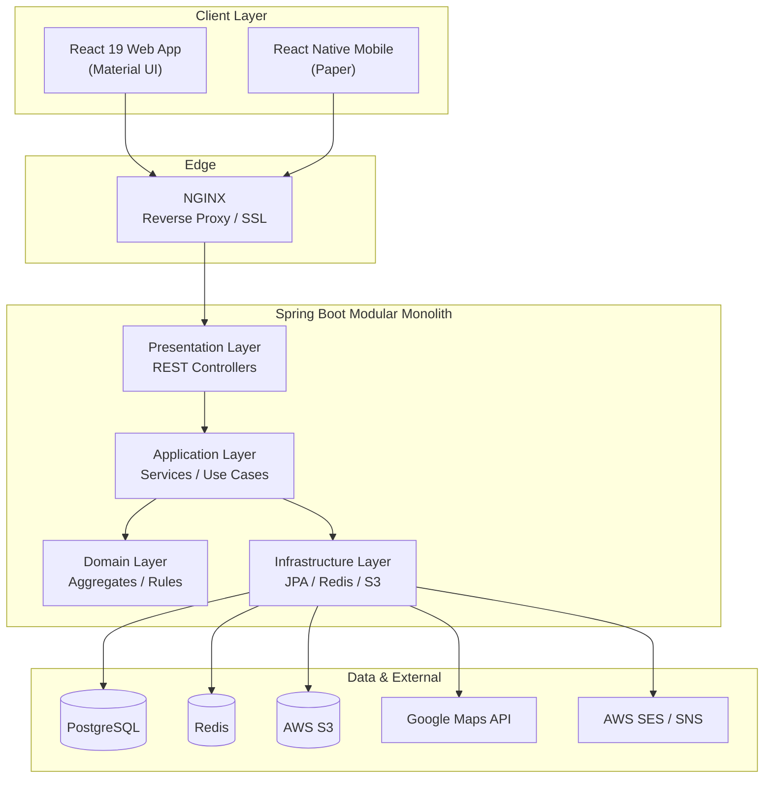
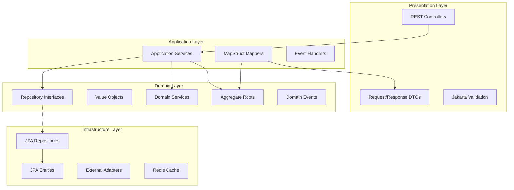
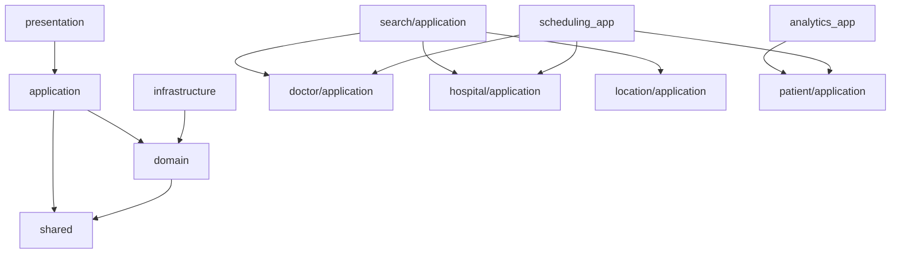
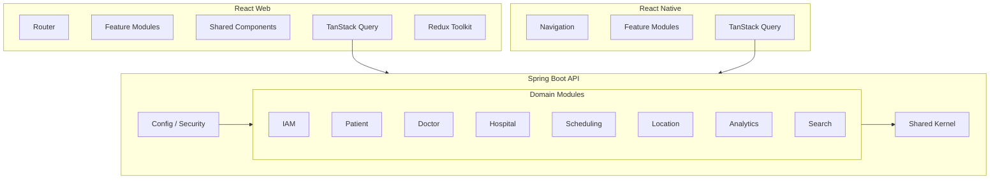

# DOC-11: Health360 AI — System Architecture Document

| Attribute | Value |
|-----------|-------|
| **Document ID** | DOC-11 |
| **Title** | System Architecture Document |
| **Version** | 1.0 |
| **Status** | **Approved** |
| **Date** | 2026-07-29 |
| **Author** | Chief Software Architect / Technical Lead |
| **References** | [DOC-04] NFR, [DOC-05] Domain Model, [DOC-07] REST API, [DOC-09] Validation, [DOC-10] UI/UX |
| **Next Document** | [DOC-12] Security Architecture |

---

## 1. Executive Summary

This document defines the **system architecture** for Health360 AI Phase 1 — a **Modular Monolith** implementing **Domain-Driven Design** and **Clean Architecture** across seven bounded contexts. It specifies repository layout, package structures for backend (Java 21 / Spring Boot 3) and frontends (React 19 / React Native), layer responsibilities, inter-module dependency rules, and cross-cutting concerns.

**Key ADRs Applied:** [ADR-001] Modular Monolith, [ADR-006] DDD + Clean Architecture, [ADR-007] MapStruct, [ADR-008] Dual Validation, [ADR-009] TanStack Query + Redux Toolkit

---

## 2. Architecture Overview

### 2.1 High-Level System Diagram



### 2.2 Architectural Style

| Aspect | Decision |
|--------|----------|
| Style | Modular Monolith [ADR-001] |
| Domain modeling | DDD — 7 bounded contexts [DOC-05] |
| Layering | Clean Architecture per module |
| Communication | In-process domain events; REST API to clients |
| Multi-tenancy | tenant_id column; TenantContext thread-local |
| Future path | Extract any module to microservice via bounded context boundary |

### 2.3 Clean Architecture Layers (Per Module)



**Dependency Rule:** Dependencies point inward. Domain has zero dependencies on outer layers.

---

## 3. Repository Layout (Monorepo)

```
health360-ai/
├── docs/                              # Architecture & requirements [DOC-00–16]
├── backend/
│   └── health360-api/                   # Spring Boot modular monolith
│       ├── pom.xml
│       └── src/
│           ├── main/java/com/health360/
│           └── test/java/com/health360/
├── frontend/
│   └── health360-web/                 # React 19 + TypeScript + MUI
│       ├── package.json
│       └── src/
├── mobile/
│   └── health360-mobile/              # React Native + TypeScript
│       ├── package.json
│       └── src/
├── docker/
│   ├── docker-compose.yml
│   ├── docker-compose.dev.yml
│   └── nginx/
│       └── nginx.conf
├── .github/
│   └── workflows/
│       ├── ci-backend.yml
│       ├── ci-frontend.yml
│       └── ci-mobile.yml
└── README.md
```

---

## 4. Backend Architecture (Spring Boot 3)

### 4.1 Root Package Structure

```
com.health360
├── Health360Application.java
├── config/                            # Cross-cutting Spring config
│   ├── SecurityConfig.java
│   ├── RedisConfig.java
│   ├── OpenApiConfig.java
│   ├── AsyncConfig.java
│   ├── JacksonConfig.java
│   └── TenantFilter.java
├── shared/
├── iam/
├── patient/
├── doctor/
├── hospital/
├── scheduling/
├── location/
└── analytics/
```

### 4.2 Module Internal Package Structure (Template)

Every bounded context module follows identical structure:

```
com.health360.{module}/
├── domain/
│   ├── model/                         # Aggregate roots, entities, value objects
│   │   ├── {Aggregate}.java
│   │   └── {ValueObject}.java
│   ├── event/                         # Domain events
│   │   └── {Event}.java
│   ├── repository/                    # Repository interfaces (ports)
│   │   └── {Aggregate}Repository.java
│   ├── service/                       # Domain services
│   │   └── {Domain}Service.java
│   └── exception/                     # Domain-specific exceptions
├── application/
│   ├── service/                       # Application services (use cases)
│   │   └── {UseCase}Service.java
│   ├── dto/                           # Application-level DTOs (optional)
│   ├── mapper/                        # MapStruct mappers
│   │   └── {Entity}Mapper.java
│   ├── validator/                     # Business rule validators (L3)
│   │   └── {Rule}Validator.java
│   └── eventhandler/                  # Domain event handlers
│       └── {Event}Handler.java
├── infrastructure/
│   ├── persistence/
│   │   ├── entity/                    # JPA entities (@Entity)
│   │   │   └── {Entity}Jpa.java
│   │   ├── repository/                # Spring Data JPA implementations
│   │   │   └── {Entity}JpaRepository.java
│   │   └── adapter/                   # Repository adapter (implements domain port)
│   │       └── {Aggregate}RepositoryAdapter.java
│   ├── cache/                         # Redis cache adapters
│   └── external/                      # External API clients (ACL)
│       └── GoogleMapsClient.java
└── presentation/
    ├── controller/                    # REST controllers
    │   └── {Resource}Controller.java
    ├── dto/                           # Request/Response DTOs
    │   ├── request/
    │   └── response/
    └── advice/                        # Module-specific exception handlers (if any)
```

### 4.3 Shared Kernel Package

```
com.health360.shared/
├── domain/
│   ├── BaseEntity.java                # id, tenantId, audit fields, version
│   ├── BaseDomainEvent.java
│   ├── valueobject/
│   │   ├── Address.java
│   │   ├── GeoCoordinate.java
│   │   ├── Money.java
│   │   └── WeeklySchedule.java
│   └── enums/                         # Shared enums
├── event/
│   ├── DomainEvent.java               # Interface
│   └── DomainEventPublisher.java
├── exception/
│   ├── BusinessException.java
│   ├── ResourceNotFoundException.java
│   ├── ValidationException.java
│   └── GlobalExceptionHandler.java    # @RestControllerAdvice
├── dto/
│   ├── ApiResponse.java
│   ├── PaginatedResponse.java
│   └── ErrorResponse.java
├── security/
│   ├── TenantContext.java             # ThreadLocal tenantId
│   └── CurrentUserContext.java
└── util/
    └── DateTimeUtils.java
```

### 4.4 Module-Specific Key Classes

#### IAM Module

```
iam/domain/model/User.java
iam/domain/model/Role.java
iam/domain/model/RefreshToken.java
iam/domain/repository/UserRepository.java
iam/domain/service/AuthenticationService.java
iam/domain/service/AuthorizationService.java
iam/application/service/UserRegistrationService.java
iam/application/service/AuditService.java
iam/infrastructure/persistence/entity/UserJpa.java
iam/infrastructure/persistence/adapter/UserRepositoryAdapter.java
iam/presentation/controller/AuthController.java
iam/presentation/controller/UserController.java
iam/presentation/controller/AdminUserController.java
```

#### Patient Module

```
patient/domain/model/PatientProfile.java
patient/domain/service/ProfileCompletionCalculator.java
patient/application/service/PatientProfileService.java
patient/application/service/HealthTimelineService.java
patient/presentation/controller/PatientProfileController.java
```

#### Analytics Module

```
analytics/domain/model/HealthMetricsSnapshot.java
analytics/domain/service/FormulaEngineService.java
analytics/domain/service/calculator/BmiCalculator.java
analytics/domain/service/calculator/BmrCalculator.java
analytics/domain/service/calculator/WellnessScoreCalculator.java
analytics/domain/service/calculator/HealthRiskScoreCalculator.java
analytics/application/service/HealthDashboardService.java
analytics/presentation/controller/HealthAnalyticsController.java
```

#### Scheduling Module

```
scheduling/domain/model/Appointment.java
scheduling/domain/model/TimeSlot.java
scheduling/domain/model/DoctorSchedule.java
scheduling/domain/service/BookingService.java
scheduling/application/service/SlotGenerationService.java
scheduling/application/validator/BookingValidator.java
scheduling/presentation/controller/AppointmentController.java
scheduling/presentation/controller/ScheduleController.java
```

### 4.5 Cross-Module Search Application Service

Search is not a bounded context — it lives in a read-optimized application layer:

```
com.health360.search/
├── application/
│   ├── DoctorSearchService.java       # Orchestrates doctor + location modules
│   ├── HospitalSearchService.java
│   └── UnifiedSearchService.java
└── presentation/
    └── controller/SearchController.java
```

**Dependency rule:** `search` may depend on `doctor`, `hospital`, `location` application services — never domain internals directly.

---

## 5. Layer Responsibilities

### 5.1 Presentation Layer

| Responsibility | Implementation |
|---------------|-----------------|
| HTTP handling | `@RestController`, `@RequestMapping("/api/v1/...")` |
| Input validation | `@Valid` on request DTOs [DOC-09 L2] |
| Authorization | `@PreAuthorize("hasAuthority('patient:profile:read')")` |
| Response wrapping | `ApiResponse<T>`, `PaginatedResponse<T>` |
| OpenAPI docs | `@Operation`, `@Tag` annotations |

**Example flow:**
```
AuthController.login(@Valid LoginRequest) 
  → AuthenticationService.login() 
  → ApiResponse<LoginResponse>
```

### 5.2 Application Layer (Service Layer)

| Responsibility | Implementation |
|---------------|-----------------|
| Use case orchestration | `@Service` application services |
| Transaction boundaries | `@Transactional` on service methods |
| DTO mapping | MapStruct mappers [ADR-007] |
| Business rule enforcement | Validator classes [DOC-09 L3] |
| Domain event publishing | Inject `DomainEventPublisher` |
| Cross-module coordination | Inject other modules' application services |

**Naming convention:** `{UseCase}Service` — e.g., `BookingService`, `PatientProfileService`

**Rules:**
- Application services NEVER expose JPA entities
- Application services coordinate aggregates; complex logic stays in domain services
- One application service method = one use case

### 5.3 Domain Layer

| Responsibility | Implementation |
|---------------|-----------------|
| Business logic | Methods on aggregate roots |
| Invariants | Enforced inside aggregate |
| Domain services | Stateless logic spanning aggregates |
| Repository ports | Interfaces only — no Spring annotations |
| Domain events | Published after state changes |

**Rules:**
- No Spring annotations in domain layer (except optional `@DomainEvents`)
- No JPA annotations in domain model
- Aggregates protect consistency boundaries [DOC-05 AB-001]

### 5.4 Infrastructure Layer (Repository Layer)

| Responsibility | Implementation |
|---------------|-----------------|
| Persistence | Spring Data JPA repositories |
| Repository adapters | Implement domain repository interfaces |
| Entity mapping | JPA entities ↔ domain models (in adapter) |
| External integrations | Google Maps, S3, SES clients |
| Caching | Redis `@Cacheable` or RedisTemplate |

**Pattern:**
```
Domain: PatientProfileRepository (interface)
  ↑ implements
Infrastructure: PatientProfileRepositoryAdapter
  ↓ uses
Infrastructure: PatientProfileJpaRepository extends JpaRepository
```

### 5.5 DTO Layer

| DTO Type | Location | Purpose |
|----------|----------|---------|
| Request DTOs | `{module}.presentation.dto.request` | API input contracts |
| Response DTOs | `{module}.presentation.dto.response` | API output contracts |
| Application DTOs | `{module}.application.dto` | Internal transfer (rare) |

**Rules [ADR-007]:**
- Never expose domain entities or JPA entities via REST
- MapStruct `@Mapper(componentModel = "spring")` for all conversions
- Request DTOs carry Jakarta validation annotations

### 5.6 Mapper Layer (MapStruct)

```
@Mapper(componentModel = "spring", uses = {DateTimeUtils.class})
public interface PatientProfileMapper {
    BasicInfoResponse toBasicInfoResponse(PatientProfile profile);
    PatientProfile toDomain(BasicInfoRequest request);
    PatientProfileJpa toJpa(PatientProfile domain);
    PatientProfile toDomain(PatientProfileJpa jpa);
}
```

| Mapping | Mapper |
|---------|--------|
| Domain ↔ JPA Entity | `{Module}PersistenceMapper` |
| Domain ↔ Response DTO | `{Module}ResponseMapper` |
| Request DTO ↔ Domain | `{Module}RequestMapper` |

### 5.7 Validation Layer

| Layer | Location | Technology |
|-------|----------|------------|
| L2 — DTO | Request DTO annotations | Jakarta `@NotNull`, `@Size`, `@Pattern`, custom validators |
| L3 — Business | `{module}.application.validator` | Java validator classes |
| L3 — Domain | Aggregate methods | Domain invariant checks throw `BusinessException` |

**Custom validators:** `@MinAge`, `@IndianPincode`, `@UniqueRegistration` in `com.health360.shared.validation`

---

## 6. Security Layer Architecture

> Full detail in [DOC-12]. Summary here for integration.

```
com.health360.config/
├── SecurityConfig.java                # SecurityFilterChain, CORS, CSRF
├── JwtAuthenticationFilter.java       # Bearer token validation
├── JwtTokenProvider.java              # RS256 sign/verify
└── TenantFilter.java                  # Extract tenant from JWT/header

com.health360.iam.infrastructure.security/
├── CustomUserDetailsService.java
├── PasswordEncoder (BCrypt strength 12)
└── RefreshTokenService.java           # Redis-backed
```

**Filter chain order:**
1. TenantFilter
2. JwtAuthenticationFilter
3. UsernamePasswordAuthenticationFilter (login endpoint only)

**Method security:** `@EnableMethodSecurity` + `@PreAuthorize` on controllers/services

---

## 7. Module Dependency Rules

### 7.1 Allowed Dependencies



### 7.2 Forbidden Dependencies

| Rule | Rationale |
|------|-----------|
| domain → application/infrastructure/presentation | Clean Architecture violation |
| module A domain → module B domain | Use application services or events |
| infrastructure → presentation | Skip layers |
| Circular module dependencies | [NFR-MAINT-004] |

### 7.3 Inter-Module Communication

| Mechanism | When |
|-----------|------|
| Application service injection | Synchronous read/query across modules |
| Domain events (in-process) | Side effects: notifications, analytics recalc, timeline |
| Shared ID references only | Cross-aggregate links (UUID, not object refs) |

---

## 8. Frontend Architecture (React 19 Web)

### 8.1 Folder Structure

```
frontend/health360-web/src/
├── app/
│   ├── App.tsx
│   ├── router.tsx                     # React Router v6 routes
│   └── providers.tsx                  # QueryClient, Redux, Theme, Auth
├── features/                          # Feature-based modules (mirror backend domains)
│   ├── auth/
│   │   ├── components/
│   │   ├── pages/
│   │   │   ├── LoginPage.tsx
│   │   │   └── RegisterPage.tsx
│   │   ├── hooks/
│   │   │   └── useAuth.ts
│   │   ├── api/
│   │   │   └── authApi.ts
│   │   ├── schemas/
│   │   │   └── auth.schema.ts         # Zod schemas [DOC-09]
│   │   └── store/
│   │       └── authSlice.ts           # Redux Toolkit
│   ├── patient/
│   │   ├── components/
│   │   │   ├── MetricCard.tsx
│   │   │   ├── ProfileSectionCard.tsx
│   │   │   └── VitalsForm.tsx
│   │   ├── pages/
│   │   │   ├── DashboardPage.tsx
│   │   │   ├── ProfileHubPage.tsx
│   │   │   └── BookAppointmentPage.tsx
│   │   ├── hooks/
│   │   │   ├── usePatientProfile.ts
│   │   │   └── useHealthDashboard.ts
│   │   ├── api/
│   │   │   └── patientApi.ts
│   │   └── schemas/
│   │       └── patient.schema.ts
│   ├── doctor/
│   ├── hospital/
│   ├── scheduling/
│   ├── search/
│   ├── analytics/
│   └── admin/
├── shared/
│   ├── components/                    # Design system components
│   │   ├── Layout/
│   │   │   ├── AppShell.tsx
│   │   │   ├── Sidebar.tsx
│   │   │   └── Header.tsx
│   │   ├── EmptyState.tsx
│   │   ├── SkeletonLoader.tsx
│   │   ├── ClassificationBadge.tsx
│   │   └── DisclaimerBanner.tsx
│   ├── hooks/
│   │   └── usePagination.ts
│   ├── api/
│   │   ├── axiosClient.ts             # Axios instance + interceptors
│   │   └── queryClient.ts             # TanStack Query config
│   ├── types/
│   │   └── api.types.ts
│   └── utils/
│       └── formatters.ts
├── assets/
├── theme/
│   └── muiTheme.ts                    # MUI theme [DOC-10 §2.1]
└── main.tsx
```

### 8.2 React Architecture Patterns

| Concern | Technology | Pattern |
|---------|-----------|---------|
| Server state | TanStack Query v5 | `useQuery`, `useMutation` per feature hook |
| Client/global state | Redux Toolkit | Auth session, UI preferences, tenant |
| Forms | React Hook Form + Zod | `zodResolver` [ADR-008] |
| Routing | React Router v6 | Role-based route guards |
| UI components | Material UI 6 | ThemeProvider, custom overrides |
| API calls | Axios | Interceptors: JWT attach, refresh, error normalize |

**Example hook pattern:**
```typescript
// features/patient/hooks/useHealthDashboard.ts
export function useHealthDashboard() {
  return useQuery({
    queryKey: ['healthDashboard'],
    queryFn: () => analyticsApi.getDashboard(),
    staleTime: 5 * 60 * 1000,
  });
}
```

### 8.3 Route Guard Structure

```
router.tsx
├── PublicRoutes (/)
├── PatientRoutes (/patient/*) — requireRole('PATIENT')
├── DoctorRoutes (/doctor/*) — requireRole('DOCTOR')
├── HospitalRoutes (/hospital/*) — requireRole('HOSPITAL_ADMIN')
└── AdminRoutes (/admin/*) — requireRole('PLATFORM_ADMIN')
```

---

## 9. Mobile Architecture (React Native)

### 9.1 Folder Structure

```
mobile/health360-mobile/src/
├── app/
│   ├── App.tsx
│   └── navigation/
│       ├── RootNavigator.tsx
│       ├── PatientTabNavigator.tsx
│       └── AuthStack.tsx
├── features/                          # Same feature modules as web
│   ├── auth/
│   ├── patient/
│   ├── search/
│   └── scheduling/
├── shared/
│   ├── components/
│   ├── api/                           # Shared axios client (same API as web)
│   ├── hooks/
│   └── theme/
│       └── paperTheme.ts
└── main.tsx
```

### 9.2 Mobile Patterns

| Concern | Technology |
|---------|-----------|
| Navigation | React Navigation 6 (stack + bottom tabs) |
| UI | React Native Paper |
| Server state | TanStack Query (shared hooks where possible) |
| Forms | React Hook Form + Zod |
| Location | react-native-geolocation-service |
| Maps | react-native-maps + Google Maps SDK |

**Code sharing strategy:** Shared `types/`, `schemas/`, and `api/` packages extracted to `shared/` npm workspace (Phase 1 optional; duplicate with sync in Phase 1 MVP).

---

## 10. Domain Events Architecture

### 10.1 Event Flow (Phase 1)

```
Aggregate.method() 
  → domainEventPublisher.publish(new ProfileUpdated(...))
  → Spring ApplicationEventPublisher
  → @EventListener / @TransactionalEventListener
  → EventHandler in target module
```

### 10.2 Key Event Handlers

| Event | Publisher | Handler Module | Action |
|-------|-----------|---------------|--------|
| ProfileSectionUpdated | patient | analytics | Recalculate metrics |
| VitalsRecorded | patient | analytics | Recalculate BP classification |
| AppointmentBooked | scheduling | iam | Send notification |
| AppointmentBooked | scheduling | patient | Add timeline event |
| AppointmentCompleted | scheduling | patient | Prompt review |
| DoctorVerified | doctor | search | Invalidate search cache |
| UserRegistered | iam | patient/doctor | Create empty profile |

### 10.3 Outbox Pattern (Future-Ready)

[DOC-06] `shared.domain_event_outbox` table written in same transaction as aggregate save; background job publishes to SNS/Kafka when modules extract.

---

## 11. Caching Architecture

| Cache Key Pattern | TTL | Invalidation |
|-------------------|-----|-------------|
| `metrics:{tenantId}:{patientId}` | 5 min | Profile update event |
| `geo:{origin}:{dest}` | 1 hour | None |
| `search:doctors:{hash}` | 2 min | DoctorVerified event |
| `refresh_token:{hash}` | 7 days | Logout / rotation |
| `jwt_blacklist:{jti}` | 15 min | Logout |

**Implementation:** Redis via Spring Cache abstraction + manual RedisTemplate for token management.

---

## 12. Error Handling Architecture

```
Controller throws BusinessException
  → GlobalExceptionHandler (@RestControllerAdvice in shared)
  → ErrorResponse { code, message, details[], correlationId }
  → HTTP status mapped [DOC-07 §3]
```

| Exception Type | HTTP Status |
|---------------|-------------|
| ValidationException | 400 |
| ResourceNotFoundException | 404 |
| BusinessException (conflict) | 409 |
| AccessDeniedException | 403 |
| AuthenticationException | 401 |

**Correlation ID:** `X-Correlation-Id` header propagated through MDC logging [NFR-MAINT-008]

---

## 13. Component Diagram



---

## 14. Technology Stack Summary

| Layer | Technology | Version |
|-------|-----------|---------|
| Backend runtime | Java | 21 |
| Backend framework | Spring Boot | 3.3+ |
| ORM | Hibernate / Spring Data JPA | 6.x |
| DTO mapping | MapStruct | 1.5+ |
| Boilerplate | Lombok | 1.18+ |
| Database | PostgreSQL | 16+ |
| Cache | Redis | 7+ |
| Web frontend | React + TypeScript | 19 |
| UI library | Material UI | 6 |
| Mobile | React Native + TypeScript | 0.76+ |
| State (server) | TanStack Query | 5 |
| State (client) | Redux Toolkit | 2 |
| Forms | React Hook Form + Zod | 7 / 3 |
| API docs | springdoc-openapi | 2.x |
| Proxy | NGINX | 1.25+ |
| Container | Docker + Compose | 24+ |

---

## 15. Requirements Traceability

| Architecture Element | ADR / NFR | DOC Reference |
|---------------------|-----------|---------------|
| Modular monolith | ADR-001 | DOC-05 |
| Clean Architecture layers | ADR-006 | DOC-05 |
| MapStruct mappers | ADR-007 | §5.6 |
| Dual validation | ADR-008 | DOC-09 |
| TanStack Query + Redux | ADR-009 | §8.2 |
| Module extraction readiness | NFR-SCAL-012 | §7 |
| Zero circular deps | NFR-MAINT-004 | §7.2 |

---

## 16. Approval

| Role | Name | Signature | Date | Status |
|------|------|-----------|------|--------|
| Product Owner | _________________ | _________________ | ________ | Pending |
| Technical Lead / Architect | _________________ | _________________ | ________ | Pending |
| Engineering Lead | _________________ | _________________ | ________ | Pending |
| DevOps Lead | _________________ | _________________ | ________ | Pending |

---

*End of DOC-11 — System Architecture Document v1.0*
