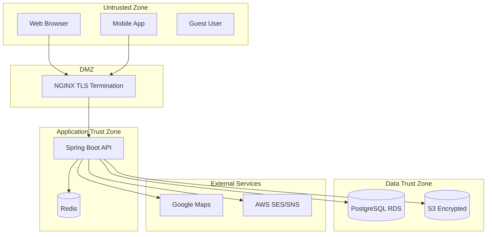
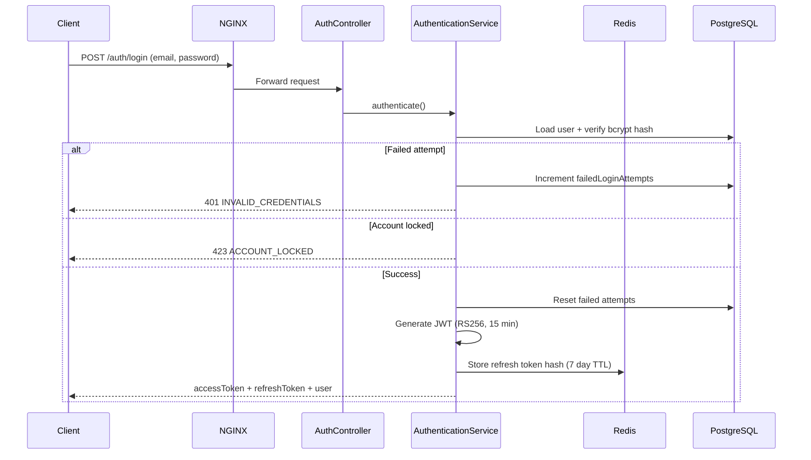
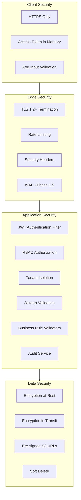

# DOC-12: Health360 AI — Security Architecture

| Attribute | Value |
|-----------|-------|
| **Document ID** | DOC-12 |
| **Title** | Security Architecture |
| **Version** | 1.0 |
| **Status** | **Approved** |
| **Date** | 2026-07-29 |
| **Author** | Security Architect / Technical Lead |
| **References** | [DOC-04] NFR, [DOC-07] REST API, [DOC-09] Validation, [DOC-11] System Architecture |
| **Next Document** | [DOC-13] DevOps & Deployment Architecture |

---

## 1. Executive Summary

This document defines the **security architecture** for Health360 AI Phase 1 — a healthcare SaaS platform handling sensitive personal and health data. It specifies authentication, authorization, encryption, data protection, threat mitigations, audit controls, and compliance alignment with [NFR-SEC-001–054] and [DOC-02 §10].

**Security Posture Goal:** Defense-in-depth with zero trust between layers; HIPAA-ready architecture [ASM-009]; DPDP Act 2023 alignment for India launch.

---

## 2. Security Principles

| Principle | Application |
|-----------|-------------|
| **Least Privilege** | RBAC with fine-grained permissions; doctor patient access time-boxed [BR-AUTH-007] |
| **Defense in Depth** | NGINX → JWT → RBAC → tenant isolation → audit |
| **Fail Secure** | Auth failures deny access; no fallback to anonymous on protected routes |
| **Zero Trust (internal)** | Every API call validated; no implicit trust between modules |
| **Privacy by Design** | Consent before health data; soft delete; encryption at rest/transit |
| **Audit Everything** | All mutations and sensitive reads logged immutably |
| **Secure Defaults** | Verified doctors only in search; account lockout enabled; HTTPS enforced |

---

## 3. Threat Model

### 3.1 STRIDE Analysis

| Threat | Category | Risk | Mitigation |
|--------|----------|------|------------|
| Stolen JWT | Spoofing | High | Short TTL (15 min), RS256, refresh rotation, JTI blacklist |
| Credential stuffing | Spoofing | High | Account lockout [BR-AUTH-005], rate limiting, bcrypt |
| IDOR on patient data | Tampering/Elevation | Critical | RBAC + ownership checks + tenant_id filtering |
| Doctor accessing patient data without appointment | Elevation | Critical | [BR-AUTH-007] appointment window validation |
| SQL injection | Tampering | High | Parameterized JPA queries [NFR-SEC-031] |
| XSS in health profile | Tampering | Medium | React escaping, CSP, input validation |
| Double-booking race condition | Repudiation | Medium | Pessimistic lock + audit trail |
| Health document URL sharing | Information Disclosure | High | Pre-signed URLs, 15 min expiry, tenant-scoped |
| Audit log tampering | Repudiation | High | Append-only table, no DELETE API |
| Tenant data leakage | Information Disclosure | Critical | tenant_id on all queries; TenantContext filter |
| MITM on API | Information Disclosure | High | TLS 1.2+, HSTS |
| Insider admin abuse | Elevation | Medium | Admin audit logging, separate permissions |

### 3.2 Trust Boundaries



---

## 4. Authentication Architecture

### 4.1 Authentication Flow



### 4.2 JWT Specification [NFR-SEC-008]

| Claim | Value |
|-------|-------|
| Algorithm | RS256 (RSA 2048-bit key pair) |
| Issuer | `health360.ai` |
| Audience | `health360-api` |
| Access token TTL | 900 seconds (15 min) |
| Refresh token | Opaque UUID; stored as SHA-256 hash in Redis |

**Access Token Payload:**

```json
{
  "sub": "user-uuid",
  "tenantId": "tenant-uuid",
  "email": "user@example.com",
  "roles": ["PATIENT"],
  "permissions": ["patient:profile:read", "patient:profile:write"],
  "jti": "unique-token-id",
  "iat": 1722236400,
  "exp": 1722237300
}
```

**Key Management:**
- Private key: AWS Secrets Manager; loaded at startup
- Public key: Available for verification; rotation via key ID (`kid` header)
- Key rotation: Quarterly; support 2 active keys during transition

### 4.3 Refresh Token Flow [NFR-SEC-003, BR-AUTH-003]

1. Client sends refresh token to `POST /auth/refresh`
2. Server hashes token, looks up in Redis
3. If valid and not revoked: invalidate old hash, issue new access + refresh pair
4. If token reused (already rotated): revoke all tokens for user → force re-login (token theft detection)

### 4.4 Logout [NFR-SEC-010]

1. Delete refresh token from Redis
2. Add access token `jti` to Redis blacklist (TTL = remaining token life)
3. JwtAuthenticationFilter checks blacklist on every request

### 4.5 Password Security [NFR-SEC-004, BR-AUTH-004]

| Control | Specification |
|---------|--------------|
| Hashing | BCrypt, strength factor 12 |
| Complexity | Min 8 chars; upper + lower + digit + special |
| Storage | `password_hash` column only; never logged or returned |
| Change | Invalidates all refresh tokens [FR-IAM-006] |
| Reset | Phase 1.5 — email-based reset flow |

### 4.6 Account Lockout [NFR-SEC-006, BR-AUTH-005]

| Parameter | Value |
|-----------|-------|
| Max failed attempts | 5 |
| Lockout duration | 30 minutes |
| Counter reset | On successful login |
| Storage | `failed_login_attempts`, `locked_until` on iam.users |

### 4.7 Email Verification [BR-AUTH-001]

- User status `PENDING_VERIFICATION` until email verified
- JwtAuthenticationFilter blocks protected endpoints except allowlist
- Verification token: single-use, SHA-256 hash stored, 24-hour expiry

---

## 5. Authorization Architecture (RBAC)

### 5.1 Role Definitions

| Role | Code | Description |
|------|------|-------------|
| Patient | PATIENT | Health profile owner; booking; dashboard |
| Doctor | DOCTOR | Professional profile; schedule; limited patient view |
| Hospital Admin | HOSPITAL_ADMIN | Hospital profile management |
| Platform Admin | PLATFORM_ADMIN | Full platform administration |

### 5.2 Permission Model

**Format:** `{resource}:{action}` — e.g., `patient:profile:read`

| Resource | Actions |
|----------|---------|
| patient:profile | read, write |
| patient:summary | read (doctor only) |
| doctor:profile | read, write |
| hospital:profile | read, write |
| schedule | read, write |
| appointment | book, view:own, update:status |
| dashboard | view |
| review | create |
| admin:user | read, write |
| admin:doctor | verify |
| admin:audit | read |
| admin:review | moderate |
| search | * (public read) |

### 5.3 Role-Permission Matrix

| Permission | PATIENT | DOCTOR | HOSPITAL_ADMIN | PLATFORM_ADMIN |
|------------|---------|--------|----------------|----------------|
| patient:profile:read | ✅ own | ❌ | ❌ | ✅ |
| patient:profile:write | ✅ own | ❌ | ❌ | ❌ |
| patient:summary:read | ❌ | ✅ window | ❌ | ✅ |
| doctor:profile:write | ❌ | ✅ own | ❌ | ✅ |
| hospital:profile:write | ❌ | ❌ | ✅ own | ✅ |
| schedule:write | ❌ | ✅ own | ❌ | ✅ |
| appointment:book | ✅ | ❌ | ❌ | ❌ |
| appointment:view:own | ✅ | ✅ own | ❌ | ✅ |
| dashboard:view | ✅ | ❌ | ❌ | ✅ |
| admin:* | ❌ | ❌ | ❌ | ✅ |

### 5.4 Enforcement Points

| Layer | Mechanism |
|-------|-----------|
| HTTP | `@PreAuthorize("hasAuthority('patient:profile:read')")` on controllers |
| Service | Additional ownership checks (`userId == resource.ownerId`) |
| Repository | `tenant_id` filter on all queries via `@Filter` or specification |
| Doctor-patient | `PatientSummaryService` validates appointment window [BR-AUTH-007] |

### 5.5 Public Endpoints (No Auth)

| Path Pattern | Rate Limit |
|-------------|------------|
| `/api/v1/auth/register` | 5/hour/IP |
| `/api/v1/auth/login` | 10/min/IP |
| `/api/v1/auth/verify-email` | 10/min/IP |
| `/api/v1/search/**` | 60/min/IP |
| `/api/v1/doctors/{id}/public` | 60/min/IP |
| `/api/v1/hospitals/{id}/public` | 60/min/IP |
| `/swagger-ui/**` | Disabled in production |

---

## 6. Multi-Tenant Security [ASM-010]

| Control | Implementation |
|---------|---------------|
| Tenant ID in JWT | `tenantId` claim extracted by TenantFilter |
| Thread-local context | `TenantContext.setCurrentTenantId()` |
| Query isolation | All JPA queries include `WHERE tenant_id = :tenantId` |
| Cross-tenant access | Impossible by design; 404 returned (not 403, to avoid leaking existence) |
| Default tenant | Single default tenant for Phase 1 MVP [OQ-001] |
| Admin cross-tenant | Platform Admin operates within tenant scope in Phase 1 |

---

## 7. Data Protection

### 7.1 Encryption in Transit [NFR-SEC-020]

| Channel | Protocol |
|---------|----------|
| Client → NGINX | TLS 1.2+ (TLS 1.3 preferred) |
| NGINX → API | HTTP internal (Docker network) or TLS |
| API → RDS | TLS enforced (sslmode=require) |
| API → Redis | TLS (ElastiCache in-transit encryption) |
| API → S3 | HTTPS |
| HSTS | `Strict-Transport-Security: max-age=31536000; includeSubDomains` |

### 7.2 Encryption at Rest [NFR-SEC-021–023]

| Store | Method |
|-------|--------|
| PostgreSQL (RDS) | AWS RDS AES-256 encryption |
| S3 (health documents) | SSE-S3 or SSE-KMS |
| Redis (ElastiCache) | At-rest + in-transit encryption |
| Backups | Encrypted snapshots (RDS automated) |
| JWT keys | AWS Secrets Manager |

### 7.3 Sensitive Data Classification

| Classification | Examples | Controls |
|---------------|----------|----------|
| **Critical** | password_hash, refresh tokens, JWT private key | Never logged; Secrets Manager; hash only |
| **Sensitive (Health)** | Patient profile, vitals, lab values, documents | RBAC, audit, encryption, consent |
| **PII** | Name, email, phone, address | RBAC, encryption, soft delete |
| **Public** | Doctor public profile, hospital public profile | Verified-only for doctors |
| **Internal** | Audit logs, system config | Admin-only access |

### 7.4 Health Document Security [NFR-SEC-026]

1. Upload: authenticated patient → S3 bucket with tenant-scoped path: `{tenantId}/patients/{patientId}/{uuid}`
2. Download: API generates pre-signed GET URL (15 min expiry)
3. No direct S3 public access; bucket policy denies public reads
4. MIME type validated server-side (magic bytes, not just extension)

### 7.5 Logging Security [NFR-SEC-024]

**Never log:** passwords, tokens (access/refresh), password hashes, full health records, document contents

**Safe to log:** userId, action, entityType, entityId, correlationId, IP, timestamp

**PII in logs (dev/staging):** Masked per [NFR-SEC-025] — email → `p***@example.com`

---

## 8. OWASP Top 10 Mitigations [NFR-SEC-030]

| OWASP 2021 | Risk | Mitigation |
|------------|------|------------|
| A01 Broken Access Control | Critical | RBAC + ownership + tenant isolation + [BR-AUTH-007] |
| A02 Cryptographic Failures | Critical | TLS, AES-256 at rest, bcrypt, RS256 JWT |
| A03 Injection | Critical | JPA parameterized queries; input validation [DOC-09] |
| A04 Insecure Design | High | Threat model, DDD boundaries, booking atomicity |
| A05 Security Misconfiguration | High | Security headers, disable Swagger prod, Secrets Manager |
| A06 Vulnerable Components | High | Dependabot/Snyk CI scan [NFR-SEC-040] |
| A07 Auth Failures | Critical | Lockout, JWT rotation, refresh token hashing |
| A08 Data Integrity Failures | High | JWT signatures, HTTPS, audit logs |
| A09 Logging Failures | Medium | Structured JSON logs, audit trail, correlation ID |
| A10 SSRF | Medium | Google Maps API calls server-side only; URL whitelist |

---

## 9. Application Security Controls

### 9.1 Security Headers [NFR-SEC-039]

Set by NGINX and/or Spring Security:

```
Strict-Transport-Security: max-age=31536000; includeSubDomains
X-Content-Type-Options: nosniff
X-Frame-Options: DENY
Content-Security-Policy: default-src 'self'; script-src 'self'; style-src 'self' 'unsafe-inline'
Referrer-Policy: strict-origin-when-cross-origin
Permissions-Policy: geolocation=(self), camera=(), microphone=()
Cache-Control: no-store (for API responses)
```

### 9.2 CORS [NFR-SEC-038]

```java
// Allowed origins (environment-specific)
https://app.health360.ai
https://staging.health360.ai
http://localhost:5173  // dev only
```

- Methods: GET, POST, PUT, PATCH, DELETE, OPTIONS
- Headers: Authorization, Content-Type, X-Tenant-Id, X-Correlation-Id
- Credentials: true (for refresh token cookie if used)

### 9.3 Rate Limiting [NFR-SEC-034–036]

| Endpoint Group | Limit | Implementation |
|---------------|-------|---------------|
| Login | 10/min/IP | NGINX `limit_req` + Redis counter |
| Register | 5/hour/IP | NGINX + Redis |
| Public search | 60/min/IP | NGINX |
| Authenticated API | 300/min/user | Redis token bucket |
| File upload | 10/min/user | Application-level |

### 9.4 Request Size Limits [NFR-SEC-037]

| Limit | Value | Enforced By |
|-------|-------|-------------|
| JSON body | 1 MB | Spring `spring.servlet.multipart.max-request-size` |
| File upload | 10 MB | Application + NGINX `client_max_body_size` |

### 9.5 CSRF [NFR-SEC-033]

- Stateless JWT API: CSRF disabled for `/api/**`
- If refresh token stored in cookie: `SameSite=Strict`, `HttpOnly`, `Secure`

---

## 10. Audit & Monitoring

### 10.1 Audit Log Architecture [NFR-SEC-050–053]

| Event Category | Examples | Retention |
|---------------|----------|-----------|
| Authentication | LOGIN, LOGOUT, FAILED_LOGIN, PASSWORD_CHANGE | 7 years |
| Authorization | PERMISSION_DENIED, ROLE_ASSIGNED | 7 years |
| Data mutation | PROFILE_UPDATED, APPOINTMENT_BOOKED, DOCUMENT_UPLOADED | 7 years |
| Sensitive read | PATIENT_SUMMARY_VIEWED (doctor) | 7 years |
| Admin actions | DOCTOR_VERIFIED, USER_DEACTIVATED, REVIEW_MODERATED | 7 years |

**Immutability:** No UPDATE/DELETE on `shared.audit_logs`; append-only INSERT.

### 10.2 Security Monitoring [NFR-SEC-054]

| Alert | Condition | Channel |
|-------|-----------|---------|
| Brute force | >50 failed logins in 5 min | Slack/PagerDuty |
| Token reuse detected | Refresh token rotation violation | Slack + auto-revoke all user tokens |
| Unauthorized access spike | >20 403s in 1 min from same IP | Slack |
| Admin action | Any admin:verify or user deactivation | Slack audit channel |
| Error rate | 5xx > 1% for 5 min | PagerDuty |

---

## 11. Compliance Alignment

| Regulation | Phase 1 Control |
|------------|----------------|
| **DPDP Act 2023 (India)** | Consent [BR-PAT-008], right to access/update/delete, data minimization |
| **HIPAA (US — ready)** | Encryption, audit, access controls, BAAs with AWS [ASM-009] |
| **Medical disclaimers** | Formula engine outputs [BR-ANL-001] |
| **Data residency** | AWS ap-south-1 (Mumbai) [NFR-COMP-010] |

### 11.1 Data Subject Rights

| Right | Implementation |
|-------|---------------|
| Access | Patient profile self-service read |
| Correction | Profile section updates |
| Erasure | Account deactivation + soft delete; hard purge on request |
| Consent withdrawal | Account deactivation flow |
| Portability | Health report PDF export [FR-ANL-008] |

---

## 12. Security Testing Strategy [NFR-SEC-040–042]

| Activity | Tool | Frequency | Gate |
|----------|------|-----------|------|
| Dependency scan | Snyk / Dependabot | Every PR | Block critical/high CVEs |
| SAST | SonarQube | Every PR | Block critical issues |
| DAST | OWASP ZAP / external pen test | Pre-launch | Zero critical findings |
| Auth testing | Custom integration tests | CI | Token expiry, lockout, RBAC |
| IDOR testing | Manual + automated | Pre-launch | All ownership checks verified |

---

## 13. Incident Response (Baseline)

| Phase | Action |
|-------|--------|
| **Detect** | CloudWatch alarms, security alerts |
| **Contain** | Revoke tokens, block IP, disable account |
| **Investigate** | Audit log analysis, correlation ID tracing |
| **Notify** | DPDP breach notification within 72 hours if personal data breach |
| **Recover** | Key rotation, password reset, patch deployment |
| **Review** | Post-incident report within 5 business days |

---

## 14. Security Architecture Diagram



---

## 15. Requirements Traceability

| Security Control | NFR | BR | FR |
|-----------------|-----|-----|-----|
| JWT RS256 | NFR-SEC-008 | BR-AUTH-002 | FR-IAM-003 |
| Refresh rotation | NFR-SEC-003 | BR-AUTH-003 | FR-IAM-004 |
| Account lockout | NFR-SEC-006 | BR-AUTH-005 | FR-IAM-003 |
| RBAC | NFR-SEC-005 | — | FR-IAM-007 |
| Doctor data window | — | BR-AUTH-007 | FR-PAT-015 |
| Audit logging | NFR-SEC-050 | — | FR-IAM-010 |
| Pre-signed URLs | NFR-SEC-026 | BR-PAT-005 | FR-PAT-012 |
| Tenant isolation | — | ASM-010 | — |

---

## 16. Approval

| Role | Name | Signature | Date | Status |
|------|------|-----------|------|--------|
| Product Owner | _________________ | _________________ | ________ | Pending |
| Security Architect | _________________ | _________________ | ________ | Pending |
| Technical Lead / Architect | _________________ | _________________ | ________ | Pending |
| Compliance Officer | _________________ | _________________ | ________ | Pending |

---

*End of DOC-12 — Security Architecture v1.0*
