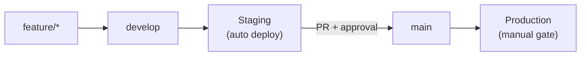
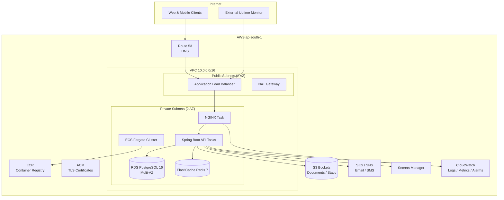

# DOC-13: Health360 AI — DevOps & Deployment Architecture

| Attribute | Value |
|-----------|-------|
| **Document ID** | DOC-13 |
| **Title** | DevOps & Deployment Architecture |
| **Version** | 1.0 |
| **Status** | **Approved** |
| **Date** | 2026-07-29 |
| **Author** | DevOps Lead / Technical Lead |
| **References** | [DOC-04] NFR, [DOC-11] System Architecture, [DOC-12] Security Architecture |
| **Next Document** | [DOC-14] User Stories & Acceptance Criteria |

---

## 1. Executive Summary

This document defines the **DevOps and deployment architecture** for Health360 AI Phase 1. It specifies containerization, local development, AWS infrastructure, CI/CD pipelines, observability, backup/disaster recovery, and operational runbooks aligned with [NFR-OPS-001–018], [NFR-AVAIL-001–011], and [DOC-12] security controls.

**Deployment Goal:** Reproducible, secure, auditable deployments from developer laptop to production with automated staging releases, manual production gates, and ≤ 10-minute rollback capability.

**Primary Region:** AWS **ap-south-1 (Mumbai)** [NFR-COMP-010] [NFR-ASM-001]

**IaC Decision:** **Terraform** [OQ-NFR-003] — chosen for multi-service composition, mature AWS provider, and team familiarity.

---

## 2. DevOps Principles

| Principle | Application |
|-----------|-------------|
| **Everything as Code** | Dockerfiles, Terraform, GitHub Actions workflows, NGINX config in repo |
| **Immutable Infrastructure** | Deploy new container images; no SSH patching of running instances |
| **Shift Left** | Unit/integration tests, SAST, dependency scan in CI before deploy |
| **Environment Parity** | Same container images from staging to production; config via secrets/env |
| **Least Privilege (Ops)** | IAM roles per service; no long-lived AWS keys in CI |
| **Observable by Default** | Structured logs, metrics, traces, health endpoints on every deploy |
| **Safe Releases** | Staging auto-deploy; production manual approval; documented rollback |
| **Secrets Never in Git** | AWS Secrets Manager + GitHub encrypted secrets only [NFR-OPS-017] |

---

## 3. Environment Strategy

### 3.1 Environment Matrix

| Environment | Purpose | URL Pattern | Deploy Trigger | Data |
|-------------|---------|-------------|----------------|------|
| **Local (dev)** | Developer workstation | `localhost:3000` / `:8080` | Manual (`docker-compose up`) | Synthetic / seed data |
| **Development (shared)** | Integration testing | `dev.health360.ai` | Push to feature branches (optional preview) | Anonymized fixtures |
| **Staging** | Pre-production QA, UAT | `staging.health360.ai` | Auto on merge to `develop` [NFR-OPS-003] | Production-like anonymized |
| **Production** | Live users | `app.health360.ai` | Manual approval on `main` [NFR-OPS-004] | Real PHI/PII |

### 3.2 Branching & Promotion Flow



| Branch | Protection Rules |
|--------|------------------|
| `main` | Require PR, 2 approvals, passing CI, no direct push |
| `develop` | Require PR, 1 approval, passing CI |
| `feature/*` | CI must pass before merge |

### 3.3 Configuration Management

| Config Type | Storage | Examples |
|-------------|---------|----------|
| Non-secret defaults | `application-{profile}.yml` in repo | Server port, feature flags (defaults off) |
| Environment secrets | AWS Secrets Manager | DB password, JWT keys, API keys |
| CI secrets | GitHub Actions Secrets | AWS role ARN, Sentry DSN |
| Frontend public config | Build-time env (`VITE_*`) | API base URL, Google Maps key (restricted) |

---

## 4. AWS Production Architecture

### 4.1 Target Architecture (Phase 1 — Single Region)



### 4.2 Service Sizing (Phase 1 MVP Baseline)

| Component | Specification | Rationale |
|-----------|---------------|-----------|
| **ECS Fargate — API** | 2 tasks × 1 vCPU / 2 GB RAM | HA across AZs; meets [NFR-PERF-001] |
| **ECS Fargate — NGINX** | 2 tasks × 0.25 vCPU / 512 MB | SSL termination, static assets |
| **RDS PostgreSQL** | db.r6g.large, Multi-AZ, 100 GB gp3 | [NFR-AVAIL-004] RPO; 52 tables [DOC-06] |
| **ElastiCache Redis** | cache.r6g.large, 2 nodes | Session, refresh tokens, cache [ADR-003] |
| **ALB** | Application Load Balancer | Health checks, TLS, path routing |
| **S3** | 2 buckets (documents, static web) | Versioning enabled on documents bucket |

> **Scale Path:** Horizontal scaling via ECS service auto-scaling on CPU (target 70%) and request count. Database read replicas deferred until [NFR-SCAL-005] threshold.

### 4.3 Network Security

| Control | Implementation |
|---------|----------------|
| VPC isolation | Private subnets for compute and data tiers |
| Security groups | ALB → NGINX (443); NGINX → API (8080); API → RDS (5432), Redis (6379) only |
| No public RDS/Redis | Database and cache accessible only from API security group |
| WAF (optional P1) | AWS WAF on ALB — rate limiting, geo block, OWASP rules |
| VPC endpoints | S3, Secrets Manager, ECR (reduce NAT cost) |

---

## 5. Container Strategy

### 5.1 Container Images

| Image | Base | Purpose | Registry |
|-------|------|---------|----------|
| `health360-api` | `eclipse-temurin:21-jre-alpine` | Spring Boot modular monolith | AWS ECR |
| `health360-web` | `nginx:1.25-alpine` | React SPA static build | AWS ECR |
| `health360-nginx` | `nginx:1.25-alpine` | Reverse proxy (prod edge) | AWS ECR |
| `postgres` | `postgres:16-alpine` | Local dev only | Docker Hub |
| `redis` | `redis:7-alpine` | Local dev only | Docker Hub |

### 5.2 Dockerfile Standards

| Rule | Detail |
|------|--------|
| Multi-stage builds | Separate build and runtime stages; minimal runtime image |
| Non-root user | Run as UID 1000 in production containers |
| Health check | `HEALTHCHECK` instruction on API and NGINX images |
| Labels | `org.opencontainers.image.revision`, `version`, `created` |
| No secrets in image | Secrets injected at runtime via ECS task definition |
| Image scanning | ECR scan on push; block deploy on Critical CVEs |

### 5.3 Image Tagging Convention

| Tag Pattern | Usage |
|-------------|-------|
| `{git-sha}` | Immutable deploy tag (primary) |
| `{semver}` | Release tag on production deploy (e.g., `1.0.0`) |
| `latest` | Never used for production deploys |

---

## 6. Local Development Environment

### 6.1 Docker Compose Stack [NFR-OPS-018]

**Goal:** Full stack running in ≤ 5 minutes on developer machine.

```
docker/
├── docker-compose.yml          # Base services
├── docker-compose.dev.yml      # Dev overrides (hot reload)
├── nginx/
│   └── nginx.dev.conf
└── init/
    └── postgres/               # Seed scripts (non-PHI)
```

### 6.2 Compose Services

| Service | Image / Build | Ports | Notes |
|---------|---------------|-------|-------|
| `postgres` | postgres:16-alpine | 5432 | Volume persist; init seed |
| `redis` | redis:7-alpine | 6379 | — |
| `api` | Build: `backend/health360-api` | 8080 | Spring profile `local`; Flyway migrate on start |
| `web` | Build: `frontend/health360-web` | 3000 | Vite dev server with HMR |
| `nginx` | nginx:1.25-alpine | 80, 443 | Routes `/api` → api, `/` → web |

### 6.3 Developer Workflow

```bash
# Clone and start
git clone <repo>
cd health360-ai
cp .env.example .env          # Local-only non-secret defaults
docker compose -f docker/docker-compose.yml -f docker/docker-compose.dev.yml up -d

# Verify
curl http://localhost/api/v1/health
open http://localhost
```

| Requirement | Target |
|-------------|--------|
| Cold start to healthy | ≤ 5 minutes [NFR-OPS-018] |
| Hot reload | Backend via Spring DevTools; frontend via Vite |
| Mobile dev | React Native connects to `http://<host-ip>:8080/api/v1` |

---

## 7. NGINX Edge Configuration [NFR-OPS-007]

### 7.1 Responsibilities

| Function | Detail |
|----------|--------|
| SSL/TLS termination | TLS 1.2+ only; cert from ACM (prod) or self-signed (local) |
| Reverse proxy | `/api/*` → Spring Boot; `/` → React static or dev server |
| Rate limiting | Align with [DOC-12 §6.3]: 100 req/min general; 10 req/min auth |
| Gzip / Brotli | Compress JSON and static assets |
| Security headers | HSTS, X-Frame-Options, CSP (coordinated with [DOC-12]) |
| Request size | 10 MB upload limit [BR-DOC-001] |
| Health passthrough | `/health` and `/actuator/health` proxied without auth |

### 7.2 Production Routing Table

| Path | Upstream | Cache |
|------|----------|-------|
| `/api/v1/*` | `api:8080` | No |
| `/swagger-ui/*` | `api:8080` | No (disabled in prod) |
| `/actuator/health` | `api:8080` | No |
| `/static/*`, `/assets/*` | S3 or web container | Yes (1 year, hashed filenames) |
| `/` | web container (SPA) | index.html no-cache |

### 7.3 Sample Rate Limit Zones (Conceptual)

```nginx
limit_req_zone $binary_remote_addr zone=api_general:10m rate=100r/m;
limit_req_zone $binary_remote_addr zone=api_auth:10m rate=10r/m;

location /api/v1/auth/ {
    limit_req zone=api_auth burst=5 nodelay;
    proxy_pass http://api_upstream;
}
```

---

## 8. CI/CD Pipeline Architecture [NFR-OPS-002]

### 8.1 Pipeline Overview

```mermaid
flowchart TB
    subgraph Trigger
        PR[Pull Request]
        MERGE_DEV[Merge to develop]
        MERGE_MAIN[Merge to main]
    end

    subgraph CI["Continuous Integration"]
        LINT[Lint & Format]
        BUILD[Build]
        UNIT[Unit Tests]
        INT[Integration Tests]
        SAST[SAST / Dependency Scan]
        IMG[Build & Push Docker Image]
    end

    subgraph CD["Continuous Deployment"]
        MIG[Flyway Migration<br/>(staging/prod)]
        DEP_STG[Deploy Staging]
        SMOKE[Smoke Tests]
        APPROVE{Manual Approval}
        DEP_PROD[Deploy Production]
        VERIFY[Post-Deploy Verification]
    end

    PR --> LINT --> BUILD --> UNIT --> INT --> SAST
    MERGE_DEV --> IMG --> MIG --> DEP_STG --> SMOKE
    MERGE_MAIN --> IMG --> APPROVE --> MIG --> DEP_PROD --> VERIFY
```

### 8.2 GitHub Actions Workflows

| Workflow File | Trigger | Stages |
|---------------|---------|--------|
| `ci-backend.yml` | PR, push to `develop`/`main` | Checkout → JDK 21 → Maven test → SonarQube (P1) → Docker build |
| `ci-frontend.yml` | PR, push | Checkout → Node 20 → lint → typecheck → Vitest → build |
| `ci-mobile.yml` | PR, push | Checkout → Node 20 → lint → Jest → typecheck |
| `deploy-staging.yml` | Push to `develop` | Build images → push ECR → Flyway → ECS deploy → smoke |
| `deploy-production.yml` | Push to `main` + approval | Same as staging + manual gate + notify |
| `security-scan.yml` | Weekly cron | Trivy, Dependabot audit, OWASP dependency check |

### 8.3 CI Quality Gates

| Gate | Tool | Fail Condition |
|------|------|----------------|
| Backend unit tests | JUnit 5 | Any failure |
| Backend integration | Testcontainers (PostgreSQL, Redis) | Any failure |
| Frontend tests | Vitest | Coverage drop > 2% from baseline (P1) |
| Lint | ESLint, Checkstyle | Any error |
| SAST | CodeQL | High/Critical finding |
| Container scan | Trivy / ECR | Critical CVE without exception |
| Migration check | Flyway validate | Pending destructive migration without review |

### 8.4 Deployment Mechanism (ECS Fargate)

| Step | Action |
|------|--------|
| 1 | Push image to ECR with `{git-sha}` tag |
| 2 | Register new ECS task definition revision |
| 3 | Run Flyway migration task (one-off ECS task) |
| 4 | Update ECS service with rolling deployment (min 100% / max 200%) |
| 5 | ALB health check passes on new tasks |
| 6 | Drain old tasks; deployment complete |

**Rollback [NFR-OPS-016]:** Revert ECS service to previous task definition revision; target ≤ 10 minutes.

---

## 9. Infrastructure as Code (Terraform) [NFR-OPS-006]

### 9.1 Repository Layout

```
infra/
├── terraform/
│   ├── modules/
│   │   ├── vpc/
│   │   ├── ecs/
│   │   ├── rds/
│   │   ├── elasticache/
│   │   ├── s3/
│   │   ├── alb/
│   │   └── monitoring/
│   ├── environments/
│   │   ├── staging/
│   │   │   ├── main.tf
│   │   │   ├── variables.tf
│   │   │   └── terraform.tfvars
│   │   └── production/
│   │       ├── main.tf
│   │       ├── variables.tf
│   │       └── terraform.tfvars
│   └── backend.tf                 # S3 remote state + DynamoDB lock
└── README.md
```

### 9.2 State Management

| Setting | Value |
|---------|-------|
| Backend | S3 bucket `health360-terraform-state` (encrypted) |
| Locking | DynamoDB table `terraform-locks` |
| State per env | Separate state files: `staging/terraform.tfstate`, `production/terraform.tfstate` |
| CI apply | `terraform plan` on PR; `terraform apply` only on approved merge to infra branch |

### 9.3 Key Terraform Resources

| Module | Resources |
|--------|-----------|
| `vpc` | VPC, subnets (2 AZ), IGW, NAT, route tables, VPC endpoints |
| `ecs` | Cluster, services, task definitions, auto-scaling, IAM roles |
| `rds` | PostgreSQL 16 Multi-AZ, parameter group, subnet group, security group |
| `elasticache` | Redis replication group, subnet group |
| `s3` | Document bucket (versioned, encrypted), static web bucket, lifecycle rules |
| `alb` | ALB, target groups, listeners, ACM cert attachment |
| `monitoring` | CloudWatch dashboards, alarms, SNS topics |

---

## 10. Database Migration Strategy [NFR-OPS-015]

### 10.1 Tooling

| Aspect | Decision |
|--------|----------|
| Tool | **Flyway** (Spring Boot integration) |
| Script location | `backend/health360-api/src/main/resources/db/migration/` |
| Naming | `V{version}__{description}.sql` (e.g., `V001__create_iam_schema.sql`) |
| Baseline | `V001` through schema creation per [DOC-06] |

### 10.2 Migration Pipeline

| Environment | When | How |
|-------------|------|-----|
| Local | API startup (profile `local`) | Flyway migrate embedded |
| CI | Integration test job | Testcontainers + Flyway before tests |
| Staging/Prod | Pre-deploy ECS task | One-off task; pipeline fails if migration fails |

### 10.3 Zero-Downtime Guidelines

| Change Type | Strategy |
|-------------|----------|
| Add nullable column | Safe — deploy anytime |
| Add non-null column | Two-phase: add nullable → backfill → set NOT NULL |
| Rename column | Expand-contract: add new → dual-write → migrate → drop old |
| Add index | `CREATE INDEX CONCURRENTLY` (PostgreSQL) |
| Drop column | Deprecate in app first; drop in subsequent release |

### 10.4 Schema Alignment

All 52 tables across 7 schemas defined in [DOC-06] are migrated incrementally by bounded context module (IAM first, then Patient, Doctor, etc.) per [DOC-15] roadmap.

---

## 11. Secrets Management [NFR-OPS-017]

### 11.1 Secret Inventory

| Secret | Storage | Rotation |
|--------|---------|----------|
| RDS master password | Secrets Manager (auto-generated) | 90 days |
| JWT RS256 private key | Secrets Manager | 365 days |
| JWT public key | Secrets Manager (read-only mount) | On private key rotation |
| Redis AUTH token | Secrets Manager | 90 days |
| AWS SES/SNS credentials | IAM role (no static keys) | N/A |
| Google Maps API key | Secrets Manager | On compromise |
| Sentry DSN | GitHub Secrets + Secrets Manager | On compromise |
| Encryption key (field-level) | Secrets Manager | 365 days [DOC-12] |

### 11.2 Injection Pattern (ECS)

```
ECS Task Definition
  └── secrets:
        - name: SPRING_DATASOURCE_PASSWORD
          valueFrom: arn:aws:secretsmanager:...:rds/password
        - name: JWT_PRIVATE_KEY
          valueFrom: arn:aws:secretsmanager:...:jwt/private
```

**Prohibited:** `.env` files with secrets in Git; hardcoded credentials in Dockerfiles or workflow YAML.

---

## 12. Monitoring & Observability

### 12.1 Observability Stack [NFR-OPS-008–011]

| Signal | Tool | Detail |
|--------|------|--------|
| **Metrics** | CloudWatch + Embedded Metric Format | CPU, memory, request rate, latency p50/p95/p99 |
| **Logs** | CloudWatch Logs | JSON structured; correlation ID [NFR-OPS-011] |
| **Traces** | AWS X-Ray (P1) [NFR-OPS-009] | Distributed tracing across ALB → API → RDS |
| **Errors** | Sentry [NFR-OPS-010] | Frontend + backend; release tracking by `{git-sha}` |
| **Uptime** | External monitor (Pingdom/UptimeRobot) [NFR-OPS-012] | `/actuator/health` every 1 minute |
| **Dashboards** | CloudWatch Dashboard | API latency, error rate, ECS task count, RDS connections |

### 12.2 Health Endpoints

| Endpoint | Auth | Purpose |
|----------|------|---------|
| `GET /actuator/health` | Public (liveness) | ALB health check |
| `GET /actuator/health/readiness` | Internal | DB + Redis connectivity |
| `GET /api/v1/health` | Public | Version + uptime for status page |

### 12.3 Key Metrics & SLOs

| Metric | Target | Alert Threshold |
|--------|--------|-----------------|
| API availability | 99.9% [NFR-AVAIL-001] | < 99.5% over 1 hour |
| API p95 latency | ≤ 500 ms [NFR-PERF-002] | > 800 ms for 5 min |
| Error rate (5xx) | < 0.1% | > 1% for 5 min |
| ECS task health | 100% desired running | < desired for 2 min |
| RDS CPU | < 70% avg | > 85% for 10 min |
| RDS storage | < 80% | > 90% |

### 12.4 Structured Log Format

```json
{
  "timestamp": "2026-07-29T07:30:00.000Z",
  "level": "INFO",
  "correlationId": "a1b2c3d4-e5f6-7890-abcd-ef1234567890",
  "tenantId": "tenant-uuid",
  "userId": "user-uuid",
  "service": "health360-api",
  "module": "scheduling",
  "message": "Appointment booked",
  "durationMs": 45
}
```

---

## 13. Alerting & Incident Response [NFR-OPS-013–014]

### 13.1 Alert Routing

| Severity | Condition | Channel | SLA |
|----------|-----------|---------|-----|
| **P0** | Production down, data breach indicator, migration failure | PagerDuty + Slack `#incidents` | ≤ 5 min [NFR-OPS-013] |
| **P1** | Elevated error rate, latency SLO breach, disk > 90% | Slack `#alerts` | ≤ 15 min [NFR-OPS-014] |
| **P2** | Non-critical warnings, cert expiry (30 days) | Slack `#ops` | Next business day |

### 13.2 CloudWatch Alarms (Production)

| Alarm | Metric | Threshold |
|-------|--------|-----------|
| `prod-api-unhealthy` | ALB `UnHealthyHostCount` | ≥ 1 for 2 min |
| `prod-api-5xx` | ALB `HTTPCode_Target_5XX_Count` | > 50 in 5 min |
| `prod-api-latency` | ALB `TargetResponseTime` p95 | > 0.8s for 5 min |
| `prod-rds-storage` | RDS `FreeStorageSpace` | < 10 GB |
| `prod-rds-connections` | RDS `DatabaseConnections` | > 80% max |
| `prod-ecs-cpu` | ECS `CPUUtilization` | > 85% for 10 min |

### 13.3 Incident Runbook Outline

1. Acknowledge PagerDuty alert; post in `#incidents`
2. Check CloudWatch dashboard and Sentry for error spike
3. If deploy-related: initiate rollback (§14)
4. If DB-related: check RDS events, connection pool, slow queries
5. Communicate status via status page (P0)
6. Post-incident review within 48 hours

---

## 14. Deployment & Rollback Procedures

### 14.1 Production Deployment Checklist

| # | Step | Owner |
|---|------|-------|
| 1 | Staging smoke tests passed | QA |
| 2 | Security scan clear (no Critical CVEs) | DevOps |
| 3 | Flyway migration reviewed (if schema change) | DBA / Tech Lead |
| 4 | Change ticket approved | Product Owner |
| 5 | GitHub Actions manual approval granted | DevOps Lead |
| 6 | Deploy executed; health checks green | Automated |
| 7 | Post-deploy smoke: login, book appointment, view dashboard | QA |
| 8 | Monitor error rate for 30 minutes | DevOps |

### 14.2 Rollback Procedure [NFR-OPS-016]

| Scenario | Action | Target Time |
|----------|--------|-------------|
| Bad application code | ECS: revert to previous task definition revision | ≤ 10 min |
| Bad migration | Restore RDS snapshot (see §15); revert app | ≤ 1 hour [NFR-AVAIL-003] |
| Bad frontend | Deploy previous web image tag | ≤ 10 min |
| Config error | Revert Secrets Manager version | ≤ 15 min |

```bash
# ECS rollback (conceptual)
aws ecs update-service \
  --cluster health360-prod \
  --service health360-api \
  --task-definition health360-api:{previous-revision}
```

---

## 15. Backup & Disaster Recovery [NFR-AVAIL-003–004, NFR-AVAIL-011]

### 15.1 Backup Strategy

| Asset | Method | Frequency | Retention |
|-------|--------|-----------|-----------|
| RDS PostgreSQL | Automated snapshots + continuous backup (PITR) | Daily snapshot; WAL continuous | 35 days snapshots; 7-day PITR window |
| S3 documents | Versioning + cross-region replication (P1) | Continuous | Indefinite (lifecycle to Glacier after 1 year) |
| Redis | Daily RDB snapshot (non-critical cache) | Daily | 7 days |
| Terraform state | S3 versioning | On every apply | 90 days |
| Audit logs [DOC-12] | S3 with Object Lock | Continuous | 7 years |

### 15.2 Recovery Objectives

| Metric | Target | Source |
|--------|--------|--------|
| **RTO** | ≤ 1 hour | [NFR-AVAIL-003] |
| **RPO** | ≤ 15 minutes | [NFR-AVAIL-004] |

### 15.3 DR Scenarios (Single Region Phase 1)

| Scenario | Recovery Action |
|----------|-----------------|
| AZ failure | Multi-AZ RDS failover (automatic); ECS reschedules tasks |
| Region failure | Manual restore from S3/RDS snapshot to DR region (P2 roadmap) |
| Data corruption | Point-in-time RDS restore to new instance; swap connection |
| Accidental deletion | S3 versioning restore; RDS snapshot restore |

### 15.4 DR Testing

| Test | Frequency | Success Criteria |
|------|-----------|------------------|
| RDS restore to staging | Quarterly | Data integrity verified; app connects |
| ECS rollback drill | Monthly | ≤ 10 min to previous version |
| Full failover simulation | Annually (P1) | RTO/RPO met |

---

## 16. Mobile App Distribution

| Platform | Phase 1 Approach |
|----------|------------------|
| **Android** | Internal testing track → Closed beta → Play Store production |
| **iOS** | TestFlight → App Store production |
| **API endpoint** | Configurable `API_BASE_URL` per build flavor |
| **CI** | `ci-mobile.yml` builds; Fastlane (P1) for store upload |
| **OTA updates** | CodePush (P2) — not Phase 1 |

Mobile releases are **decoupled** from backend deploys; API versioning [DOC-07] ensures backward compatibility.

---

## 17. Static Web & CDN

| Asset | Delivery |
|-------|----------|
| React SPA (production) | Built in CI → uploaded to S3 → served via NGINX or CloudFront (P1) |
| Cache policy | `index.html`: no-cache; hashed assets: `max-age=31536000, immutable` |
| Document uploads | Direct to S3 via presigned URL [DOC-07]; never through NGINX body |

---

## 18. Cost Management (Phase 1 Estimate)

| Service | Monthly Est. (USD) | Notes |
|---------|-------------------|-------|
| ECS Fargate (4 tasks) | ~$150 | API + NGINX |
| RDS Multi-AZ | ~$300 | db.r6g.large |
| ElastiCache | ~$150 | 2 nodes |
| ALB + NAT | ~$80 | NAT is largest network cost |
| S3 + CloudWatch | ~$50 | Scales with usage |
| **Total baseline** | **~$730/mo** | Excludes data transfer, SES |

**Cost controls:** Reserved instances (P1 after 3 months stable), VPC endpoints to reduce NAT, S3 lifecycle policies, ECS scale-to-zero in dev environment.

---

## 19. Compliance & Audit (Ops)

| Requirement | Ops Control |
|-------------|-------------|
| Audit log retention 7 years [DOC-12] | S3 Object Lock; immutable bucket policy |
| Data residency India [NFR-COMP-010] | All primary resources in ap-south-1 |
| Access logging | ALB access logs → S3; CloudTrail enabled |
| Change audit | GitHub PR history; Terraform state versioning |
| Penetration test | Pre-production gate [NFR-SEC-050] |

---

## 20. Operational Runbooks Index

| Runbook ID | Title | Trigger |
|------------|-------|---------|
| RB-001 | Production deployment | Release |
| RB-002 | Production rollback | Failed deploy / incident |
| RB-003 | Database migration failure | Flyway error in pipeline |
| RB-004 | RDS storage full | CloudWatch alarm |
| RB-005 | Certificate renewal | ACM auto-renew; manual if failed |
| RB-006 | Secret rotation | Scheduled / compromise |
| RB-007 | Scale ECS tasks | Traffic spike |
| RB-008 | Incident response | P0/P1 alert |

Detailed runbook content will be maintained in `docs/runbooks/` during implementation phase.

---

## 21. Requirements Traceability

| NFR ID | Requirement | Section |
|--------|-------------|---------|
| NFR-OPS-001 | Containerized deployment | §5, §6 |
| NFR-OPS-002 | CI/CD pipeline | §8 |
| NFR-OPS-003 | Auto deploy staging | §3.2, §8.2 |
| NFR-OPS-004 | Manual prod approval | §8.1, §14.1 |
| NFR-OPS-005 | Environment separation | §3 |
| NFR-OPS-006 | Infrastructure as Code | §9 |
| NFR-OPS-007 | NGINX reverse proxy | §7 |
| NFR-OPS-008 | CloudWatch monitoring | §12 |
| NFR-OPS-009 | APM / tracing | §12.1 (X-Ray P1) |
| NFR-OPS-010 | Sentry error tracking | §12.1 |
| NFR-OPS-011 | Log aggregation | §12.4 |
| NFR-OPS-012 | Uptime monitoring | §12.1 |
| NFR-OPS-013 | P0 alerting ≤ 5 min | §13 |
| NFR-OPS-014 | P1 alerting ≤ 15 min | §13 |
| NFR-OPS-015 | Automated DB migration | §10 |
| NFR-OPS-016 | Rollback ≤ 10 min | §14.2 |
| NFR-OPS-017 | Secrets Manager | §11 |
| NFR-OPS-018 | Local dev ≤ 5 min | §6 |
| NFR-AVAIL-001 | 99.9% uptime | §12.3 |
| NFR-AVAIL-003 | RTO ≤ 1 hour | §15.2 |
| NFR-AVAIL-004 | RPO ≤ 15 min | §15.2 |
| NFR-AVAIL-011 | Automated DB backups | §15.1 |
| NFR-COMP-010 | Data residency ap-south-1 | §4 |
| NFR-ASM-001 | Single-region Phase 1 | §4, §15.3 |

---

## 22. Open Items & Phase 2 Considerations

| ID | Item | Priority | Notes |
|----|------|----------|-------|
| OQ-OPS-001 | CloudFront CDN for static assets | P1 | Reduce latency for pan-India users |
| OQ-OPS-002 | AWS WAF ruleset tuning | P1 | After traffic baseline established |
| OQ-OPS-003 | Multi-region DR (ap-south-2) | P2 | When RTO requirements tighten |
| OQ-OPS-004 | Kubernetes (EKS) migration | P2 | If module extraction to microservices |
| OQ-OPS-005 | Feature flag service (LaunchDarkly/Unleash) | P2 | Gradual rollout |

---

## 23. Approval

| Role | Name | Signature | Date | Status |
|------|------|-----------|------|--------|
| Product Owner | _________________ | _________________ | ________ | Pending |
| Technical Lead / Architect | _________________ | _________________ | ________ | Pending |
| DevOps Lead | _________________ | _________________ | ________ | Pending |
| Security Lead | _________________ | _________________ | ________ | Pending |

---

*End of DOC-13 — DevOps & Deployment Architecture v1.0*
