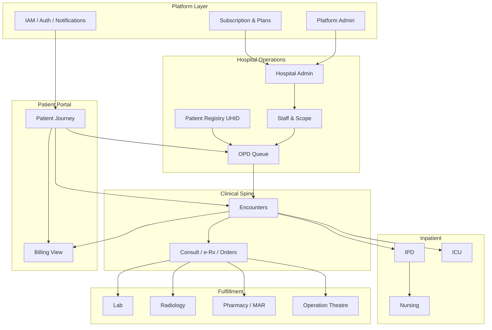

# Health360 — Module Development Plan (Tracked)

| Attribute | Value |
|-----------|-------|
| **Document ID** | PM-MODULE-PLAN-001 |
| **Status** | ACTIVE — Phase B COMPLETE (code); Phase A ops + Phase C next |
| **Created** | 2026-09-03 |
| **Last Updated** | 2026-09-03 |
| **Owner** | Engineering |
| **Related** | [feature-status-board.md](./feature-status-board.md), [PHASE-A-OPS-CHECKLIST.md](./PHASE-A-OPS-CHECKLIST.md), [HMS-ROADMAP.md](../hms/HMS-ROADMAP.md), [HOSPITAL-OPD-REALISM-BACKLOG.md](../hms/HOSPITAL-OPD-REALISM-BACKLOG.md) |

---

## How to use this document

1. Execute phases **A → G** in order (do not skip A before D).
2. Check boxes as work completes (`[ ]` → `[x]`).
3. Update **Phase status** and **Last Updated** when a phase finishes.
4. Keep [feature-status-board.md](./feature-status-board.md) in sync for feature-level QA/RELEASED.

**Checkbox legend:** `[ ]` not started · `[~]` in progress · `[x]` done · `[-]` deferred / cancelled

---

## 1. Current baseline (as of 2026-09-03)

| Layer | Completeness | Notes |
|-------|--------------|-------|
| Backend | ~90% | 23 packages; HMS-0…11 RELEASED; nursing package missing |
| Web | ~75–95% by role | All 11 roles have portals; depth uneven |
| Mobile | ~65–80% | Patient/doctor strong; admin ~55%; reception desk flows code-ready; staff roles unsupported |
| OPD | IN QA | Golden path needs production verification |
| Push notifications | Implemented | Needs EAS project ID + production verify |
| Keep-alive (Render) | Implemented | Needs deploy + `API_HEALTH_URL` variable |

### Cross-platform matrix

| Module | Backend | Web | Mobile | Next focus |
|--------|---------|-----|--------|------------|
| Platform Admin | 90% | 95% | 55% | Phase C |
| Hospital | 95% | 90% | 80% | Phase C (admin polish) |
| Patient Registry | 95% | 90% | 80% staff | Stable |
| OPD | 95% | 85% | 80% | Phase A prod QA |
| Patient Portal | 95% | 90% | 85% | Encounter reviews wired |
| Doctor | 95% | 90% | 70% | Phase E |
| Reception | 95% | 95% | 80% | Stable |
| Clinical | 90% | 90% | 40% | Phase E |
| Billing | 80% | 75% | 55% desk checkout | Phase D / F |
| Scheduling | 90% | 50% | 40% | Phase A decision |
| Lab | 90% | 70% | 50% patient | Phase E |
| Radiology | 90% | 70% | 40% | Phase E |
| Pharmacy | 90% | 70% | 50% patient | Phase E |
| OT | 85% | 70% | 0% | Phase E |
| Nursing | 40% | 30% | 0% | Phase D |
| IPD | 75% | 60% | 0% | Phase D |
| ICU | 80% | 60% | 0% | Phase D |
| Subscription | 80% | 80% | 20% | Phase C / F |
| Analytics | 70% patient | 70% | 60% | Phase G |

---

## 2. Architecture principle



**Rule:** One **Encounter** per visit (OPD / IPD / ICU). Modules attach to encounter + UHID.

**Critical path to IPD:** OPD stable → registry on mobile → admin can onboard hospitals → IPD admit UX → nursing → discharge billing.

---

## 3. Phase overview

| Phase | Name | Duration | Status | Goal |
|-------|------|----------|--------|------|
| **A** | Stabilize & Release OPD | 2–3 weeks | **IN PROGRESS** | Production QA, orphans, push |
| **B** | Patient + Hospital polish | 2 weeks | **COMPLETE** (code) | Reviews + feature flags; QA on live API |
| **C** | Platform Admin completion | 1–2 weeks | NOT STARTED | Admin mobile gaps, dashboard API, audit |
| **D** | IPD depth | 3–4 weeks | NOT STARTED | Admit UX, nursing, discharge billing |
| **E** | Staff portals depth | 3–4 weeks | NOT STARTED | Lab/Rad/Pharm/OT/Nurse worklists |
| **F** | Payments & SaaS | Phase 2 | NOT STARTED | Razorpay, subscription billing |
| **G** | Advanced / integrations | Ongoing | NOT STARTED | PACS, LIS, SMS, inventory |

---

## 4. Phase A — Stabilize & Release OPD

| Attribute | Value |
|-----------|-------|
| **Status** | **IN PROGRESS** |
| **Target** | Weeks 1–3 |
| **Exit criteria** | OPD golden path passes on deployed env; push delivers CALLED; no orphaned OPD UI |
| **Ops checklist** | [PHASE-A-OPS-CHECKLIST.md](./PHASE-A-OPS-CHECKLIST.md) |

### Tasks

| ID | Task | Modules | Effort | Done |
|----|------|---------|--------|------|
| A1 | EAS push production setup + golden path QA on Render | IAM, OPD, Patient | 3d | [~] code ready — Render wake timed out (cold/sleep); see ops checklist |
| A2 | Self check-in: fix web routing OR deprecate; add mobile self check-in if kept | Scheduling, OPD | 3d | [x] deprecated patient UI; desk Arrive wired |
| A3 | Mobile reception: queue **complete** action | OPD, Reception | 1d | [x] |
| A4 | Wire clinical catalogs route **or** remove; clean orphan slot-booking / arrival panels | OPD, Scheduling, Hospital | 3d | [x] catalogs + Arrive wired; slot panel deferred |
| A5 | CI: keep `OpdWalkInGoldenPathIntegrationTest`; add 1 Playwright OPD script | OPD | 3d | [x] Playwright OPD smoke + GH workflow |
| A6 | Deploy keep-alive workflow + set `API_HEALTH_URL` + absolute `VITE_API_BASE_URL` | Ops | 1d | [~] code ready — production ping failed (API asleep/unreachable) |

### OPD golden path (must pass)

```
Patient requests OPD (or reception walk-in)
  → Queue token WAITING
  → Reception calls patient (CALLED) → patient notified (push)
  → Doctor starts consult (IN_SERVICE)
  → Doctor completes + e-Rx signed
  → Reception checkout → invoice → payment recorded
  → Patient sees COMPLETED + Paid on /patient/opd
```

- [x] Golden path verified on local (Playwright patient request → My OPD; backend IT exists)
- [ ] Golden path verified on production (Render)

### Decision (A2 / A4)

| Option | Decision | Owner | Date |
|--------|----------|-------|------|
| Primary booking model | **OPD request + walk-in + desk arrive** (canonical) | Engineering | 2026-09-03 |
| Self check-in | **Deprecated patient UI** for now (routes stay → `/patient/opd`); API kept; desk Arrive tab wired | Engineering | 2026-09-03 |
| Slot booking panel | **Deferred** — not routed; comment on component | Engineering | 2026-09-03 |
| Clinical catalogs | **Wired** at `/hospital/catalogs` + hospital nav | Engineering | 2026-09-03 |

---

## 5. Phase B — Patient + Hospital polish

| Attribute | Value |
|-----------|-------|
| **Status** | **COMPLETE** (code) |
| **Target** | Weeks 4–5 |
| **Exit criteria** | Reception can run desk on mobile (search + walk-in + checkout); catalogs wired; patient journey timeline + document center on mobile; encounter reviews; subscription feature gates |

### Tasks

| ID | Task | Modules | Effort | Done |
|----|------|---------|--------|------|
| B1 | Mobile hospital admin: staff invite / list / deactivate | Hospital | 3d | [x] |
| B2 | Wire `/hospital/catalogs` + nav item | Hospital, Clinical | 1d | [x] done in A4 |
| B3 | Mobile hospital dashboard → `/api/v1/hospital/dashboard` | Hospital, Dashboard | 2d | [x] |
| B4 | Mobile reception: patient search + register (UHID) | Registry, Reception | 4d | [x] |
| B5 | Mobile reception: walk-in + checkout / payment record | OPD, Billing, Reception | 4d | [x] |
| B6 | Mobile: journey timeline API + document center parity | Patient | 3d | [x] already on patient Home stack |
| B7 | Encounter-based reviews (not only appointmentId) | Review, Clinical | 2d | [x] |
| B8 | Enforce subscription feature flags in backend services | Subscription | 2d | [x] |

---

## 6. Phase C — Platform Admin completion

| Attribute | Value |
|-----------|-------|
| **Status** | NOT STARTED |
| **Target** | Weeks 6–7 |
| **Exit criteria** | Platform admin can onboard hospital, assign plan, approve doctor, moderate reviews, and audit — from web **and** mobile |

### Admin function checklist

| # | Function | Backend | Web | Mobile | Sprint | Done |
|---|----------|---------|-----|--------|--------|------|
| A1 | Platform dashboard KPIs | ⚠️ compose only | ✅ | ⚠️ | C1 | [ ] |
| A2 | User directory + status | ✅ | ✅ | ⚠️ no filters | C2 | [ ] |
| A3 | Hospital list + create | ✅ | ✅ | ❌ | C3 | [ ] |
| A4 | Hospital detail + status | ✅ | ✅ | ❌ | C3 | [ ] |
| A5 | Hospital doctor invite | ✅ | ✅ | ❌ | C4 | [ ] |
| A6 | Hospital subscription assign | ✅ | ✅ | ❌ | C4 | [ ] |
| A7 | Plans list / edit limits | ✅ | ✅ | ❌ | C5 | [ ] |
| A8 | Doctor verification queue | ✅ | ✅ | ✅ | — | [x] |
| A9 | Verification review + docs | ✅ | ✅ | ✅ | — | [x] |
| A10 | Review moderation | ✅ | ✅ | ✅ | — | [x] |
| A11 | Audit log search | ✅ | ✅ | ❌ | C6 | [ ] |
| A12 | Account settings | ✅ | ✅ | ✅ | — | [x] |

### Tasks

| ID | Task | Modules | Effort | Done |
|----|------|---------|--------|------|
| C1 | Backend `GET /api/v1/admin/dashboard` + wire web + enrich mobile home | Admin | 2d | [ ] |
| C2 | Mobile admin user filters (role / status) | Admin | 1d | [ ] |
| C3 | Mobile: AdminHospitalsList + AdminHospitalDetail | Admin | 4d | [ ] |
| C4 | Mobile: hospital subscription + doctor invite | Admin, Subscription | 3d | [ ] |
| C5 | Mobile: AdminPlansScreen (read + edit limits) | Admin, Subscription | 2d | [ ] |
| C6 | Mobile: AdminAuditLogsScreen (paginated) | Admin | 2d | [ ] |

---

## 7. Phase D — IPD depth

| Attribute | Value |
|-----------|-------|
| **Status** | NOT STARTED |
| **Target** | Weeks 8–11 |
| **Depends on** | Phase A + B exit criteria |
| **Exit criteria** | Admit by UHID search → bed assigned → doctor rounds → discharge → invoice → bed free |

### Tasks

| ID | Task | Modules | Effort | Done |
|----|------|---------|--------|------|
| D1 | IPD admit: patient search by UHID/name; discharge UX polish | IPD, Registry | 4d | [ ] |
| D2 | Nursing: ward board, vitals rounds, assessments (backend + web) | Nursing, IPD | 2w | [ ] |
| D3 | Discharge billing workflow | Billing, IPD | 1w | [ ] |
| D4 | Doctor IPD rounds UI (web) | IPD, Doctor, Clinical | 1w | [ ] |
| D5 | ICU polish (web / optional mobile nurse) | ICU | 1w | [ ] |
| D6 | Bed transfer | IPD | 3d | [ ] |

### IPD DoD checklist

- [ ] Admit via patient search (not raw UUID)
- [ ] Ward / room / bed setup usable
- [ ] Doctor can record rounds
- [ ] Discharge releases bed
- [ ] Discharge creates / links invoice
- [ ] Nursing can chart vitals on IPD encounter

---

## 8. Phase E — Staff portals depth

| Attribute | Value |
|-----------|-------|
| **Status** | NOT STARTED |
| **Target** | Weeks 12–15 |
| **Exit criteria** | Each staff role has a usable worklist (web depth; mobile selective) |

### Tasks

| ID | Task | Modules | Effort | Done |
|----|------|---------|--------|------|
| E1 | Lab tech: enhanced worklist (order detail routes) | Lab | 1w | [ ] |
| E2 | Radiology tech portal depth | Radiology | 1w | [ ] |
| E3 | Pharmacy + MAR nursing (mobile optional) | Pharmacy, Nursing | 1w | [ ] |
| E4 | OT coordinator portal depth | OT | 1w | [ ] |
| E5 | Doctor mobile: light structured consult + e-Rx | Clinical, Doctor | 2w | [ ] |
| E6 | Enable remaining staff roles on mobile (or keep Unauthorized) | Mobile nav | 1w | [ ] |

---

## 9. Phase F — Payments & SaaS (Phase 2)

| Attribute | Value |
|-----------|-------|
| **Status** | NOT STARTED |
| **Depends on** | Phase A–B stable |

| ID | Task | Modules | Done |
|----|------|---------|------|
| F1 | Razorpay sandbox integration | Billing | [ ] |
| F2 | Patient online pay + webhook | Billing, Patient | [ ] |
| F3 | Subscription SaaS billing for hospitals | Subscription, Admin | [ ] |

---

## 10. Phase G — Advanced / deferred

| ID | Item | Notes | Done |
|----|------|-------|------|
| G1 | SMS / WhatsApp gateway | ECO-P5 deferred | [ ] |
| G2 | QR deep-link self check-in packaging | ECO-P5 deferred | [ ] |
| G3 | OPD_APPROACHING queue-position alerts | Enum reserved | [ ] |
| G4 | PACS / DICOM | Radiology | [ ] |
| G5 | LIS integration | Lab | [ ] |
| G6 | Pharmacy inventory / stock | Pharmacy | [ ] |
| G7 | Anesthesia / implant tracking | OT | [ ] |
| G8 | Partner admin portal | Org | [ ] |
| G9 | Hospital / platform ops analytics | Analytics | [ ] |
| G10 | MFA / password reset | IAM Phase 1.5+ | [ ] |
| G11 | TV / display board | Non-goal unless requested | [-] |

---

## 11. Module DoD templates (release checklist)

Use before marking a module **RELEASED** on the feature board.

### Shared checklist

- [ ] Backend APIs in OpenAPI / documented
- [ ] RBAC tested for role
- [ ] Web golden path manual QA passed
- [ ] Mobile core flows (if applicable) passed
- [ ] Integration test in CI (where applicable)
- [ ] No orphaned / unrouted UI for this module
- [ ] Production deploy verified
- [ ] QA credentials doc updated (`mannual/QA-TEST-CREDENTIALS-AND-FUNCTIONALITY.txt`)

### OPD DoD

- [ ] Request / walk-in / arrive → queue token
- [ ] WAITING → CALLED → IN_SERVICE → COMPLETED (+ skip/recall)
- [ ] Doctor consult syncs queue + encounter
- [ ] Checkout gate (final consult + signed e-Rx)
- [ ] Patient `/opd/me/today` shows token, position, billing
- [ ] Push or reliable fallback on CALLED

### Patient DoD

- [ ] UHID + self-register + portal invite
- [ ] Consent gate
- [ ] Discover → request OPD → live status
- [ ] Post-visit package (Dx, Rx, labs, wellness)
- [ ] Lab book + pharmacy send
- [ ] Invoice visibility
- [ ] Journey timeline + document center (web + mobile)

### Hospital DoD

- [ ] Profile / branches / departments / facilities
- [ ] Staff invite + branch scope
- [ ] Doctor roster
- [ ] Patient registry (search/register)
- [ ] OPD desk + walk-in + queue
- [ ] Billing checkout
- [ ] Clinical catalogs reachable
- [ ] Operational dashboard

### Admin DoD

- [ ] Dashboard KPIs (API-backed)
- [ ] Users + hospitals + plans
- [ ] Doctor verification
- [ ] Review moderation
- [ ] Audit logs
- [ ] Mobile parity for A3–A11 (or explicit web-only waiver)

### IPD DoD

- [ ] Admit by UHID search
- [ ] Bed assignment / release
- [ ] Doctor rounds
- [ ] Discharge + billing
- [ ] Nursing vitals on IPD encounter

---

## 12. Immediate next 2 weeks (execution kickoff)

### Week 1 (current)

| Day | Focus | IDs | Status |
|-----|-------|-----|--------|
| Done | Code: catalogs, Arrive tab, mobile complete, Playwright | A2–A5 | Done |
| Next | Deploy keep-alive + EAS + production golden path | A1, A6 | You |

### Week 2

| Day | Focus | IDs | Status |
|-----|-------|-----|--------|
| Done | Mobile staff + ops dashboard + reception search/walk-in/checkout | B1–B6 | Code ready |
| Done | Encounter reviews + subscription feature gates | B7, B8 | Code ready |
| Next | Admin dashboard API + mobile polish | C1, C2 | — |

**After production A1/A6:** mark Phase A exit criteria when golden path passes on Render. Phase B is code-complete; QA on a live API before Phase D (IPD).

---

## 13. Already built (do not rebuild)

Deepen or wire — do not recreate:

- [x] HMS backend HMS-0…11 (OPD, IPD, ICU, Lab, Rad, Pharmacy, OT)
- [x] Web role portals for all 11 staff roles
- [x] Patient ECO-P3 / ECO-P4 (lab + pharmacy journeys)
- [x] Platform admin web (hospitals, plans, audit, verification)
- [x] Encounter-centric clinical spine
- [x] UHID + patient registry (web reception)
- [x] Mobile push token registration + Expo push service (V68)
- [x] Mobile reception OPD queue (call / start / skip / recall / assign)
- [x] Backend keep-alive + frontend / GitHub wake pings

---

## 14. Change log

| Date | Change |
|------|--------|
| 2026-09-03 | Initial tracked plan created from module audit (OPD / Patient / Hospital / Admin + full HMS map) |
| 2026-09-03 | Phase A started: A2/A3/A4 implemented; A1/A6 ops checklist added |
| 2026-09-03 | A5 done: Playwright OPD smoke (2/2 local pass) + `.github/workflows/e2e-opd.yml` |

---

*End of PM-MODULE-PLAN-001*
