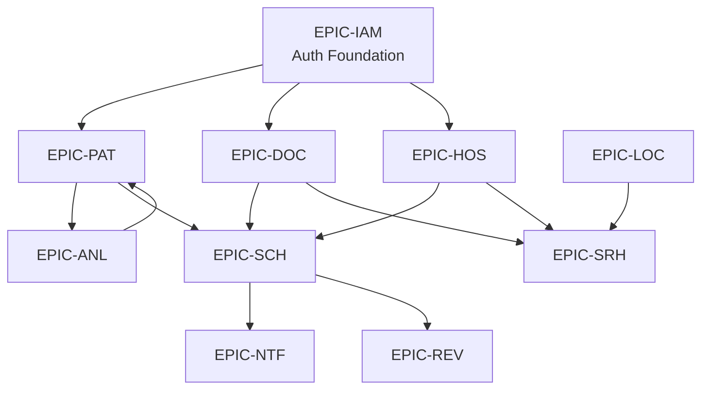

# DOC-14: Health360 AI — User Stories & Acceptance Criteria


| Attribute         | Value                                                     |
| ----------------- | --------------------------------------------------------- |
| **Document ID**   | DOC-14                                                    |
| **Title**         | User Stories & Acceptance Criteria                        |
| **Version**       | 1.0                                                       |
| **Status**        | **Approved**                                              |
| **Date**          | 2026-07-29                                                |
| **Author**        | Product Owner / Business Analyst                          |
| **References**    | [DOC-03] FRS, [DOC-09] Validation, [DOC-10] UI/UX Screens |
| **Next Document** | [DOC-15] Development Roadmap                              |


---

## 1. Executive Summary

This document translates [DOC-03] functional requirements into an **Agile product backlog** for Health360 AI Phase 1. It contains **10 epics**, **79 user stories** (1:1 mapped to [FR-XXX]), **188 acceptance criteria** (referenced from [AC-XXX] in DOC-03), and **342 story points** estimated using Fibonacci sizing.

**Backlog Goal:** Sprint-ready stories with clear personas, INVEST-compliant descriptions, testable acceptance criteria, and traceability to functional requirements, screens, and business rules.

---


## 2. Document Conventions


### 2.1 ID Formats


| ID Pattern    | Meaning                                                     |
| ------------- | ----------------------------------------------------------- |
| `EPIC-XXX`    | Epic grouping related stories by bounded context            |
| `US-XXX-NNN`  | User story (maps 1:1 to `FR-XXX-NNN`)                       |
| `AC-XXX-NNN`  | Acceptance criterion (defined in [DOC-03]; referenced here) |
| `SCR-XXX-NNN` | UI screen ([DOC-10])                                        |


### 2.2 User Story Template

```
As a <persona>
I want <capability>
So that <business value>
```


### 2.3 Story Point Scale (Fibonacci)


| Points  | Complexity Guide                                           |
| ------- | ---------------------------------------------------------- |
| **1–2** | Trivial config, simple read-only view                      |
| **3**   | Standard CRUD with validation                              |
| **5**   | Multi-step flow, integrations, or cross-module logic       |
| **8**   | Complex workflow, concurrency, or security-critical        |
| **13**  | Core engine, platform capability, or multi-surface feature |


### 2.4 Priority Alignment


| Priority | Sprint Target                            | Source   |
| -------- | ---------------------------------------- | -------- |
| **P0**   | Phase 1 MVP — must ship                  | [DOC-03] |
| **P1**   | Phase 1 — should ship if capacity allows | [DOC-03] |
| **P2**   | Phase 1 stretch / early Phase 2          | [DOC-03] |


### 2.5 Definition of Ready (DoR)

- [ ] Story maps to an approved [FR-XXX]
- [ ] Acceptance criteria are testable and unambiguous
- [ ] UI screen identified or marked N/A (backend-only)
- [ ] Dependencies identified (blocked stories flagged)
- [ ] Story points estimated by team


### 2.6 Definition of Done (DoD)

- [ ] All acceptance criteria pass (automated + manual QA)
- [ ] Unit tests written for business logic
- [ ] API contract matches [DOC-07]
- [ ] Validation rules from [DOC-09] implemented
- [ ] Audit logging where required [FR-IAM-010]
- [ ] No P0/P1 linter or security scan findings
- [ ] Deployed to staging and smoke-tested
- [ ] Product Owner acceptance

---


## 3. Epic Overview


| Epic ID   | Epic Name                         | Stories | P0     | P1     | P2    | Points  |
| --------- | --------------------------------- | ------- | ------ | ------ | ----- | ------- |
| EPIC-IAM  | Identity & Access Management      | 12      | 10     | 2      | 0     | 53      |
| EPIC-PAT  | Patient Health Profile            | 15      | 10     | 5      | 0     | 58      |
| EPIC-DOC  | Doctor Professional Profile       | 14      | 10     | 4      | 0     | 55      |
| EPIC-HOS  | Hospital Management               | 8       | 6      | 2      | 0     | 31      |
| EPIC-SCH  | Scheduling & Appointments         | 9       | 8      | 1      | 0     | 47      |
| EPIC-LOC  | Location & Geo-Search             | 6       | 3      | 3      | 0     | 26      |
| EPIC-ANL  | Health Analytics & Formula Engine | 8       | 6      | 1      | 1     | 60      |
| EPIC-SRH  | Search & Discovery                | 3       | 3      | 0      | 0     | 13      |
| EPIC-REV  | Reviews & Ratings                 | 2       | 0      | 2      | 0     | 8       |
| EPIC-NTF  | Notifications                     | 2       | 2      | 0      | 0     | 8       |
| **Total** |                                   | **79**  | **58** | **20** | **1** | **342** |


---


## 4. Dependency Graph (Critical Path)




**Recommended build order:** IAM → Patient (consent + profile) → Doctor + Hospital (parallel) → Scheduling → Analytics → Location/Search → Notifications → Reviews

---


## 5. EPIC-IAM: Identity & Access Management

**Goal:** Secure registration, authentication, authorization, and account lifecycle for all personas.

**Personas:** Guest, Patient, Doctor, Hospital Admin, Platform Admin, System


| Story ID   | Title                          | FR         | SCR         | Pri | Pts | Depends On |
| ---------- | ------------------------------ | ---------- | ----------- | --- | --- | ---------- |
| US-IAM-001 | Register Account               | FR-IAM-001 | SCR-PUB-003 | P0  | 5   | —          |
| US-IAM-002 | Verify Email                   | FR-IAM-002 | SCR-PUB-004 | P0  | 3   | US-IAM-001 |
| US-IAM-003 | Login                          | FR-IAM-003 | SCR-PUB-002 | P0  | 8   | US-IAM-002 |
| US-IAM-004 | Refresh Token                  | FR-IAM-004 | —           | P0  | 5   | US-IAM-003 |
| US-IAM-005 | Logout                         | FR-IAM-005 | —           | P0  | 2   | US-IAM-003 |
| US-IAM-006 | Change Password                | FR-IAM-006 | SCR-PAT-020 | P0  | 3   | US-IAM-003 |
| US-IAM-007 | Role-Based Access Control      | FR-IAM-007 | —           | P0  | 8   | US-IAM-003 |
| US-IAM-008 | Account Profile Settings       | FR-IAM-008 | SCR-PAT-020 | P0  | 3   | US-IAM-003 |
| US-IAM-009 | Notification Preferences       | FR-IAM-009 | SCR-PAT-021 | P1  | 3   | US-IAM-003 |
| US-IAM-010 | Audit Log Recording            | FR-IAM-010 | SCR-ADM-005 | P0  | 5   | US-IAM-003 |
| US-IAM-011 | Platform Admin User Management | FR-IAM-011 | SCR-ADM-002 | P1  | 5   | US-IAM-007 |
| US-IAM-012 | Account Deactivation           | FR-IAM-012 | SCR-ADM-002 | P1  | 3   | US-IAM-011 |


### US-IAM-001: Register Account

**As a** guest  
**I want** to register with email, password, and role (Patient or Doctor)  
**So that** I can access platform features after verification

**Acceptance Criteria:**

- [ ] AC-IAM-001: Registration with valid data creates user and sends verification email
- [ ] AC-IAM-002: Duplicate email returns 409 Conflict with clear message
- [ ] AC-IAM-003: Weak password returns 400 with specific validation errors [BR-AUTH-004]
- [ ] AC-IAM-004: Unverified user cannot access protected endpoints


### US-IAM-002: Verify Email

**As a** guest  
**I want** to verify my email via the link sent after registration  
**So that** my account becomes active and I can log in

**Acceptance Criteria:**

- [ ] AC-IAM-005: Valid token activates account
- [ ] AC-IAM-006: Expired/invalid token returns error with resend option


### US-IAM-003: Login

**As a** registered user (Patient, Doctor, Hospital Admin, or Platform Admin)  
**I want** to log in with email and password  
**So that** I receive secure access tokens for the platform

**Acceptance Criteria:**

- [ ] AC-IAM-007: Valid credentials return tokens and user profile
- [ ] AC-IAM-008: Invalid credentials return 401 without revealing which field failed
- [ ] AC-IAM-009: Locked account returns 423 with lockout duration [BR-AUTH-005]
- [ ] AC-IAM-010: Unverified email returns 403 with verification prompt


### US-IAM-004: Refresh Token

**As an** authenticated user  
**I want** to refresh my access token using a refresh token  
**So that** I stay logged in without re-entering credentials

**Acceptance Criteria:**

- [ ] AC-IAM-011: Valid refresh token returns new token pair
- [ ] AC-IAM-012: Reused refresh token returns 401 (token rotation enforced)
- [ ] AC-IAM-013: Expired refresh token returns 401 requiring re-login


### US-IAM-005: Logout

**As an** authenticated user  
**I want** to log out  
**So that** my session is invalidated on this device

**Acceptance Criteria:**

- [ ] AC-IAM-014: After logout, refresh token cannot be used
- [ ] AC-IAM-015: After logout, access token returns 401


### US-IAM-006: Change Password

**As an** authenticated user  
**I want** to change my password  
**So that** I can maintain account security

**Acceptance Criteria:**

- [ ] AC-IAM-016: Successful change invalidates all sessions
- [ ] AC-IAM-017: Wrong current password returns 400


### US-IAM-007: Role-Based Access Control

**As the** system  
**I want** to enforce role-based permissions on every API endpoint  
**So that** users can only access features appropriate to their role

**Acceptance Criteria:**

- [ ] AC-IAM-018: Patient cannot access doctor-only endpoints (403)
- [ ] AC-IAM-019: Doctor cannot access hospital admin endpoints (403)
- [ ] AC-IAM-020: Platform Admin can access all admin endpoints


### US-IAM-008: Account Profile Settings

**As an** authenticated user  
**I want** to update my account profile (name, phone)  
**So that** my contact information stays current

**Acceptance Criteria:**

- [ ] AC-IAM-021: Profile updates persist and reflect immediately
- [ ] AC-IAM-022: Email change requires re-verification (separate flow)


### US-IAM-009: Notification Preferences

**As an** authenticated user  
**I want** to configure my notification channel preferences  
**So that** I receive alerts only on channels I choose

**Acceptance Criteria:**

- [ ] AC-IAM-023: Disabled channel prevents notification on that channel
- [ ] AC-IAM-024: In-app notifications cannot be disabled


### US-IAM-010: Audit Log Recording

**As the** platform  
**I want** to record an immutable audit log for all mutating operations  
**So that** compliance and security investigations are supported

**Acceptance Criteria:**

- [ ] AC-IAM-025: Every mutation API call generates an audit log entry
- [ ] AC-IAM-026: Audit logs are append-only (no update/delete via API)


### US-IAM-011: Platform Admin User Management

**As a** platform admin  
**I want** to search, view, and manage user accounts  
**So that** I can support users and enforce platform policies

**Acceptance Criteria:**

- [ ] AC-IAM-027: Admin can search users by email, name, role, status
- [ ] AC-IAM-028: Deactivated user cannot login (403)
- [ ] AC-IAM-029: Role assignment logged in audit trail


### US-IAM-012: Account Deactivation

**As a** platform admin  
**I want** to deactivate user accounts  
**So that** problematic or departing users lose access while data is retained

**Acceptance Criteria:**

- [ ] AC-IAM-030: Deactivated account data retained but inaccessible
- [ ] AC-IAM-031: Deactivated user excluded from search results

---


## 6. EPIC-PAT: Patient Health Profile

**Goal:** Comprehensive patient health profile with consent, vitals, documents, and doctor-visible summary.

**Personas:** Patient, Doctor (read-only limited)


| Story ID   | Title                        | FR         | SCR         | Pri | Pts | Depends On     |
| ---------- | ---------------------------- | ---------- | ----------- | --- | --- | -------------- |
| US-PAT-001 | Create Patient Profile       | FR-PAT-001 | SCR-PAT-015 | P0  | 5   | US-IAM-003     |
| US-PAT-002 | Update Basic Information     | FR-PAT-002 | SCR-PAT-003 | P0  | 3   | US-PAT-001     |
| US-PAT-003 | Update Contact Information   | FR-PAT-003 | SCR-PAT-004 | P0  | 3   | US-PAT-001     |
| US-PAT-004 | Update Physical Measurements | FR-PAT-004 | SCR-PAT-005 | P0  | 5   | US-PAT-001     |
| US-PAT-005 | Manage Medical Information   | FR-PAT-005 | SCR-PAT-006 | P0  | 5   | US-PAT-001     |
| US-PAT-006 | Update Lifestyle Profile     | FR-PAT-006 | SCR-PAT-007 | P0  | 3   | US-PAT-001     |
| US-PAT-007 | Manage Emergency Contacts    | FR-PAT-007 | SCR-PAT-008 | P0  | 3   | US-PAT-001     |
| US-PAT-008 | Manage Family Members        | FR-PAT-008 | SCR-PAT-009 | P1  | 3   | US-PAT-001     |
| US-PAT-009 | Record Vital Signs           | FR-PAT-009 | SCR-PAT-010 | P0  | 5   | US-PAT-001     |
| US-PAT-010 | Record Lab Values            | FR-PAT-010 | SCR-PAT-011 | P1  | 5   | US-PAT-001     |
| US-PAT-011 | Manage Health Goals          | FR-PAT-011 | SCR-PAT-012 | P1  | 3   | US-PAT-001     |
| US-PAT-012 | Upload Health Documents      | FR-PAT-012 | SCR-PAT-013 | P1  | 5   | US-PAT-001     |
| US-PAT-013 | View Health Timeline         | FR-PAT-013 | SCR-PAT-014 | P1  | 5   | US-PAT-001     |
| US-PAT-014 | Profile Completion Score     | FR-PAT-014 | SCR-PAT-002 | P0  | 5   | US-PAT-002–007 |
| US-PAT-015 | Doctor View Patient Summary  | FR-PAT-015 | SCR-DOC-009 | P1  | 8   | US-SCH-004     |


### US-PAT-001: Create Patient Profile

**As a** patient  
**I want** to provide health data consent and have my profile initialized  
**So that** I can begin building my health record securely

**Acceptance Criteria:**

- [ ] AC-PAT-001: Profile auto-created on first access after consent
- [ ] AC-PAT-002: Consent rejection prevents profile access


### US-PAT-002: Update Basic Information

**As a** patient  
**I want** to update my basic demographic information  
**So that** my profile reflects accurate personal details

**Acceptance Criteria:**

- [ ] AC-PAT-003: Section saves independently without requiring other sections
- [ ] AC-PAT-004: Completion score updates after save


### US-PAT-003: Update Contact Information

**As a** patient  
**I want** to manage my permanent and current addresses  
**So that** providers and the platform have accurate contact details

**Acceptance Criteria:**

- [ ] AC-PAT-005: "Same as permanent" copies permanent to current address
- [ ] AC-PAT-006: Invalid pincode returns validation error


### US-PAT-004: Update Physical Measurements

**As a** patient  
**I want** to record height, weight, and body measurements  
**So that** health metrics like BMI can be calculated

**Acceptance Criteria:**

- [ ] AC-PAT-007: Measurements history maintained with timestamps
- [ ] AC-PAT-008: BMI recalculated on weight/height change [FML-001]


### US-PAT-005: Manage Medical Information

**As a** patient  
**I want** to manage allergies, conditions, medications, and surgeries  
**So that** my medical history is available for care and analytics

**Acceptance Criteria:**

- [ ] AC-PAT-009: Each sub-entity supports add, edit, remove independently
- [ ] AC-PAT-010: Removing allergy logged in health timeline


### US-PAT-006: Update Lifestyle Profile

**As a** patient  
**I want** to record lifestyle factors (smoking, alcohol, exercise, diet)  
**So that** my health risk assessment is accurate

**Acceptance Criteria:**

- [ ] AC-PAT-011: Lifestyle update triggers Health Risk Score recalculation


### US-PAT-007: Manage Emergency Contacts

**As a** patient  
**I want** to manage emergency contacts with a designated primary  
**So that** providers can reach someone in an emergency

**Acceptance Criteria:**

- [ ] AC-PAT-012: Setting new primary demotes previous primary
- [ ] AC-PAT-013: Cannot delete last primary without assigning new primary


### US-PAT-008: Manage Family Members

**As a** patient  
**I want** to record family medical history  
**So that** hereditary risk factors are captured

**Acceptance Criteria:**

- [ ] AC-PAT-014: Family history contributes to Health Risk Score


### US-PAT-009: Record Vital Signs

**As a** patient  
**I want** to log vital signs (BP, heart rate, temperature, SpO2)  
**So that** I can track my health trends over time

**Acceptance Criteria:**

- [ ] AC-PAT-015: New vital record appended to history
- [ ] AC-PAT-016: BP classification calculated on save [FML-003]
- [ ] AC-PAT-017: Vital history displayed in chronological order with trend indicators


### US-PAT-010: Record Lab Values

**As a** patient  
**I want** to enter lab test results  
**So that** my health analytics include clinical data

**Acceptance Criteria:**

- [ ] AC-PAT-018: Lab values append-only with history
- [ ] AC-PAT-019: Lipid profile contributes to Health Risk Score


### US-PAT-011: Manage Health Goals

**As a** patient  
**I want** to set and track health goals  
**So that** I stay motivated to improve my wellness

**Acceptance Criteria:**

- [ ] AC-PAT-020: Dashboard displays progress toward goals where applicable


### US-PAT-012: Upload Health Documents

**As a** patient  
**I want** to upload health documents (reports, prescriptions)  
**So that** my records are centralized and accessible

**Acceptance Criteria:**

- [ ] AC-PAT-021: Valid file uploads and appears in document list
- [ ] AC-PAT-022: Oversized file returns 413 with size limit message [BR-DOC-001]
- [ ] AC-PAT-023: Invalid file type returns 400


### US-PAT-013: View Health Timeline

**As a** patient  
**I want** to view a chronological timeline of my health events  
**So that** I can understand my health journey at a glance

**Acceptance Criteria:**

- [ ] AC-PAT-024: Timeline sorted by date descending
- [ ] AC-PAT-025: Each event type has distinct icon and summary text
- [ ] AC-PAT-026: Timeline supports pagination (20 events per page)


### US-PAT-014: Profile Completion Score

**As a** patient  
**I want** to see my profile completion percentage and missing sections  
**So that** I know what to fill in for accurate analytics

**Acceptance Criteria:**

- [ ] AC-PAT-027: Score recalculates on any section save
- [ ] AC-PAT-028: Dashboard shows score with section breakdown
- [ ] AC-PAT-029: Sections marked complete when all required fields filled


### US-PAT-015: Doctor View Patient Summary (Limited)

**As a** doctor  
**I want** to view a limited patient summary during an active appointment window  
**So that** I can provide informed care without unrestricted PHI access

**Acceptance Criteria:**

- [ ] AC-PAT-030: Doctor sees summary only during valid appointment window [BR-AUTH-007]
- [ ] AC-PAT-031: No appointment relationship returns 403

---


## 7. EPIC-DOC: Doctor Professional Profile

**Goal:** Doctor onboarding, verification workflow, and public discoverable profile.

**Personas:** Doctor, Platform Admin, Guest


| Story ID   | Title                           | FR         | SCR             | Pri | Pts | Depends On             |
| ---------- | ------------------------------- | ---------- | --------------- | --- | --- | ---------------------- |
| US-DOC-001 | Create Doctor Profile           | FR-DOC-001 | SCR-DOC-002     | P0  | 3   | US-IAM-003             |
| US-DOC-002 | Update Professional Details     | FR-DOC-002 | SCR-DOC-002     | P0  | 3   | US-DOC-001             |
| US-DOC-003 | Manage Qualifications           | FR-DOC-003 | SCR-DOC-003     | P0  | 3   | US-DOC-001             |
| US-DOC-004 | Manage Experience               | FR-DOC-004 | SCR-DOC-003     | P0  | 3   | US-DOC-001             |
| US-DOC-005 | Set Specialization              | FR-DOC-005 | SCR-DOC-002     | P0  | 3   | US-DOC-001             |
| US-DOC-006 | Manage Languages                | FR-DOC-006 | SCR-DOC-002     | P1  | 2   | US-DOC-001             |
| US-DOC-007 | Hospital Association            | FR-DOC-007 | SCR-DOC-004     | P0  | 5   | US-DOC-001, US-HOS-001 |
| US-DOC-008 | Set Consultation Fee & Types    | FR-DOC-008 | SCR-DOC-002     | P0  | 3   | US-DOC-001             |
| US-DOC-009 | Biography, Awards & Memberships | FR-DOC-009 | SCR-DOC-002     | P1  | 3   | US-DOC-001             |
| US-DOC-010 | Upload Verification Documents   | FR-DOC-010 | SCR-DOC-005     | P0  | 5   | US-DOC-001             |
| US-DOC-011 | Submit for Verification         | FR-DOC-011 | SCR-DOC-005     | P0  | 5   | US-DOC-003–010         |
| US-DOC-012 | Doctor Verification Review      | FR-DOC-012 | SCR-ADM-003/004 | P0  | 8   | US-DOC-011             |
| US-DOC-013 | Public Doctor Profile           | FR-DOC-013 | SCR-PUB-007     | P0  | 5   | US-DOC-012             |
| US-DOC-014 | Doctor Ratings Display          | FR-DOC-014 | SCR-PUB-007     | P1  | 3   | US-REV-001             |


### US-DOC-001: Create Doctor Profile

**As a** doctor  
**I want** my professional profile created in draft status on first login  
**So that** I can begin completing my credentials

**Acceptance Criteria:**

- [ ] AC-DOC-001: Profile created in DRAFT status
- [ ] AC-DOC-002: Draft profile not visible in public search


### US-DOC-002: Update Professional Details

**As a** doctor  
**I want** to update registration number, council, and practice details  
**So that** my credentials are accurately represented

**Acceptance Criteria:** Per [FR-DOC-002] validation rules in [DOC-09]

### US-DOC-003: Manage Qualifications

**As a** doctor  
**I want** to add and manage my medical qualifications  
**So that** patients can verify my credentials

**Acceptance Criteria:**

- [ ] AC-DOC-003: Multiple qualifications supported
- [ ] AC-DOC-004: At least one qualification required before verification submission


### US-DOC-004: Manage Experience

**As a** doctor  
**I want** to record my professional experience  
**So that** patients understand my background

**Acceptance Criteria:** Per [FR-DOC-004]; experience entries support add/edit/remove

### US-DOC-005: Set Specialization

**As a** doctor  
**I want** to set my primary and secondary specializations  
**So that** patients can find me by specialty

**Acceptance Criteria:**

- [ ] AC-DOC-005: Only taxonomy values accepted for primary specialization
- [ ] AC-DOC-006: Specialization appears in search filters


### US-DOC-006: Manage Languages

**As a** doctor  
**I want** to specify languages I speak  
**So that** patients can filter by language preference

**Acceptance Criteria:** Per [FR-DOC-006]; multi-select from supported language list

### US-DOC-007: Hospital Association

**As a** doctor  
**I want** to associate with one or more hospitals  
**So that** I can offer consultations at those facilities

**Acceptance Criteria:**

- [ ] AC-DOC-007: Doctor must have ≥1 active hospital association to enable booking [BR-DOC-003]
- [ ] AC-DOC-008: Doctor can have independent schedules per hospital


### US-DOC-008: Set Consultation Fee & Types

**As a** doctor  
**I want** to set consultation fees and types (in-person, tele — Phase 1 in-person only)  
**So that** patients know the cost before booking

**Acceptance Criteria:**

- [ ] AC-DOC-009: Fee = 0 displayed as "Free Consultation"
- [ ] AC-DOC-010: Fee visible on public profile and search results


### US-DOC-009: Biography, Awards & Memberships

**As a** doctor  
**I want** to add biography, awards, and professional memberships  
**So that** my public profile is comprehensive and trustworthy

**Acceptance Criteria:** Per [FR-DOC-009]; rich text biography with character limit

### US-DOC-010: Upload Verification Documents

**As a** doctor  
**I want** to upload license and identity documents  
**So that** the platform can verify my credentials

**Acceptance Criteria:**

- [ ] AC-DOC-011: Documents stored securely; not publicly accessible
- [ ] AC-DOC-012: Only Platform Admin can view verification documents


### US-DOC-011: Submit for Verification

**As a** doctor  
**I want** to submit my completed profile for platform verification  
**So that** I can become bookable by patients

**Acceptance Criteria:**

- [ ] AC-DOC-013: Incomplete profile cannot submit (400 with missing items list)
- [ ] AC-DOC-014: Status change triggers admin notification


### US-DOC-012: Doctor Verification Review

**As a** platform admin  
**I want** to review and approve or reject doctor verification requests  
**So that** only verified doctors appear in patient search

**Acceptance Criteria:**

- [ ] AC-DOC-015: Verified doctor appears in bookable search
- [ ] AC-DOC-016: Rejected doctor can edit and resubmit
- [ ] AC-DOC-017: Verification badge visible on public profile


### US-DOC-013: Public Doctor Profile

**As a** guest or patient  
**I want** to view a doctor's public profile  
**So that** I can evaluate them before booking

**Acceptance Criteria:**

- [ ] AC-DOC-018: Unverified doctors not listed in search [BR-DOC-001]
- [ ] AC-DOC-019: Public profile accessible without authentication


### US-DOC-014: Doctor Ratings Display

**As a** guest or patient  
**I want** to see doctor ratings and reviews on their profile  
**So that** I can make an informed choice

**Acceptance Criteria:**

- [ ] AC-DOC-020: Aggregate rating displayed to 1 decimal place
- [ ] AC-DOC-021: Reviews paginated, sorted by date descending

---


## 8. EPIC-HOS: Hospital Management

**Goal:** Hospital profile, branches, departments, facilities, and doctor roster management.

**Personas:** Hospital Admin, Guest


| Story ID   | Title                       | FR         | SCR         | Pri | Pts | Depends On             |
| ---------- | --------------------------- | ---------- | ----------- | --- | --- | ---------------------- |
| US-HOS-001 | Create Hospital Profile     | FR-HOS-001 | SCR-HOS-002 | P0  | 5   | US-IAM-003             |
| US-HOS-002 | Manage Branches             | FR-HOS-002 | SCR-HOS-003 | P0  | 5   | US-HOS-001             |
| US-HOS-003 | Manage Departments          | FR-HOS-003 | SCR-HOS-004 | P0  | 3   | US-HOS-001             |
| US-HOS-004 | Manage Facilities           | FR-HOS-004 | SCR-HOS-005 | P1  | 3   | US-HOS-001             |
| US-HOS-005 | Map Doctors to Hospital     | FR-HOS-005 | SCR-HOS-006 | P0  | 5   | US-HOS-001, US-DOC-012 |
| US-HOS-006 | Emergency & ICU Information | FR-HOS-006 | SCR-HOS-008 | P0  | 3   | US-HOS-001             |
| US-HOS-007 | Hospital Image Gallery      | FR-HOS-007 | SCR-HOS-007 | P1  | 5   | US-HOS-001             |
| US-HOS-008 | Public Hospital Profile     | FR-HOS-008 | SCR-PUB-008 | P0  | 5   | US-HOS-002             |


### US-HOS-001: Create Hospital Profile

**As a** hospital admin  
**I want** to create and manage my hospital's core profile  
**So that** the facility is represented on the platform

**Acceptance Criteria:** Per [FR-HOS-001]; hospital created with required fields and default branch prompt

### US-HOS-002: Manage Branches

**As a** hospital admin  
**I want** to manage hospital branches with addresses and geo-coordinates  
**So that** patients can find the nearest location

**Acceptance Criteria:**

- [ ] AC-HOS-001: At least one branch required [BR-HOS-001]
- [ ] AC-HOS-002: Branch geo coordinates used in location search


### US-HOS-003: Manage Departments

**As a** hospital admin  
**I want** to define hospital departments  
**So that** the facility structure is accurately represented

**Acceptance Criteria:** Per [FR-HOS-003]; CRUD with soft delete

### US-HOS-004: Manage Facilities

**As a** hospital admin  
**I want** to list available facilities (parking, pharmacy, etc.)  
**So that** patients know what services the hospital offers

**Acceptance Criteria:** Per [FR-HOS-004]; multi-select from facility taxonomy

### US-HOS-005: Map Doctors to Hospital

**As a** hospital admin  
**I want** to associate verified doctors with my hospital  
**So that** they can schedule appointments at our branches

**Acceptance Criteria:**

- [ ] AC-HOS-003: Associated doctor appears on hospital profile
- [ ] AC-HOS-004: Doctor-hospital link enables schedule creation for that hospital


### US-HOS-006: Emergency & ICU Information

**As a** hospital admin  
**I want** to publish emergency and ICU contact details  
**So that** patients can reach critical services quickly

**Acceptance Criteria:** Per [FR-HOS-006]; 24/7 emergency number required

### US-HOS-007: Hospital Image Gallery

**As a** hospital admin  
**I want** to upload and manage hospital photos  
**So that** patients can preview the facility

**Acceptance Criteria:**

- [ ] AC-HOS-005: Gallery displayed on public profile
- [ ] AC-HOS-006: Upload beyond limit returns 400 [BR-HOS-003 — max 20 images]


### US-HOS-008: Public Hospital Profile

**As a** guest or patient  
**I want** to view a hospital's public profile with map and doctors  
**So that** I can choose where to seek care

**Acceptance Criteria:**

- [ ] AC-HOS-007: Public profile accessible without authentication
- [ ] AC-HOS-008: Map shows branch locations

---


## 9. EPIC-SCH: Scheduling & Appointments

**Goal:** Doctor availability, appointment booking, cancellation, rescheduling, and lifecycle management.

**Personas:** Doctor, Patient, System


| Story ID   | Title                           | FR         | SCR         | Pri | Pts | Depends On |
| ---------- | ------------------------------- | ---------- | ----------- | --- | --- | ---------- |
| US-SCH-001 | Define Weekly Schedule Template | FR-SCH-001 | SCR-DOC-006 | P0  | 5   | US-DOC-007 |
| US-SCH-002 | Generate Time Slots             | FR-SCH-002 | SCR-DOC-006 | P0  | 5   | US-SCH-001 |
| US-SCH-003 | View Doctor Availability        | FR-SCH-003 | SCR-PAT-016 | P0  | 5   | US-SCH-002 |
| US-SCH-004 | Book Appointment                | FR-SCH-004 | SCR-PAT-016 | P0  | 8   | US-SCH-003 |
| US-SCH-005 | Cancel Appointment              | FR-SCH-005 | SCR-PAT-018 | P0  | 5   | US-SCH-004 |
| US-SCH-006 | Reschedule Appointment          | FR-SCH-006 | SCR-PAT-018 | P0  | 5   | US-SCH-004 |
| US-SCH-007 | Appointment Status Lifecycle    | FR-SCH-007 | SCR-DOC-008 | P0  | 5   | US-SCH-004 |
| US-SCH-008 | Appointment History             | FR-SCH-008 | SCR-PAT-017 | P0  | 3   | US-SCH-004 |
| US-SCH-009 | Doctor Block Time Slot          | FR-SCH-009 | SCR-DOC-006 | P1  | 5   | US-SCH-002 |


### US-SCH-001: Define Weekly Schedule Template

**As a** doctor  
**I want** to define my weekly availability template per hospital  
**So that** bookable time slots can be generated

**Acceptance Criteria:**

- [ ] AC-SCH-001: Schedule defined independently per hospital
- [ ] AC-SCH-002: End time must be after start time
- [ ] AC-SCH-003: Overlapping schedule blocks for same day rejected [BR-SCH-001]


### US-SCH-002: Generate Time Slots

**As the** system  
**I want** to generate bookable time slots from schedule templates  
**So that** patients see accurate availability

**Acceptance Criteria:**

- [ ] AC-SCH-004: Slots generated for 30 days ahead
- [ ] AC-SCH-005: Booked slots not regenerated as available


### US-SCH-003: View Doctor Availability

**As a** patient  
**I want** to view a doctor's available time slots  
**So that** I can choose a convenient appointment time

**Acceptance Criteria:**

- [ ] AC-SCH-006: Only AVAILABLE slots selectable for booking
- [ ] AC-SCH-007: Unverified doctor returns empty availability


### US-SCH-004: Book Appointment

**As a** patient  
**I want** to book an appointment with a verified doctor  
**So that** I can receive medical consultation

**Acceptance Criteria:**

- [ ] AC-SCH-008: Successful booking returns confirmation with all details
- [ ] AC-SCH-009: Concurrent booking attempt on same slot — only one succeeds (409 for loser)
- [ ] AC-SCH-010: Booking unverified doctor returns 400
- [ ] AC-SCH-011: Notifications sent within 30 seconds [US-NTF-001]


### US-SCH-005: Cancel Appointment

**As a** patient or doctor  
**I want** to cancel an appointment within the cancellation policy  
**So that** the slot becomes available for others

**Acceptance Criteria:**

- [ ] AC-SCH-012: Cancellation within window succeeds; slot released [BR-SCH-003 — 2 hours]
- [ ] AC-SCH-013: Cancellation outside window returns 400 with policy message


### US-SCH-006: Reschedule Appointment

**As a** patient  
**I want** to reschedule my appointment to a new slot  
**So that** I can adjust my schedule without losing the booking

**Acceptance Criteria:**

- [ ] AC-SCH-014: Rescheduled appointment linked to original
- [ ] AC-SCH-015: New slot booked atomically


### US-SCH-007: Appointment Status Lifecycle

**As a** doctor  
**I want** to update appointment status (confirmed → completed, no-show)  
**So that** appointment records reflect actual outcomes

**Acceptance Criteria:**

- [ ] AC-SCH-016: Invalid status transition returns 400
- [ ] AC-SCH-017: Completed appointment triggers review prompt [US-REV-001]


### US-SCH-008: Appointment History

**As a** patient or doctor  
**I want** to view my appointment history  
**So that** I can reference past and upcoming visits

**Acceptance Criteria:**

- [ ] AC-SCH-018: Patient sees all own appointments sorted by date desc
- [ ] AC-SCH-019: Doctor sees appointments for own schedule only


### US-SCH-009: Doctor Block Time Slot

**As a** doctor  
**I want** to block time slots when unavailable  
**So that** patients cannot book during my unavailability

**Acceptance Criteria:**

- [ ] AC-SCH-020: Blocked slots not available for booking
- [ ] AC-SCH-021: Already booked slots in block range require manual cancellation first

---


## 10. EPIC-LOC: Location & Geo-Search

**Goal:** Google Maps integration, geocoding, nearby search, and distance calculation.

**Personas:** Patient, Guest, System


| Story ID   | Title                      | FR         | SCR         | Pri | Pts | Depends On             |
| ---------- | -------------------------- | ---------- | ----------- | --- | --- | ---------------------- |
| US-LOC-001 | Google Maps Integration    | FR-LOC-001 | SCR-PUB-008 | P1  | 5   | US-HOS-002             |
| US-LOC-002 | Geocode Address            | FR-LOC-002 | SCR-HOS-003 | P0  | 3   | US-HOS-002             |
| US-LOC-003 | Nearby Hospitals Search    | FR-LOC-003 | SCR-PUB-006 | P0  | 5   | US-LOC-002             |
| US-LOC-004 | Nearby Doctors Search      | FR-LOC-004 | SCR-PUB-005 | P0  | 5   | US-LOC-002, US-DOC-012 |
| US-LOC-005 | Distance & Travel Time     | FR-LOC-005 | SCR-PUB-005 | P1  | 5   | US-LOC-003             |
| US-LOC-006 | Mobile Location Permission | FR-LOC-006 | —           | P1  | 3   | US-LOC-003             |


### US-LOC-001: Google Maps Integration

**As a** user  
**I want** to see hospitals and branches on an interactive map  
**So that** I can visually locate healthcare facilities

**Acceptance Criteria:**

- [ ] AC-LOC-001: Hospital branches displayed as map markers
- [ ] AC-LOC-002: Map loads within 2 seconds on standard connection


### US-LOC-002: Geocode Address

**As the** system  
**I want** to convert branch addresses to geo-coordinates  
**So that** location-based search works accurately

**Acceptance Criteria:**

- [ ] AC-LOC-003: Valid address returns coordinates stored on branch


### US-LOC-003: Nearby Hospitals Search

**As a** patient or guest  
**I want** to search for hospitals near my location  
**So that** I can find convenient facilities

**Acceptance Criteria:**

- [ ] AC-LOC-004: Results within specified radius only
- [ ] AC-LOC-005: Distance displayed in km to 1 decimal


### US-LOC-004: Nearby Doctors Search

**As a** patient or guest  
**I want** to search for verified doctors near my location  
**So that** I can find accessible healthcare providers

**Acceptance Criteria:**

- [ ] AC-LOC-006: Only verified doctors returned
- [ ] AC-LOC-007: Distance based on nearest associated hospital branch


### US-LOC-005: Distance & Travel Time

**As a** patient  
**I want** to see estimated travel time to a doctor or hospital  
**So that** I can plan my visit

**Acceptance Criteria:**

- [ ] AC-LOC-008: Travel time displayed in minutes
- [ ] AC-LOC-009: Results cached in Redis for 1 hour per origin-destination pair


### US-LOC-006: Mobile Location Permission

**As a** mobile user  
**I want** to grant or deny location permission  
**So that** the app can auto-detect my location or fall back to manual entry

**Acceptance Criteria:**

- [ ] AC-LOC-010: Permission granted → auto-detect location for search
- [ ] AC-LOC-011: Permission denied → manual entry field displayed

---


## 11. EPIC-ANL: Health Analytics & Formula Engine

**Goal:** Deterministic health calculations, dashboard, classifications, and reporting.

**Personas:** Patient, System


| Story ID   | Title                                     | FR         | SCR         | Pri | Pts | Depends On |
| ---------- | ----------------------------------------- | ---------- | ----------- | --- | --- | ---------- |
| US-ANL-001 | Health Dashboard                          | FR-ANL-001 | SCR-PAT-001 | P0  | 8   | US-PAT-004 |
| US-ANL-002 | Formula Engine Execution                  | FR-ANL-002 | —           | P0  | 13  | US-PAT-004 |
| US-ANL-003 | Metric Classification & Interpretation    | FR-ANL-003 | SCR-PAT-022 | P0  | 5   | US-ANL-002 |
| US-ANL-004 | Wellness Score Calculation                | FR-ANL-004 | SCR-PAT-001 | P0  | 5   | US-ANL-002 |
| US-ANL-005 | Health Risk Score Calculation             | FR-ANL-005 | SCR-PAT-001 | P0  | 5   | US-ANL-002 |
| US-ANL-006 | Automatic Recalculation on Profile Update | FR-ANL-006 | —           | P0  | 5   | US-ANL-002 |
| US-ANL-007 | Health Timeline Visualization             | FR-ANL-007 | SCR-PAT-001 | P1  | 5   | US-PAT-009 |
| US-ANL-008 | Export Health Report (PDF)                | FR-ANL-008 | SCR-PAT-001 | P2  | 8   | US-ANL-001 |


### US-ANL-001: Health Dashboard

**As a** patient  
**I want** to view my health dashboard with scores, metrics, and trends  
**So that** I understand my current health status

**Acceptance Criteria:**

- [ ] AC-ANL-001: Dashboard loads all available metrics in < 2 seconds
- [ ] AC-ANL-002: Missing data sections show "Complete your profile" CTA


### US-ANL-002: Formula Engine Execution

**As the** system  
**I want** to execute deterministic health formulas on patient data  
**So that** all health metrics are calculated consistently

**Acceptance Criteria:**

- [ ] AC-ANL-003: Same inputs always produce same outputs [BRQ-ANL-013]
- [ ] AC-ANL-004: Each metric includes value, unit, classification, interpretation, disclaimer
- [ ] AC-ANL-005: Insufficient data returns specific missing field guidance

**Formulas:** All 20 formulas [FML-001–020] per [DOC-08]

### US-ANL-003: Metric Classification & Interpretation

**As a** patient  
**I want** to see human-readable classifications for each health metric  
**So that** I understand what my numbers mean

**Acceptance Criteria:**

- [ ] AC-ANL-006: All metrics display disclaimer
- [ ] AC-ANL-007: Classification thresholds per WHO/AHA/ADA standards [DOC-08]


### US-ANL-004: Wellness Score Calculation

**As a** patient  
**I want** to see my composite Wellness Score  
**So that** I have a single indicator of overall health status

**Acceptance Criteria:** Per [FR-ANL-004] and [FML-015]; score 0–100 with component breakdown

### US-ANL-005: Health Risk Score Calculation

**As a** patient  
**I want** to see my Health Risk Score  
**So that** I am aware of areas needing attention

**Acceptance Criteria:** Per [FR-ANL-005] and [FML-016]; score 0–100 with risk factors listed

### US-ANL-006: Automatic Recalculation on Profile Update

**As the** system  
**I want** to recalculate metrics when profile data changes  
**So that** the dashboard always reflects current data

**Acceptance Criteria:**

- [ ] AC-ANL-008: Dashboard reflects updated metrics within 5 seconds of profile save


### US-ANL-007: Health Timeline Visualization

**As a** patient  
**I want** to see trend charts for my health metrics  
**So that** I can track changes over time

**Acceptance Criteria:**

- [ ] AC-ANL-009: Line chart renders for metrics with sufficient history
- [ ] AC-ANL-010: Single data point shows "Add more recordings to see trends"


### US-ANL-008: Export Health Report (PDF)

**As a** patient  
**I want** to export my health summary as a PDF  
**So that** I can share it with my doctor offline

**Acceptance Criteria:**

- [ ] AC-ANL-011: PDF generated and downloadable within 10 seconds

---


## 12. EPIC-SRH: Search & Discovery

**Goal:** Unified search with filters for doctors and hospitals.

**Personas:** Guest, Patient


| Story ID   | Title                   | FR         | SCR         | Pri | Pts | Depends On |
| ---------- | ----------------------- | ---------- | ----------- | --- | --- | ---------- |
| US-SRH-001 | Unified Search          | FR-SRH-001 | SCR-PUB-001 | P0  | 5   | US-DOC-012 |
| US-SRH-002 | Doctor Search Filters   | FR-SRH-002 | SCR-PUB-005 | P0  | 5   | US-SRH-001 |
| US-SRH-003 | Hospital Search Filters | FR-SRH-003 | SCR-PUB-006 | P0  | 3   | US-SRH-001 |


### US-SRH-001: Unified Search

**As a** guest or patient  
**I want** to search for doctors and hospitals from a single search bar  
**So that** I can quickly find healthcare providers

**Acceptance Criteria:**

- [ ] AC-SRH-001: Search returns results in < 500ms p95
- [ ] AC-SRH-002: Empty query with filters returns filtered results


### US-SRH-002: Doctor Search Filters

**As a** guest or patient  
**I want** to filter doctors by specialty, location, fee, rating, and language  
**So that** I can narrow results to my needs

**Acceptance Criteria:**

- [ ] AC-SRH-003: Only VERIFIED doctors in results
- [ ] AC-SRH-004: Multiple filters applied as AND conditions
- [ ] AC-SRH-005: Sort by nearest requires location input


### US-SRH-003: Hospital Search Filters

**As a** guest or patient  
**I want** to filter hospitals by type, facilities, and location  
**So that** I can find suitable facilities

**Acceptance Criteria:** Per [FR-SRH-003]; filters combine as AND; results paginated

---


## 13. EPIC-REV: Reviews & Ratings

**Goal:** Post-appointment reviews with moderation.

**Personas:** Patient, Platform Admin


| Story ID   | Title             | FR         | SCR         | Pri | Pts | Depends On |
| ---------- | ----------------- | ---------- | ----------- | --- | --- | ---------- |
| US-REV-001 | Submit Review     | FR-REV-001 | SCR-PAT-019 | P1  | 5   | US-SCH-007 |
| US-REV-002 | Review Moderation | FR-REV-002 | SCR-ADM-006 | P1  | 3   | US-REV-001 |


### US-REV-001: Submit Review

**As a** patient  
**I want** to submit a rating and review after a completed appointment  
**So that** I can share my experience with other patients

**Acceptance Criteria:**

- [ ] AC-REV-001: Valid review published on doctor/hospital profile
- [ ] AC-REV-002: Duplicate review attempt returns 409
- [ ] AC-REV-003: Review outside window returns 400


### US-REV-002: Review Moderation

**As a** platform admin  
**I want** to moderate inappropriate reviews  
**So that** public profiles maintain quality and trust

**Acceptance Criteria:**

- [ ] AC-REV-004: Admin can hide/remove review with reason logged
- [ ] AC-REV-005: Removed review excluded from aggregate rating

---


## 14. EPIC-NTF: Notifications

**Goal:** Transactional notifications and appointment reminders.

**Personas:** System, Patient, Doctor


| Story ID   | Title                           | FR         | SCR | Pri | Pts | Depends On |
| ---------- | ------------------------------- | ---------- | --- | --- | --- | ---------- |
| US-NTF-001 | Send Transactional Notification | FR-NTF-001 | —   | P0  | 5   | US-IAM-009 |
| US-NTF-002 | Schedule Appointment Reminders  | FR-NTF-002 | —   | P0  | 3   | US-SCH-004 |


### US-NTF-001: Send Transactional Notification

**As the** system  
**I want** to send transactional notifications via email, SMS, and in-app  
**So that** users are informed of important events

**Acceptance Criteria:**

- [ ] AC-NTF-001: Appointment confirmation sent to patient and doctor
- [ ] AC-NTF-002: Respects user channel preferences


### US-NTF-002: Schedule Appointment Reminders

**As the** system  
**I want** to send appointment reminders at T-24h and T-1h  
**So that** patients and doctors do not miss appointments

**Acceptance Criteria:**

- [ ] AC-NTF-003: Reminders sent at correct intervals
- [ ] AC-NTF-004: Cancelled appointments do not trigger reminders

---


## 15. Use Case to Story Mapping


| Use Case | Title                       | Primary Stories                                        |
| -------- | --------------------------- | ------------------------------------------------------ |
| UC-001   | Register & Verify Account   | US-IAM-001, US-IAM-002                                 |
| UC-002   | Login & Session Management  | US-IAM-003, US-IAM-004, US-IAM-005                     |
| UC-003   | Build Health Profile        | US-PAT-001–013, US-PAT-014                             |
| UC-004   | View Health Dashboard       | US-ANL-001–007, US-PAT-014                             |
| UC-005   | Search & Discover Providers | US-SRH-001–003, US-LOC-003–004, US-DOC-013, US-HOS-008 |
| UC-006   | View Hospital Profile       | US-HOS-008, US-LOC-001                                 |
| UC-007   | Book Appointment            | US-SCH-003, US-SCH-004, US-NTF-001, US-NTF-002         |
| UC-008   | Cancel Appointment          | US-SCH-005                                             |
| UC-009   | Reschedule Appointment      | US-SCH-006                                             |
| UC-010   | Doctor Onboarding           | US-DOC-001–011                                         |
| UC-011   | Doctor Verification         | US-DOC-012                                             |
| UC-015   | Submit Review               | US-REV-001                                             |


---


## 16. Sprint Allocation Preview

> Full sprint plan in [DOC-15]. Below is a indicative allocation at **~25 points/sprint** (2-week sprints).


| Sprint | Focus                           | Stories                                                | Points |
| ------ | ------------------------------- | ------------------------------------------------------ | ------ |
| S1     | Auth foundation                 | US-IAM-001–005, US-IAM-010                             | 23     |
| S2     | RBAC + account mgmt             | US-IAM-006–009, US-IAM-007                             | 22     |
| S3     | Patient profile core            | US-PAT-001–007                                         | 27     |
| S4     | Patient vitals + completion     | US-PAT-009, US-PAT-014, US-PAT-004–006                 | 21     |
| S5     | Doctor profile + qualifications | US-DOC-001–005, US-DOC-008                             | 17     |
| S6     | Doctor verification             | US-DOC-010–012                                         | 18     |
| S7     | Hospital setup                  | US-HOS-001–006, US-DOC-007                             | 26     |
| S8     | Scheduling core                 | US-SCH-001–004                                         | 23     |
| S9     | Scheduling lifecycle            | US-SCH-005–008, US-NTF-001–002                         | 21     |
| S10    | Formula engine                  | US-ANL-002, US-ANL-006                                 | 18     |
| S11    | Health dashboard                | US-ANL-001, US-ANL-003–005                             | 23     |
| S12    | Search + location               | US-SRH-001–003, US-LOC-002–004                         | 18     |
| S13    | Public profiles + maps          | US-DOC-013, US-HOS-008, US-LOC-001                     | 15     |
| S14    | P1 features + admin             | US-PAT-008–013, US-IAM-011–012, US-REV-001–002         | 27     |
| S15    | Stretch + polish                | US-ANL-007–008, US-LOC-005–006, US-SCH-009, US-PAT-015 | 29     |


**Estimated duration:** 15 sprints (~30 weeks) for full Phase 1 backlog at 25 pts/sprint.

---


## 17. Full Traceability Matrix


| Story ID   | FR ID      | BRQ (Primary) | UC     | Screen(s)       | Priority | Points |
| ---------- | ---------- | ------------- | ------ | --------------- | -------- | ------ |
| US-IAM-001 | FR-IAM-001 | BRQ-IAM-001   | UC-001 | SCR-PUB-003     | P0       | 5      |
| US-IAM-002 | FR-IAM-002 | BRQ-IAM-001   | UC-001 | SCR-PUB-004     | P0       | 3      |
| US-IAM-003 | FR-IAM-003 | BRQ-IAM-002   | UC-002 | SCR-PUB-002     | P0       | 8      |
| US-IAM-004 | FR-IAM-004 | BRQ-IAM-003   | UC-002 | —               | P0       | 5      |
| US-IAM-005 | FR-IAM-005 | BRQ-IAM-003   | UC-002 | —               | P0       | 2      |
| US-IAM-006 | FR-IAM-006 | BRQ-IAM-004   | UC-002 | SCR-PAT-020     | P0       | 3      |
| US-IAM-007 | FR-IAM-007 | BRQ-IAM-005   | UC-002 | —               | P0       | 8      |
| US-IAM-008 | FR-IAM-008 | BRQ-IAM-006   | UC-002 | SCR-PAT-020     | P0       | 3      |
| US-IAM-009 | FR-IAM-009 | BRQ-IAM-007   | —      | SCR-PAT-021     | P1       | 3      |
| US-IAM-010 | FR-IAM-010 | BRQ-IAM-008   | —      | SCR-ADM-005     | P0       | 5      |
| US-IAM-011 | FR-IAM-011 | BRQ-IAM-009   | —      | SCR-ADM-002     | P1       | 5      |
| US-IAM-012 | FR-IAM-012 | BRQ-IAM-010   | —      | SCR-ADM-002     | P1       | 3      |
| US-PAT-001 | FR-PAT-001 | BRQ-PAT-001   | UC-003 | SCR-PAT-015     | P0       | 5      |
| US-PAT-002 | FR-PAT-002 | BRQ-PAT-005   | UC-003 | SCR-PAT-003     | P0       | 3      |
| US-PAT-003 | FR-PAT-003 | BRQ-PAT-006   | UC-003 | SCR-PAT-004     | P0       | 3      |
| US-PAT-004 | FR-PAT-004 | BRQ-PAT-007   | UC-003 | SCR-PAT-005     | P0       | 5      |
| US-PAT-005 | FR-PAT-005 | BRQ-PAT-008   | UC-003 | SCR-PAT-006     | P0       | 5      |
| US-PAT-006 | FR-PAT-006 | BRQ-PAT-009   | UC-003 | SCR-PAT-007     | P0       | 3      |
| US-PAT-007 | FR-PAT-007 | BRQ-PAT-010   | UC-003 | SCR-PAT-008     | P0       | 3      |
| US-PAT-008 | FR-PAT-008 | BRQ-PAT-011   | UC-003 | SCR-PAT-009     | P1       | 3      |
| US-PAT-009 | FR-PAT-009 | BRQ-PAT-012   | UC-003 | SCR-PAT-010     | P0       | 5      |
| US-PAT-010 | FR-PAT-010 | BRQ-PAT-013   | UC-003 | SCR-PAT-011     | P1       | 5      |
| US-PAT-011 | FR-PAT-011 | BRQ-PAT-014   | UC-003 | SCR-PAT-012     | P1       | 3      |
| US-PAT-012 | FR-PAT-012 | BRQ-PAT-015   | UC-003 | SCR-PAT-013     | P1       | 5      |
| US-PAT-013 | FR-PAT-013 | BRQ-PAT-016   | UC-003 | SCR-PAT-014     | P1       | 5      |
| US-PAT-014 | FR-PAT-014 | BRQ-PAT-003   | UC-004 | SCR-PAT-002     | P0       | 5      |
| US-PAT-015 | FR-PAT-015 | BRQ-PAT-017   | —      | SCR-DOC-009     | P1       | 8      |
| US-DOC-001 | FR-DOC-001 | BRQ-DOC-001   | UC-010 | SCR-DOC-002     | P0       | 3      |
| US-DOC-002 | FR-DOC-002 | BRQ-DOC-002   | UC-010 | SCR-DOC-002     | P0       | 3      |
| US-DOC-003 | FR-DOC-003 | BRQ-DOC-003   | UC-010 | SCR-DOC-003     | P0       | 3      |
| US-DOC-004 | FR-DOC-004 | BRQ-DOC-004   | UC-010 | SCR-DOC-003     | P0       | 3      |
| US-DOC-005 | FR-DOC-005 | BRQ-DOC-005   | UC-010 | SCR-DOC-002     | P0       | 3      |
| US-DOC-006 | FR-DOC-006 | BRQ-DOC-006   | UC-010 | SCR-DOC-002     | P1       | 2      |
| US-DOC-007 | FR-DOC-007 | BRQ-DOC-007   | UC-010 | SCR-DOC-004     | P0       | 5      |
| US-DOC-008 | FR-DOC-008 | BRQ-DOC-008   | UC-010 | SCR-DOC-002     | P0       | 3      |
| US-DOC-009 | FR-DOC-009 | BRQ-DOC-009   | UC-010 | SCR-DOC-002     | P1       | 3      |
| US-DOC-010 | FR-DOC-010 | BRQ-DOC-010   | UC-010 | SCR-DOC-005     | P0       | 5      |
| US-DOC-011 | FR-DOC-011 | BRQ-DOC-010   | UC-010 | SCR-DOC-005     | P0       | 5      |
| US-DOC-012 | FR-DOC-012 | BRQ-DOC-011   | UC-011 | SCR-ADM-003/004 | P0       | 8      |
| US-DOC-013 | FR-DOC-013 | BRQ-DOC-015   | UC-005 | SCR-PUB-007     | P0       | 5      |
| US-DOC-014 | FR-DOC-014 | BRQ-DOC-016   | UC-005 | SCR-PUB-007     | P1       | 3      |
| US-HOS-001 | FR-HOS-001 | BRQ-HOS-001   | —      | SCR-HOS-002     | P0       | 5      |
| US-HOS-002 | FR-HOS-002 | BRQ-HOS-002   | —      | SCR-HOS-003     | P0       | 5      |
| US-HOS-003 | FR-HOS-003 | BRQ-HOS-003   | —      | SCR-HOS-004     | P0       | 3      |
| US-HOS-004 | FR-HOS-004 | BRQ-HOS-004   | —      | SCR-HOS-005     | P1       | 3      |
| US-HOS-005 | FR-HOS-005 | BRQ-HOS-005   | —      | SCR-HOS-006     | P0       | 5      |
| US-HOS-006 | FR-HOS-006 | BRQ-HOS-006   | —      | SCR-HOS-008     | P0       | 3      |
| US-HOS-007 | FR-HOS-007 | BRQ-HOS-007   | —      | SCR-HOS-007     | P1       | 5      |
| US-HOS-008 | FR-HOS-008 | BRQ-HOS-012   | UC-006 | SCR-PUB-008     | P0       | 5      |
| US-SCH-001 | FR-SCH-001 | BRQ-SCH-001   | —      | SCR-DOC-006     | P0       | 5      |
| US-SCH-002 | FR-SCH-002 | BRQ-SCH-002   | —      | SCR-DOC-006     | P0       | 5      |
| US-SCH-003 | FR-SCH-003 | BRQ-SCH-003   | UC-007 | SCR-PAT-016     | P0       | 5      |
| US-SCH-004 | FR-SCH-004 | BRQ-SCH-005   | UC-007 | SCR-PAT-016     | P0       | 8      |
| US-SCH-005 | FR-SCH-005 | BRQ-SCH-009   | UC-008 | SCR-PAT-018     | P0       | 5      |
| US-SCH-006 | FR-SCH-006 | BRQ-SCH-010   | UC-009 | SCR-PAT-018     | P0       | 5      |
| US-SCH-007 | FR-SCH-007 | BRQ-SCH-012   | —      | SCR-DOC-008     | P0       | 5      |
| US-SCH-008 | FR-SCH-008 | BRQ-SCH-013   | —      | SCR-PAT-017     | P0       | 3      |
| US-SCH-009 | FR-SCH-009 | BRQ-SCH-004   | —      | SCR-DOC-006     | P1       | 5      |
| US-LOC-001 | FR-LOC-001 | BRQ-LOC-001   | UC-006 | SCR-PUB-008     | P1       | 5      |
| US-LOC-002 | FR-LOC-002 | BRQ-LOC-004   | —      | SCR-HOS-003     | P0       | 3      |
| US-LOC-003 | FR-LOC-003 | BRQ-LOC-002   | UC-005 | SCR-PUB-006     | P0       | 5      |
| US-LOC-004 | FR-LOC-004 | BRQ-LOC-003   | UC-005 | SCR-PUB-005     | P0       | 5      |
| US-LOC-005 | FR-LOC-005 | BRQ-LOC-005   | UC-005 | SCR-PUB-005     | P1       | 5      |
| US-LOC-006 | FR-LOC-006 | BRQ-LOC-006   | —      | —               | P1       | 3      |
| US-ANL-001 | FR-ANL-001 | BRQ-ANL-001   | UC-004 | SCR-PAT-001     | P0       | 8      |
| US-ANL-002 | FR-ANL-002 | BRQ-ANL-002   | UC-004 | —               | P0       | 13     |
| US-ANL-003 | FR-ANL-003 | BRQ-ANL-003   | UC-004 | SCR-PAT-022     | P0       | 5      |
| US-ANL-004 | FR-ANL-004 | BRQ-ANL-004   | UC-004 | SCR-PAT-001     | P0       | 5      |
| US-ANL-005 | FR-ANL-005 | BRQ-ANL-005   | UC-004 | SCR-PAT-001     | P0       | 5      |
| US-ANL-006 | FR-ANL-006 | BRQ-ANL-006   | UC-004 | —               | P0       | 5      |
| US-ANL-007 | FR-ANL-007 | BRQ-ANL-007   | UC-004 | SCR-PAT-001     | P1       | 5      |
| US-ANL-008 | FR-ANL-008 | BRQ-ANL-008   | UC-004 | SCR-PAT-001     | P2       | 8      |
| US-SRH-001 | FR-SRH-001 | BRQ-SRH-001   | UC-005 | SCR-PUB-001     | P0       | 5      |
| US-SRH-002 | FR-SRH-002 | BRQ-SRH-002   | UC-005 | SCR-PUB-005     | P0       | 5      |
| US-SRH-003 | FR-SRH-003 | BRQ-SRH-003   | UC-005 | SCR-PUB-006     | P0       | 3      |
| US-REV-001 | FR-REV-001 | BRQ-REV-001   | UC-015 | SCR-PAT-019     | P1       | 5      |
| US-REV-002 | FR-REV-002 | BRQ-REV-002   | —      | SCR-ADM-006     | P1       | 3      |
| US-NTF-001 | FR-NTF-001 | BRQ-SCH-014   | UC-007 | —               | P0       | 5      |
| US-NTF-002 | FR-NTF-002 | BRQ-SCH-011   | UC-007 | —               | P0       | 3      |


---


## 18. Approval


| Role                       | Name              | Signature         | Date     | Status  |
| -------------------------- | ----------------- | ----------------- | -------- | ------- |
| Product Owner              | _________________ | _________________ | ________ | Pending |
| Technical Lead / Architect | _________________ | _________________ | ________ | Pending |
| Engineering Lead           | _________________ | _________________ | ________ | Pending |
| QA Lead                    | _________________ | _________________ | ________ | Pending |


---

*End of DOC-14 — User Stories & Acceptance Criteria v1.0*