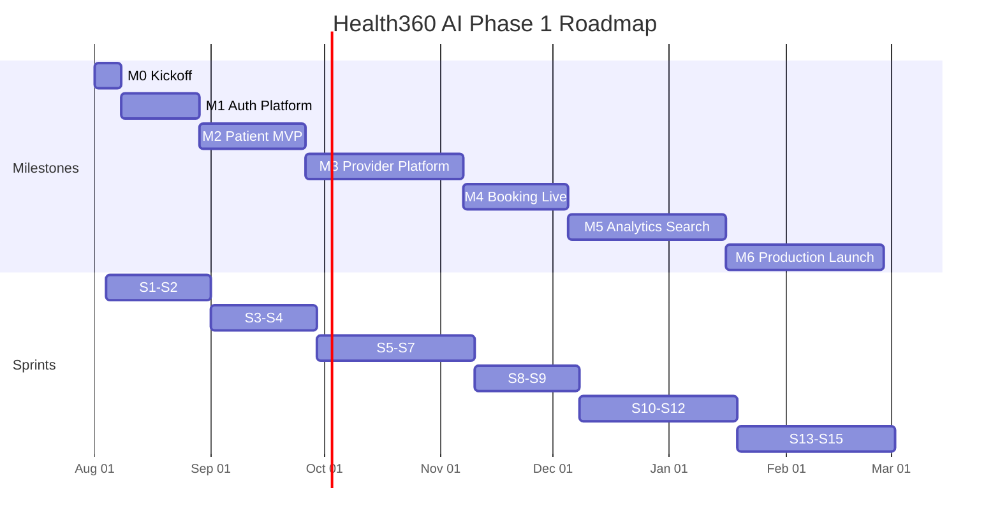

# DOC-15: Health360 AI — Development Roadmap

| Attribute | Value |
|-----------|-------|
| **Document ID** | DOC-15 |
| **Title** | Development Roadmap |
| **Version** | 1.1 |
| **Status** | **Approved** |
| **Date** | 2026-07-29 |
| **Last Updated** | 2026-07-30 |
| **Author** | Technical Lead / Engineering Manager |
| **References** | [DOC-01] Vision, [DOC-11] Architecture, [DOC-13] DevOps, [DOC-14] User Stories |
| **Next Document** | [DOC-16] Architecture Diagrams Pack |

---

## 1. Executive Summary

This document defines the **phased implementation plan** for Health360 AI Phase 1 — translating the approved backlog [DOC-14] into milestones, sprints, technical workstreams, and a production launch sequence.

**Timeline Summary:**

| Milestone | Target | Outcome |
|-----------|--------|---------|
| **M0** — Project Kickoff | Week 0 | Repo, CI/CD skeleton, local dev stack |
| **M1** — Auth Platform Live | Week 4 | Registration, login, RBAC on staging |
| **M2** — Patient MVP | Week 8 | Health profile + consent on staging |
| **M3** — Provider Platform | Week 14 | Doctor verification + hospital setup |
| **M4** — Booking Live | Week 18 | End-to-end appointment booking |
| **M5** — Analytics & Search | Week 24 | Dashboard, formula engine, discovery |
| **M6** — Phase 1 Launch | Week 30 | Production release (all P0 + selected P1) |

**Total Duration:** ~30 weeks (15 two-week sprints) at **25 story points/sprint** velocity [DOC-14 §16].

---

## 2. Roadmap Principles

| Principle | Application |
|-----------|-------------|
| **Vertical Slices** | Each sprint delivers testable user-facing capability, not layer-only work |
| **Foundation First** | IAM and shared infrastructure before domain modules |
| **MVP Then Expand** | P0 stories gate milestones; P1 fills out before launch |
| **Four-Deliverable Sprints** | Every sprint ships Backend + Web + Mobile + Documentation — see §2.1 |
| **Parallel Workstreams** | Backend, frontend, mobile, and infra progress concurrently within sprints; mobile is never deferred |
| **Continuous Deployment** | Every merge to `develop` deploys to staging [DOC-13] |
| **Risk-Front Loading** | Booking concurrency, formula engine, and verification workflow scheduled early enough for rework |
| **Documentation Complete Before Code Freeze** | DOC-01–DOC-16 approved before production launch [DOC-01 §11] |

---

## 2.1 Permanent Four-Deliverable Workflow

**Effective 2026-07-30.** Backend and web development continue without interruption. Mobile development is an equal workstream from this sprint onward.

### Mandatory Sprint Deliverables

| # | Deliverable | Path | Definition of Done |
|---|-------------|------|---------------------|
| 1 | **Backend** (Spring Boot) | `backend/health360-api/` | Migrations, APIs, domain logic, RBAC, tests green |
| 2 | **Web Frontend** (React + Vite) | `frontend/health360-web/` | Feature screens, build passes, role routing |
| 3 | **Mobile** (React Native) | `mobile/health360-mobile/` | Equivalent screens consuming same REST APIs |
| 4 | **Documentation** | `docs/mobile/` | Screens, APIs, navigation, components, pending work |

### Within-Sprint Execution Order

1. Finish backend feature
2. Finish web frontend feature
3. Implement equivalent mobile feature
4. Update mobile documentation

### Mobile Catch-Up Program

Backend and web are ahead of mobile (scaffold only). Mobile catches up **one sprint at a time** (S1 → S2 → … → current sprint) while ongoing sprints (S8+) continue on all three codebases. **Do not implement entire mobile catch-up in a single iteration.**

| Sprint | Mobile Deliverable (Catch-Up) |
|--------|------------------------------|
| S1 | Auth stack — login, register, verify email, token storage |
| S2 | Account settings, change password, notification preferences, RBAC nav |
| S3 | Patient profile — consent + profile sections |
| S4 | Vitals recording + profile completion widget + patient tab shell |
| S5 | Doctor profile accordion |
| S6 | Doctor verification — document upload, submit, status |
| S7 | Hospital setup — profile, branches, doctor association |

See [MOBILE-STRAT-001](mobile/MOBILE_DEVELOPMENT_STRATEGY.md) and [MOBILE-STATUS-001](mobile/MOBILE_SPRINT_STATUS.md).

### Sprint Review Checklist

Every sprint review reports:

- ✓ Backend work completed
- ✓ Web work completed
- ✓ Mobile work completed
- ✓ Database migrations
- ✓ APIs added
- ✓ Documentation updated
- ✓ Tests passed
- ✓ Remaining work

---

## 3. Team & Capacity Assumptions

### 3.1 Recommended Team (Phase 1)

| Role | Count | Primary Focus |
|------|-------|---------------|
| Technical Lead / Architect | 1 | Architecture, code review, cross-module integration |
| Backend Engineer (Java/Spring) | 2 | Modular monolith modules, API, formula engine |
| Frontend Engineer (React) | 2 | Web portals (Patient, Doctor, Hospital, Admin) |
| Mobile Engineer (React Native) | 1 | Patient + Doctor mobile apps |
| DevOps Engineer | 1 | AWS, CI/CD, monitoring (0.5 FTE from M0; full from M3) |
| QA Engineer | 1 | Test automation, staging validation, load test |
| Product Owner | 1 | Backlog prioritization, acceptance |
| UI/UX Designer | 0.5 | Design tokens, screen polish (front-loaded S1–S4) |

**Total:** ~9.5 FTE

### 3.2 Velocity Assumptions

| Parameter | Value | Source |
|-----------|-------|--------|
| Sprint length | 2 weeks | Standard Agile |
| Target velocity | 25 story points/sprint | [DOC-14] — 342 pts ÷ ~14 productive sprints |
| P0 backlog | 58 stories / ~280 points | [DOC-14] |
| P1 backlog | 20 stories / ~55 points | [DOC-14] |
| P2 backlog | 1 story / 8 points | [DOC-14] — stretch goal |

### 3.3 Workstream Allocation (Per Sprint)

| Workstream | Typical Capacity Split |
|------------|------------------------|
| Backend | 30% |
| Frontend (Web) | 30% |
| Mobile | 25% |
| Documentation | 5% |
| DevOps / QA | 10% |

Mobile capacity includes catch-up work for S1–S7 until mobile reaches parity with backend/web.

---

## 4. Milestone Overview

### 4.1 Milestone Definitions

#### M0 — Project Kickoff (Week 0)

**Goal:** Development environment operational; team aligned on architecture.

| Deliverable | Owner | Acceptance |
|-------------|-------|------------|
| Monorepo scaffold per [DOC-11] | Tech Lead | `backend/`, `frontend/`, `mobile/`, `docker/` exist |
| Docker Compose local stack | DevOps | Full stack ≤ 5 min [NFR-OPS-018] |
| GitHub Actions CI (build + test) | DevOps | PR checks pass on empty scaffold |
| Spring Boot skeleton with 7 module packages | Backend | App starts; health endpoint 200 |
| React app shell with routing + MUI theme | Frontend | Landing page renders |
| Flyway V001 — shared + IAM schema | Backend | Migration runs clean [DOC-06 §3–4] |
| Coding standards documented | Tech Lead | README + PR template |

---

#### M1 — Auth Platform Live (Week 4, end of S2)

**Goal:** Secure authentication and authorization on staging.

| Deliverable | Stories | Demo Scenario |
|-------------|---------|---------------|
| Registration + email verification | US-IAM-001, US-IAM-002 | Guest registers as Patient |
| Login + token refresh + logout | US-IAM-003–005 | User logs in; token refreshes |
| RBAC enforcement | US-IAM-007 | Patient gets 403 on admin route |
| Password change + profile settings | US-IAM-006, US-IAM-008 | User updates profile |
| Audit logging | US-IAM-010 | Mutation creates audit entry |

**Exit Criteria:**
- [ ] All P0 IAM stories through US-IAM-010 complete
- [ ] JWT RS256 + refresh rotation working [DOC-12]
- [ ] Staging deploy automated on `develop` merge
- [ ] Security review of auth flow passed

---

#### M2 — Patient MVP (Week 8, end of S4)

**Goal:** Patient can build core health profile with consent.

| Deliverable | Stories | Demo Scenario |
|-------------|---------|---------------|
| Health data consent | US-PAT-001 | Consent gate before profile |
| Profile sections (basic → emergency) | US-PAT-002–007 | Section-by-section save |
| Vital signs recording | US-PAT-009 | BP logged with classification |
| Profile completion score | US-PAT-014 | Dashboard shows % complete |

**Exit Criteria:**
- [ ] All P0 patient profile stories complete (except US-PAT-015)
- [ ] Flyway migrations through patient schema [DOC-06 §5]
- [ ] Patient web portal navigable (SCR-PAT-001–010)
- [ ] Mobile patient profile screens (core sections)

---

#### M3 — Provider Platform (Week 14, end of S7)

**Goal:** Doctors onboarded and verified; hospitals configured.

| Deliverable | Stories | Demo Scenario |
|-------------|---------|---------------|
| Doctor profile + qualifications | US-DOC-001–005, US-DOC-008 | Doctor completes draft profile |
| Verification workflow | US-DOC-010–012 | Admin approves doctor |
| Hospital + branches | US-HOS-001–006 | Hospital admin adds branch |
| Doctor-hospital association | US-DOC-007, US-HOS-005 | Doctor linked to hospital |

**Exit Criteria:**
- [ ] Verified doctor searchable internally (pre-search module)
- [ ] Admin verification queue operational (SCR-ADM-003)
- [ ] Flyway migrations through doctor + hospital schemas [DOC-06 §6–7]
- [ ] Doctor and hospital admin portals functional

---

#### M4 — Booking Live (Week 18, end of S9)

**Goal:** End-to-end appointment booking with notifications.

| Deliverable | Stories | Demo Scenario |
|-------------|---------|---------------|
| Schedule templates + slot generation | US-SCH-001–002 | Doctor sets weekly schedule |
| Availability calendar | US-SCH-003 | Patient sees open slots |
| Atomic booking | US-SCH-004 | Patient books appointment |
| Cancel + reschedule | US-SCH-005–006 | Patient reschedules within policy |
| Appointment lifecycle | US-SCH-007–008 | Doctor marks completed |
| Notifications + reminders | US-NTF-001–002 | Confirmation email + T-24h reminder |

**Exit Criteria:**
- [ ] UC-007 Book Appointment passes full QA [DOC-03]
- [x] Zero double-bookings in concurrency test [R-007]
- [x] Flyway scheduling schema deployed [DOC-06 §8]
- [x] 5-step booking wizard complete (SCR-PAT-016)

---

#### M5 — Analytics & Search (Week 24, end of S12)

**Goal:** Health dashboard live; patients discover providers.

| Deliverable | Stories | Demo Scenario |
|-------------|---------|---------------|
| Formula engine (20 formulas) | US-ANL-002, US-ANL-006 | BMI, Wellness Score calculated |
| Health dashboard | US-ANL-001, US-ANL-003–005 | Patient views dashboard |
| Unified search + filters | US-SRH-001–003 | Patient finds doctor by specialty |
| Geo search | US-LOC-002–004 | Nearby hospitals displayed |
| Public profiles | US-DOC-013, US-HOS-008 | Guest views doctor profile |

**Exit Criteria:**
- [ ] UC-004 View Health Dashboard passes QA
- [ ] UC-005 Search & Discover passes QA
- [ ] All 20 formulas validated against [DOC-08] test vectors
- [ ] Search p95 < 500ms in staging load test [NFR-PERF-003]
- [ ] API p95 < 300ms for core endpoints [NFR-PERF-002]

---

#### M6 — Phase 1 Production Launch (Week 30, end of S15)

**Goal:** Production-ready platform with full P0 + selected P1 features.

| Deliverable | Stories | Notes |
|-------------|---------|-------|
| P1 patient features | US-PAT-008–013 | Family, labs, goals, documents, timeline |
| Admin user management | US-IAM-011–012 | Platform admin tools |
| Reviews + moderation | US-REV-001–002 | Post-appointment reviews |
| Maps + travel time | US-LOC-001, US-LOC-005–006 | Enhanced discovery |
| Doctor block slots | US-SCH-009 | Schedule flexibility |
| Doctor patient summary | US-PAT-015 | Limited PHI during appointment |
| PDF export (stretch) | US-ANL-008 | P2 — include if capacity |

**Exit Criteria:** All gates in §10 Production Launch Checklist passed.

---

## 5. Sprint Plan (Detailed)

### Sprint Calendar (Indicative)

| Sprint | Dates (2026) | Focus | Points | Milestone |
|--------|--------------|-------|--------|-----------|
| **S0** | Aug 1–7 | Kickoff / scaffold | — | M0 |
| **S1** | Aug 8–21 | Auth foundation | 23 | M1 |
| **S2** | Aug 22–Sep 4 | RBAC + account mgmt | 22 | M1 |
| **S3** | Sep 5–18 | Patient profile core | 27 | M2 |
| **S4** | Sep 19–Oct 2 | Vitals + completion | 21 | M2 |
| **S5** | Oct 3–16 | Doctor profile | 17 | M3 |
| **S6** | Oct 17–30 | Doctor verification | 18 | M3 |
| **S7** | Oct 31–Nov 13 | Hospital setup | 26 | M3 |
| **S8** | Nov 14–27 | Scheduling core | 23 | M4 |
| **S9** | Nov 28–Dec 11 | Scheduling lifecycle + NTF | 21 | M4 |
| **S10** | Dec 12–25 | Formula engine | 18 | M5 |
| **S11** | Dec 26–Jan 8 | Health dashboard | 23 | M5 |
| **S12** | Jan 9–22 | Search + location | 18 | M5 |
| **S13** | Jan 23–Feb 5 | Public profiles + maps | 15 | M6 |
| **S14** | Feb 6–19 | P1 features + admin | 27 | M6 |
| **S15** | Feb 20–Mar 5 | Polish + hardening | 29 | M6 |

---

### S0 — Project Kickoff (Week 0)

| Workstream | Tasks |
|------------|-------|
| **Infra** | Create repo; Docker Compose; GitHub Actions CI skeleton; `.env.example` |
| **Backend** | Spring Boot 3 scaffold; module packages; Flyway V001 (shared + IAM); health endpoint |
| **Frontend** | React 19 + Vite + MUI; routing shell; design tokens from [DOC-10] |
| **Mobile** | React Native scaffold; navigation shell |
| **All** | Architecture walkthrough [DOC-11]; backlog grooming [DOC-14] |

**Sprint Goal:** Developer can clone repo and run `docker compose up` successfully.

---

### S1 — Auth Foundation (23 pts)

| ID | Story | Pts | Workstream |
|----|-------|-----|------------|
| US-IAM-001 | Register Account | 5 | BE + FE |
| US-IAM-002 | Verify Email | 3 | BE + FE |
| US-IAM-003 | Login | 8 | BE + FE + Mobile |
| US-IAM-004 | Refresh Token | 5 | BE |
| US-IAM-005 | Logout | 2 | BE + FE |
| US-IAM-010 | Audit Log Recording | 5 | BE |

**Technical Tasks:**
- Implement JWT RS256 key pair [DOC-12]
- Redis refresh token store [ADR-003]
- SCR-PUB-002, SCR-PUB-003, SCR-PUB-004

**Mobile Deliverables:**
- Initialize React Native project; install stack (Navigation, Query, Axios, RHF, Zod, Paper)
- Auth stack screens: Login, Register, Verify Email
- Secure token storage; Axios client with refresh interceptor (mirror web)
- Root navigator with authenticated/unauthenticated gates

**Sprint Goal:** Patient can register, verify email, and log in on web **and mobile**.

---

### S2 — RBAC + Account Management (22 pts)

| ID | Story | Pts | Workstream |
|----|-------|-----|------------|
| US-IAM-007 | Role-Based Access Control | 8 | BE |
| US-IAM-006 | Change Password | 3 | BE + FE |
| US-IAM-008 | Account Profile Settings | 3 | BE + FE |
| US-IAM-009 | Notification Preferences | 3 | BE + FE |
| — | Staging CI/CD pipeline | — | DevOps |
| — | Integration test suite (auth) | — | QA |

**Mobile Deliverables:**
- Account settings screen; change password; notification preferences
- Role-aware navigation shell (Patient / Doctor / Admin routes)
- Settings stack accessible from profile menu

**Sprint Goal:** RBAC enforced; staging auto-deploy operational [M1 exit]. Mobile S2 catch-up complete when settings screens ship.

---

### S3 — Patient Profile Core (27 pts)

| ID | Story | Pts | Workstream |
|----|-------|-----|------------|
| US-PAT-001 | Create Patient Profile | 5 | BE + FE |
| US-PAT-002 | Update Basic Information | 3 | BE + FE + Mobile |
| US-PAT-003 | Update Contact Information | 3 | BE + FE |
| US-PAT-004 | Update Physical Measurements | 5 | BE + FE |
| US-PAT-005 | Manage Medical Information | 5 | BE + FE |
| US-PAT-006 | Update Lifestyle Profile | 3 | BE + FE |
| US-PAT-007 | Manage Emergency Contacts | 3 | BE + FE |

**Technical Tasks:**
- Flyway V002 — patient schema [DOC-06 §5]
- SCR-PAT-015 (consent), SCR-PAT-002–008
- Zod + Jakarta dual validation [ADR-008]

**Mobile Deliverables:**
- Consent screen; patient profile sections (mobile accordion / expandable sections)
- React Query hooks mirroring `usePatientQueries`
- Save-per-section with optimistic cache updates

**Sprint Goal:** Patient completes core profile sections with consent on web **and mobile**.

---

### S4 — Vitals + Profile Completion (21 pts)

| ID | Story | Pts | Workstream |
|----|-------|-----|------------|
| US-PAT-009 | Record Vital Signs | 5 | BE + FE + Mobile |
| US-PAT-014 | Profile Completion Score | 5 | BE + FE |
| — | Revisit US-PAT-004–006 polish | — | FE |
| — | Patient portal navigation shell | — | FE |

**Mobile Deliverables:**
- Patient bottom tabs: Dashboard, Profile, Vitals, Settings
- Vitals entry form with native numeric inputs; latest vitals cards
- Profile completion score widget on dashboard

**Sprint Goal:** Vitals recorded; completion score visible [M2 exit] on web **and mobile**.

---

### S5 — Doctor Profile (17 pts)

| ID | Story | Pts | Workstream |
|----|-------|-----|------------|
| US-DOC-001 | Create Doctor Profile | 3 | BE + FE |
| US-DOC-002 | Update Professional Details | 3 | BE + FE |
| US-DOC-003 | Manage Qualifications | 3 | BE + FE |
| US-DOC-004 | Manage Experience | 3 | BE + FE |
| US-DOC-005 | Set Specialization | 3 | BE + FE |
| US-DOC-008 | Set Consultation Fee & Types | 3 | BE + FE |

**Technical Tasks:**
- Flyway V003 — doctor schema [DOC-06 §6]
- SCR-DOC-002, SCR-DOC-003

**Mobile Deliverables:**
- Doctor profile accordion (professional details, qualifications, experience, specialization, consultation defaults)
- Doctor role routing after login
- Specialization picker (native/modal list)

**Sprint Goal:** Doctor completes professional profile in draft status on web **and mobile**.

---

### S6 — Doctor Verification (18 pts)

| ID | Story | Pts | Workstream |
|----|-------|-----|------------|
| US-DOC-010 | Upload Verification Documents | 5 | BE + FE |
| US-DOC-011 | Submit for Verification | 5 | BE + FE |
| US-DOC-012 | Doctor Verification Review | 8 | BE + FE |
| US-DOC-006 | Manage Languages | 2 | BE + FE |

**Technical Tasks:**
- S3 presigned upload [DOC-07]
- SCR-DOC-005, SCR-ADM-003, SCR-ADM-004

**Mobile Deliverables:**
- Document upload via native camera/file picker
- Submit for verification flow; verification status screen
- Languages management section

**Sprint Goal:** Admin can verify doctors; verified badge visible internally. Mobile verification UX complete.

---

### S7 — Hospital Setup (26 pts)

| ID | Story | Pts | Workstream |
|----|-------|-----|------------|
| US-HOS-001 | Create Hospital Profile | 5 | BE + FE |
| US-HOS-002 | Manage Branches | 5 | BE + FE |
| US-HOS-003 | Manage Departments | 3 | BE + FE |
| US-HOS-005 | Map Doctors to Hospital | 5 | BE + FE |
| US-HOS-006 | Emergency & ICU Information | 3 | BE + FE |
| US-DOC-007 | Hospital Association | 5 | BE + FE |

**Technical Tasks:**
- Flyway V004 — hospital schema [DOC-06 §7]
- SCR-HOS-002–006, SCR-DOC-004
- Geocoding integration start [US-LOC-002 prep]

**Mobile Deliverables:**
- Hospital profile and branch management screens
- Department list; doctor association mapping
- Emergency/ICU information forms
- Hospital admin role routing

**Sprint Goal:** Hospital operational with verified doctors associated [M3 exit] on web **and mobile**.

---

### S8 — Scheduling Core (23 pts)

| ID | Story | Pts | Workstream |
|----|-------|-----|------------|
| US-SCH-001 | Define Weekly Schedule Template | 5 | BE + FE |
| US-SCH-002 | Generate Time Slots | 5 | BE |
| US-SCH-003 | View Doctor Availability | 5 | BE + FE + Mobile |
| US-SCH-004 | Book Appointment | 8 | BE + FE + Mobile |

**Technical Tasks:**
- Flyway V005 — scheduling schema [DOC-06 §8]
- Pessimistic locking for slot booking [R-007]
- SCR-DOC-006, SCR-PAT-016 (wizard steps 1–5)

**Sprint Goal:** Patient books appointment end-to-end on staging.

---

### S9 — Scheduling Lifecycle + Notifications (21 pts)

| ID | Story | Pts | Workstream |
|----|-------|-----|------------|
| US-SCH-005 | Cancel Appointment | 5 | BE + FE |
| US-SCH-006 | Reschedule Appointment | 5 | BE + FE |
| US-SCH-007 | Appointment Status Lifecycle | 5 | BE + FE |
| US-SCH-008 | Appointment History | 3 | BE + FE + Mobile |
| US-NTF-001 | Send Transactional Notification | 5 | BE |
| US-NTF-002 | Schedule Appointment Reminders | 3 | BE |

**Technical Tasks:**
- AWS SES/SNS integration [DOC-13]
- Background job scheduler (Spring @Scheduled or Quartz)
- SCR-PAT-017, SCR-PAT-018, SCR-DOC-007–008

**Sprint Goal:** Full appointment lifecycle with notifications [M4 exit].

---

### S10 — Formula Engine (18 pts)

| ID | Story | Pts | Workstream |
|----|-------|-----|------------|
| US-ANL-002 | Formula Engine Execution | 13 | BE |
| US-ANL-006 | Automatic Recalculation | 5 | BE |

**Technical Tasks:**
- Flyway V006 — analytics schema [DOC-06 §9]
- Implement FML-001–020 per [DOC-08]
- Unit tests with medical test vectors
- Domain service isolation in `analytics` module

**Sprint Goal:** All 20 formulas pass automated test suite.

---

### S11 — Health Dashboard (23 pts)

| ID | Story | Pts | Workstream |
|----|-------|-----|------------|
| US-ANL-001 | Health Dashboard | 8 | BE + FE + Mobile |
| US-ANL-003 | Metric Classification | 5 | BE + FE |
| US-ANL-004 | Wellness Score | 5 | BE + FE |
| US-ANL-005 | Health Risk Score | 5 | BE + FE |

**Technical Tasks:**
- SCR-PAT-001, SCR-PAT-022
- TanStack Query data fetching [ADR-009]
- Chart components for trends

**Sprint Goal:** Patient views complete health dashboard with scores.

---

### S12 — Search + Location (18 pts)

| ID | Story | Pts | Workstream |
|----|-------|-----|------------|
| US-SRH-001 | Unified Search | 5 | BE + FE |
| US-SRH-002 | Doctor Search Filters | 5 | BE + FE + Mobile |
| US-SRH-003 | Hospital Search Filters | 3 | BE + FE |
| US-LOC-002 | Geocode Address | 3 | BE |
| US-LOC-003 | Nearby Hospitals Search | 5 | BE + FE |
| US-LOC-004 | Nearby Doctors Search | 5 | BE + FE |

**Technical Tasks:**
- Google Maps API integration [ASM-002]
- Redis geo cache [NFR-PERF-005]
- SCR-PUB-005, SCR-PUB-006

**Sprint Goal:** Patient discovers verified doctors and hospitals [M5 exit].

---

### S13 — Public Profiles + Maps (15 pts)

| ID | Story | Pts | Workstream |
|----|-------|-----|------------|
| US-DOC-013 | Public Doctor Profile | 5 | BE + FE + Mobile |
| US-HOS-008 | Public Hospital Profile | 5 | BE + FE |
| US-LOC-001 | Google Maps Integration | 5 | FE |
| US-DOC-014 | Doctor Ratings Display | 3 | BE + FE |

**Technical Tasks:**
- SCR-PUB-007, SCR-PUB-008
- Public (unauthenticated) API routes
- SEO meta tags on public pages

**Sprint Goal:** Guest can browse doctor/hospital profiles without login.

---

### S14 — P1 Features + Admin (27 pts)

| ID | Story | Pts | Workstream |
|----|-------|-----|------------|
| US-PAT-008 | Manage Family Members | 3 | BE + FE |
| US-PAT-010 | Record Lab Values | 5 | BE + FE |
| US-PAT-011 | Manage Health Goals | 3 | BE + FE |
| US-PAT-012 | Upload Health Documents | 5 | BE + FE |
| US-PAT-013 | View Health Timeline | 5 | BE + FE |
| US-IAM-011 | Platform Admin User Management | 5 | BE + FE |
| US-IAM-012 | Account Deactivation | 3 | BE + FE |
| US-REV-001 | Submit Review | 5 | BE + FE |
| US-REV-002 | Review Moderation | 3 | BE + FE |

**Sprint Goal:** P1 patient features and admin tools complete.

---

### S15 — Polish + Hardening (29 pts)

| ID | Story | Pts | Workstream |
|----|-------|-----|------------|
| US-ANL-007 | Health Timeline Visualization | 5 | FE |
| US-ANL-008 | Export Health Report (PDF) | 8 | BE + FE |
| US-LOC-005 | Distance & Travel Time | 5 | BE + FE |
| US-LOC-006 | Mobile Location Permission | 3 | Mobile |
| US-SCH-009 | Doctor Block Time Slot | 5 | BE + FE |
| US-PAT-015 | Doctor View Patient Summary | 8 | BE + FE |
| US-HOS-004 | Manage Facilities | 3 | BE + FE |
| US-HOS-007 | Hospital Image Gallery | 5 | BE + FE |
| US-DOC-009 | Biography, Awards & Memberships | 3 | BE + FE |

**Non-Feature Tasks (all workstreams):**
- Load testing [NFR-PERF-001–003]
- Penetration test [NFR-SEC-050]
- Production Terraform apply [DOC-13]
- Backup/restore drill [NFR-AVAIL-011]
- Bug burn-down; accessibility audit [NFR-USE-005]

**Sprint Goal:** Production launch [M6 exit].

---

## 6. Technical Delivery Sequence

### 6.1 Database Migration Order

| Flyway Version | Schema | Sprint | Tables (approx) |
|----------------|--------|--------|-----------------|
| V001 | shared + iam | S0 | 8 |
| V002 | patient | S3 | 14 |
| V003 | doctor | S5 | 10 |
| V004 | hospital | S7 | 8 |
| V005 | scheduling | S8 | 6 |
| V006 | analytics | S10 | 4 |
| V007 | location (geo cache) + search indexes | S12 | 2 + indexes |
| V008 | reviews + notifications | S9/S14 | 4 |

**Total:** 52 tables per [DOC-06]

### 6.2 API Module Delivery Order

| Module | Base Path | Sprint | Endpoints (approx) |
|--------|-----------|--------|-------------------|
| IAM | `/api/v1/auth`, `/api/v1/users` | S1–S2 | 18 |
| Patient | `/api/v1/patients` | S3–S4 | 22 |
| Doctor | `/api/v1/doctors` | S5–S6 | 20 |
| Hospital | `/api/v1/hospitals` | S7 | 14 |
| Scheduling | `/api/v1/appointments`, `/api/v1/schedules` | S8–S9 | 16 |
| Analytics | `/api/v1/analytics` | S10–S11 | 10 |
| Location | `/api/v1/locations` | S12 | 6 |
| Search | `/api/v1/search` | S12 | 4 |
| Reviews | `/api/v1/reviews` | S14 | 4 |
| Notifications | `/api/v1/notifications` | S9 | 3 |

**Total:** 117 endpoints per [DOC-07]

### 6.3 Frontend & Mobile Portal Delivery

| Portal | Web Screens | Mobile Screens | Target Sprint |
|--------|-------------|----------------|---------------|
| Public | SCR-PUB-001–008 | Auth + landing | S1–S2 |
| Patient | SCR-PAT-001–022 | Profile, vitals, dashboard, booking | S3–S4, S8–S11, S14–S15 |
| Doctor | SCR-DOC-001–010 | Profile, verification, schedule | S5–S9, S15 |
| Hospital Admin | SCR-HOS-001–008 | Hospital setup, branches | S7, S15 |
| Platform Admin | SCR-ADM-001–006 | Verification review (limited mobile) | S6, S14 |

Mobile delivery follows [MOBILE-STRAT-001](mobile/MOBILE_DEVELOPMENT_STRATEGY.md). Catch-up S1–S7 runs in parallel with S8+ inline delivery.

---

## 7. MVP vs Full Phase 1 Scope

### 7.1 MVP Cut (M4 — Week 18)

Minimum viable product for **limited beta** — core booking loop only:

| Included | Excluded (defer to M5–M6) |
|----------|---------------------------|
| Auth (P0 IAM) | P1 patient features (labs, documents, timeline) |
| Patient core profile + vitals | Health dashboard + formula engine |
| Doctor verification + hospital | Search + geo discovery |
| Appointment booking + notifications | Reviews |
| Web + mobile patient + doctor portals | — |
| Staging environment | Production launch |

**MVP Demo Script:** Register → build profile → admin verifies doctor → hospital setup → search doctor (internal) → book appointment → receive confirmation.

### 7.2 Full Phase 1 Launch (M6 — Week 30)

All P0 stories (58) + P1 stories (20) + optional P2 (US-ANL-008 PDF export).

---

## 8. Infrastructure Roadmap

| Sprint | Infrastructure Deliverable |
|--------|---------------------------|
| S0 | Docker Compose local; GitHub Actions CI |
| S2 | Staging AWS (ECS, RDS, Redis); auto-deploy `develop` |
| S4 | CloudWatch dashboards; Sentry integration |
| S7 | Terraform modules (VPC, ECS, RDS) |
| S9 | SES/SNS notification pipeline |
| S12 | External uptime monitoring |
| S14 | Production AWS environment (manual gate) |
| S15 | Load test environment; WAF (P1); production launch |

---

## 9. Quality & Testing Roadmap

| Sprint | QA Activity |
|--------|-------------|
| S1–S2 | Auth integration tests; security unit tests |
| S4 | Patient profile E2E (Playwright) |
| S8 | Booking concurrency test (Testcontainers + parallel threads) |
| S10 | Formula engine test vectors (all FML-001–020) |
| S11 | Dashboard E2E |
| S12 | Search load test (k6 — 100 concurrent users) |
| S14 | Full regression suite |
| S15 | Penetration test; staging → prod smoke; UAT (n≥10) [DOC-01 §11] |

---

## 10. Production Launch Checklist

Aligned with [DOC-04 §16] Production Readiness Gate and [DOC-01 §11] Success Criteria.

### 10.1 Functional Gate

- [ ] All 58 P0 user stories accepted by Product Owner
- [ ] All 7 domain modules operational end-to-end
- [ ] UC-001 through UC-011 pass QA
- [ ] No P0 bugs open

### 10.2 Security Gate

- [ ] Penetration test passed (zero critical/high) [NFR-SEC-050]
- [ ] JWT rotation verified in production config
- [ ] RBAC matrix tested for all roles [DOC-12]
- [ ] Secrets in AWS Secrets Manager only [NFR-OPS-017]
- [ ] Audit logs retained with 7-year S3 policy

### 10.3 Performance Gate

- [ ] API p95 < 300ms [NFR-PERF-002]
- [ ] Search p95 < 500ms [NFR-PERF-003]
- [ ] Dashboard load < 2s [NFR-PERF-004]
- [ ] Booking concurrency test passed (100 parallel)

### 10.4 Availability Gate

- [ ] Health checks on ALB + ECS
- [ ] RDS backup + restore tested [NFR-AVAIL-011]
- [ ] Rollback drill ≤ 10 minutes [NFR-OPS-016]
- [ ] Uptime monitor active [NFR-OPS-012]

### 10.5 Operability Gate

- [ ] CI/CD pipeline green [NFR-OPS-002]
- [ ] CloudWatch dashboards + P0 alerts [NFR-OPS-013]
- [ ] Sentry error tracking active [NFR-OPS-010]
- [ ] Runbooks RB-001 through RB-008 drafted [DOC-13 §20]

### 10.6 Compliance Gate

- [ ] Health data consent flow live [US-PAT-001]
- [ ] Privacy policy + Terms of Service published
- [ ] Data residency ap-south-1 confirmed [NFR-COMP-010]
- [ ] Medical disclaimers on all analytics [AC-ANL-006]

### 10.7 Documentation Gate

- [ ] DOC-01 through DOC-16 approved
- [ ] API docs (Swagger) accessible at `/swagger-ui.html`
- [ ] README with local setup instructions

---

## 11. Risk Timeline

| Risk | Sprint to Mitigate | Action |
|------|-------------------|--------|
| R-001 Scope creep | Ongoing | Change control board; [DOC-00 §6] reference |
| R-002 Verification bottleneck | S6 | Admin SLA: 48h review; notification on submit |
| R-003 Google Maps cost | S12 | Redis cache; monitor API usage dashboard |
| R-004 Profile UX drop-off | S3–S4 | Progressive completion; section save |
| R-005 Formula accuracy | S10 | Medical advisory review before S11 |
| R-006 Multi-tenant delay | S0 | Single-tenant MVP; tenant_id in schema |
| R-007 Double booking | S8 | Pessimistic lock + integration test in CI |
| Team velocity shortfall | S6, S12 | Re-prioritize P1; defer P2; add contractor |
| Holiday slowdown (Dec–Jan) | S10–S11 | Front-load S8–S9; reduce S11 scope if needed |

---

## 12. Communication Plan

| Cadence | Audience | Content |
|---------|----------|---------|
| Daily standup | Engineering team | Blockers, sprint progress |
| Sprint review (biweekly) | PO + stakeholders | Demo of sprint goal |
| Sprint retrospective | Engineering team | Process improvements |
| Milestone review | Executive sponsors | M1–M6 exit criteria status |
| Monthly steering | Product Owner + Tech Lead | Scope, risk, timeline |

---

## 13. Post-Launch (Phase 1.5 Preview)

Not in Phase 1 scope — logged for future roadmap:

| Item | Trigger |
|------|---------|
| MFA / 2FA | Security audit recommendation |
| Multi-tenant isolation enforcement | Second hospital group onboarded |
| CloudFront CDN | Latency complaints from non-Mumbai users |
| Kubernetes (EKS) | Traffic exceeds ECS auto-scale limits |
| Pharmacy / Lab modules | Phase 2 charter approved |

---

## 14. Requirements Traceability

| Roadmap Element | Source Document |
|-----------------|-----------------|
| 15 sprints / 342 points | [DOC-14 §3, §16] |
| 7 modules | [DOC-01 §5], [DOC-05] |
| Milestone success criteria | [DOC-01 §11] |
| Production gates | [DOC-04 §16] |
| Sprint technical tasks | [DOC-06], [DOC-07], [DOC-11] |
| Auth / deploy sequence | [DOC-12], [DOC-13] |
| Formula delivery | [DOC-08] |
| Screen delivery | [DOC-10] |
| Mobile strategy | [MOBILE-STRAT-001](mobile/MOBILE_DEVELOPMENT_STRATEGY.md), [MOBILE-STATUS-001](mobile/MOBILE_SPRINT_STATUS.md) |

---

## 15. Approval

| Role | Name | Signature | Date | Status |
|------|------|-----------|------|--------|
| Product Owner | _________________ | _________________ | ________ | Pending |
| Technical Lead / Architect | _________________ | _________________ | ________ | Pending |
| Engineering Manager | _________________ | _________________ | ________ | Pending |
| DevOps Lead | _________________ | _________________ | ________ | Pending |

---

*End of DOC-15 — Development Roadmap v1.0*
