# DOC-16: Health360 AI — Architecture Diagrams Pack

| Attribute | Value |
|-----------|-------|
| **Document ID** | DOC-16 |
| **Title** | Architecture Diagrams Pack |
| **Version** | 1.0 |
| **Status** | **Approved** |
| **Date** | 2026-07-29 |
| **Author** | Chief Software Architect / Technical Lead |
| **References** | [DOC-01]–[DOC-15] — All foundation documents |
| **Next Document** | — (Final deliverable in Phase 1 documentation program) |

---

## 1. Executive Summary

This document consolidates the **visual architecture artifacts** for Health360 AI Phase 1. It contains **20 Mermaid diagrams** covering system context, containers, use cases, domain model, database, components, deployment, sequences, activities, and state machines.

**Purpose:** Single reference for stakeholders, engineers, and QA to understand system structure, interactions, and data relationships without reading all 15 prior documents.

**Notation:** Mermaid syntax (renderable in GitHub, GitLab, and most Markdown viewers).

---

## 2. Diagram Catalog

| ID | Diagram | Type | Primary Source |
|----|---------|------|----------------|
| DIA-001 | System Context | C4 Level 1 | [DOC-01 §18] |
| DIA-002 | Container Diagram | C4 Level 2 | [DOC-11 §2] |
| DIA-003 | Use Case Diagram | UML Use Case | [DOC-03 §14] |
| DIA-004 | Bounded Context Map | DDD Context Map | [DOC-05 §2] |
| DIA-005 | Entity Relationship Diagram | ER | [DOC-06 §10] |
| DIA-006 | Domain Class Diagram — Patient & IAM | UML Class | [DOC-05 §3–4] |
| DIA-007 | Domain Class Diagram — Doctor & Scheduling | UML Class | [DOC-05 §5–7] |
| DIA-008 | Component Diagram | UML Component | [DOC-11 §4–7] |
| DIA-009 | Deployment Diagram | Infrastructure | [DOC-13 §4] |
| DIA-010 | Sequence — Authentication | UML Sequence | [DOC-12 §4] |
| DIA-011 | Sequence — Book Appointment | UML Sequence | [DOC-03 UC-007] |
| DIA-012 | Sequence — Health Dashboard | UML Sequence | [DOC-03 UC-004] |
| DIA-013 | Sequence — Doctor Verification | UML Sequence | [DOC-03 UC-011] |
| DIA-014 | Activity — Patient Onboarding | Activity | [DOC-02 §8.1] |
| DIA-015 | Activity — Appointment Booking | Activity | [DOC-02 §8.3] |
| DIA-016 | Activity — Formula Engine | Activity | [DOC-08 §2] |
| DIA-017 | State — Appointment Lifecycle | State Machine | [DOC-09 SM-SCH-001] |
| DIA-018 | State — Doctor Verification | State Machine | [DOC-09 SM-DOC-001] |
| DIA-019 | CI/CD Pipeline | Flow | [DOC-13 §8] |
| DIA-020 | Security Trust Boundaries | Security | [DOC-12 §3] |

---

## 3. DIA-001 — System Context Diagram (C4 Level 1)

Shows Health360 AI and its relationships with users and external systems.

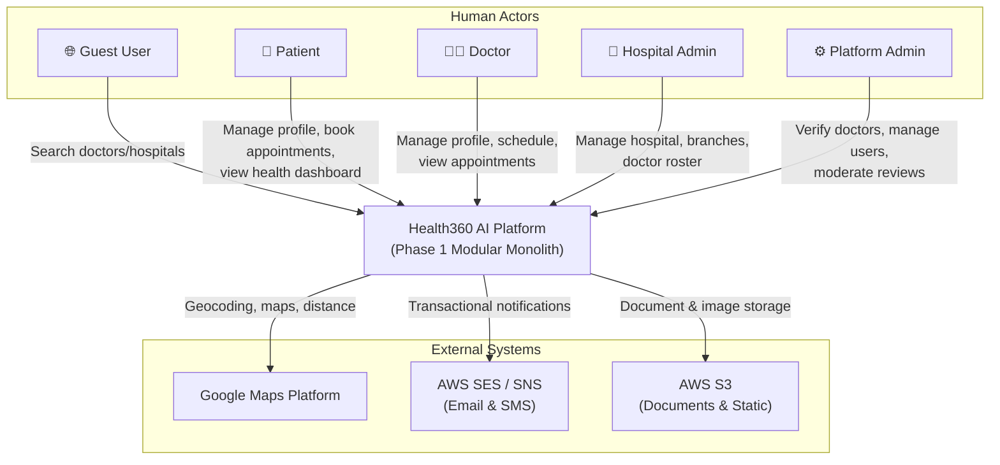
```mermaid
flowchart TB
    subgraph Actors["Human Actors"]
        Guest["🌐 Guest User"]
        Patient["👤 Patient"]
        Doctor["👨‍⚕️ Doctor"]
        HospAdmin["🏥 Hospital Admin"]
        PlatAdmin["⚙️ Platform Admin"]
    end

    Health360["Health360 AI Platform<br/>(Phase 1 Modular Monolith)"]

    subgraph External["External Systems"]
        Maps["Google Maps Platform"]
        SES["AWS SES / SNS<br/>(Email & SMS)"]
        S3["AWS S3<br/>(Documents & Static)"]
    end

    Guest -->|"Search doctors/hospitals"| Health360
    Patient -->|"Manage profile, book appointments,<br/>view health dashboard"| Health360
    Doctor -->|"Manage profile, schedule,<br/>view appointments"| Health360
    HospAdmin -->|"Manage hospital, branches,<br/>doctor roster"| Health360
    PlatAdmin -->|"Verify doctors, manage users,<br/>moderate reviews"| Health360

    Health360 -->|"Geocoding, maps, distance"| Maps
    Health360 -->|"Transactional notifications"| SES
    Health360 -->|"Document & image storage"| S3
```

**Scope:** Phase 1 only — Pharmacy, Lab, Billing, Telemedicine excluded [DOC-01 §5.3].

---

## 4. DIA-002 — Container Diagram (C4 Level 2)

Shows major deployable containers and data stores within the platform.

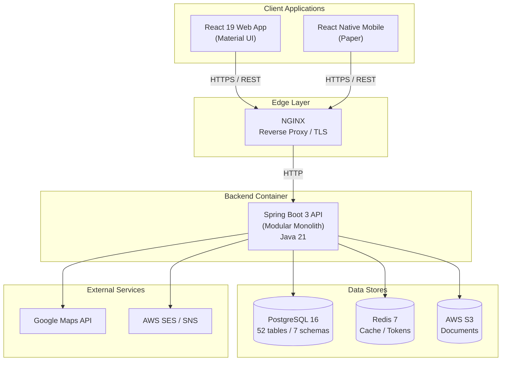
```mermaid
flowchart TB
    subgraph Clients["Client Applications"]
        WebApp["React 19 Web App<br/>(Material UI)"]
        MobileApp["React Native Mobile<br/>(Paper)"]
    end

    subgraph Edge["Edge Layer"]
        NGINX["NGINX<br/>Reverse Proxy / TLS"]
    end

    subgraph Backend["Backend Container"]
        API["Spring Boot 3 API<br/>(Modular Monolith)<br/>Java 21"]
    end

    subgraph DataStores["Data Stores"]
        PG[("PostgreSQL 16<br/>52 tables / 7 schemas")]
        Redis[("Redis 7<br/>Cache / Tokens")]
        S3Store[("AWS S3<br/>Documents")]
    end

    subgraph External["External Services"]
        GMaps["Google Maps API"]
        AWSSNS["AWS SES / SNS"]
    end

    WebApp -->|"HTTPS / REST"| NGINX
    MobileApp -->|"HTTPS / REST"| NGINX
    NGINX -->|"HTTP"| API
    API --> PG
    API --> Redis
    API --> S3Store
    API --> GMaps
    API --> AWSSNS
```

---

## 5. DIA-003 — Use Case Diagram

Primary use cases and actors for Phase 1.

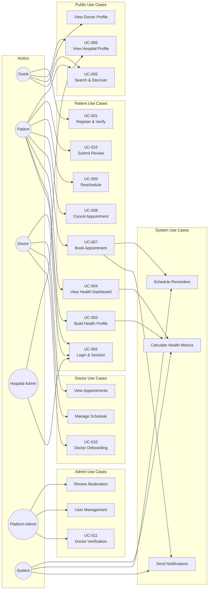
```mermaid
flowchart LR
    subgraph Actors
        Guest((Guest))
        Patient((Patient))
        Doctor((Doctor))
        HAdmin((Hospital Admin))
        PAdmin((Platform Admin))
        System((System))
    end

    subgraph Public["Public Use Cases"]
        UC_Search["UC-005<br/>Search & Discover"]
        UC_ViewDoc["View Doctor Profile"]
        UC_ViewHos["UC-006<br/>View Hospital Profile"]
    end

    subgraph PatientUC["Patient Use Cases"]
        UC_Reg["UC-001<br/>Register & Verify"]
        UC_Login["UC-002<br/>Login & Session"]
        UC_Profile["UC-003<br/>Build Health Profile"]
        UC_Dash["UC-004<br/>View Health Dashboard"]
        UC_Book["UC-007<br/>Book Appointment"]
        UC_Cancel["UC-008<br/>Cancel Appointment"]
        UC_Resched["UC-009<br/>Reschedule"]
        UC_Review["UC-015<br/>Submit Review"]
    end

    subgraph DoctorUC["Doctor Use Cases"]
        UC_Onboard["UC-010<br/>Doctor Onboarding"]
        UC_Schedule["Manage Schedule"]
        UC_ApptDoc["View Appointments"]
    end

    subgraph AdminUC["Admin Use Cases"]
        UC_Verify["UC-011<br/>Doctor Verification"]
        UC_UserMgmt["User Management"]
        UC_ModReview["Review Moderation"]
    end

    subgraph SystemUC["System Use Cases"]
        UC_Notify["Send Notifications"]
        UC_Remind["Schedule Reminders"]
        UC_Formula["Calculate Health Metrics"]
    end

    Guest --> UC_Search
    Guest --> UC_ViewDoc
    Guest --> UC_ViewHos
    Guest --> UC_Reg

    Patient --> UC_Login
    Patient --> UC_Profile
    Patient --> UC_Dash
    Patient --> UC_Book
    Patient --> UC_Cancel
    Patient --> UC_Resched
    Patient --> UC_Review
    Patient --> UC_Search

    Doctor --> UC_Onboard
    Doctor --> UC_Schedule
    Doctor --> UC_ApptDoc
    Doctor --> UC_Login

    HAdmin --> UC_Login
    HAdmin --> UC_ViewHos

    PAdmin --> UC_Verify
    PAdmin --> UC_UserMgmt
    PAdmin --> UC_ModReview

    System --> UC_Notify
    System --> UC_Remind
    System --> UC_Formula

    UC_Book --> UC_Notify
    UC_Book --> UC_Remind
    UC_Profile --> UC_Formula
    UC_Dash --> UC_Formula
```

---

## 6. DIA-004 — Bounded Context Map

Seven bounded contexts and their DDD relationships [DOC-05].

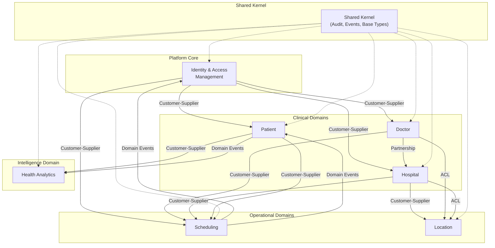
```mermaid
graph TB
    subgraph Platform["Platform Core"]
        IAM["Identity & Access<br/>Management"]
    end

    subgraph Clinical["Clinical Domains"]
        PAT["Patient"]
        DOC["Doctor"]
        HOS["Hospital"]
    end

    subgraph Operations["Operational Domains"]
        SCH["Scheduling"]
        LOC["Location"]
    end

    subgraph Intelligence["Intelligence Domain"]
        ANL["Health Analytics"]
    end

    subgraph CrossCutting["Shared Kernel"]
        SK["Shared Kernel<br/>(Audit, Events, Base Types)"]
    end

    IAM -->|"Customer-Supplier"| PAT
    IAM -->|"Customer-Supplier"| DOC
    IAM -->|"Customer-Supplier"| HOS
    IAM -->|"Customer-Supplier"| SCH

    PAT -->|"Customer-Supplier"| ANL
    DOC -->|"Partnership"| HOS
    DOC -->|"Customer-Supplier"| SCH
    HOS -->|"Customer-Supplier"| SCH
    PAT -->|"Customer-Supplier"| SCH

    HOS -->|"Customer-Supplier"| LOC
    DOC -->|"ACL"| LOC
    HOS -->|"ACL"| LOC

    PAT -->|"Domain Events"| ANL
    SCH -->|"Domain Events"| IAM
    SCH -->|"Domain Events"| PAT

    SK -.-> IAM
    SK -.-> PAT
    SK -.-> DOC
    SK -.-> HOS
    SK -.-> SCH
    SK -.-> LOC
    SK -.-> ANL
```

---

## 7. DIA-005 — Entity Relationship Diagram

Core entities across 7 PostgreSQL schemas [DOC-06]. Full table inventory: 52 tables.

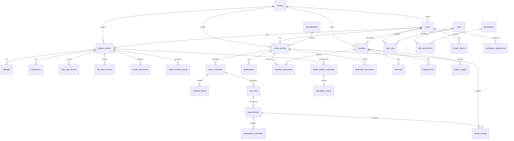
```mermaid
erDiagram
    tenants ||--o{ users : "scopes"
    tenants ||--o{ patient_profiles : "scopes"
    tenants ||--o{ doctor_profiles : "scopes"
    tenants ||--o{ hospitals : "scopes"

    users ||--o| patient_profiles : "has"
    users ||--o| doctor_profiles : "has"
    users ||--o| hospitals : "administers"
    users ||--o{ user_roles : "assigned"
    roles ||--o{ user_roles : "granted"
    roles ||--o{ role_permissions : "has"
    permissions ||--o{ role_permissions : "granted"
    users ||--o{ refresh_tokens : "has"
    users ||--o{ notification_preferences : "configures"

    patient_profiles ||--o{ allergies : "has"
    patient_profiles ||--o{ medications : "has"
    patient_profiles ||--o{ vital_sign_records : "records"
    patient_profiles ||--o{ lab_value_records : "records"
    patient_profiles ||--o{ health_documents : "uploads"
    patient_profiles ||--o{ health_timeline_events : "generates"
    patient_profiles ||--o{ health_metrics_snapshots : "calculated_for"

    doctor_profiles ||--o{ qualifications : "has"
    doctor_profiles ||--o{ hospital_associations : "practices_at"
    doctor_profiles ||--o{ doctor_schedules : "maintains"
    doctor_profiles ||--o{ verification_documents : "submits"
    doctor_profiles ||--o{ doctor_reviews : "receives"
    specializations ||--o{ doctor_profiles : "primary"

    hospitals ||--o{ branches : "has"
    hospitals ||--o{ departments : "has"
    hospitals ||--o{ gallery_images : "displays"
    hospitals ||--o{ hospital_associations : "employs"

    doctor_schedules ||--o{ schedule_blocks : "contains"
    doctor_schedules ||--o{ time_slots : "generates"
    time_slots ||--o| appointments : "booked_by"
    appointments ||--o{ appointment_reminders : "triggers"
    appointments ||--o| doctor_reviews : "enables"

    health_metrics_snapshots ||--o{ calculated_metrics : "contains"
```

---

## 8. DIA-006 — Domain Class Diagram (Patient & IAM)

Key aggregates in IAM and Patient bounded contexts [DOC-05].

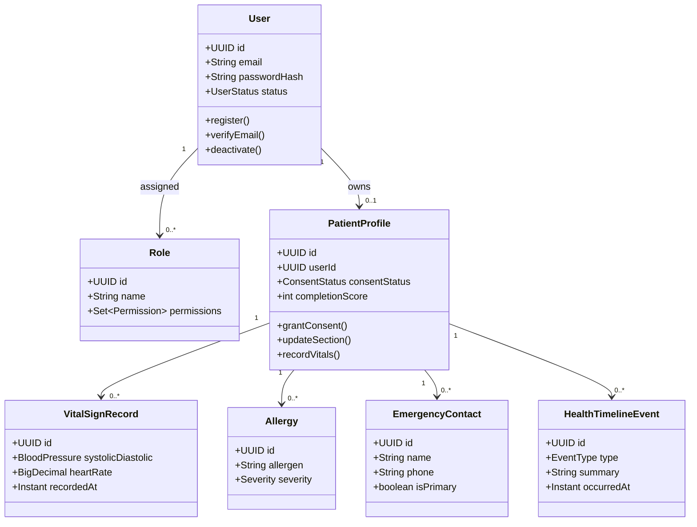
```mermaid
classDiagram
    class User {
        +UUID id
        +String email
        +String passwordHash
        +UserStatus status
        +register()
        +verifyEmail()
        +deactivate()
    }

    class Role {
        +UUID id
        +String name
        +Set~Permission~ permissions
    }

    class PatientProfile {
        +UUID id
        +UUID userId
        +ConsentStatus consentStatus
        +int completionScore
        +grantConsent()
        +updateSection()
        +recordVitals()
    }

    class VitalSignRecord {
        +UUID id
        +BloodPressure systolicDiastolic
        +BigDecimal heartRate
        +Instant recordedAt
    }

    class Allergy {
        +UUID id
        +String allergen
        +Severity severity
    }

    class EmergencyContact {
        +UUID id
        +String name
        +String phone
        +boolean isPrimary
    }

    class HealthTimelineEvent {
        +UUID id
        +EventType type
        +String summary
        +Instant occurredAt
    }

    User "1" --> "0..1" PatientProfile : owns
    User "1" --> "0..*" Role : assigned
    PatientProfile "1" --> "0..*" VitalSignRecord
    PatientProfile "1" --> "0..*" Allergy
    PatientProfile "1" --> "0..*" EmergencyContact
    PatientProfile "1" --> "0..*" HealthTimelineEvent
```

---

## 9. DIA-007 — Domain Class Diagram (Doctor & Scheduling)

Key aggregates in Doctor and Scheduling bounded contexts [DOC-05].

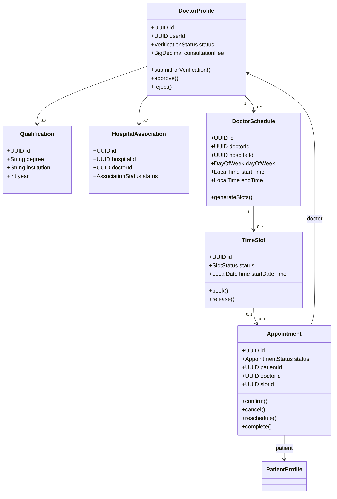
```mermaid
classDiagram
    class DoctorProfile {
        +UUID id
        +UUID userId
        +VerificationStatus status
        +BigDecimal consultationFee
        +submitForVerification()
        +approve()
        +reject()
    }

    class Qualification {
        +UUID id
        +String degree
        +String institution
        +int year
    }

    class HospitalAssociation {
        +UUID id
        +UUID hospitalId
        +UUID doctorId
        +AssociationStatus status
    }

    class DoctorSchedule {
        +UUID id
        +UUID doctorId
        +UUID hospitalId
        +DayOfWeek dayOfWeek
        +LocalTime startTime
        +LocalTime endTime
        +generateSlots()
    }

    class TimeSlot {
        +UUID id
        +SlotStatus status
        +LocalDateTime startDateTime
        +book()
        +release()
    }

    class Appointment {
        +UUID id
        +AppointmentStatus status
        +UUID patientId
        +UUID doctorId
        +UUID slotId
        +confirm()
        +cancel()
        +reschedule()
        +complete()
    }

    DoctorProfile "1" --> "0..*" Qualification
    DoctorProfile "1" --> "0..*" HospitalAssociation
    DoctorProfile "1" --> "0..*" DoctorSchedule
    DoctorSchedule "1" --> "0..*" TimeSlot
    TimeSlot "0..1" --> "0..1" Appointment
    Appointment --> DoctorProfile : doctor
    Appointment --> PatientProfile : patient
```

---

## 10. DIA-008 — Component Diagram

Spring Boot modular monolith internal components [DOC-11].

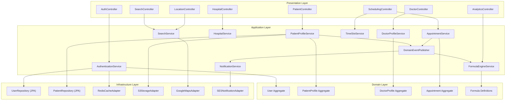
```mermaid
flowchart TB
    subgraph Presentation["Presentation Layer"]
        AuthCtrl["AuthController"]
        PatCtrl["PatientController"]
        DocCtrl["DoctorController"]
        HosCtrl["HospitalController"]
        SchCtrl["SchedulingController"]
        AnlCtrl["AnalyticsController"]
        LocCtrl["LocationController"]
        SrhCtrl["SearchController"]
    end

    subgraph Application["Application Layer"]
        AuthSvc["AuthenticationService"]
        PatSvc["PatientProfileService"]
        DocSvc["DoctorProfileService"]
        HosSvc["HospitalService"]
        SchSvc["AppointmentService"]
        SlotSvc["TimeSlotService"]
        FormulaSvc["FormulaEngineService"]
        SearchSvc["SearchService"]
        NotifySvc["NotificationService"]
        EventBus["DomainEventPublisher"]
    end

    subgraph Domain["Domain Layer"]
        UserAgg["User Aggregate"]
        PatAgg["PatientProfile Aggregate"]
        DocAgg["DoctorProfile Aggregate"]
        ApptAgg["Appointment Aggregate"]
        FormulaDom["Formula Definitions"]
    end

    subgraph Infrastructure["Infrastructure Layer"]
        UserRepo["UserRepository (JPA)"]
        PatRepo["PatientRepository (JPA)"]
        RedisCache["RedisCacheAdapter"]
        S3Adapter["S3StorageAdapter"]
        MapsAdapter["GoogleMapsAdapter"]
        SESAdapter["SESNotificationAdapter"]
    end

    AuthCtrl --> AuthSvc
    PatCtrl --> PatSvc
    DocCtrl --> DocSvc
    HosCtrl --> HosSvc
    SchCtrl --> SchSvc
    SchCtrl --> SlotSvc
    AnlCtrl --> FormulaSvc
    LocCtrl --> SearchSvc
    SrhCtrl --> SearchSvc

    AuthSvc --> UserAgg
    PatSvc --> PatAgg
    DocSvc --> DocAgg
    SchSvc --> ApptAgg
    FormulaSvc --> FormulaDom

    AuthSvc --> UserRepo
    PatSvc --> PatRepo
    AuthSvc --> RedisCache
    PatSvc --> S3Adapter
    SearchSvc --> MapsAdapter
    NotifySvc --> SESAdapter

    SchSvc --> EventBus
    PatSvc --> EventBus
    EventBus --> NotifySvc
    EventBus --> FormulaSvc
```

---

## 11. DIA-009 — Deployment Diagram

AWS production deployment in ap-south-1 [DOC-13].

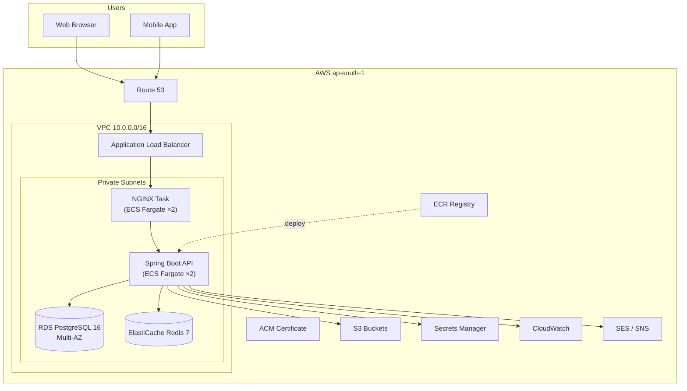
```mermaid
flowchart TB
    subgraph Users["Users"]
        Browser["Web Browser"]
        Mobile["Mobile App"]
    end

    subgraph AWS["AWS ap-south-1"]
        R53["Route 53"]
        ACM["ACM Certificate"]

        subgraph VPC["VPC 10.0.0.0/16"]
            ALB["Application Load Balancer"]

            subgraph PrivateSubnet["Private Subnets"]
                NGINX_T["NGINX Task<br/>(ECS Fargate ×2)"]
                API_T["Spring Boot API<br/>(ECS Fargate ×2)"]
                RDS[("RDS PostgreSQL 16<br/>Multi-AZ")]
                Redis[("ElastiCache Redis 7")]
            end
        end

        S3["S3 Buckets"]
        SM["Secrets Manager"]
        CW["CloudWatch"]
        ECR["ECR Registry"]
        SES["SES / SNS"]
    end

    Browser --> R53 --> ALB
    Mobile --> R53
    ALB --> NGINX_T
    NGINX_T --> API_T
    API_T --> RDS
    API_T --> Redis
    API_T --> S3
    API_T --> SM
    API_T --> SES
    API_T --> CW
    ECR -.->|"deploy"| API_T
```

---

## 12. DIA-010 — Sequence Diagram: Authentication

JWT login with refresh token rotation [DOC-12 §4].

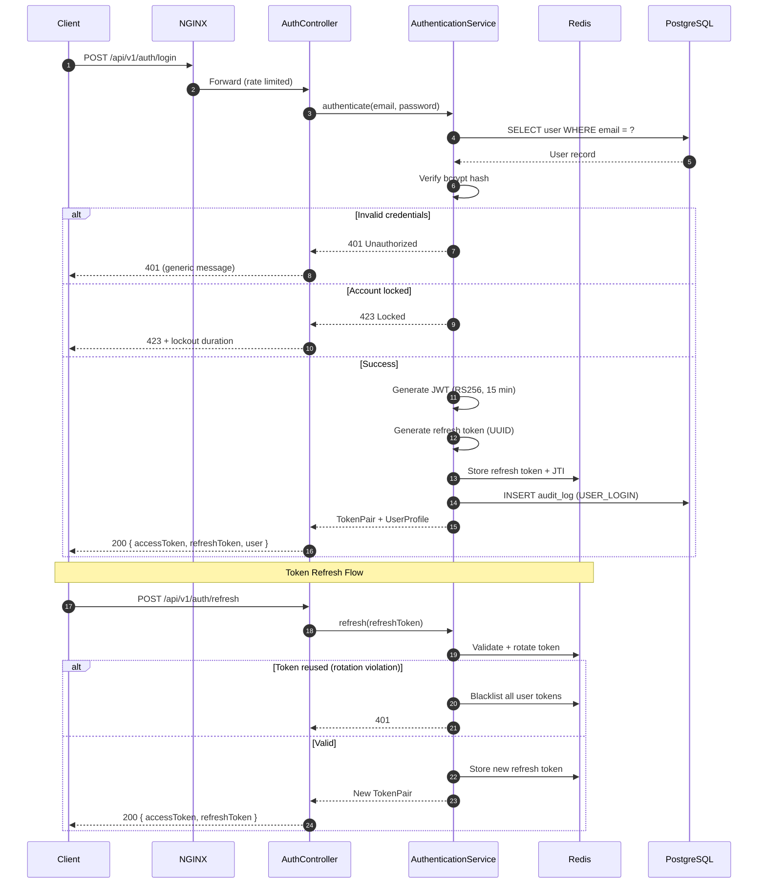
```mermaid
sequenceDiagram
    autonumber
    participant C as Client
    participant N as NGINX
    participant A as AuthController
    participant S as AuthenticationService
    participant R as Redis
    participant DB as PostgreSQL

    C->>N: POST /api/v1/auth/login
    N->>A: Forward (rate limited)
    A->>S: authenticate(email, password)
    S->>DB: SELECT user WHERE email = ?
    DB-->>S: User record
    S->>S: Verify bcrypt hash
    alt Invalid credentials
        S-->>A: 401 Unauthorized
        A-->>C: 401 (generic message)
    else Account locked
        S-->>A: 423 Locked
        A-->>C: 423 + lockout duration
    else Success
        S->>S: Generate JWT (RS256, 15 min)
        S->>S: Generate refresh token (UUID)
        S->>R: Store refresh token + JTI
        S->>DB: INSERT audit_log (USER_LOGIN)
        S-->>A: TokenPair + UserProfile
        A-->>C: 200 { accessToken, refreshToken, user }
    end

    Note over C,R: Token Refresh Flow
    C->>A: POST /api/v1/auth/refresh
    A->>S: refresh(refreshToken)
    S->>R: Validate + rotate token
    alt Token reused (rotation violation)
        S->>R: Blacklist all user tokens
        S-->>A: 401
    else Valid
        S->>R: Store new refresh token
        S-->>A: New TokenPair
        A-->>C: 200 { accessToken, refreshToken }
    end
```

---

## 13. DIA-011 — Sequence Diagram: Book Appointment

Atomic booking with concurrency control [DOC-03 UC-007], [FR-SCH-004].

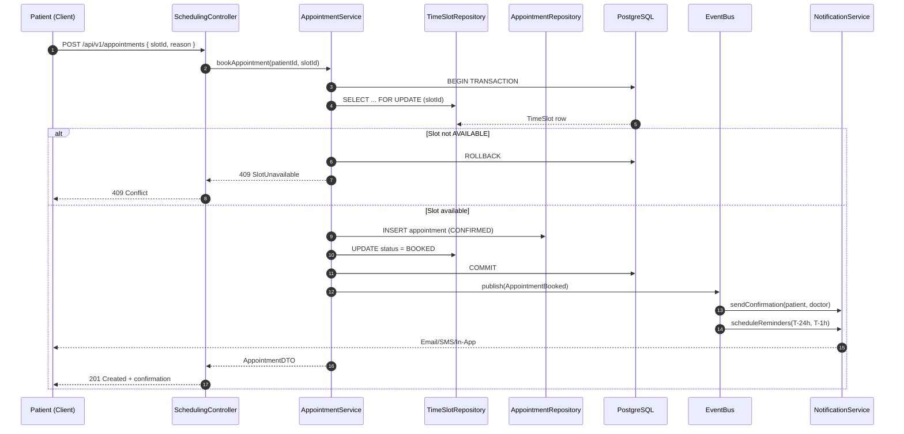
```mermaid
sequenceDiagram
    autonumber
    participant P as Patient (Client)
    participant API as SchedulingController
    participant Svc as AppointmentService
    participant Slot as TimeSlotRepository
    participant Appt as AppointmentRepository
    participant DB as PostgreSQL
    participant EB as EventBus
    participant NTF as NotificationService

    P->>API: POST /api/v1/appointments { slotId, reason }
    API->>Svc: bookAppointment(patientId, slotId)
    Svc->>DB: BEGIN TRANSACTION
    Svc->>Slot: SELECT ... FOR UPDATE (slotId)
    DB-->>Slot: TimeSlot row

    alt Slot not AVAILABLE
        Svc->>DB: ROLLBACK
        Svc-->>API: 409 SlotUnavailable
        API-->>P: 409 Conflict
    else Slot available
        Svc->>Appt: INSERT appointment (CONFIRMED)
        Svc->>Slot: UPDATE status = BOOKED
        Svc->>DB: COMMIT
        Svc->>EB: publish(AppointmentBooked)
        EB->>NTF: sendConfirmation(patient, doctor)
        EB->>NTF: scheduleReminders(T-24h, T-1h)
        NTF-->>P: Email/SMS/In-App
        Svc-->>API: AppointmentDTO
        API-->>P: 201 Created + confirmation
    end
```

---

## 14. DIA-012 — Sequence Diagram: Health Dashboard

Dashboard load with formula engine invocation [DOC-03 UC-004].

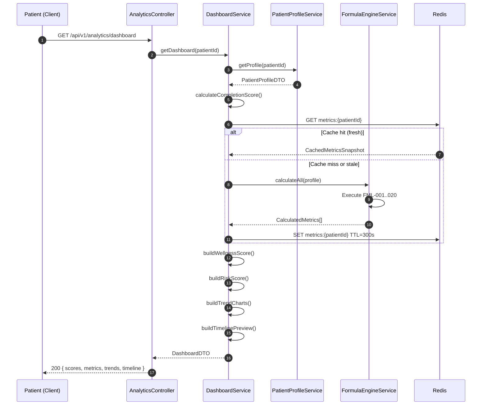
```mermaid
sequenceDiagram
    autonumber
    participant P as Patient (Client)
    participant API as AnalyticsController
    participant Dash as DashboardService
    participant Prof as PatientProfileService
    participant Form as FormulaEngineService
    participant Cache as Redis

    P->>API: GET /api/v1/analytics/dashboard
    API->>Dash: getDashboard(patientId)
    Dash->>Prof: getProfile(patientId)
    Prof-->>Dash: PatientProfileDTO
    Dash->>Dash: calculateCompletionScore()

    Dash->>Cache: GET metrics:{patientId}
    alt Cache hit (fresh)
        Cache-->>Dash: CachedMetricsSnapshot
    else Cache miss or stale
        Dash->>Form: calculateAll(profile)
        Form->>Form: Execute FML-001..020
        Form-->>Dash: CalculatedMetrics[]
        Dash->>Cache: SET metrics:{patientId} TTL=300s
    end

    Dash->>Dash: buildWellnessScore()
    Dash->>Dash: buildRiskScore()
    Dash->>Dash: buildTrendCharts()
    Dash->>Dash: buildTimelinePreview()
    Dash-->>API: DashboardDTO
    API-->>P: 200 { scores, metrics, trends, timeline }
```

---

## 15. DIA-013 — Sequence Diagram: Doctor Verification

Admin verification workflow [DOC-03 UC-011], [FR-DOC-012].

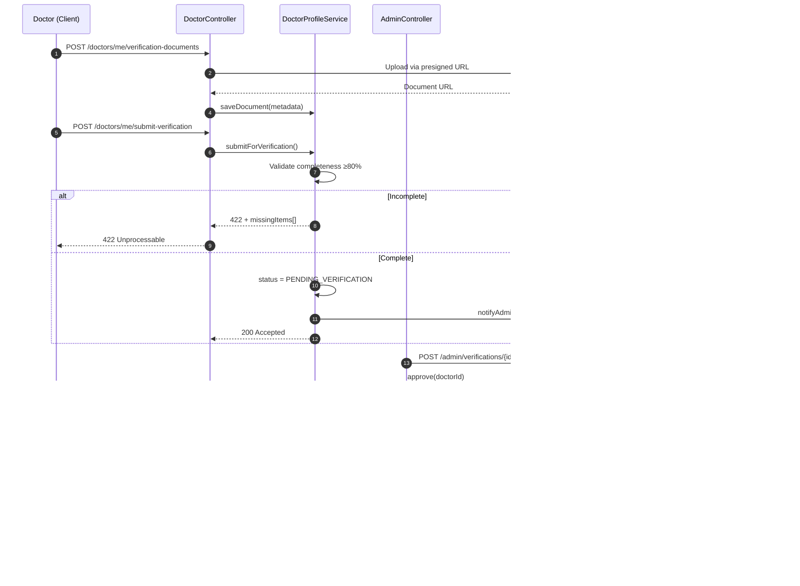
```mermaid
sequenceDiagram
    autonumber
    participant D as Doctor (Client)
    participant API as DoctorController
    participant DocSvc as DoctorProfileService
    participant Admin as AdminController
    participant AdmSvc as VerificationService
    participant S3 as S3 Storage
    participant NTF as NotificationService

    D->>API: POST /doctors/me/verification-documents
    API->>S3: Upload via presigned URL
    S3-->>API: Document URL
    API->>DocSvc: saveDocument(metadata)

    D->>API: POST /doctors/me/submit-verification
    API->>DocSvc: submitForVerification()
    DocSvc->>DocSvc: Validate completeness ≥80%
    alt Incomplete
        DocSvc-->>API: 422 + missingItems[]
        API-->>D: 422 Unprocessable
    else Complete
        DocSvc->>DocSvc: status = PENDING_VERIFICATION
        DocSvc->>NTF: notifyAdmin(new submission)
        DocSvc-->>API: 200 Accepted
    end

    Admin->>AdmSvc: POST /admin/verifications/{id}/approve
    AdmSvc->>DocSvc: approve(doctorId)
    DocSvc->>DocSvc: status = VERIFIED
    DocSvc->>NTF: notifyDoctor(approved)
    AdmSvc-->>Admin: 200 OK

    Note over D,NTF: Rejection path
    Admin->>AdmSvc: POST /admin/verifications/{id}/reject
    AdmSvc->>DocSvc: reject(doctorId, reason)
    DocSvc->>NTF: notifyDoctor(rejected, reason)
```

---

## 16. DIA-014 — Activity Diagram: Patient Onboarding

Business process from registration to profile completion [DOC-02 §8.1].

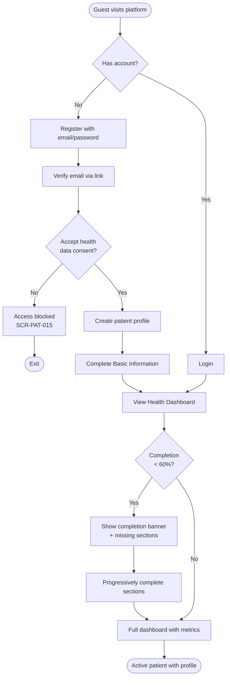
```mermaid
flowchart TD
    Start([Guest visits platform]) --> HasAcct{Has account?}
    HasAcct -->|No| Register[Register with email/password]
    HasAcct -->|Yes| Login[Login]
    Register --> Verify[Verify email via link]
    Verify --> Consent{Accept health<br/>data consent?}
    Consent -->|No| Blocked[Access blocked<br/>SCR-PAT-015]
    Consent -->|Yes| CreateProf[Create patient profile]
    CreateProf --> BasicInfo[Complete Basic Information]
    BasicInfo --> Dashboard[View Health Dashboard]
    Login --> Dashboard
    Dashboard --> Completion{Completion<br/>&lt; 60%?}
    Completion -->|Yes| Banner[Show completion banner<br/>+ missing sections]
    Completion -->|No| FullDash[Full dashboard with metrics]
    Banner --> Progressive[Progressively complete sections]
    Progressive --> FullDash
    FullDash --> End([Active patient with profile])
    Blocked --> End2([Exit])
```

---

## 17. DIA-015 — Activity Diagram: Appointment Booking

End-to-end booking flow [DOC-02 §8.3], [DOC-10 SCR-PAT-016].

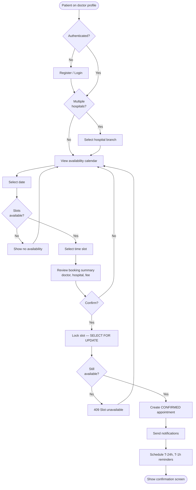
```mermaid
flowchart TD
    Start([Patient on doctor profile]) --> Login{Authenticated?}
    Login -->|No| AuthFlow[Register / Login]
    AuthFlow --> SelectHosp
    Login -->|Yes| SelectHosp{Multiple<br/>hospitals?}
    SelectHosp -->|Yes| PickHosp[Select hospital branch]
    SelectHosp -->|No| Calendar
    PickHosp --> Calendar[View availability calendar]
    Calendar --> PickDate[Select date]
    PickDate --> HasSlots{Slots<br/>available?}
    HasSlots -->|No| NoAvail[Show no availability]
    NoAvail --> Calendar
    HasSlots -->|Yes| PickSlot[Select time slot]
    PickSlot --> Summary[Review booking summary<br/>doctor, hospital, fee]
    Summary --> Confirm{Confirm?}
    Confirm -->|No| Calendar
    Confirm -->|Yes| Lock[Lock slot — SELECT FOR UPDATE]
    Lock --> Avail{Still<br/>available?}
    Avail -->|No| Conflict[409 Slot unavailable]
    Conflict --> Calendar
    Avail -->|Yes| Create[Create CONFIRMED appointment]
    Create --> Notify[Send notifications]
    Notify --> Remind[Schedule T-24h, T-1h reminders]
    Remind --> Done([Show confirmation screen])
```

---

## 18. DIA-016 — Activity Diagram: Formula Engine

Metric calculation pipeline [DOC-08], [FR-ANL-002].

```mermaid
flowchart TD
    Start([Trigger: profile update or dashboard load]) --> Load[Load patient profile data]
    Load --> Check{All required<br/>inputs present?}
    Check -->|No| Missing[Return missing field guidance<br/>AC-ANL-005]
    Check -->|Yes| Select[Select applicable formulas<br/>FML-001..020]
    Select --> Loop{For each formula}
    Loop --> Input[Extract input values<br/>height, weight, BP, labs, lifestyle]
    Input --> Calc[Apply formula + thresholds<br/>WHO/AHA/ADA]
    Calc --> Classify[Assign classification<br/>+ interpretation text]
    Classify --> Disclaimer[Attach medical disclaimer]
    Disclaimer --> Loop
    Loop -->|Done| Aggregate[Compute Wellness Score FML-015<br/>Health Risk Score FML-016]
    Aggregate --> Snapshot[Persist metrics snapshot]
    Snapshot --> Cache[Update Redis cache]
    Cache --> Event[Publish MetricsCalculated event]
    Event --> End([Return CalculatedMetrics[]])
    Missing --> End
```

---

## 19. DIA-017 — State Diagram: Appointment Lifecycle

Appointment status transitions [DOC-09 SM-SCH-001].

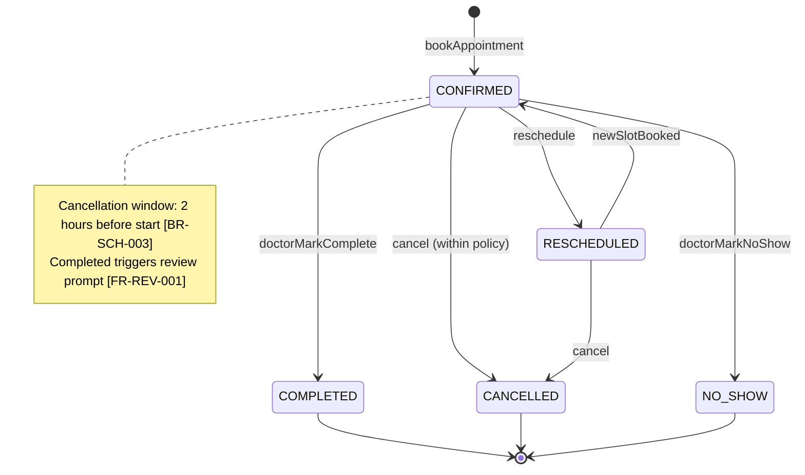
```mermaid
stateDiagram-v2
    [*] --> CONFIRMED: bookAppointment

    CONFIRMED --> CANCELLED: cancel (within policy)
    CONFIRMED --> RESCHEDULED: reschedule
    CONFIRMED --> COMPLETED: doctorMarkComplete
    CONFIRMED --> NO_SHOW: doctorMarkNoShow

    RESCHEDULED --> CONFIRMED: newSlotBooked
    RESCHEDULED --> CANCELLED: cancel

    COMPLETED --> [*]
    CANCELLED --> [*]
    NO_SHOW --> [*]

    note right of CONFIRMED
        Cancellation window: 2 hours before start [BR-SCH-003]
        Completed triggers review prompt [FR-REV-001]
    end note
```

---

## 20. DIA-018 — State Diagram: Doctor Verification

Doctor profile verification states [DOC-09 SM-DOC-001].

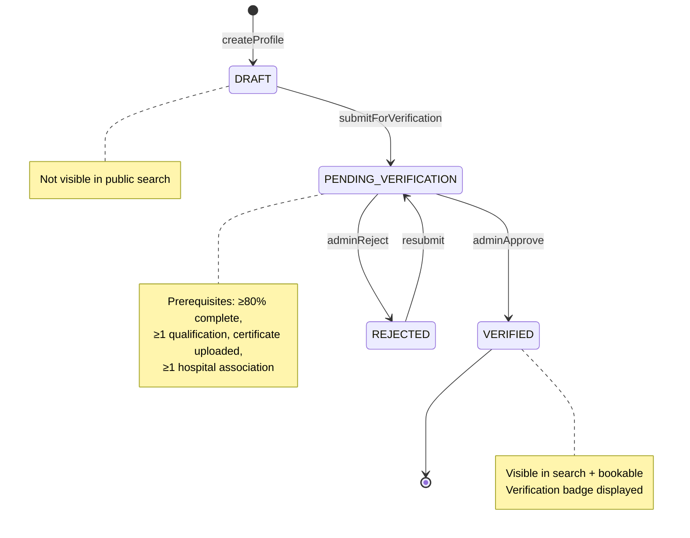
```mermaid
stateDiagram-v2
    [*] --> DRAFT: createProfile

    DRAFT --> PENDING_VERIFICATION: submitForVerification
    PENDING_VERIFICATION --> VERIFIED: adminApprove
    PENDING_VERIFICATION --> REJECTED: adminReject
    REJECTED --> PENDING_VERIFICATION: resubmit

    VERIFIED --> [*]

    note right of DRAFT
        Not visible in public search
    end note

    note right of VERIFIED
        Visible in search + bookable
        Verification badge displayed
    end note

    note right of PENDING_VERIFICATION
        Prerequisites: ≥80% complete,
        ≥1 qualification, certificate uploaded,
        ≥1 hospital association
    end note
```

---

## 21. DIA-019 — CI/CD Pipeline Diagram

GitHub Actions deployment flow [DOC-13 §8].

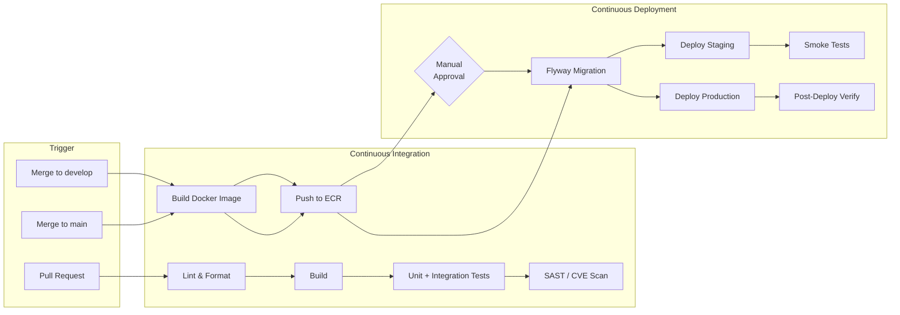
```mermaid
flowchart LR
    subgraph Trigger
        PR[Pull Request]
        DEV[Merge to develop]
        MAIN[Merge to main]
    end

    subgraph CI["Continuous Integration"]
        Lint[Lint & Format]
        Build[Build]
        Test[Unit + Integration Tests]
        Scan[SAST / CVE Scan]
        Image[Build Docker Image]
        ECR[Push to ECR]
    end

    subgraph CD["Continuous Deployment"]
        Flyway[Flyway Migration]
        DeployS[Deploy Staging]
        Smoke[Smoke Tests]
        Approve{Manual<br/>Approval}
        DeployP[Deploy Production]
        Verify[Post-Deploy Verify]
    end

    PR --> Lint --> Build --> Test --> Scan
    DEV --> Image --> ECR --> Flyway --> DeployS --> Smoke
    MAIN --> Image --> ECR --> Approve --> Flyway --> DeployP --> Verify
```

---

## 22. DIA-020 — Security Trust Boundaries

Defense-in-depth zones [DOC-12 §3].

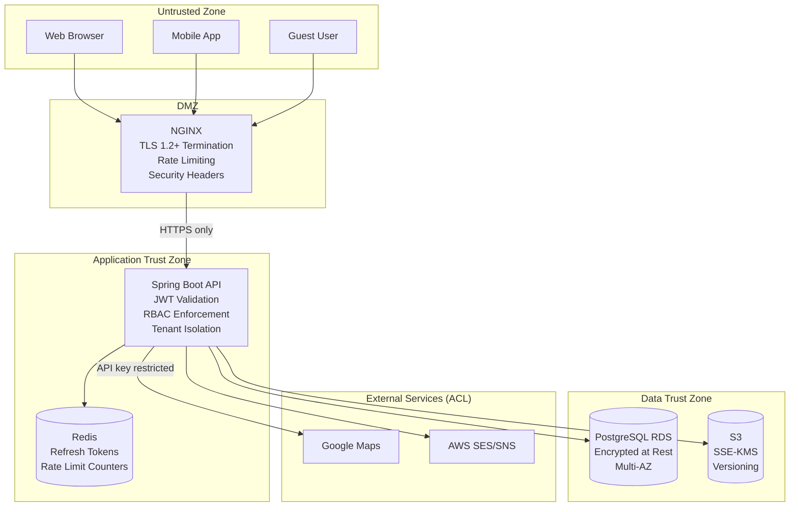
```mermaid
flowchart TB
    subgraph Untrusted["Untrusted Zone"]
        Browser[Web Browser]
        Mobile[Mobile App]
        Guest[Guest User]
    end

    subgraph DMZ["DMZ"]
        NGINX[NGINX<br/>TLS 1.2+ Termination<br/>Rate Limiting<br/>Security Headers]
    end

    subgraph Trusted["Application Trust Zone"]
        API[Spring Boot API<br/>JWT Validation<br/>RBAC Enforcement<br/>Tenant Isolation]
        Redis[(Redis<br/>Refresh Tokens<br/>Rate Limit Counters)]
    end

    subgraph DataZone["Data Trust Zone"]
        PG[(PostgreSQL RDS<br/>Encrypted at Rest<br/>Multi-AZ)]
        S3[(S3<br/>SSE-KMS<br/>Versioning)]
    end

    subgraph External["External Services (ACL)"]
        Maps[Google Maps]
        SES[AWS SES/SNS]
    end

    Browser --> NGINX
    Mobile --> NGINX
    Guest --> NGINX
    NGINX -->|"HTTPS only"| API
    API --> Redis
    API --> PG
    API --> S3
    API -->|"API key restricted"| Maps
    API --> SES
```

---

## 23. Frontend Architecture Diagram

React 19 feature-based structure [DOC-11 §8].

```mermaid
flowchart TB
    subgraph AppShell["App Shell"]
        Router["React Router v6"]
        Providers["Providers<br/>QueryClient, Redux, Theme, Auth"]
    end

    subgraph Features["Feature Modules"]
        AuthF["auth/<br/>Login, Register"]
        PatF["patient/<br/>Dashboard, Profile, Booking"]
        DocF["doctor/<br/>Profile, Schedule"]
        HosF["hospital/<br/>Branches, Roster"]
        AdmF["admin/<br/>Verification, Users"]
        SearchF["search/<br/>Doctor, Hospital"]
    end

    subgraph SharedFE["Shared"]
        Components["UI Components<br/>(MUI wrappers)"]
        Hooks["Custom Hooks"]
        API["API Client<br/>(Axios + interceptors)"]
        Schemas["Zod Schemas"]
    end

    Router --> AuthF
    Router --> PatF
    Router --> DocF
    Router --> HosF
    Router --> AdmF
    Router --> SearchF

    AuthF --> SharedFE
    PatF --> SharedFE
    DocF --> SharedFE

    Providers --> Router
```

---

## 24. Mobile Architecture Diagram

React Native structure [DOC-11 §9].

```mermaid
flowchart TB
    subgraph MobileApp["React Native App"]
        Nav["React Navigation<br/>(Stack + Tab)"]
        AuthM["Auth Screens"]
        PatM["Patient Screens<br/>Dashboard, Profile, Booking"]
        DocM["Doctor Screens<br/>Schedule, Appointments"]
    end

    subgraph SharedMobile["Shared Layer"]
        APIClient["API Client<br/>(same contracts as web)"]
        SecureStore["Secure Token Storage"]
        LocationSvc["Location Service<br/>(FR-LOC-006)"]
        QueryM["TanStack Query"]
    end

    Nav --> AuthM
    Nav --> PatM
    Nav --> DocM

    AuthM --> SharedMobile
    PatM --> SharedMobile
    DocM --> SharedMobile
```

---

## 25. Diagram Traceability Matrix

| Diagram ID | Referenced In | Implementation Phase |
|------------|---------------|---------------------|
| DIA-001 | DOC-01, stakeholder decks | All |
| DIA-002 | DOC-11 | All |
| DIA-003 | DOC-03, DOC-14 | All |
| DIA-004 | DOC-05, DOC-11 | S0–S1 (package setup) |
| DIA-005 | DOC-06 | S0–S10 (Flyway migrations) |
| DIA-006–007 | DOC-05 | S1–S9 (domain implementation) |
| DIA-008 | DOC-11 | S1+ |
| DIA-009 | DOC-13 | S2 (staging), S14 (production) |
| DIA-010 | DOC-12 | S1–S2 |
| DIA-011 | DOC-03, DOC-09 | S8 |
| DIA-012 | DOC-08, DOC-03 | S10–S11 |
| DIA-013 | DOC-03 | S6 |
| DIA-014–016 | DOC-02 | UX/QA reference |
| DIA-017–018 | DOC-09 | S6, S8–S9 |
| DIA-019 | DOC-13 | S0–S2 |
| DIA-020 | DOC-12 | S1–S2 |

---

## 26. Diagram Usage Guidelines

| Audience | Recommended Diagrams |
|----------|-------------------|
| **Executive / Product** | DIA-001, DIA-003, DIA-014, DIA-015 |
| **Architect / Tech Lead** | DIA-002, DIA-004, DIA-008, DIA-009, DIA-020 |
| **Backend Engineer** | DIA-005, DIA-006, DIA-007, DIA-010–013, DIA-016–018 |
| **Frontend Engineer** | DIA-003, Frontend §23, Mobile §24 |
| **DevOps** | DIA-009, DIA-019 |
| **QA / Test** | DIA-003, DIA-011–015, DIA-017–018 |
| **Security** | DIA-010, DIA-020 |

**Maintenance:** When architecture changes, update the relevant diagram here first, then propagate to source documents in the next documentation revision.

---

## 27. Phase 1 Documentation Program — Completion Status

With DOC-16, the **16-document enterprise foundation** defined in [DOC-01 §13] is complete:

| ID | Document | Status |
|----|----------|--------|
| DOC-00 | Project Memory | Active |
| DOC-01 | Project Vision & Scope Charter | Approved |
| DOC-02 | Business Requirements Document | Approved |
| DOC-03 | Functional Requirements Specification | Approved |
| DOC-04 | Non-Functional Requirements | Approved |
| DOC-05 | Domain Model & Bounded Contexts | Approved |
| DOC-06 | Database Design Specification | Approved |
| DOC-07 | REST API Design Specification | Approved |
| DOC-08 | Health Formula Engine Specification | Approved |
| DOC-09 | Business Rules & Validation Catalog | Approved |
| DOC-10 | UI/UX Screen Specification | Approved |
| DOC-11 | System Architecture Document | Approved |
| DOC-12 | Security Architecture | Approved |
| DOC-13 | DevOps & Deployment Architecture | Approved |
| DOC-14 | User Stories & Acceptance Criteria | Approved |
| DOC-15 | Development Roadmap | Pending Approval |
| DOC-16 | Architecture Diagrams Pack | Approved |

**Next step after approval:** Begin implementation per [DOC-15] — S0 Project Kickoff.

---

## 28. Approval

| Role | Name | Signature | Date | Status |
|------|------|-----------|------|--------|
| Product Owner | _________________ | _________________ | ________ | Pending |
| Technical Lead / Architect | _________________ | _________________ | ________ | Pending |
| Engineering Lead | _________________ | _________________ | ________ | Pending |
| DevOps Lead | _________________ | _________________ | ________ | Pending |

---

*End of DOC-16 — Architecture Diagrams Pack v1.0*
