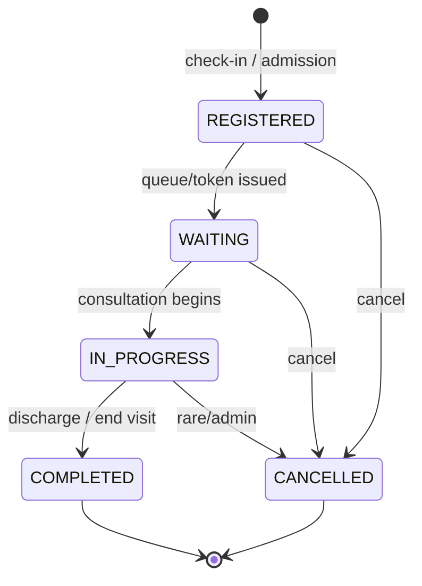
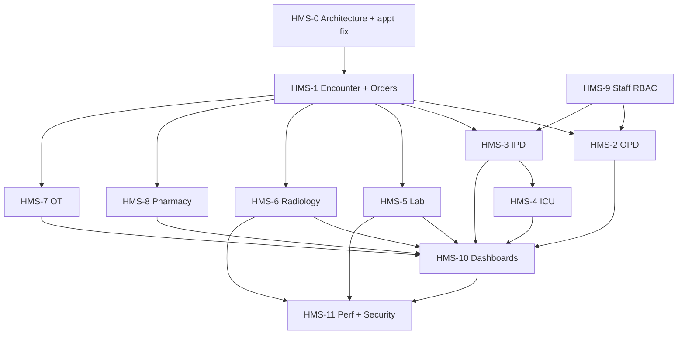

# Health360 HMS — Clinical Operations Architecture

| Attribute | Value |
|-----------|-------|
| **Document ID** | HMS-ARCH-001 |
| **Title** | Hospital Management System / Clinical Operations Architecture |
| **Version** | 1.0 (Draft — pending approval) |
| **Date** | 2026-08-12 |
| **Status** | **Pending stakeholder approval — no implementation until approved** |
| **References** | [HEALTH360-STATUS-001](../HEALTH360-COMPLETE-PROJECT-STATUS.md), [DOC-51](../phase-1.5/requirements/51-PHASE-1.5-VISION-AND-SCOPE-CHARTER.md), [DOC-55–60](../phase-1.5/architecture/) |
| **Scope** | Post Phase 1 / Phase 1.5 clinical expansion (HMS phase) |

---

## 1. Executive summary

Health360 HMS introduces a **clinical operations layer** on top of the existing Phase 1 consumer-health and Phase 1.5 hospital-subscription foundations. The design is **encounter-centric**: every OPD visit, IPD admission, ICU stay, lab order, imaging study, OT procedure, and medication order attaches to a single global **patient identity** through a shared **Clinical Encounter** entity.

**Non-negotiable constraints:**

- Reuse existing `patient`, `doctor`, `hospital`, `scheduling`, `subscription`, `search`, `iam`, and `shared.audit_logs` — no duplicate identity or appointment engines.
- New PostgreSQL schemas/domains after Flyway **V29** only.
- Feature-gate HMS modules via existing `subscription_plan_features` / `subscription_plan_limits`.
- RBAC enforced on backend; frontend routing is persona-specific.
- Phase 1 and Phase 1.5 behaviour must remain regression-safe.

---

## 2. Current platform baseline (reuse map)

### 2.1 Existing PostgreSQL schemas (V1–V29)

| Schema | Purpose | HMS reuse |
|--------|---------|-----------|
| `shared` | tenants, audit_logs, specializations, subscription_plans/limits/features | Extend features/limits; audit all clinical actions |
| `iam` | users, roles, permissions, notifications | Extend roles/permissions; generic reminders |
| `patient` | profiles, vitals, self-reported labs/meds, documents, timeline | **Single patient identity**; extend identity fields; encounter-linked observations |
| `doctor` | profiles, associations, verification | Attending/visiting consultants; rounds |
| `hospital` | hospitals, branches, departments, facilities, gallery, subscriptions | HMS master config; ward/bed metadata hooks |
| `scheduling` | schedules, slots, appointments, appointment_reminders | OPD booking, follow-up appointments — **only engine** |
| `analytics` | health metrics snapshots | Patient wellness dashboard (distinct from clinical HMS dashboard) |
| `location` | geocode cache | Search/geo |
| `review` | doctor/hospital reviews | Unchanged |

### 2.2 What exists vs what is new

| Capability | Current state | HMS action |
|------------|---------------|------------|
| Appointments | Full lifecycle (book/cancel/reschedule/doctor actions) | Link to Encounter on check-in/consultation |
| Patient vitals | `patient.vital_sign_records` append-only | Add optional `encounter_id` FK; capture in OPD/IPD/ICU |
| Patient medications | Self-reported list on profile | Clinical `medication_orders` + administrations |
| Patient lab values | Self-reported biomarkers | Hospital `lab_orders` / results (separate from self-reported) |
| Encounters | **None** | **New core** `clinical.encounters` |
| OPD/IPD/ICU/Lab/Radiology/OT/Pharmacy ops | **None** (roles seeded only) | New modules |
| Staff management | **None** | New `hospital_staff` + IAM role bindings |
| Generic reminders | Appointment reminders only (`scheduling.appointment_reminders` + scheduler) | Generalize to `clinical.reminders` |
| Search | In-memory doctor/hospital search | DB-side FTS/trigram; availability in query |
| Dashboards | Basic per-role stat pages | Aggregated clinical dashboard APIs |

---

## 3. Domain model

### 3.1 Core clinical hub — Encounter

```
Patient (patient.patient_profiles)
    └── Encounter (clinical.encounters)
            ├── Diagnoses (clinical.diagnoses)
            ├── Observations / vitals link (clinical.observations → patient.vital_sign_records optional)
            ├── Notes (clinical.notes)
            ├── Orders (clinical.orders → clinical.order_items)
            │       ├── Lab fulfillment (laboratory.*)
            │       ├── Imaging fulfillment (radiology.*)
            │       ├── Medication fulfillment (pharmacy.*)
            │       └── Procedure fulfillment (ot.*)
            ├── Follow-ups (clinical.followups → scheduling.appointments)
            └── Reminders (clinical.reminders)
```

### 3.2 Encounter entity (logical)

| Field | Type | Notes |
|-------|------|-------|
| id | UUID | PK |
| tenant_id | UUID | |
| encounter_number | VARCHAR | Human-readable per hospital sequence |
| patient_id | UUID | FK → patient.patient_profiles |
| hospital_id | UUID | FK → hospital.hospitals |
| branch_id | UUID | FK → hospital.branches |
| department_id | UUID | nullable; FK → hospital.departments |
| primary_doctor_id | UUID | FK → doctor.doctor_profiles |
| appointment_id | UUID | nullable; FK → scheduling.appointments |
| encounter_type | ENUM | OPD, IPD, ICU, EMERGENCY, FOLLOW_UP, PROCEDURE, DIAGNOSTIC, POST_OPERATIVE |
| status | ENUM | REGISTERED, WAITING, IN_PROGRESS, COMPLETED, CANCELLED |
| visit_reason | TEXT | |
| started_at / ended_at | TIMESTAMPTZ | |
| created_by / updated_by | UUID | audit |

**Lifecycle:**



### 3.3 Order architecture (generic clinical orders)

| Entity | Purpose |
|--------|---------|
| `clinical.orders` | Header: encounter_id, order_type (LAB/IMAGING/MEDICATION/PROCEDURE/OTHER), status, ordered_by, ordered_at |
| `clinical.order_items` | Line items referencing master data (test_id, modality_id, medicine_id, procedure_id) |
| Department modules | Fulfillment tables reference `order_item_id` |

Statuses (header): `DRAFT`, `ORDERED`, `IN_PROGRESS`, `COMPLETED`, `CANCELLED`

---

## 4. Module workflows

### 4.1 OPD

**Reuse:** `scheduling.appointments`, `scheduling.time_slots`, hospital branches/departments.

**New:** OPD desk config (optional `opd.desks`), queue/token (`opd.queue_entries`), link appointment → encounter on arrival.

```
Search/book (existing) → Arrival/check-in → Encounter(REGISTERED)
  → Token/queue(WAITING) → Consultation(IN_PROGRESS)
  → Vitals + diagnosis + orders → COMPLETED → Follow-up/reminder
```

Walk-in: create encounter without prior appointment; optional later link to booked slot.

### 4.2 IPD

**New schema `ipd`:**

| Table | Purpose |
|-------|---------|
| `wards` | Hospital/branch ward master |
| `rooms` | Room within ward |
| `beds` | Bed with status: AVAILABLE, OCCUPIED, RESERVED, MAINTENANCE, BLOCKED |
| `admissions` | IPD encounter extension; admission_number, reason, consultant |
| `bed_assignments` | Temporal bed occupancy |
| `rounds` | Doctor/nursing round notes linked to encounter |
| `discharge_summaries` | Structured discharge |

Flow: Admission → bed assignment → daily rounds/vitals/orders → discharge → encounter COMPLETED.

### 4.3 ICU

**New schema `icu`:**

| Table | Purpose |
|-------|---------|
| `icu_units` | ICU unit per hospital/branch |
| `icu_beds` | Bed inventory (may reference ipd.beds or separate) |
| `icu_stays` | Extension of encounter for ICU admission |
| `equipment` | Ventilators, monitors, pumps — inventory entity |
| `equipment_assignments` | Patient ↔ equipment over time |
| `monitoring_records` | Polymorphic or typed tables: infusion, ventilator, bipap, oxygen, cardiac, central_line, catheter |

Equipment status: AVAILABLE, IN_USE, MAINTENANCE, OUT_OF_SERVICE.

### 4.4 Laboratory

**New schema `laboratory`:**

| Table | Purpose |
|-------|---------|
| `laboratories` | Lab facility per hospital/branch |
| `lab_tests` | Configurable test catalog |
| `lab_test_parameters` | Result parameters (CBC params, etc.) |
| `lab_orders` / `lab_order_items` | Fulfillment of clinical.order_items |
| `lab_samples` | Collection tracking |
| `lab_results` | DRAFT → VERIFIED → RELEASED |
| `lab_reports` | Released report document/metadata |

Workflow: Order → sample collection → processing → result entry → verification → release to encounter/patient record.

### 4.5 Radiology / imaging

**New schema `radiology`:**

| Table | Purpose |
|-------|---------|
| `imaging_modalities` | X-RAY, USG, MRI, CT, EEG, custom |
| `imaging_orders` / `imaging_order_items` | From clinical orders |
| `imaging_studies` | Scheduled/performed study |
| `imaging_reports` | Draft → verified → released |

Single generic model — **no** separate `xray_orders`, `mri_orders` tables.

### 4.6 Operation theatre

**New schema `ot`:**

| Table | Purpose |
|-------|---------|
| `operation_theatres` | OT room master; status AVAILABLE, SCHEDULED, IN_USE, CLEANING, MAINTENANCE |
| `ot_schedules` | Calendar |
| `ot_procedures` | Procedure instance linked to encounter |
| `ot_team_members` | Surgeon, assistant, anaesthetist, nurses |
| `ot_notes` | PRE_OP, INTRA_OP, POST_OP |

Workflow: Request → approval → schedule → pre-op → procedure → post-op → recovery.

### 4.7 Medication / clinical pharmacy (foundation only)

**New schema `pharmacy`:**

| Table | Purpose |
|-------|---------|
| `medicines` | Medicine master (name, form, strength) |
| `medication_orders` / `medication_order_items` | Prescription lines |
| `medication_administrations` | IPD/ICU MAR — dose, route, frequency, administered_by/at |

**Out of scope:** marketplace, payments, inventory commerce (Phase 2).

### 4.8 Follow-up and reminders

**Follow-up:** `clinical.followups` with target date, doctor, department, reason, optional `appointment_id` once booked.

**Reminders:** Generic `clinical.reminders` entity:

| Field | Notes |
|-------|-------|
| reminder_type | APPOINTMENT, FOLLOW_UP, MEDICATION, LAB, IMAGING, ROUND, PROCEDURE |
| subject_user_id | Patient or staff |
| related_entity_type/id | Polymorphic pointer |
| scheduled_at | When to fire |
| channel | IN_APP, EMAIL (SMS stub) |
| status | PENDING, SENT, CANCELLED |

Reuse `TransactionalNotificationService` for delivery; deprecate parallel per-module reminder tables.

---

## 5. Hospital master / HMS configuration

Extend **existing** hospital module — no duplicate hospital tables.

| Config area | Storage approach |
|-------------|------------------|
| Identity, address, logo, gallery | Existing `hospital.*` |
| Branches, departments, facilities | Existing |
| Working hours | `branch_working_hours` |
| OPD/IPD/ICU/Lab/Radiology/OT/Pharmacy enablement | `hospital.service_configs` (JSONB or typed rows) + subscription feature flags |
| Staff roster | New `hospital.staff` + IAM linkage |
| Bed/ward/OT/lab | Module master tables scoped by hospital_id |

---

## 6. Staff and RBAC model

### 6.1 New roles (extend IAM)

| Role | Dashboard | Scope |
|------|-----------|-------|
| NURSE | `/nursing/dashboard` | Vitals, nursing notes, MAR (IPD/ICU) |
| RECEPTIONIST | `/reception/dashboard` | OPD registration, queue, appointments |
| LAB_TECHNICIAN | `/lab/dashboard` | Lab orders/results (exists as stub) |
| RADIOLOGY_TECHNICIAN | `/radiology/dashboard` | Imaging workflow |
| PHARMACIST | `/pharmacy/dashboard` | Medication orders/admin (stub exists) |
| OT_STAFF | `/ot/dashboard` | OT schedule/procedures |
| ICU_NURSE | `/icu/dashboard` | ICU monitoring |
| MEDICAL_RECORDS | `/records/dashboard` | Read-only clinical access per policy |
| BILLING_STAFF | `/billing/dashboard` | Future billing-ready data (read) |

Existing roles retained: PATIENT, DOCTOR, HOSPITAL_ADMIN, PLATFORM_ADMIN.

### 6.2 Permission naming convention

`{domain}:{resource}:{action}` examples:

- `clinical:encounter:read`, `clinical:encounter:write`
- `opd:queue:manage`
- `ipd:admission:write`, `ipd:bed:read`
- `lab:result:verify`, `radiology:report:release`
- `pharmacy:medication:administer`
- `patient:identity:read_sensitive` (Aadhaar masked/full)
- `staff:invite`, `staff:manage`

Staff record: `hospital.staff (user_id, hospital_id, branch_id?, employment_status)` + `staff_department_assignments` + `staff_role_assignments` (maps to IAM roles scoped to hospital).

### 6.3 Policy note — doctor provisioning

**Phase 1.5 (current):** Platform admin creates hospitals and invites doctors; hospital admin cannot invite.

**HMS requirement (user spec §7):** Hospital admin may invite doctors per subscription permissions.

**Resolution (pending approval):** Implement `hospital:doctors:invite` gated by `FEATURE_DOCTOR_MANAGEMENT` + `MAX_DOCTORS` — hospital admin invite allowed when plan permits; platform admin retains override.

---

## 7. Patient identity and Aadhaar handling

**Current state:** No Aadhaar field in `patient.patient_profiles` (V3).

**Proposed (V30+):**

| Column | Notes |
|--------|-------|
| `aadhaar_token` | Encrypted or HMAC-tokenized value; never log |
| `aadhaar_last4` | Display masking XXXX-XXXX-{last4} |
| `identity_document_type` | optional enum |

Rules:

- Optional unless `hospital.service_configs.require_aadhaar = true`
- API DTOs expose `aadhaarMasked` only by default
- Full value requires `patient:identity:read_sensitive` + audit `AADHAAR_ACCESSED`
- Use existing JWT/RBAC; consider AES-GCM with KMS/env key (`Health360Properties`)

---

## 8. Vitals strategy

**Reuse** `patient.vital_sign_records` as canonical vital storage.

**Extend:**

- Add nullable `encounter_id` UUID FK → `clinical.encounters`
- Add optional `observation_context` (OPD_TRIAGE, IPD_ROUND, ICU_MONITORING)
- Configurable vital types via `clinical.observation_definitions` (pain score, RBS, etc.)

`VitalSignService.recordVitals()` gains optional encounterId; existing patient-initiated recording unchanged when encounterId is null.

---

## 9. Subscription integration

### 9.1 New feature flags (seed via migration)

| Feature key | Module |
|-------------|--------|
| `FEATURE_OPD` | OPD queue/consultation |
| `FEATURE_IPD` | Inpatient |
| `FEATURE_ICU` | ICU |
| `FEATURE_LABORATORY` | LIS |
| `FEATURE_RADIOLOGY` | Imaging |
| `FEATURE_OT` | Operation theatre |
| `FEATURE_CLINICAL_PHARMACY` | Medication orders/MAR |
| `FEATURE_STAFF_MANAGEMENT` | Staff RBAC |
| `FEATURE_CLINICAL_DASHBOARD` | Aggregated dashboards |

### 9.2 New plan limits

| Limit key | Enforced by |
|-----------|-------------|
| `MAX_STAFF` | Staff invite |
| `MAX_BEDS` | IPD bed creation |
| `MAX_ICU_BEDS` | ICU beds |
| `MAX_OPD_CONSULTATIONS_PER_MONTH` | Encounter create OPD type |
| `MAX_IPD_ADMISSIONS_PER_MONTH` | Admissions |
| `MAX_LAB_ORDERS_PER_MONTH` | Lab orders |
| `MAX_IMAGING_ORDERS_PER_MONTH` | Imaging orders |
| `MAX_OT_PROCEDURES_PER_MONTH` | OT procedures |

Use existing `FeatureAccessService` / `PlanLimitService` patterns.

---

## 10. Audit model

Reuse `shared.audit_logs` via `AuditLogService.record()`.

**Additional clinical actions to audit:**

| Action | Entity type |
|--------|-------------|
| PATIENT_RECORD_VIEWED | PatientProfile |
| ENCOUNTER_CREATED / UPDATED | Encounter |
| DIAGNOSIS_ADDED / CHANGED | Diagnosis |
| CLINICAL_ORDER_PLACED | ClinicalOrder |
| LAB_RESULT_VERIFIED / RELEASED | LabResult |
| IMAGING_REPORT_RELEASED | ImagingReport |
| MEDICATION_ADMINISTERED | MedicationAdministration |
| IPD_ADMITTED / DISCHARGED | Admission |
| BED_ASSIGNED / RELEASED | BedAssignment |
| ICU_EQUIPMENT_ASSIGNED | EquipmentAssignment |
| AADHAAR_ACCESSED | PatientProfile |

Consider read-audit interceptor for sensitive patient chart views (HMS-11).

---

## 11. Notification architecture

| Layer | Responsibility |
|-------|----------------|
| `clinical.reminders` | Persistent reminder records |
| `ReminderDispatchScheduler` | `@Scheduled` poll due reminders |
| `TransactionalNotificationService` | Email + in-app delivery with preferences |
| `scheduling.appointment_reminders` | Keep for backward compatibility; optionally write through generic reminder service later |

---

## 12. API structure

Base path: `/api/v1` (unchanged).

### 12.1 Clinical core

```
GET/POST   /clinical/encounters
GET/PATCH  /clinical/encounters/{id}
GET/POST   /clinical/encounters/{id}/diagnoses
GET/POST   /clinical/encounters/{id}/observations
GET/POST   /clinical/encounters/{id}/orders
GET/POST   /clinical/encounters/{id}/notes
GET/POST   /clinical/followups
GET/POST   /clinical/reminders
```

### 12.2 Module APIs

```
/api/v1/opd/registrations, /opd/queue, /opd/desks
/api/v1/ipd/admissions, /ipd/beds, /ipd/wards, /ipd/rounds, /ipd/discharges
/api/v1/icu/units, /icu/stays, /icu/equipment, /icu/monitoring
/api/v1/lab/orders, /lab/samples, /lab/results, /lab/reports
/api/v1/radiology/orders, /radiology/studies, /radiology/reports
/api/v1/ot/theatres, /ot/schedules, /ot/procedures
/api/v1/medications, /medication-orders, /medication-administrations
/api/v1/staff, /staff/invitations
```

### 12.3 Aggregated dashboards

```
GET /api/v1/patient/dashboard
GET /api/v1/doctor/dashboard
GET /api/v1/hospital/dashboard
GET /api/v1/opd/dashboard
GET /api/v1/ipd/dashboard
GET /api/v1/icu/dashboard
GET /api/v1/lab/dashboard
GET /api/v1/radiology/dashboard
GET /api/v1/ot/dashboard
```

All return purpose-built DTO aggregates (no entity exposure, no N+1).

### 12.4 Search (enhanced)

```
GET /api/v1/search/doctors?q=&specialization=&city=&hospitalId=&availableDate=&page=&size=&sort=
```

Move filtering to SQL with indexes (see §14).

### 12.5 Appointment list fix (pre-HMS gate)

```
GET /api/v1/scheduling/appointments/me?filter=upcoming|past|cancelled&page=0&size=20
→ 200 Page { content: [], totalElements: 0, ... } even when zero rows
```

---

## 13. Database structure (proposed migrations)

**Flyway numbering starts at V30** (after V29 `align_subscription_currency_columns`).

| Migration | Contents |
|-----------|----------|
| V30 | `clinical` schema: encounters, diagnoses, notes, observations, orders, order_items, followups, reminders |
| V31 | `opd` schema: desks, queue_entries; encounter integration |
| V32 | `ipd` schema: wards, rooms, beds, admissions, bed_assignments, rounds, discharge_summaries |
| V33 | `icu` schema: units, stays, equipment, assignments, monitoring records |
| V34 | `laboratory` schema |
| V35 | `radiology` schema |
| V36 | `ot` schema |
| V37 | `pharmacy` schema: medicines, orders, administrations |
| V38 | `hospital.staff`, staff assignments; IAM roles/permissions seed |
| V39 | Subscription feature/limit seeds for HMS |
| V40 | Search/clinical indexes (GIN/trigram, composite) |
| V41 | Optional: patient identity columns (Aadhaar token) |
| V42 | `vital_sign_records.encounter_id` nullable FK |

**Schemas:** Prefer dedicated schemas (`clinical`, `opd`, `ipd`, `icu`, `laboratory`, `radiology`, `ot`, `pharmacy`) matching existing multi-schema convention.

---

## 14. Performance strategy

| Area | Approach |
|------|----------|
| Search | PostgreSQL `pg_trgm` + GIN indexes on doctor name, hospital name, city; query-side pagination; projection DTOs |
| Doctor availability | Materialized or indexed slot query — not load-all-doctors in Java |
| Dashboards | Single aggregate query per dashboard via SQL CTEs / native queries; target <500ms p95 |
| Clinical lists | Always paginated; avoid `SELECT *` |
| N+1 | Batch loaders (pattern from `AppointmentSummaryMapper.loadContext`) |
| Frontend | TanStack Query staleTime, debounced search, parallel dashboard sections via one API |
| Caching | Hospital master/config cache (Caffeine); Redis optional later |

---

## 15. Security model

- JWT RS256 unchanged; permissions in token claims.
- Patient: own records + own encounters/orders/results.
- Doctor: patients under care (encounter assignment, appointment window, IPD/ICU assignment).
- Module staff: department-scoped data only.
- Hospital admin: hospital scope.
- Platform admin: platform scope; no automatic clinical PHI access without explicit permission.
- Sensitive fields (Aadhaar) never in logs; masked in default DTOs.
- All clinical write endpoints `@PreAuthorize` + subscription feature assert.

---

## 16. Web and mobile implementation notes

### 16.1 Web feature modules (new)

`features/clinical`, `opd`, `ipd`, `icu`, `laboratory`, `radiology`, `ot`, `pharmacy`, `staff`

**Reusable components to build:**

PatientSearch, DoctorSearch, HospitalSelector, DepartmentSelector, EncounterSelector, VitalsForm, ClinicalOrderForm, DiagnosisSelector, AppointmentSelector, BedSelector, StaffSelector

### 16.2 Role dashboards

Extend `roleNavigation.ts` with NURSE, RECEPTIONIST, RADIOLOGY_TECHNICIAN, OT_STAFF, ICU_NURSE — never fall back to generic dashboard when role-specific route exists.

### 16.3 Mobile priority

| Persona | Screens |
|---------|---------|
| Patient | appointments, search, visits, reports, meds, reminders |
| Doctor | encounters, notes, vitals, orders, follow-ups |
| Hospital staff | selected operational flows only (not full admin) |

Admin hospital/plan management remains **web-first**.

---

## 17. Testing strategy

Each HMS sprint delivers:

- Unit tests: services, validation, RBAC guards, plan limits
- Integration tests: API + PostgreSQL + Flyway migration
- Golden-path scenarios (see acceptance criteria in user spec §40)

**Pre-HMS gate:** `AppointmentListIntegrationTest` — patient with/without profile, empty lists, all filters → never 500.

---

## 18. Implementation phases (HMS-0 → HMS-11)

| Phase | Deliverable |
|-------|-------------|
| **HMS-0** | Architecture approval, migration design review, appointment 500 fix |
| **HMS-1** | Clinical encounter foundation + order engine skeleton |
| **HMS-2** | OPD (queue, check-in, consultation) |
| **HMS-3** | IPD (wards/beds/admissions) |
| **HMS-4** | ICU |
| **HMS-5** | Laboratory |
| **HMS-6** | Radiology |
| **HMS-7** | Operation theatre |
| **HMS-8** | Clinical pharmacy foundation |
| **HMS-9** | Staff + RBAC expansion |
| **HMS-10** | Role dashboards (aggregated APIs) |
| **HMS-11** | Search performance, security hardening, integration regression |

---

## 19. Dependency graph



---

## 20. Risks and mitigations

| Risk | Mitigation |
|------|------------|
| Scope explosion | Strict phase gates; no cross-module big-bang PR |
| Duplicate patient/clinical data | Encounter-centric reviews in PR checklist |
| Breaking Phase 1.5 subscriptions | Feature flags default off for existing plans until configured |
| Search perf regression | Ship index migration before UI changes |
| RBAC gaps | Integration tests per role; deny-by-default permissions |
| Aadhaar compliance | Tokenize/mask; audit; optional field |
| Migration failures on prod | Forward-only Flyway; testcontainers CI per migration |
| Appointment regression | Fix + integration tests in HMS-0 before clinical work |

---

## 21. Approval checklist

Before any HMS code merge:

- [ ] Stakeholder approval of this architecture
- [ ] Resolution of hospital-admin doctor invite vs Phase 1.5 policy
- [x] Appointment `/appointments/me` fix verified
- [ ] Flyway V30+ naming reviewed
- [ ] Sprint plan committed to DOC-62 successor (HMS sprint tracker)

---

*End of document — awaiting approval before implementation.*
