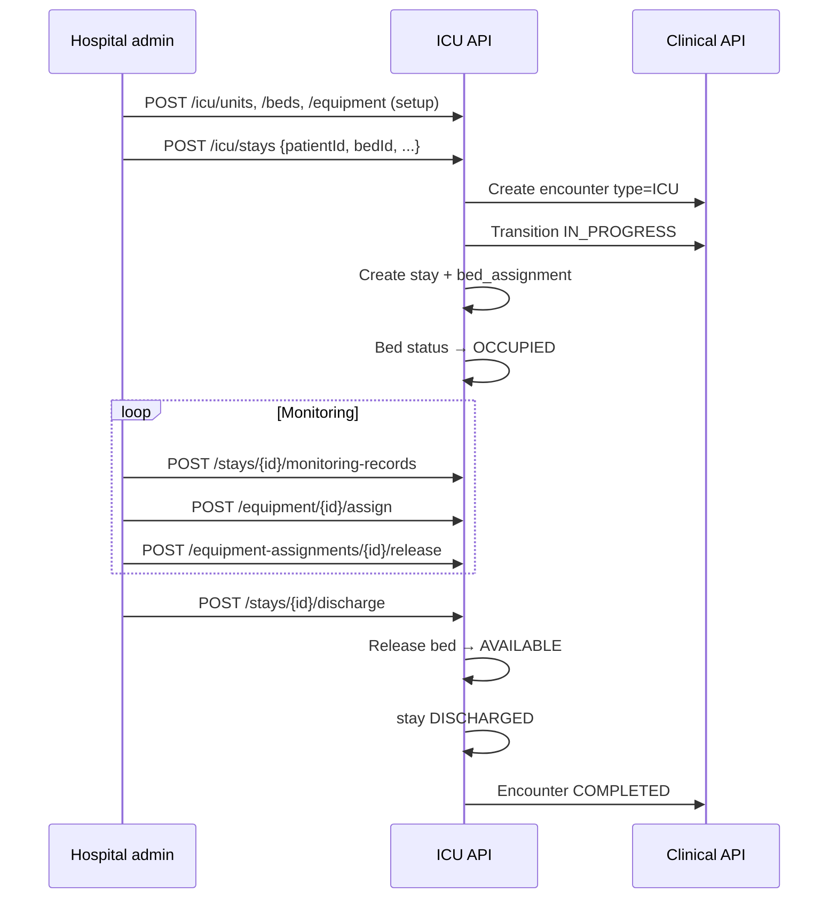

# HMS ICU Flow — Critical Care Admission to Discharge

| Attribute | Value |
|-----------|-------|
| **Document ID** | HMS-ICU-FLOW-001 |
| **Last Updated** | 2026-08-18 |
| **Sprint** | HMS-4 |

---

## Actors

| Actor | Portal | Permissions |
|-------|--------|-------------|
| Hospital admin | Web `/hospital/icu` | `icu:*` |
| Doctor | Encounter detail (future ICU nurse dashboard HMS-9) | `icu:stay:*`, `icu:equipment:*`, `icu:monitoring:*`, `clinical:*` |
| Patient | Web `/patient/encounters` | `clinical:encounter:read` |

---

## End-to-end flow



---

## Setup hierarchy

```
Hospital / Branch
  └── ICU Unit (icu.icu_units)
        └── Bed (icu.icu_beds) — status AVAILABLE | OCCUPIED | …
  └── Equipment (icu.equipment) — optional unit link
```

---

## Status mappings

### ICU stay (`icu.icu_stays`)

| Status | Meaning |
|--------|---------|
| ACTIVE | Patient in ICU |
| DISCHARGED | Closed |
| TRANSFERRED | Moved (future: back to IPD) |
| CANCELLED | Stay voided |

### Equipment (`icu.equipment`)

| Status | Meaning |
|--------|---------|
| AVAILABLE | Free for assignment |
| IN_USE | Assigned to active stay |
| MAINTENANCE / RETIRED | Not assignable |

### Monitoring records

Append-only JSONB payloads keyed by `record_type` (VITALS, VENTILATOR, INFUSION, LAB, OTHER). No update/delete API in HMS-4.

---

## Encounter numbers

ICU encounters use **`ICU-{year}-{6digits}`** via `clinical.encounter_number_sequences` (V32).

Stay number mirrors encounter number for HMS-4.

---

## UI entry points

| Surface | Route |
|---------|-------|
| Hospital web | `/hospital/icu` — tabs: Stays, Beds, Equipment, Monitoring, Setup, Discharge |

---

## Operational notes

- Re-login after V34 so JWT includes `icu:*` permissions.
- Only **AVAILABLE** beds and equipment can be assigned.
- One active assignment per bed and per equipment (unique indexes).
- Double equipment assignment returns **409 Conflict**.

---

## References

- [HMS-MASTER-FLOW.md](./HMS-MASTER-FLOW.md)
- [HMS-IPD-FLOW.md](./HMS-IPD-FLOW.md)
- [HMS-SPRINT-PLAN.md § HMS-4](./HMS-SPRINT-PLAN.md#hms-4--icu-module)
