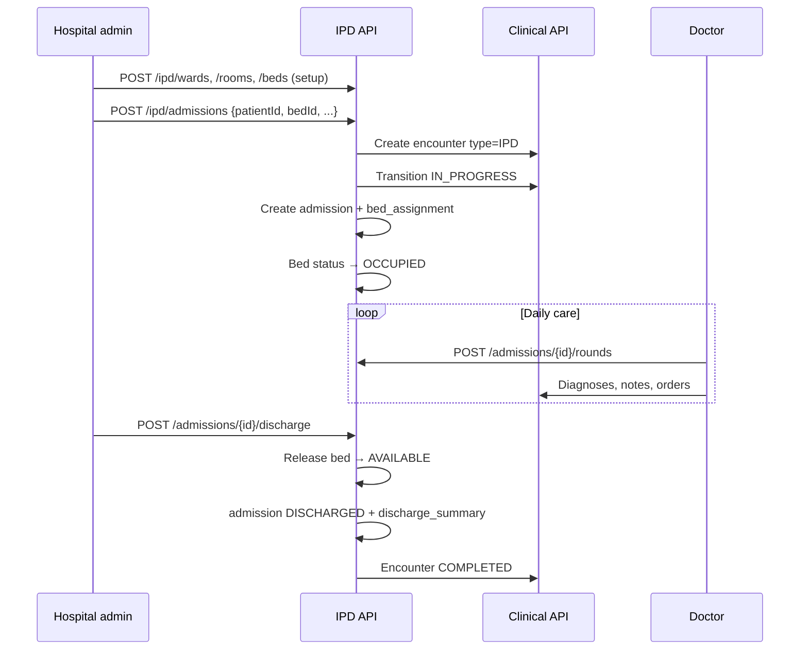

# HMS IPD Flow — Admission to Discharge

| Attribute | Value |
|-----------|-------|
| **Document ID** | HMS-IPD-FLOW-001 |
| **Last Updated** | 2026-08-18 |
| **Sprint** | HMS-3 |

---

## Actors

| Actor | Portal | Permissions |
|-------|--------|-------------|
| Hospital admin | Web `/hospital/ipd` | `ipd:*` |
| Doctor | Encounter detail (future nursing portal HMS-9) | `ipd:admission:*`, `ipd:round:*`, `ipd:discharge:write`, `clinical:*` |
| Patient | Web `/patient/encounters` | `clinical:encounter:read` |

---

## End-to-end flow



---

## Setup hierarchy

```
Hospital / Branch
  └── Ward (ipd.wards)
        └── Room (ipd.rooms)
              └── Bed (ipd.beds) — status AVAILABLE | OCCUPIED | …
```

---

## Status mappings

### Admission (`ipd.admissions`)

| Status | Meaning |
|--------|---------|
| ADMITTED | Active inpatient |
| DISCHARGED | Closed with summary |
| TRANSFERRED | Moved (future: ward/bed transfer) |
| CANCELLED | Admission voided |

### Bed (`ipd.beds`)

| Status | Meaning |
|--------|---------|
| AVAILABLE | Free for assignment |
| OCCUPIED | Active admission |
| RESERVED | Held for expected admission |
| MAINTENANCE / BLOCKED | Not assignable |

### Encounter

IPD admissions create encounters that go **REGISTERED → IN_PROGRESS** on admit and **COMPLETED** on discharge (skips OPD-style WAITING queue).

---

## Encounter numbers

IPD encounters use **`IPD-{year}-{6digits}`** via `clinical.encounter_number_sequences` (V32).

Admission number mirrors encounter number for HMS-3.

---

## UI entry points

| Surface | Route |
|---------|-------|
| Hospital web | `/hospital/ipd` — tabs: Admissions, Beds, Setup, Discharge |

---

## Operational notes

- Re-login after V33 for `ipd:*` permissions.
- Only **AVAILABLE** beds can be assigned on admit.
- One active bed assignment per bed (unique index).
- Discharge is idempotent-guarded (one discharge summary per admission).

---

## References

- [HMS-MASTER-FLOW.md](./HMS-MASTER-FLOW.md)
- [HMS-SPRINT-PLAN.md § HMS-3](./HMS-SPRINT-PLAN.md#hms-3--ipd-module)
