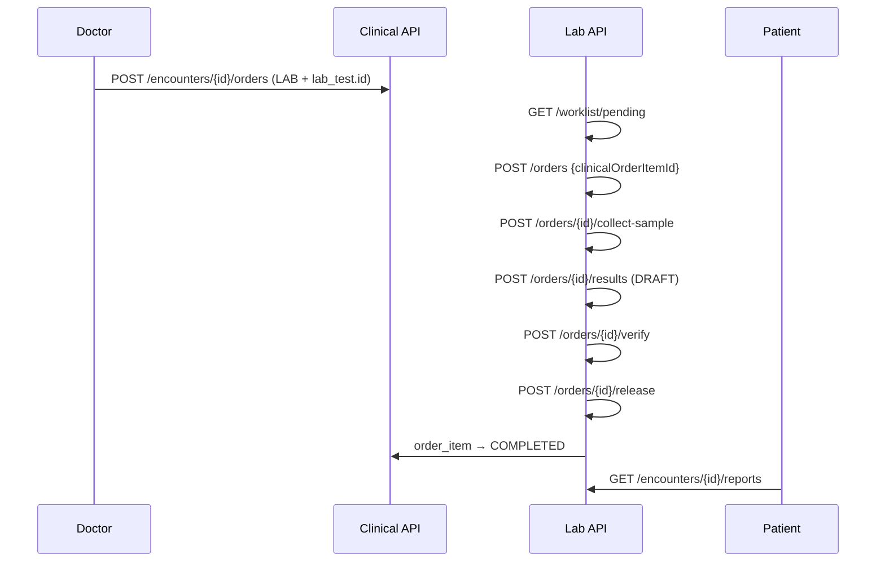

# HMS Laboratory Flow — Clinical Order to Released Report

| Attribute | Value |
|-----------|-------|
| **Document ID** | HMS-LAB-FLOW-001 |
| **Last Updated** | 2026-08-19 |
| **Sprint** | HMS-5 |

---

## Actors

| Actor | Portal | Permissions |
|-------|--------|-------------|
| Hospital admin / Lab technician | Web `/lab/dashboard` | `lab:*` |
| Doctor | Encounter detail `/doctor/encounters/:id` | `lab:catalog:read`, `clinical:encounter:write` |
| Patient | Encounter detail `/patient/encounters/:id` | `clinical:encounter:read` |

---

## End-to-end flow



---

## Catalog hierarchy

```
Hospital / Branch
  └── Laboratory (laboratory.laboratories)
        └── Lab test (laboratory.lab_tests)
              └── Parameters (laboratory.lab_test_parameters)
```

---

## Lab order status (`laboratory.lab_orders`)

| Status | Meaning |
|--------|---------|
| RECEIVED | Lab accepted the clinical order item |
| SAMPLE_COLLECTED | Specimen recorded |
| RESULTS_DRAFT | At least one result entered, not verified |
| VERIFIED | All parameters verified |
| RELEASED | Report published to encounter |
| CANCELLED | Voided (future) |

---

## Key rules

1. One `lab_order` per `clinical.order_item` (unique constraint).
2. Results cannot be released until all parameters are **VERIFIED**.
3. Released reports appear on encounter detail for doctor and patient via `GET /lab/encounters/{id}/reports`.
4. Doctor LAB orders must set `itemReferenceId` to `lab_tests.id` so fulfillment can resolve the test catalog.

---

## API summary

| Method | Path | Purpose |
|--------|------|---------|
| POST/GET | `/lab/laboratories` | Lab location master |
| POST/GET | `/lab/tests` | Test catalog |
| POST/GET | `/lab/tests/{id}/parameters` | Result parameters |
| GET | `/lab/worklist/pending` | Unreceived clinical LAB items |
| POST/GET | `/lab/orders` | Receive / list lab orders |
| POST | `/lab/orders/{id}/collect-sample` | Sample collection |
| POST | `/lab/orders/{id}/results` | Enter draft results |
| POST | `/lab/orders/{id}/verify` | Verify all results |
| POST | `/lab/orders/{id}/release` | Release report |
| GET | `/lab/encounters/{id}/reports` | Released reports for encounter |

---

## Migration

| Version | Content |
|---------|---------|
| V35 | `laboratory` schema + RBAC (`lab:*` permissions) |

---

## Related docs

- [HMS-SPRINT-PLAN.md § HMS-5](./HMS-SPRINT-PLAN.md#hms-5--laboratory)
- [HMS-API-MAP.md](./HMS-API-MAP.md)
- [HMS-MASTER-FLOW.md](./HMS-MASTER-FLOW.md)
