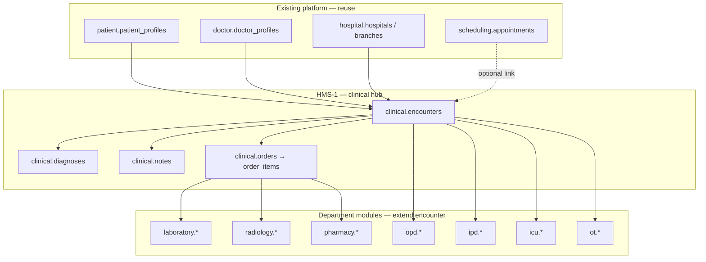
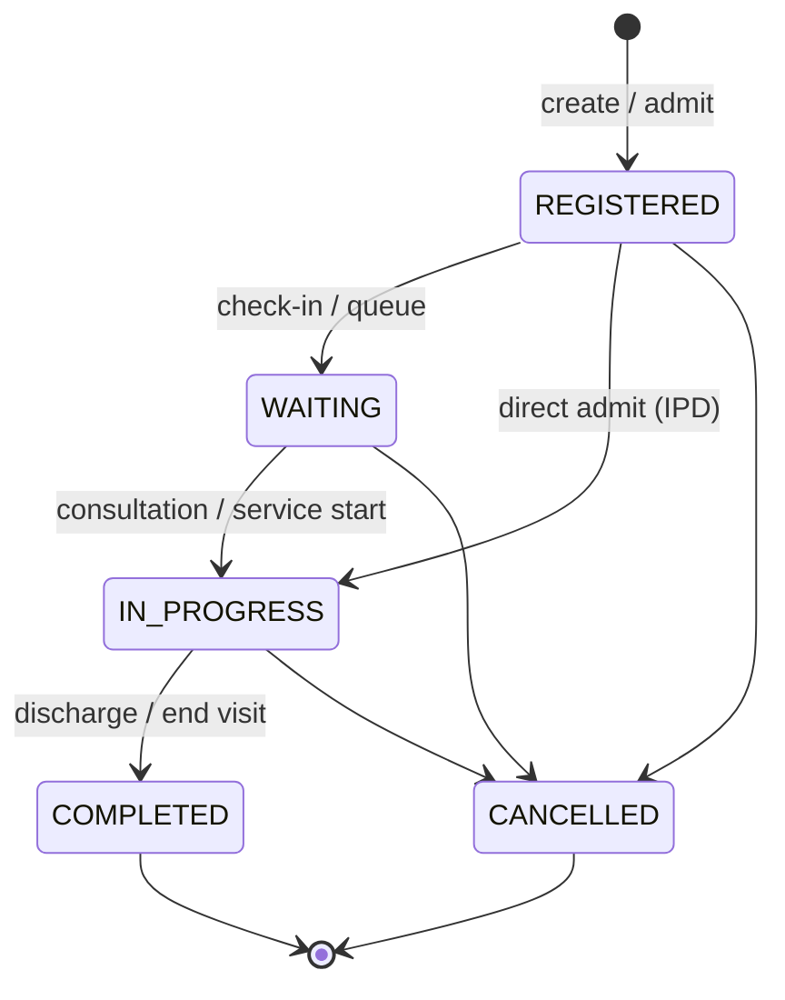
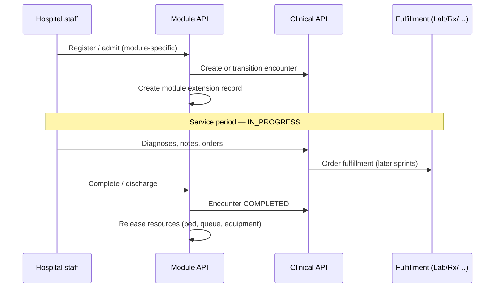
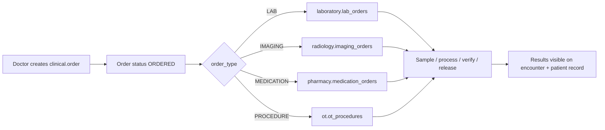

# HMS Master Flow — Generalized Clinical Patterns

| Attribute | Value |
|-----------|-------|
| **Document ID** | HMS-MASTER-FLOW-001 |
| **Last Updated** | 2026-08-18 |
| **Purpose** | Reusable flow template every HMS module follows |

---

## Design principle: encounter-centric

Every clinical event (OPD visit, admission, ICU stay, lab order, imaging, OT procedure, medication) attaches to one **`clinical.encounters`** row for a single **patient identity**. Department modules add **extension tables** and **fulfillment workflows** — they do not duplicate patients or appointments.

---

## 1. Encounter hub pattern

### Create encounter

| Step | Responsibility |
|------|----------------|
| 1 | Validate patient, hospital, branch (and doctor if set) |
| 2 | Allocate `encounter_number` via sequence service (`OPD-`, `IPD-`, or `ENC-` prefix) |
| 3 | Insert `clinical.encounters` with `encounter_type` and `status = REGISTERED` |
| 4 | Audit log `ENCOUNTER_CREATED` |

### Status lifecycle (all modules)

### Clinical documentation (during IN_PROGRESS)

- **Diagnoses** → `POST /clinical/encounters/{id}/diagnoses`
- **Notes** → `POST /clinical/encounters/{id}/notes`
- **Orders** → `POST /clinical/encounters/{id}/orders` (LAB, IMAGING, MEDICATION, PROCEDURE)

### Close encounter

- `POST /encounters/{id}/complete` or module-specific discharge (IPD, ICU)
- Sets `ended_at`, status `COMPLETED`

---

## 2. Department module pattern (template)

Every new HMS module (OPD, IPD, ICU, Lab, …) follows this **same implementation shape**:

| Layer | Convention |
|-------|------------|
| **Flyway** | New schema or tables in dedicated schema; RBAC seed in same migration |
| **Package** | `com.health360.{module}.*` — domain, application, infrastructure, presentation |
| **Extension entity** | Links to `encounter_id` (and optionally `clinical.orders`) |
| **Access service** | `{Module}AccessService` — permission + hospital scope checks |
| **Controller** | `/api/v1/{module}/...` with `@PreAuthorize` |
| **Web** | `frontend/.../features/{module}/` + hospital/doctor portal pages |
| **Tests** | `{Module}IntegrationTest` golden path with Testcontainers |

### Generic sequence (admit / register → serve → complete)

---

## 3. Order fulfillment pattern (HMS-5+)

Clinical orders are **generic** in HMS-1; department modules **fulfill** them:

Order header statuses: `DRAFT` → `ORDERED` → `IN_PROGRESS` → `COMPLETED` | `CANCELLED`

---

## 4. Queue vs bed vs equipment (resource patterns)

| Resource type | Module | Allocation pattern |
|---------------|--------|-------------------|
| **Token / queue slot** | OPD | Daily token sequence; queue entry statuses |
| **Bed** | IPD, ICU | Bed status AVAILABLE → OCCUPIED; temporal `bed_assignments` |
| **Equipment** | ICU | Equipment inventory + time-bound assignments |
| **OT room** | OT | Theatre calendar + status AVAILABLE → IN_USE |
| **Lab bench** | Lab | Implicit via sample processing queue (HMS-5) |

**Rule:** releasing a resource and completing the encounter happen in the **same transaction** on discharge/complete.

---

## 5. RBAC pattern

Each sprint adds permissions `{domain}:{resource}:{action}` and seeds role mappings:

| Role | Typical permissions |
|------|---------------------|
| HOSPITAL_ADMIN | Full module read/write for their hospital |
| DOCTOR | Clinical write + read module data for assigned patients |
| PATIENT | Read own encounters and results |
| PLATFORM_ADMIN | All (dev/support) |
| NURSE / RECEPTIONIST / … | Added in HMS-9, scoped per module |

**Deploy rule:** users must **re-login** after migrations that seed new permissions (JWT is issued at login).

---

## 6. UI pattern (web + mobile)

| Persona | Pattern |
|---------|---------|
| **Hospital admin** | `/hospital/{module}` — setup, queue/beds, operational actions |
| **Doctor** | `/doctor/...` — today's worklist + encounter detail with clinical actions |
| **Patient** | `/patient/encounters` — read-only visit history and results |
| **Mobile** | Same API layer in `features/{module}/api/`; list + detail screens |

List pages use **Spring Page** pagination (`content`, `totalPages`, `page` query param).

---

## 7. Migration numbering

| Version | Module |
|---------|--------|
| V30 | clinical schema |
| V31 | opd |
| V32 | encounter number sequences |
| V33 | ipd |
| V34+ | icu, laboratory, radiology, ot, pharmacy, staff (see [HMS-SPRINT-PLAN.md](./HMS-SPRINT-PLAN.md)) |

**Never edit applied migrations** — add new versions only. Local checksum issues: `mvn flyway:repair flyway:migrate`.

---

## References

- [HMS-SPRINT-PLAN.md](./HMS-SPRINT-PLAN.md) — per-sprint detail
- [HMS-OPD-FLOW.md](./HMS-OPD-FLOW.md) — OPD instance of this pattern
- [HMS-IPD-FLOW.md](./HMS-IPD-FLOW.md) — IPD instance of this pattern
- [HEALTH360-HMS-ARCHITECTURE.md](./HEALTH360-HMS-ARCHITECTURE.md) — full spec
