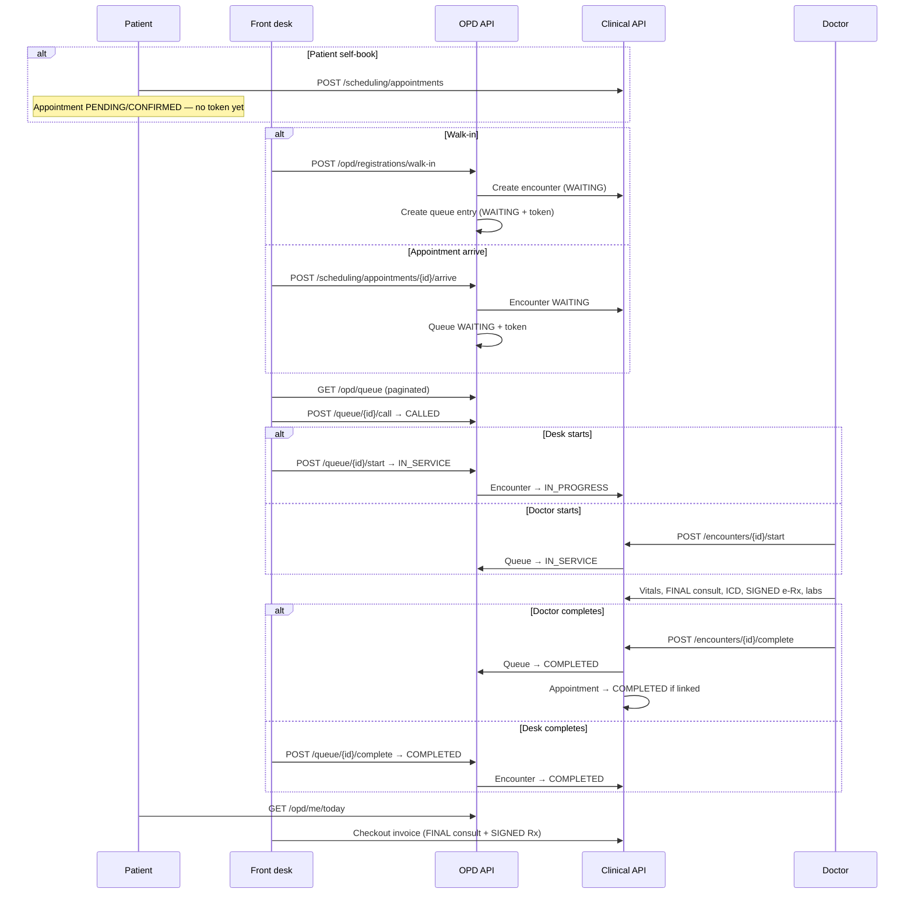

# HMS OPD Flow — Registration to Consultation Complete

| Attribute | Value |
|-----------|-------|
| **Document ID** | HMS-OPD-FLOW-001 |
| **Last Updated** | 2026-08-24 |

---

## Actors

| Actor | Portal | Permissions |
|-------|--------|-------------|
| Hospital admin / front desk | Web `/hospital/opd` | `opd:*`, `clinical:encounter:read` |
| Reception | Web `/reception/dashboard` | `opd:*` |
| Doctor | Web `/doctor/opd`, Mobile Visits tab | `clinical:encounter:*`, `clinical:order:*` |
| Patient | Web `/patient/book`, `/patient/opd`, `/patient/appointments` | `appointment:book`, `clinical:encounter:read` |

Connected visit stories: [P2-F10](../09-features/P2-opd/P2-F10/README.md).

---

## End-to-end flow

---

## Status mappings

### Queue entry (`opd.queue_entries`)

| Status | Meaning |
|--------|---------|
| WAITING | Registered, not yet called |
| CALLED | Token announced / patient at desk |
| IN_SERVICE | Consultation in progress |
| COMPLETED | Visit finished |
| CANCELLED / NO_SHOW | Closed without service |

### Encounter (`clinical.encounters`)

| Status | Meaning |
|--------|---------|
| REGISTERED | Created, not yet in waiting area |
| WAITING | Checked in, awaiting doctor |
| IN_PROGRESS | Active consultation |
| COMPLETED | Closed clinically |
| CANCELLED | Voided |

Queue **start/complete** updates the encounter. Doctor **start/complete** syncs the linked queue (and appointment on complete) so hospital and reception show the same visit.

---

## Encounter numbers (V32+)

New encounters receive concurrency-safe numbers from `clinical.encounter_number_sequences`:

- OPD visits: `OPD-2026-000001`
- Other types: `ENC-2026-000001`

Legacy rows may retain the older `ENC-{hospitalPrefix}-{seq}` format.

---

## UI entry points

| Surface | Route / screen |
|---------|----------------|
| Hospital web | `/hospital/opd` — queue tabs, walk-in, check-in, desks |
| Reception web | `/reception/dashboard` — same queue as hospital |
| Doctor web | `/doctor/opd` — today's encounters; `/doctor/encounters/:id` — detail + actions |
| Patient web | `/patient/book`, `/patient/opd`, `/patient/appointments`, `/patient/encounters` |
| Doctor mobile | Visits tab → Today's OPD → Encounter detail |
| Patient mobile | Dashboard → My visits → Visit detail |

---

## Operational notes

- Re-login required after V30/V31/V32 migrations so JWT includes `clinical:*` and `opd:*` permissions.
- OPD queue polls every 8s on hospital/reception web; doctor OPD refreshes every 10s.
- Queue list is paginated (default `size=50`); use `page` query param for large queues.
