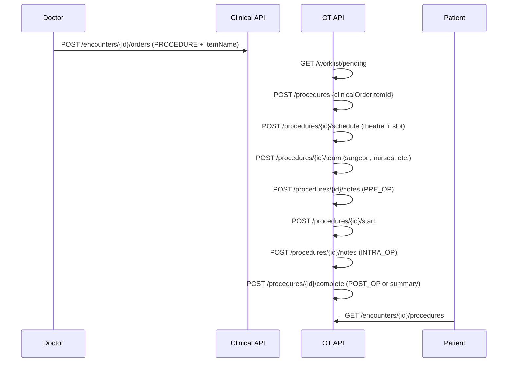

# HMS Operation Theatre Flow — Clinical PROCEDURE Order to Completed Surgery

| Attribute | Value |
|-----------|-------|
| **Document ID** | HMS-OT-FLOW-001 |
| **Last Updated** | 2026-08-19 |
| **Sprint** | HMS-7 |

---

## Actors

| Actor | Portal | Permissions |
|-------|--------|-------------|
| Hospital admin / OT coordinator | `/hospital/ot` or `/ot/dashboard` | `ot:*` |
| Doctor | Encounter detail | `clinical:encounter:write`, `ot:procedure:read` |
| Patient | Encounter detail | `clinical:encounter:read` |

---

## End-to-end flow

---

## Operation theatre catalog

Theatres are registered per hospital branch via `ot.operation_theatres`. Status transitions: `AVAILABLE` → `IN_USE` during active procedures → `AVAILABLE` on completion.

---

## Procedure status

| Status | Meaning |
|--------|---------|
| RECEIVED | OT accepted the clinical PROCEDURE order item |
| SCHEDULED | Theatre and time slot assigned |
| IN_PROGRESS | Procedure started; theatre in use |
| COMPLETED | Post-op documentation done; visible on encounter |
| CANCELLED | Procedure cancelled |

---

## Key rules

1. One `ot_procedure` per `clinical.order_item` (unique constraint).
2. Schedule overlap on the same theatre returns **409 Conflict**.
3. Start requires at least one team member and a **PRE_OP** note (can be supplied via schedule notes).
4. Complete requires an **INTRA_OP** note and either a **POST_OP** note or completion summary.
5. Doctor PROCEDURE orders use free-text `itemName` (no catalog required for MVP).
6. Completed procedures visible via `GET /ot/encounters/{id}/procedures`.

---

## Team roles

`SURGEON`, `ASSISTANT`, `ANAESTHETIST`, `SCRUB_NURSE`, `CIRCULATING_NURSE`

---

## API summary

| Method | Path | Purpose |
|--------|------|---------|
| POST/GET | `/ot/theatres` | Theatre catalog |
| GET | `/ot/worklist/pending` | Unreceived clinical PROCEDURE items |
| POST/GET | `/ot/procedures` | Receive / list procedures |
| GET | `/ot/procedures/{id}` | Procedure detail |
| POST | `/ot/procedures/{id}/schedule` | Schedule in theatre (conflict check) |
| POST | `/ot/procedures/{id}/team` | Add team member |
| POST | `/ot/procedures/{id}/notes` | Add pre/intra/post-op note |
| POST | `/ot/procedures/{id}/start` | Start procedure |
| POST | `/ot/procedures/{id}/complete` | Complete procedure |
| GET | `/ot/encounters/{id}/procedures` | Completed procedures for encounter |

---

## Migration

| Version | Content |
|---------|---------|
| V37 | `ot` schema + RBAC + `OT_COORDINATOR` role |

---

## Related docs

- [HMS-SPRINT-PLAN.md § HMS-7](./HMS-SPRINT-PLAN.md#hms-7--operation-theatre)
- [HMS-RAD-FLOW.md](./HMS-RAD-FLOW.md) — parallel fulfillment pattern
