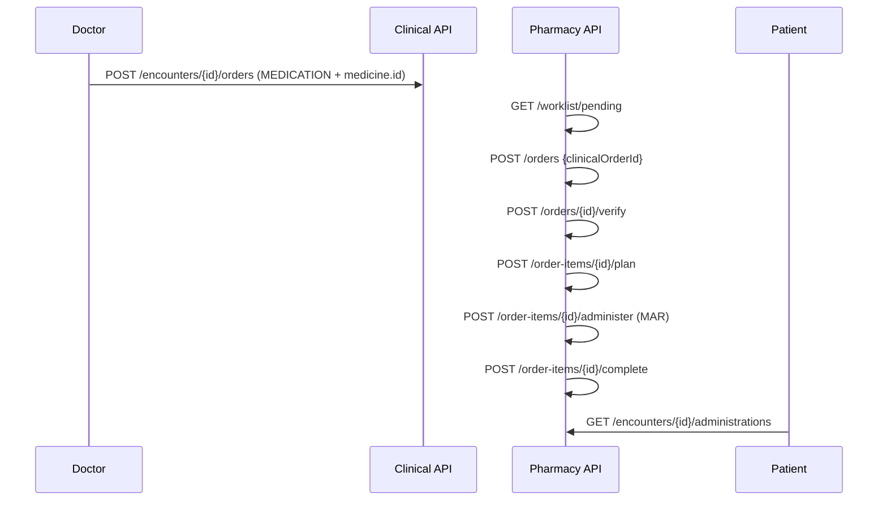

# HMS Clinical Pharmacy Flow — MEDICATION Order to MAR

| Attribute | Value |
|-----------|-------|
| **Document ID** | HMS-PHARM-FLOW-001 |
| **Last Updated** | 2026-08-19 |
| **Sprint** | HMS-8 |

---

## Actors

| Actor | Portal | Permissions |
|-------|--------|-------------|
| Hospital admin / Pharmacist | `/hospital/pharmacy` or `/pharmacy/dashboard` | `pharmacy:*` |
| Doctor | Encounter detail | `pharmacy:medicine:read`, `clinical:encounter:write` |
| Patient | Encounter detail | `clinical:encounter:read` |

---

## End-to-end flow

---

## Medicine catalog

Hospital-branch scoped `pharmacy.medicines` (name, form, strength, default route). No commerce, billing, or inventory in HMS-8.

---

## Medication order status

| Status | Meaning |
|--------|---------|
| RECEIVED | Pharmacy accepted the clinical prescription |
| VERIFIED | Pharmacist verified all lines |
| ACTIVE | Dispense planned; administration in progress |
| COMPLETED | All lines completed |
| CANCELLED | Order cancelled |

---

## Key rules

1. One `medication_order` per `clinical.order` (unique constraint).
2. One `medication_order_item` per clinical order line.
3. Administration (MAR) requires item status **READY** (dispense plan saved).
4. Complete item requires at least one administration record.
5. MAR records link **encounter + time + administering user**.
6. Doctor MEDICATION orders should set `itemReferenceId` to `medicines.id`.
7. **Out of scope:** marketplace, payments, inventory commerce.

---

## API summary

| Method | Path | Purpose |
|--------|------|---------|
| POST/GET | `/pharmacy/medicines` | Medicine catalog |
| GET | `/pharmacy/worklist/pending` | Unreceived clinical MEDICATION orders |
| POST/GET | `/pharmacy/orders` | Receive / list medication orders |
| GET | `/pharmacy/orders/{id}` | Order detail |
| POST | `/pharmacy/orders/{id}/verify` | Verify prescription |
| POST | `/pharmacy/order-items/{id}/plan` | Plan dispense (dose, route, frequency) |
| POST | `/pharmacy/order-items/{id}/administer` | Record MAR dose |
| POST | `/pharmacy/order-items/{id}/complete` | Complete medication course |
| GET | `/pharmacy/encounters/{id}/administrations` | MAR history for encounter |

---

## Migration

| Version | Content |
|---------|---------|
| V38 | `pharmacy` schema + RBAC for existing `PHARMACIST` role |

---

## Related docs

- [HMS-SPRINT-PLAN.md § HMS-8](./HMS-SPRINT-PLAN.md#hms-8--clinical-pharmacy)
- [HMS-OT-FLOW.md](./HMS-OT-FLOW.md) — parallel fulfillment pattern
