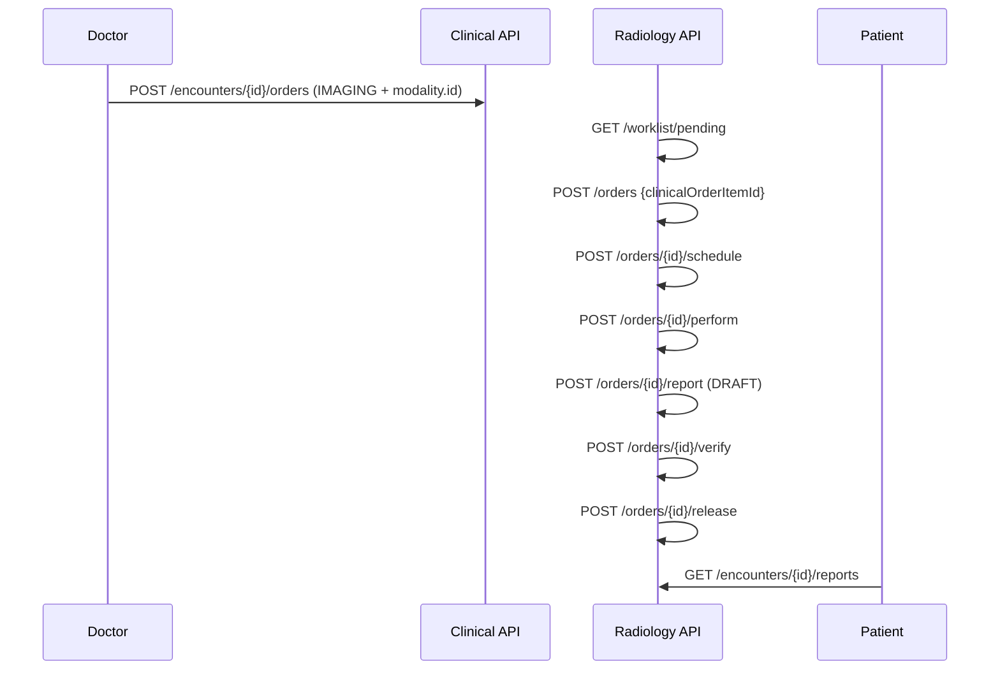

# HMS Radiology Flow — Clinical IMAGING Order to Released Report

| Attribute | Value |
|-----------|-------|
| **Document ID** | HMS-RAD-FLOW-001 |
| **Last Updated** | 2026-08-19 |
| **Sprint** | HMS-6 |

---

## Actors

| Actor | Portal | Permissions |
|-------|--------|-------------|
| Hospital admin / Radiology technician | `/hospital/radiology` or `/radiology/dashboard` | `radiology:*` |
| Doctor | Encounter detail | `radiology:modality:read`, `clinical:encounter:write` |
| Patient | Encounter detail | `clinical:encounter:read` |

---

## End-to-end flow

---

## Modality catalog

Single generic model supporting **X_RAY, USG, CT, MRI, EEG, OTHER** via `modality_type` on `radiology.imaging_modalities`.

---

## Imaging order status

| Status | Meaning |
|--------|---------|
| RECEIVED | Radiology accepted the clinical order item |
| SCHEDULED | Study scheduled |
| PERFORMED | Study completed |
| REPORT_DRAFT | Report entered, not verified |
| VERIFIED | Report verified |
| RELEASED | Report published to encounter |

---

## Key rules

1. One `imaging_order` per `clinical.order_item` (unique constraint).
2. Reports cannot release without verification.
3. Doctor IMAGING orders must set `itemReferenceId` to `imaging_modalities.id`.
4. Released reports visible via `GET /radiology/encounters/{id}/reports`.

---

## API summary

| Method | Path | Purpose |
|--------|------|---------|
| POST/GET | `/radiology/modalities` | Modality catalog |
| GET | `/radiology/worklist/pending` | Unreceived clinical IMAGING items |
| POST/GET | `/radiology/orders` | Receive / list imaging orders |
| POST | `/radiology/orders/{id}/schedule` | Schedule study |
| POST | `/radiology/orders/{id}/perform` | Mark study performed |
| POST | `/radiology/orders/{id}/report` | Enter draft report |
| POST | `/radiology/orders/{id}/verify` | Verify report |
| POST | `/radiology/orders/{id}/release` | Release to encounter |
| GET | `/radiology/encounters/{id}/reports` | Released reports |

---

## Migration

| Version | Content |
|---------|---------|
| V36 | `radiology` schema + RBAC + `RADIOLOGY_TECHNICIAN` role |

---

## Related docs

- [HMS-SPRINT-PLAN.md § HMS-6](./HMS-SPRINT-PLAN.md#hms-6--radiology)
- [HMS-LAB-FLOW.md](./HMS-LAB-FLOW.md) — parallel fulfillment pattern
