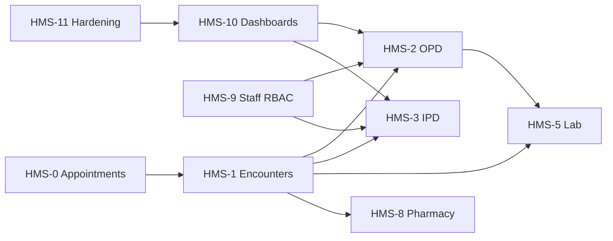

# HMS Roadmap — Phases HMS-0 through HMS-11

| Attribute | Value |
|-----------|-------|
| **Document ID** | HMS-ROADMAP-001 |
| **Last Updated** | 2026-08-18 |
| **Status** | Living document |

---

## Overview

Health360 HMS expands the platform from consumer health + hospital subscription into full clinical operations. Work is delivered in twelve phases (HMS-0 … HMS-11), each with a Flyway migration boundary, backend module, RBAC slice, and portal UI where applicable.

---

## Phase summary

| Phase | Name | Focus | Migration | Status |
|-------|------|-------|-----------|--------|
| HMS-0 | Launch gate | Appointment list pagination fix | — | ✅ Done |
| HMS-1 | Clinical encounter foundation | Encounters, diagnoses, notes, orders, patient/doctor UIs | V30, V32 | ✅ Done |
| HMS-2 | OPD module | Desks, queue, walk-in/check-in, hospital OPD UI | V31 | ✅ Done |
| HMS-3 | IPD module | Admissions, wards, beds, nursing notes | V33 | ✅ Done |
| HMS-4 | ICU module | Critical care flows, monitoring hooks | TBD | ⏳ Next |
| HMS-5 | Laboratory | Lab order fulfillment, results | TBD | ⏳ |
| HMS-6 | Radiology | Imaging orders, reports | TBD | ⏳ |
| HMS-7 | Operation theatre | Surgical scheduling, OT notes | TBD | ⏳ |
| HMS-8 | Clinical pharmacy | Dispensing, administrations | TBD | ⏳ |
| HMS-9 | Staff + RBAC | Receptionist, nurse, lab tech roles | TBD | ⏳ |
| HMS-10 | Role dashboards | Aggregated KPIs per persona | TBD | ⏳ |
| HMS-11 | Performance + security | Load tests, audit review, regression | TBD | ⏳ |

---

## HMS-1 completion criteria (2026-08-18)

- **Backend:** Convenience APIs (`/encounters/me`, `/doctor/me`, `/hospital/{id}`, check-in/start/complete)
- **Encounter numbers:** V32 sequence table with pessimistic locking (`OPD-{year}-{seq}`, `ENC-{year}-{seq}`)
- **OPD queue:** Paginated `GET /opd/queue` (Spring `Page`)
- **Web:** Patient `/patient/encounters`, Doctor `/doctor/opd` + `/doctor/encounters/:id`
- **Mobile:** Patient visits stack, Doctor OPD queue + encounter detail
- **Docs:** Stage 2 pack (this roadmap, OPD flow, domain model, API map)

---

## Dependencies between phases

---

## References

- [HEALTH360-HMS-ARCHITECTURE.md](./HEALTH360-HMS-ARCHITECTURE.md)
- [HMS-SPRINT-STATUS.md](./HMS-SPRINT-STATUS.md)
- [HMS-OPD-FLOW.md](./HMS-OPD-FLOW.md)
- [HMS-DOMAIN-MODEL.md](./HMS-DOMAIN-MODEL.md)
- [HMS-API-MAP.md](./HMS-API-MAP.md)
