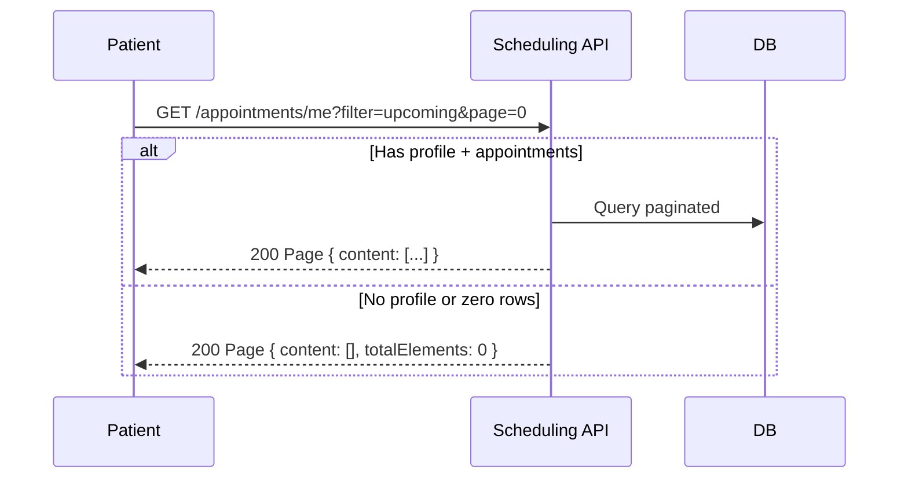
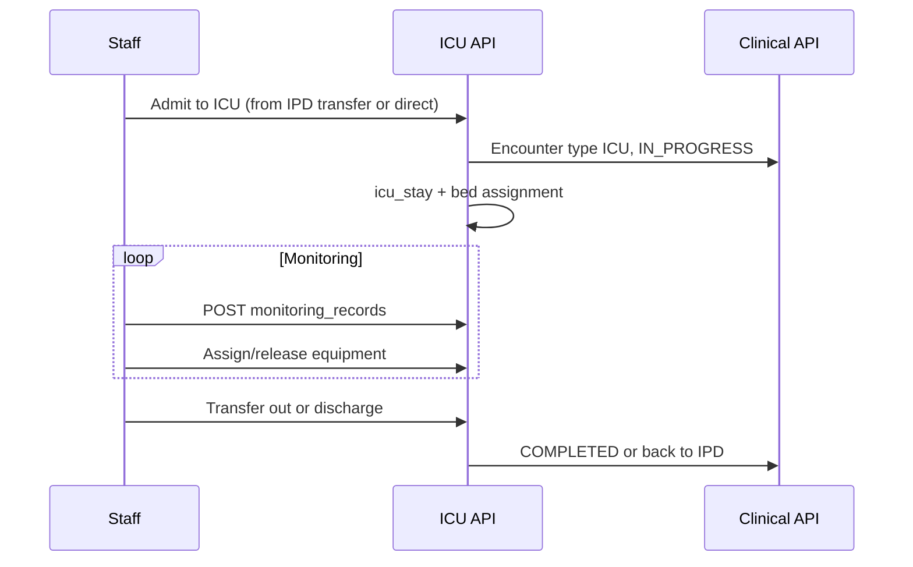
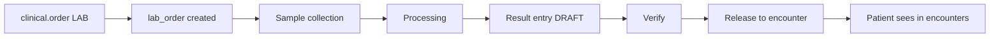
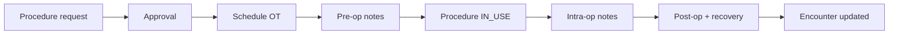

# HMS Sprint Plan — Detailed Design (HMS-0 through HMS-11)

| Attribute | Value |
|-----------|-------|
| **Document ID** | HMS-SPRINT-PLAN-001 |
| **Last Updated** | 2026-08-18 |
| **Index** | [README.md](./README.md) |
| **Generalized patterns** | [HMS-MASTER-FLOW.md](./HMS-MASTER-FLOW.md) |

This document is the **complete per-sprint plan**: goals, flows, schema, APIs, UI, tests, and acceptance criteria. For deliverable checklists see [HMS-SPRINT-STATUS.md](./HMS-SPRINT-STATUS.md).

---

## Sprint overview

| Sprint | Name | Migration | Status | Flow doc |
|--------|------|-----------|--------|----------|
| HMS-0 | Launch gate | — | ✅ | § below |
| HMS-1 | Clinical encounters | V30, V32 | ✅ | [Master flow](./HMS-MASTER-FLOW.md) |
| HMS-2 | OPD | V31 | ✅ | [HMS-OPD-FLOW.md](./HMS-OPD-FLOW.md) |
| HMS-3 | IPD | V33 | ✅ | [HMS-IPD-FLOW.md](./HMS-IPD-FLOW.md) |
| HMS-4 | ICU | V34 (planned) | ✅ | [HMS-ICU-FLOW.md](./HMS-ICU-FLOW.md) |
| HMS-5 | Laboratory | V35 | ✅ | [HMS-LAB-FLOW.md](./HMS-LAB-FLOW.md) |
| HMS-6 | Radiology | V36 | ✅ | [HMS-RAD-FLOW.md](./HMS-RAD-FLOW.md) |
| HMS-7 | Operation theatre | V37 | ✅ | § HMS-7 |
| HMS-8 | Clinical pharmacy | V38 | ✅ | § HMS-8 |
| HMS-9 | Staff + RBAC | V39 (planned) | ✅ | [HMS-STAFF-FLOW.md](./HMS-STAFF-FLOW.md) |
| HMS-10 | Role dashboards | — | ✅ | [HMS-DASHBOARD-FLOW.md](./HMS-DASHBOARD-FLOW.md) |
| HMS-11 | Perf + security | V40 | ✅ | [HMS-HARDENING-FLOW.md](./HMS-HARDENING-FLOW.md) |

---

## HMS-0 — Launch gate

### Goal

Fix appointment list API so patient portal never 500s on empty or missing-profile cases. Establish pagination contract used by all later list APIs.

### Problem

`GET /scheduling/appointments/me` returned a raw list; edge cases caused 500 errors blocking patient portal launch.

### Flow



### Deliverables

| Layer | Item |
|-------|------|
| Backend | Spring `Page` response; null-safe filters |
| Backend | `AppointmentListIntegrationTest` |
| Web/Mobile | Read `data.content` from paged response |

### Acceptance criteria

- [x] All filters (upcoming/past/cancelled) return 200 with empty page when no data
- [x] Patient without profile gets 200 empty page (not 404/500)
- [x] Web and mobile appointment lists work without login-time prefetch

---

## HMS-1 — Clinical encounter foundation

### Goal

Introduce the **encounter hub** — all future HMS modules attach here. Support diagnoses, notes, generic orders, and patient/doctor UIs.

### Depends on

HMS-0 (stable scheduling).

### Schema (V30, V32)

- **V30:** `clinical` — encounters, diagnoses, notes, orders, order_items, followups, reminders
- **V32:** `clinical.encounter_number_sequences` — concurrency-safe numbering

### Encounter flow

See [HMS-MASTER-FLOW.md § Encounter hub](./HMS-MASTER-FLOW.md#1-encounter-hub-pattern).

### RBAC

`clinical:encounter:read|write`, `clinical:order:read|write` → PATIENT (read), DOCTOR, HOSPITAL_ADMIN

### Backend module

`com.health360.clinical.*` — `EncounterService`, `ClinicalController`, `EncounterNumberService`

### Key APIs

| Method | Path | Purpose |
|--------|------|---------|
| POST | `/clinical/encounters` | Create |
| GET | `/clinical/encounters/me` | Patient list |
| GET | `/clinical/encounters/doctor/me` | Doctor worklist |
| POST | `/clinical/encounters/{id}/check-in\|start\|complete` | Convenience transitions |
| POST/GET | `/clinical/encounters/{id}/diagnoses\|notes\|orders` | Documentation |

Full list: [HMS-API-MAP.md](./HMS-API-MAP.md)

### UI

| Persona | Web | Mobile |
|---------|-----|--------|
| Patient | `/patient/encounters`, `/patient/encounters/:id` | Home → My visits |
| Doctor | `/doctor/opd`, `/doctor/encounters/:id` | Visits → OPD queue |

### Tests

- `EncounterStatusTest`, `EncounterNumberServiceTest`
- `ClinicalEncounterIntegrationTest`

### Acceptance criteria

- [x] Doctor can create encounter, add diagnosis + lab order
- [x] Encounter numbers unique under concurrency (V32)
- [x] Patient and doctor can list/view encounters
- [x] Status transitions enforced by `EncounterStatus.canTransitionTo`

---

## HMS-2 — OPD module

### Goal

Outpatient **queue and registration**: walk-in, appointment check-in, token management, consultation sync with encounter.

### Depends on

HMS-1 (encounters).

### Schema (V31)

`opd.desks`, `opd.queue_entries`

### Flow

**Full diagram:** [HMS-OPD-FLOW.md](./HMS-OPD-FLOW.md)

Summary: Register → queue token (WAITING) → call → start (IN_PROGRESS) → complete.

### RBAC

`opd:desk:*`, `opd:queue:*`, `opd:registration:write`

### Backend module

`com.health360.opd.*`

### Key APIs

- `POST /opd/registrations/walk-in`, `/check-in`
- `GET /opd/queue` (paginated, default size 50)
- `POST /opd/queue/{id}/call|start|complete|cancel`

### UI

| Persona | Route |
|---------|-------|
| Hospital admin | `/hospital/opd` — queue, walk-in, check-in, desks |

### Tests

- `OpdIntegrationTest` — walk-in through complete
- `QueueEntryStatusTest`

### Acceptance criteria

- [x] Walk-in creates encounter + queue token
- [x] Appointment check-in links existing appointment
- [x] Queue start sets encounter IN_PROGRESS
- [x] Paginated queue for large hospitals

---

## HMS-3 — IPD module

### Goal

Inpatient **admissions**: ward/room/bed master, bed assignment, daily rounds, structured discharge.

### Depends on

HMS-1 (encounters).

### Schema (V33)

`ipd.wards`, `rooms`, `beds`, `admissions`, `bed_assignments`, `rounds`, `discharge_summaries`

### Flow

**Full diagram:** [HMS-IPD-FLOW.md](./HMS-IPD-FLOW.md)

### RBAC

`ipd:ward:*`, `ipd:bed:*`, `ipd:admission:*`, `ipd:round:*`, `ipd:discharge:write`

### Backend module

`com.health360.ipd.*`

### Key APIs

- Setup: `/ipd/wards`, `/rooms`, `/beds`
- Operations: `POST /ipd/admissions`, `/admissions/{id}/rounds`, `/admissions/{id}/discharge`

### UI

| Persona | Route |
|---------|-------|
| Hospital admin | `/hospital/ipd` |

### Tests

- `IpdIntegrationTest` — ward → bed → admit → round → discharge

### Acceptance criteria

- [x] Admit occupies bed and creates IPD encounter
- [x] Discharge releases bed and completes encounter
- [x] One active assignment per bed

---

## HMS-4 — ICU module

### Goal

Critical care: ICU units/beds, stays linked to encounters, equipment tracking, monitoring records.

### Depends on

HMS-3 (IPD bed patterns; ICU may reference or mirror bed model).

### Planned schema (V34)

| Table | Purpose |
|-------|---------|
| `icu.icu_units` | Unit per branch |
| `icu.icu_beds` | Bed inventory |
| `icu.icu_stays` | Encounter extension for ICU admission |
| `icu.equipment` | Ventilators, monitors, pumps |
| `icu.equipment_assignments` | Patient ↔ equipment over time |
| `icu.monitoring_records` | Typed monitoring (ventilator, infusion, vitals, etc.) |

### Planned flow



### Planned RBAC

`icu:unit:*`, `icu:stay:*`, `icu:equipment:*`, `icu:monitoring:write`

### Planned UI

| Persona | Route |
|---------|-------|
| Hospital admin | `/hospital/icu` |
| ICU nurse | `/icu/dashboard` (HMS-9 role) |

### Planned tests

- `IcuIntegrationTest` — admit, monitoring record, equipment assign, discharge

### Acceptance criteria

- [x] ICU stay linked 1:1 to encounter
- [x] Equipment cannot be double-assigned
- [x] Monitoring records append-only with audit

---

## HMS-5 — Laboratory

### Goal

Fulfill **clinical LAB orders**: catalog, sample collection, result entry, verification, release to patient record.

### Depends on

HMS-1 (clinical orders).

### Planned schema (V35)

`laboratory.laboratories`, `lab_tests`, `lab_test_parameters`, `lab_orders`, `lab_samples`, `lab_results`, `lab_reports`

### Planned flow



### Planned RBAC

`lab:order:*`, `lab:result:verify`, `lab:report:release` → LAB_TECHNICIAN

### Planned UI

| Persona | Route |
|---------|-------|
| Lab tech | `/lab/dashboard` |
| Doctor | Order labs from encounter detail |
| Patient | Results on encounter detail |

### Acceptance criteria

- [x] Lab order links to `clinical.order_item_id`
- [x] Results cannot release without verification step
- [x] Released results visible on patient encounter

---

## HMS-6 — Radiology

### Goal

Imaging workflow: modalities, studies, reports — single generic model (no per-modality tables).

### Depends on

HMS-1 (clinical IMAGING orders).

### Planned schema (V36)

`radiology.imaging_modalities`, `imaging_orders`, `imaging_studies`, `imaging_reports`

### Planned flow

Order → schedule study → perform → draft report → verify → release (mirrors lab pattern).

### Planned RBAC

`radiology:order:*`, `radiology:report:verify`, `radiology:report:release`

### Planned UI

`/radiology/dashboard`, encounter detail for ordering

### Acceptance criteria

- [x] Supports X-RAY, USG, CT, MRI, EEG via modality catalog
- [x] Report release triggers patient visibility

---

## HMS-7 — Operation theatre

### Goal

Surgical scheduling and documentation: theatres, schedules, procedures, team, pre/intra/post-op notes.

### Depends on

HMS-1 (encounters + PROCEDURE orders).

### Planned schema (V37)

`ot.operation_theatres`, `ot_schedules`, `ot_procedures`, `ot_team_members`, `ot_notes`

### Planned flow



### Planned RBAC

`ot:theatre:*`, `ot:schedule:*`, `ot:procedure:*`

### Acceptance criteria

- [x] OT room conflict detection on schedule
- [x] Team members recorded per procedure

---

## HMS-8 — Clinical pharmacy

### Goal

Medication order fulfillment and **MAR** (medication administration record) for IPD/ICU.

### Depends on

HMS-1 (orders), HMS-3/4 (administration context).

### Planned schema (V38)

`pharmacy.medicines`, `medication_orders`, `medication_order_items`, `medication_administrations`

### Planned flow

Prescribe (clinical order) → pharmacy verify → dispense plan → administer dose (MAR) → audit trail

**Out of scope:** marketplace, payments, inventory commerce.

### Planned RBAC

`pharmacy:medication:*`, `pharmacy:administer`

### Acceptance criteria

- [x] Administration linked to encounter + time + nurse
- [x] No commerce/billing in HMS-8

---

## HMS-9 — Staff + RBAC expansion

### Goal

Hospital staff records and new roles: RECEPTIONIST, NURSE, LAB_TECHNICIAN, PHARMACIST, etc.

### Depends on

HMS-2, HMS-3 (modules for roles to operate).

### Planned schema (V39)

`hospital.staff`, `staff_role_assignments`, IAM role seeds

### Planned flow

Hospital admin invites staff → role assignment → scoped permissions per branch/department

### New roles (from architecture)

| Role | Primary module |
|------|----------------|
| RECEPTIONIST | OPD registration/queue |
| NURSE | IPD/ICU vitals, MAR |
| LAB_TECHNICIAN | Laboratory |
| RADIOLOGY_TECHNICIAN | Radiology |
| PHARMACIST | Pharmacy |
| OT_STAFF | Operation theatre |
| ICU_NURSE | ICU monitoring |

### Acceptance criteria

- [x] Staff can only access assigned hospital/branch
- [x] Receptionist can run OPD without full admin rights

---

## HMS-10 — Role dashboards

### Goal

Aggregated **read APIs** per persona — no N+1, purpose-built DTOs.

### Depends on

HMS-2 through HMS-8 (data to aggregate).

### Planned APIs

```
GET /api/v1/hospital/dashboard
GET /api/v1/opd/dashboard
GET /api/v1/ipd/dashboard
GET /api/v1/icu/dashboard
GET /api/v1/lab/dashboard
GET /api/v1/doctor/dashboard (enhanced)
GET /api/v1/patient/dashboard (clinical slice)
```

### Acceptance criteria

- [x] Each dashboard loads in single API call
- [x] Counts match underlying module queries

---

## HMS-11 — Performance + security

### Goal

Search indexes, load tests, RBAC regression suite, security audit of clinical endpoints.

### Planned work

| Area | Action |
|------|--------|
| Search | DB-side FTS/trigram (V40 indexes) |
| Vitals | Optional `encounter_id` on vital_sign_records (V42) |
| Tests | Full integration regression matrix per role |
| Security | Audit sensitive fields; deny-by-default review |
| Flyway | Never modify applied migrations |

### Acceptance criteria

- [x] Appointment + encounter golden paths pass CI
- [x] No 500 on empty list endpoints
- [x] RBAC integration tests for each role

---

## Cross-sprint conventions

| Topic | Rule |
|-------|------|
| **Pagination** | Spring `Page` in `data`; clients read `content` |
| **Permissions** | Re-login after migration seeds new permissions |
| **Audit** | All write operations via `AuditLogService` |
| **Feature gates** | `subscription_plan_features` (future per-module enablement) |
| **Tests** | Testcontainers PostgreSQL; `@EnabledIf` Docker check |

---

## References

- [README.md](./README.md) — documentation index
- [HMS-MASTER-FLOW.md](./HMS-MASTER-FLOW.md) — generalized patterns
- [HEALTH360-HMS-ARCHITECTURE.md](./HEALTH360-HMS-ARCHITECTURE.md) — authoritative architecture
- [HMS-SPRINT-STATUS.md](./HMS-SPRINT-STATUS.md) — completion checklist
