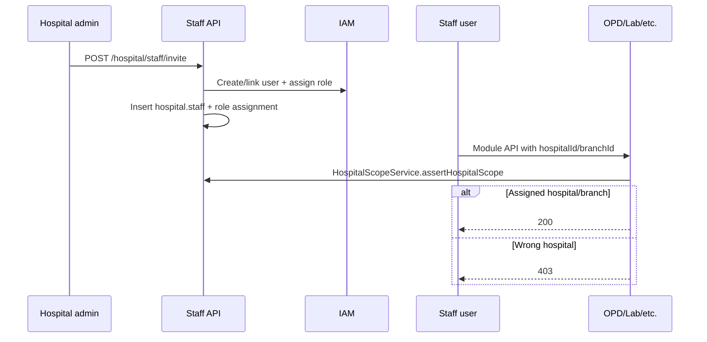

# HMS Staff + RBAC Flow — Hospital Staff Invite to Scoped Access

| Attribute | Value |
|-----------|-------|
| **Document ID** | HMS-STAFF-FLOW-001 |
| **Last Updated** | 2026-08-19 |
| **Sprint** | HMS-9 |

---

## Actors

| Actor | Portal | Permissions |
|-------|--------|-------------|
| Hospital admin | `/hospital/staff` | `staff:read`, `staff:write`, `staff:invite` |
| Receptionist | `/reception/dashboard` | `opd:*` (queue/registration), `clinical:encounter:read` |
| Nurse | `/nursing/dashboard` | MAR + IPD/ICU read/write (vitals, rounds) |
| ICU nurse | `/icu-nurse/dashboard` | ICU monitoring + MAR |
| Lab / radiology / pharmacy / OT staff | Existing module portals | Module permissions + staff scope |

---

## End-to-end flow

---

## Schema (V39)

- `hospital.staff` — links `user_id` to `hospital_id` (+ optional `branch_id`, `department_id`)
- `hospital.staff_role_assignments` — operational role label per staff record
- IAM roles seeded: `RECEPTIONIST`, `NURSE`, `ICU_NURSE`
- Permissions: `staff:read`, `staff:write`, `staff:invite` → `HOSPITAL_ADMIN`, `PLATFORM_ADMIN`

---

## Hospital scope rules

1. `PLATFORM_ADMIN` — unrestricted.
2. `HOSPITAL_ADMIN` — owns the hospital (existing admin check).
3. Staff-scoped roles (`RECEPTIONIST`, `NURSE`, `ICU_NURSE`, `LAB_TECHNICIAN`, …) — must have an **active** `hospital.staff` row for the requested `hospitalId`; when `branchId` is supplied, staff `branch_id` must match or be null (hospital-wide).
4. Others — denied for hospital-wide operations (encounter-level checks apply elsewhere).

`HospitalScopeService` is used by OPD, IPD, ICU, lab, radiology, pharmacy, and OT access services.

---

## Invitable roles

| Role | Primary module |
|------|----------------|
| RECEPTIONIST | OPD queue / registration |
| NURSE | MAR, IPD rounds |
| ICU_NURSE | ICU monitoring |
| LAB_TECHNICIAN | Laboratory |
| RADIOLOGY_TECHNICIAN | Radiology |
| PHARMACIST | Pharmacy |
| OT_COORDINATOR | Operation theatre |

---

## API summary

| Method | Path | Purpose |
|--------|------|---------|
| POST | `/hospital/staff/invite` | Invite staff (create user if needed, assign IAM + staff record) |
| GET | `/hospital/staff?hospitalId=` | List staff for hospital |
| POST | `/hospital/staff/{staffId}/deactivate` | Set employment status INACTIVE |

---

## Web routes

| Persona | Route |
|---------|-------|
| Hospital admin | `/hospital/staff` |
| Receptionist | `/reception/dashboard` |
| Nurse | `/nursing/dashboard` |
| ICU nurse | `/icu-nurse/dashboard` |

Staff portals use manual hospital/branch ID fields (same pattern as lab/pharmacy tech portals) until HMS-10 adds aggregated dashboard APIs.

---

## Deploy note

Restart backend after V39 migration. Hospital admin and newly invited staff must **re-login** so JWT includes `staff:*` permissions and new role grants.
