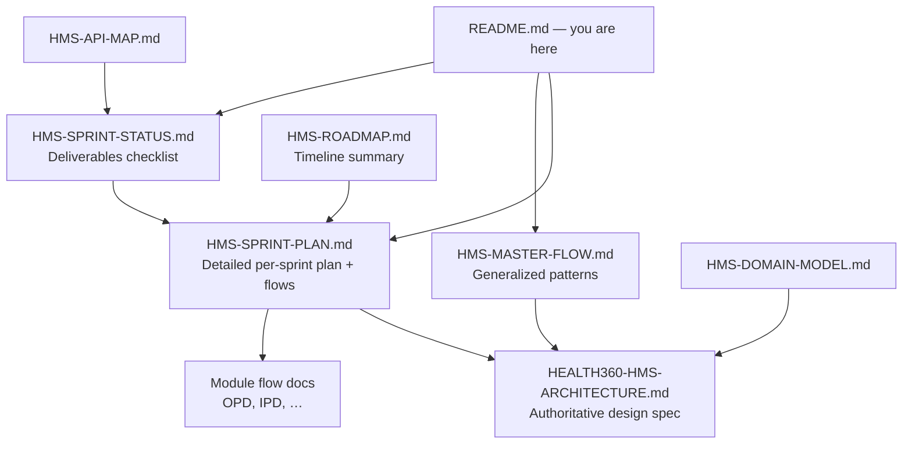

# Health360 HMS — Documentation Index

| Attribute | Value |
|-----------|-------|
| **Document ID** | HMS-INDEX-001 |
| **Last Updated** | 2026-08-19 |
| **Start here** | This file |

---

## What to read first

| Question | Document |
|----------|----------|
| **Where is the complete plan for all 12 sprints?** | [HMS-SPRINT-PLAN.md](./HMS-SPRINT-PLAN.md) |
| **What is the generalized flow every module follows?** | [HMS-MASTER-FLOW.md](./HMS-MASTER-FLOW.md) |
| **What is done vs in progress?** | [HMS-SPRINT-STATUS.md](./HMS-SPRINT-STATUS.md) |
| **High-level phase timeline** | [HMS-ROADMAP.md](./HMS-ROADMAP.md) |
| **Full architecture (domain, RBAC, migrations)** | [HEALTH360-HMS-ARCHITECTURE.md](./HEALTH360-HMS-ARCHITECTURE.md) |
| **Entity & schema relationships** | [HMS-DOMAIN-MODEL.md](./HMS-DOMAIN-MODEL.md) |
| **All API endpoints** | [HMS-API-MAP.md](./HMS-API-MAP.md) |

---

## Module flow designs (per feature)

Each module has a dedicated flow document with actors, sequence diagrams, status tables, and UI routes.

| Module | Flow doc | Sprint | Status |
|--------|----------|--------|--------|
| Appointments (pre-HMS gate) | [HMS-SPRINT-PLAN.md § HMS-0](./HMS-SPRINT-PLAN.md#hms-0--launch-gate) | HMS-0 | ✅ |
| Clinical encounters (hub) | [HMS-MASTER-FLOW.md § Encounter hub](./HMS-MASTER-FLOW.md#1-encounter-hub-pattern) | HMS-1 | ✅ |
| OPD | [HMS-OPD-FLOW.md](./HMS-OPD-FLOW.md) | HMS-2 | ✅ |
| IPD | [HMS-IPD-FLOW.md](./HMS-IPD-FLOW.md) | HMS-3 | ✅ |
| ICU | [HMS-ICU-FLOW.md](./HMS-ICU-FLOW.md) | HMS-4 | ✅ |
| Laboratory | [HMS-LAB-FLOW.md](./HMS-LAB-FLOW.md) | HMS-5 | ✅ |
| Radiology | [HMS-RAD-FLOW.md](./HMS-RAD-FLOW.md) | HMS-6 | ✅ |
| Operation theatre | [HMS-OT-FLOW.md](./HMS-OT-FLOW.md) | HMS-7 | ✅ |
| Clinical pharmacy | [HMS-PHARM-FLOW.md](./HMS-PHARM-FLOW.md) | HMS-8 | ✅ |
| Staff + RBAC | [HMS-STAFF-FLOW.md](./HMS-STAFF-FLOW.md) | HMS-9 | ✅ |
| Role dashboards | [HMS-DASHBOARD-FLOW.md](./HMS-DASHBOARD-FLOW.md) | HMS-10 | ✅ |
| Hardening | [HMS-HARDENING-FLOW.md](./HMS-HARDENING-FLOW.md) | HMS-11 | ✅ |

---

## Document roles (how they relate)

---

## Code locations (implementation)

| Layer | Pattern |
|-------|---------|
| Migrations | `backend/health360-api/src/main/resources/db/migration/V30+__*.sql` |
| Backend modules | `backend/health360-api/src/main/java/com/health360/{clinical,opd,ipd,icu,...}/` |
| Web features | `frontend/health360-web/src/features/{clinical,opd,ipd,icu,...}/` |
| Mobile features | `mobile/health360-mobile/src/features/clinical/` |
| Integration tests | `backend/health360-api/src/test/java/com/health360/{clinical,opd,ipd,...}/` |

---

## Related (outside `docs/hms/`)

- [HEALTH360-COMPLETE-PROJECT-STATUS.md](../HEALTH360-COMPLETE-PROJECT-STATUS.md) — whole-product status (Phase 1 + 1.5 + HMS)
- Phase 1.5 architecture docs under `docs/phase-1.5/`
