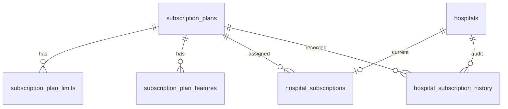

# DOC-56: Phase 1.5 — Database Design

| Attribute | Value |
|-----------|-------|
| **Document ID** | DOC-56 |
| **Version** | 1.0 |
| **Status** | Approved |
| **Migrations** | V26, V27, V28 |

---

## 1. New tables

### `shared.subscription_plans`

| Column | Type | Notes |
|--------|------|-------|
| id | UUID PK | Seeded fixed IDs for FREE–ENTERPRISE |
| tenant_id | UUID FK | |
| code | VARCHAR(50) | UNIQUE per tenant |
| name | VARCHAR(200) | |
| description | TEXT | |
| price | DECIMAL(12,2) | |
| currency | CHAR(3) | Default INR |
| billing_cycle | VARCHAR(20) | NONE, MONTHLY |
| status | VARCHAR(20) | ACTIVE, INACTIVE |
| trial_days | INT | Optional |

Extends `BaseAuditableEntity` (soft delete via `deleted_at`).

### `shared.subscription_plan_limits`

| Column | Type | Notes |
|--------|------|-------|
| plan_id | UUID FK | |
| limit_key | VARCHAR(100) | e.g. MAX_DOCTORS |
| limit_value | BIGINT | |

Unique: `(plan_id, limit_key)` where not deleted.

### `shared.subscription_plan_features`

| Column | Type | Notes |
|--------|------|-------|
| plan_id | UUID FK | |
| feature_key | VARCHAR(100) | e.g. FEATURE_ANALYTICS |
| enabled | BOOLEAN | |

### `hospital.hospital_subscriptions`

| Column | Type | Notes |
|--------|------|-------|
| id | UUID PK | |
| hospital_id | UUID FK | |
| plan_id | UUID FK | |
| status | VARCHAR(30) | ACTIVE, TRIAL, EXPIRED, CANCELLED, SUSPENDED |
| start_date | DATE | |
| end_date | DATE | Nullable |
| auto_renew | BOOLEAN | |
| price_at_subscription | DECIMAL | Snapshot |

**Unique index:** one ACTIVE/TRIAL row per `hospital_id`.

### `hospital.hospital_subscription_history`

| Column | Type | Notes |
|--------|------|-------|
| id | UUID PK | |
| hospital_id | UUID FK | |
| subscription_id | UUID FK | Nullable |
| plan_id | UUID FK | |
| previous_plan_id | UUID FK | Nullable |
| event_type | VARCHAR(50) | See DOC-55 |
| status | VARCHAR(30) | Status at event time |
| effective_at | TIMESTAMPTZ | |
| notes | TEXT | |

**Append-only** — no updates/deletes in application code.

---

## 2. Modified tables

### `hospital.hospitals`

Added:
- `status VARCHAR(20) DEFAULT 'ACTIVE'` — CHECK (ACTIVE, INACTIVE, SUSPENDED)

---

## 3. Seeded plan limits (V28)

| Plan | MAX_DOCTORS | MAX_PATIENTS | MAX_DEPARTMENTS | MAX_BRANCHES | MAX_APPT/MO |
|------|-------------|--------------|-----------------|--------------|-------------|
| FREE | 1 | 100 | 1 | 1 | 200 |
| STARTER | 5 | 500 | 5 | 2 | 1,000 |
| PROFESSIONAL | 25 | 5,000 | 20 | 10 | 10,000 |
| ENTERPRISE | 999 | 99,999 | 99 | 50 | 999,999 |

**Note:** `MAX_STAFF` intentionally omitted.

---

## 4. Seeded permissions (V28)

| Permission | Role |
|------------|------|
| `admin:hospitals:read/write` | PLATFORM_ADMIN |
| `admin:plans:read/write` | PLATFORM_ADMIN |
| `admin:subscriptions:read/write` | PLATFORM_ADMIN |
| `hospital:subscription:read` | HOSPITAL_ADMIN |
| `audit:view` | PLATFORM_ADMIN (API not implemented) |

---

## 5. Backfill (V28)

- All existing hospitals without subscription → FREE plan
- INITIAL history row for each backfilled subscription

---

## 6. ER diagram (subscription slice)

---

## 7. Existing relationships (unchanged)

- `doctor.hospital_associations` — doctor M:N hospital (status ACTIVE/PENDING)
- `hospital.hospitals.admin_user_id` → `iam.users.id`
