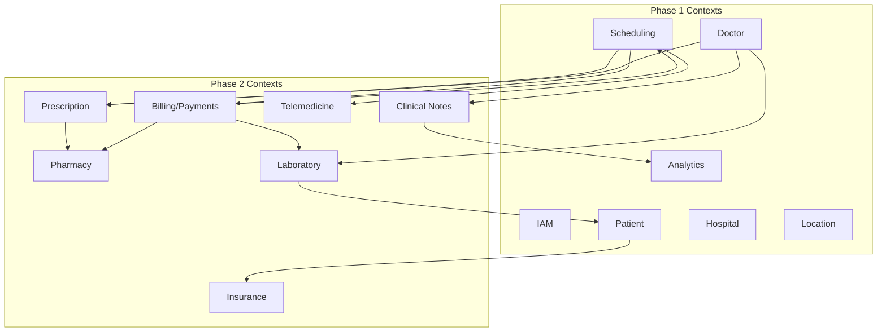

# DOC-25: Health360 AI — Phase 2 Domain Model & Bounded Contexts

| Attribute | Value |
|-----------|-------|
| **Document ID** | DOC-25 |
| **Title** | Phase 2 Domain Model & Bounded Contexts |
| **Version** | 1.0 |
| **Status** | **Draft** |
| **Date** | 2026-08-03 |
| **References** | [DOC-05](../../phase-1/architecture/05-DOMAIN-MODEL-AND-BOUNDED-CONTEXTS.md), [DOC-21](../requirements/21-PHASE-2-VISION-AND-SCOPE-CHARTER.md) |

---

## 1. Context Map (Phase 1 + Phase 2)

---

## 2. New Bounded Contexts

### 2.1 Prescription (M08)

| Aggregate | Entities / VOs |
|-----------|----------------|
| **Prescription** | PrescriptionId, AppointmentId, DoctorId, PatientId, lines[], status, version |
| **PrescriptionLine** | DrugName, Dosage, Frequency, Duration, Instructions |
| **PrescriptionStatus** | DRAFT, ISSUED, PARTIALLY_DISPENSED, DISPENSED, EXPIRED, CANCELLED |

**Domain events:** `PrescriptionIssued`, `PrescriptionAmended`

### 2.2 Pharmacy (M09)

| Aggregate | Entities |
|-----------|----------|
| **Pharmacy** | Profile, license, branches, verification status |
| **MedicineCatalogItem** | SKU, name, strength, MRP, stock |
| **PharmacyOrder** | PrescriptionId, lines[], fulfillment status, delivery address |

### 2.3 Laboratory (M10)

| Aggregate | Entities |
|-----------|----------|
| **Lab** | Profile, accreditation, collection centers |
| **LabTest** | Code, name, sample type, TAT, price |
| **LabOrder** | AppointmentId, tests[], collection slot, status |
| **LabResult** | OrderId, PDF ref, structured values[], releasedAt |

### 2.4 Billing & Payments (M11)

| Aggregate | Entities |
|-----------|----------|
| **Invoice** | Line items, tax, total, linked entity (appointment/order) |
| **Payment** | Gateway ref, status, idempotency key |
| **Refund** | PaymentId, amount, reason |

### 2.5 Telemedicine (M12)

| Aggregate | Entities |
|-----------|----------|
| **VideoSession** | AppointmentId, roomId, provider, startedAt, endedAt |
| **TelehealthConsent** | PatientId, acceptedAt, version |

---

## 3. Integration Patterns

| From | To | Pattern |
|------|-----|---------|
| Prescription → Pharmacy | Domain event | Async order creation offer |
| Lab result released → Patient | Event + API | Sync timeline update |
| Payment confirmed → Order | Saga | Confirm within transaction boundary |
| Appointment COMPLETED → EMR | Application service | Enable note/Rx UI |

---

## 4. New Roles (IAM extension)

| Role | Context access |
|------|----------------|
| PHARMACIST | Pharmacy module (full), read prescription |
| LAB_TECHNICIAN | Laboratory module (full) |
| BILLING_ADMIN | Payments reconciliation (read/export) |

---

*End of DOC-25 — Phase 2 Domain Model v1.0*
