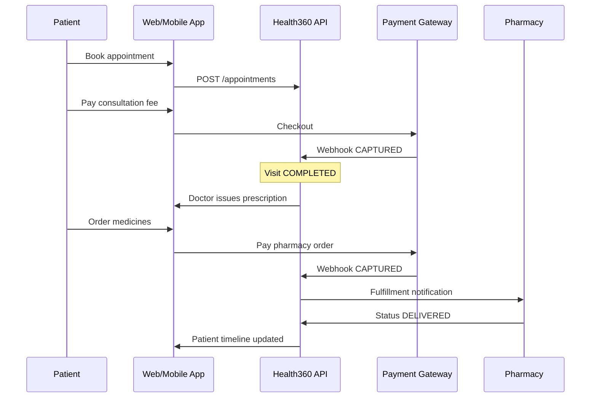
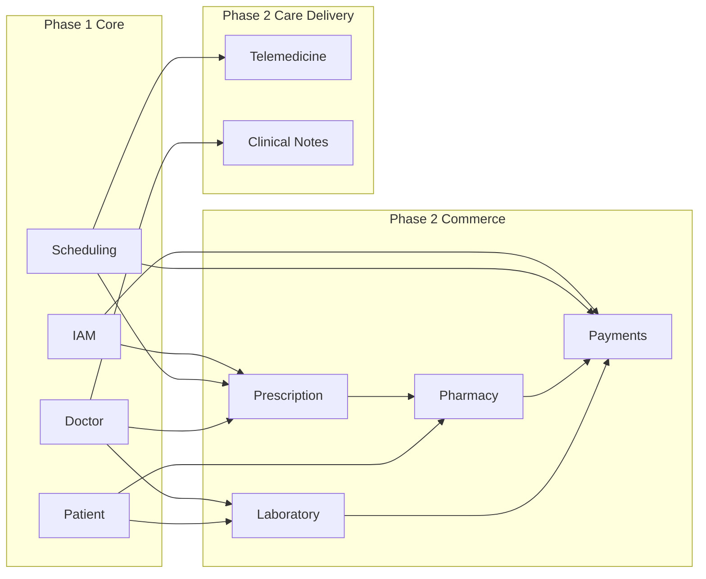
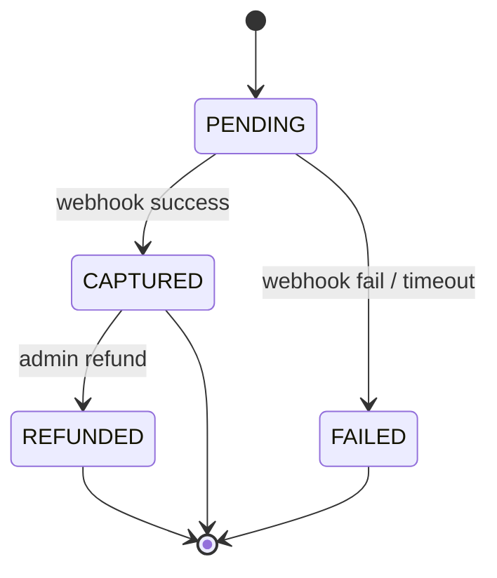
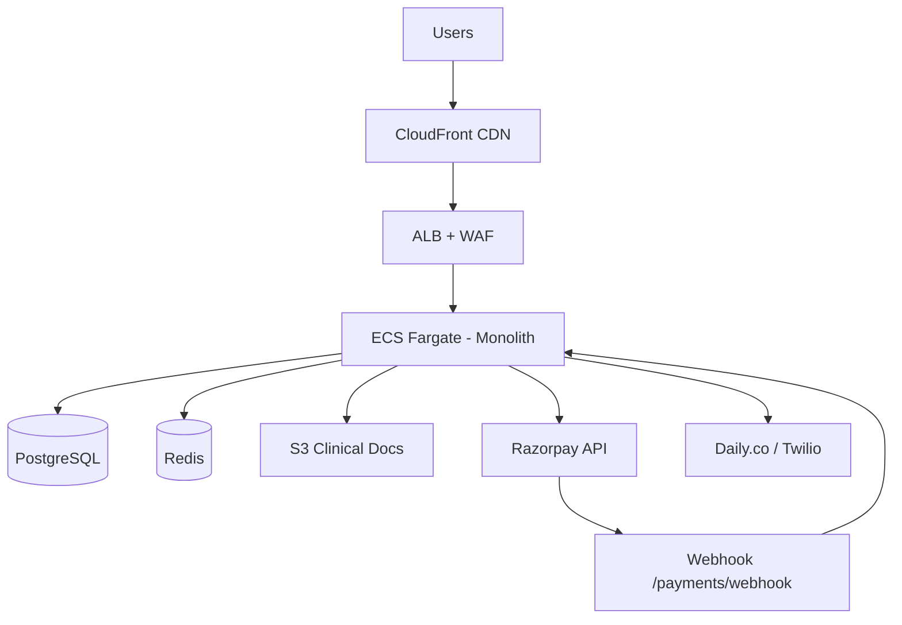

# DOC-35: Health360 AI — Phase 2 Architecture Diagrams Pack

| Attribute | Value |
|-----------|-------|
| **Document ID** | DOC-35 |
| **Title** | Phase 2 Architecture Diagrams Pack |
| **Version** | 1.0 |
| **Status** | **Draft** |
| **Date** | 2026-08-03 |
| **References** | [DOC-16](../../phase-1/architecture/16-ARCHITECTURE-DIAGRAMS-PACK.md), [DOC-30](./30-PHASE-2-SYSTEM-ARCHITECTURE.md) |

---

## 1. Care Journey (Phase 2 End-to-End)



---

## 2. Module Dependency Diagram



---

## 3. Payment State Machine



---

## 4. Deployment View (Phase 2 Additions)



---

## 5. Data Flow — Lab Result Release

```
Lab uploads result (S3 + structured values)
  → lab_results.status = PENDING_REVIEW
  → Lab tech marks RELEASED
  → Event LabResultReleased
  → Patient lab_values + timeline updated
  → Push/email notification
```

---

*End of DOC-35 — Phase 2 Architecture Diagrams v1.0*
