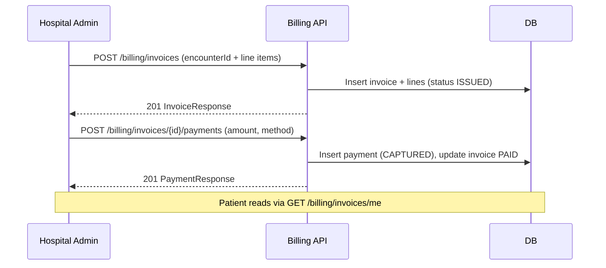

# P2-B1 — Hospital Billing Foundation Flow

| Attribute | Value |
|-----------|-------|
| **Document ID** | P2-B1-FLOW-001 |
| **Last Updated** | 2026-08-19 |
| **Sprint** | P2-B1 (first post-HMS) |

---

## Goal

Issue **encounter-linked invoices** and record **manual payments** so the hospital can close the OPD → clinical → billing loop before Razorpay integration (P2-B2).

---

## Actors

| Actor | Actions |
|-------|---------|
| Hospital admin / billing staff | Create invoice from encounter, list hospital invoices, record cash/UPI payment |
| Patient | View own invoices (`/invoices/me`), read invoice detail |

---

## Flow

---

## APIs (P2-B1)

| Method | Path | Permission | Description |
|--------|------|------------|-------------|
| POST | `/api/v1/billing/invoices` | `billing:invoice:write` | Create invoice for encounter |
| GET | `/api/v1/billing/invoices` | `billing:invoice:read` | Hospital-scoped list |
| GET | `/api/v1/billing/invoices/me` | `billing:invoice:read` | Patient own invoices |
| GET | `/api/v1/billing/invoices/{id}` | `billing:invoice:read` | Invoice detail + lines |
| POST | `/api/v1/billing/invoices/{id}/payments` | `billing:payment:write` | Record manual payment |

---

## Schema (V41)

- `billing.invoice_number_sequences` — per-hospital yearly sequence
- `billing.invoices` — encounter-linked header
- `billing.invoice_line_items` — charge lines
- `billing.payments` — payment records (gateway `MANUAL` in P2-B1)

---

## Out of scope (P2-B2+)

- Razorpay / Stripe payment intents
- Webhooks and idempotent gateway reconciliation
- Refunds, PDF receipts, tax engine
- Insurance pre-auth

---

## Module location

Backend: `com.health360.billing.*`  
Migration: `V41__create_billing_schema.sql`
