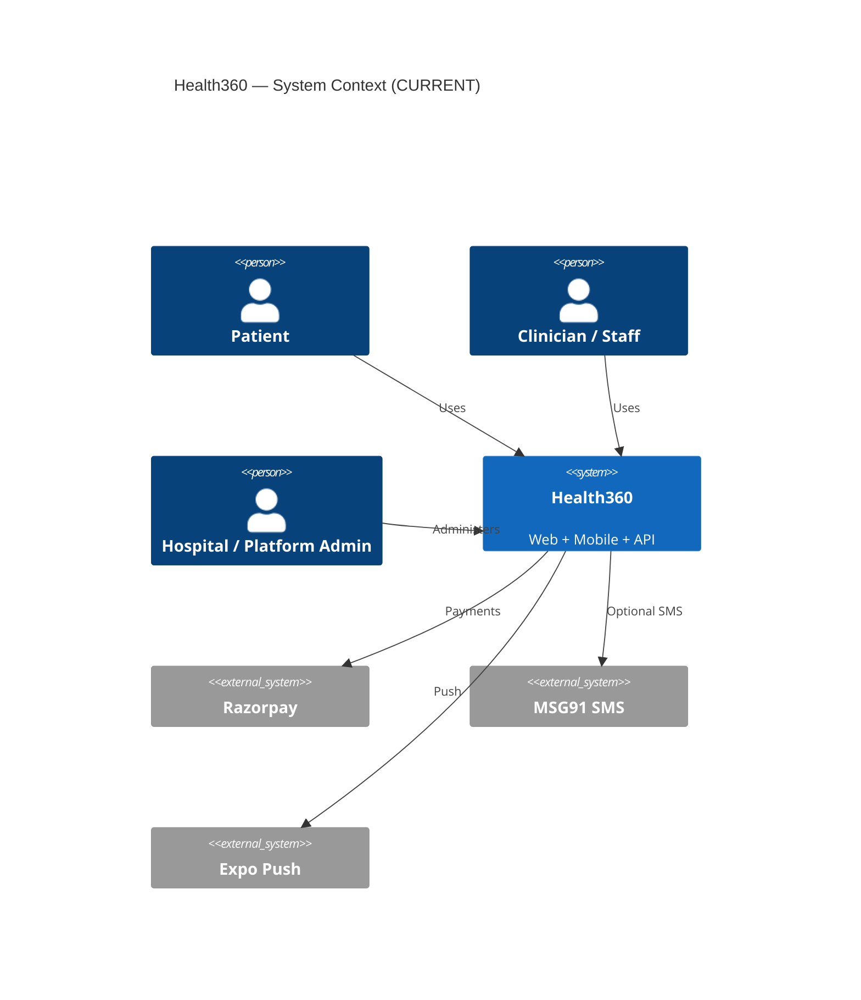

# C4 Overview — CURRENT

| Attribute | Value |
|-----------|-------|
| **Document ID** | SSOT-C4-001 |
| **Version** | 1.0 |
| **Status** | DRAFT |

## System context

## Containers

| Container | Technology | Responsibility |
|-----------|------------|----------------|
| health360-web | React/Vite | Role portals |
| health360-mobile | Expo/RN | Consumer + light staff |
| health360-api | Spring Boot | Business logic + REST |
| PostgreSQL | PG 16 | System of record |
| Redis | Optional | Token blacklist / cache helpers |
| Local disk | FS | Uploaded documents |

## Components (API — selected)

| Component | Role |
|-----------|------|
| IAM | Auth, users, RBAC |
| Hospital / Doctor / Patient | Org & identity masters |
| Clinical + OPD/IPD/ICU/Lab/Rad/OT/Pharmacy | Care delivery |
| Billing + Charges | Revenue |
| Automation + Tasks + Approvals | Coordination |
| Inventory / Procurement / Asset / Facility | Ops |
| Insurance / Blood / StaffOps / Predictive / CommandCenter | Extended HMS V2 |

Detailed class lists: see backend packages in REPOSITORY-INVENTORY.
